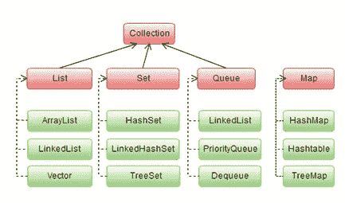

# Java 中的集合

> 原文：<https://medium.com/analytics-vidhya/collections-in-java-beb775fe9c3a?source=collection_archive---------17----------------------->

在这篇博客中，我们将从集合在编码/实现中的用法的角度来谈论它们。这对于一个有竞争力的程序员来说是非常方便的，我们不打算在接口和其他东西方面探索内部细节。这也有助于那些精通其他语言的人，比如 C++、python 等，并希望了解一些数据结构在 Java 中的实现…

**Java 中的集合是什么…**

Java 中的集合框架类似于 C++中的 STL。这个框架包含了所有数据结构的实现，从链表，队列，栈。我们还将在这个博客中讨论 Map，它是使用最广泛的数据结构之一，尽管它没有实现集合框架，并且在为采访编码时不能错过这个 Map 数据结构。

来源@谷歌图片

让我们首先探索集合接口中可用的一些通用方法，这意味着这些方法适用于列表、集合。队列，仅堆栈，不映射。

**size()** —返回集合中元素的数量

**isEmpty()** —如果集合为空，即大小==0，则返回真

**add()** —向集合中添加元素

**remove()**-从集合中移除元素

**addAll(collection)** —将传递的集合中的所有元素添加到集合中

**remove all(collection)**—从集合中删除传递的集合中的所有元素

**包含()** -检查集合中是否存在 specific

**clear()** —从集合中删除所有元素

# **列表的实现**

我们使用链表来避免我们在数组中面临的固定大小的问题。我们可以用两种方式在 Java 中实现 List ArrayList，LinkedList。

ArrayList 是 List 最常见的用法，它实际上是以动态数组的形式实现的，这意味着首先要分配一些初始空间给它，当它用完空间时，它会将现有空间翻倍，每当我们向 List 中添加越来越多的元素时。

要声明一个 ArrayList，你可以像这样使用 List 接口:

**List<object type>*List name*= new ArrayList<>()；**

或者

**数组列表<对象类型> *列表名称* =新数组列表<>()；**

在这里，ObjectType 可以是任何类，如我们自己定制的类类型或标准类型，如 String、Integer、Double 等。

要向列表中添加元素，可以使用 add 函数，删除元素可以使用 remove。

我们经常使用的另一件事是遍历整个列表。为此，你可以使用迭代器，或者简单地说，你可以使用 foreach 循环。这是因为所有的集合都实现了迭代器接口。要使用 for each 循环，我们可以这样使用

**for(Object o:collection name){**

**//与对象 o 的操作**

**}**

例如:

for(字符串:名称){

system . out . prinln(s)；

}

带有 LinkedList 实现的列表

List 的实现完全是使用 LinkedList 实现的。为了实现我们可以这样声明。

**List<object type>listname = new linked List<()；**

我们可以使用 add()和 remove()方法分别在列表中添加和删除元素。

# 设置

集合是类似于列表的数据结构，不同之处在于集合中没有重复项。还有一个集合的排序版本，其中的顺序由 compare 方法决定，或者您可以使用一些自定义的比较器。

要实现到 normal Set 我们可以使用 HashSet 实现 List 并可以声明如下:

**Set<object type>Set name = new HashSet<>()；**

例:Set<integer>myset = new HashSet<>()；</integer>

我们可以使用标准的添加和删除元素来对集合执行操作。

注意:元素的相同性与 hashcode 相比较。所以具有相同 hashcode 的元素被认为是相等的。

要实现 Set 的排序版本，我们可以使用 TreeSet，它是使用下面的树实现内置实现的。

**sorted set<object type>set name = new TreeSet<>()；**

我们可以使用标准的添加和移除元素来对列表执行操作。

# **队列**

队列是遵循先进先出(FIFO)原则的数据结构。队列有各种各样的实现，最著名的是带有队列接口的 ArrayDeque 实现。

**队列<对象类型>队列名称=新数组队列<>()；**

我们可以使用标准的 add 和 remove 方法来执行操作，但是当操作被禁止时，比如从空队列中删除，它们可能会抛出异常。这就是为什么它们不是最常用的操作，所以最常用的方法是:

**offer()-** 向队列中添加一个元素，如果队列已满，则返回 null。

**poll()-** 从队列中删除一个元素，如果不可行则返回 null

当您希望存储由比较器定义的具有某种优先级的元素时，还有 queue 的优先级队列实现。

**队列<对象类型>队列名称=新优先级队列<>()；**

# 堆

堆栈最常见的实现是使用 Deque 接口。

**Deque<object type>stack name = new array queue<>()；**

我们可以使用 push()和 pop()函数来实现栈的操作。

# 地图

映射是编程中重要的数据结构，在某些语言中，它们有时被称为字典。它们是键、值对数据结构。所有的键都是唯一的，本质上是不可变的。

HashMap 是 Map 最常见的实现。

**Map < Keytype，value type>Map name = new HashMap<>()；**

例如:Map<integer>m = new HashMap<>()；</integer>

正如我们所讨论的，这些方法没有实现集合接口，所以上面讨论的标准方法，如 add、remove，在地图上不起作用。

地图上的方法如下:

put(键，值)-将元素添加到地图中

remove(Key)-删除具有该特定键的元素

replace(Key)-替换给定键的值

containsKey(Key)-检查给定的键是否存在于 map 中

get(Key) —返回给定键的值

另外，请注意，如前所述，我们不能迭代映射，因为它没有实现迭代器接口。

要迭代 Map，可以使用可用的 entrySet()方法。 *Map.entrySet()* 方法返回一个集合视图(*集合<映射。包含在该映射中的映射的条目< K，V > >* )。因此，我们可以使用 Map 的 *getKey()* 和 *getValue()* 方法迭代键值对。条目< K，V >。

用法如下:

**设置<地图。Entry < Keytype，value type>>set name = mapobject . entry set()；**

现在我们可以在获得的集合上使用 foreach 循环

`**for**` `(Map.Entry<Keytype,ValueType> entry : setname){`

`System.out.println("Key = "`

`", Value = "` `+ entry.getValue());`

}

你也可以在这里阅读其他方法。

**地图的排序版本**

您还可以将地图的排序版本实现为 TreeMap，它是使用红黑树数据结构构建的。

**SortedMap < Key，Value>map name = new TreeMap<>()；**

您可以使用地图的标准方法来执行操作。

**采集接口的一些标准算法**

sort() —用于对元素进行排序，您可以使用自定义比较器来定义顺序

shuffle() —以随机顺序重新排列集合中的元素

rotate(collections，distance)-用于将集合的指定列表中的元素旋转给定的距离

# **结尾**

在博客的最后，我们已经讨论了 java 中各种数据结构实现的概述，在每个集合中有更多的方法可用，在排序版本中有各种其他方法可用，如 tail()、head()、sub()。您可以在在线/文档中找到相同的内容。

请随意为你想看的博客发表任何建议和推荐。