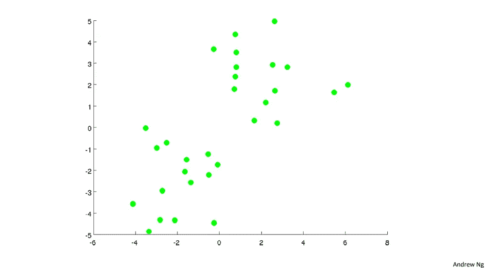
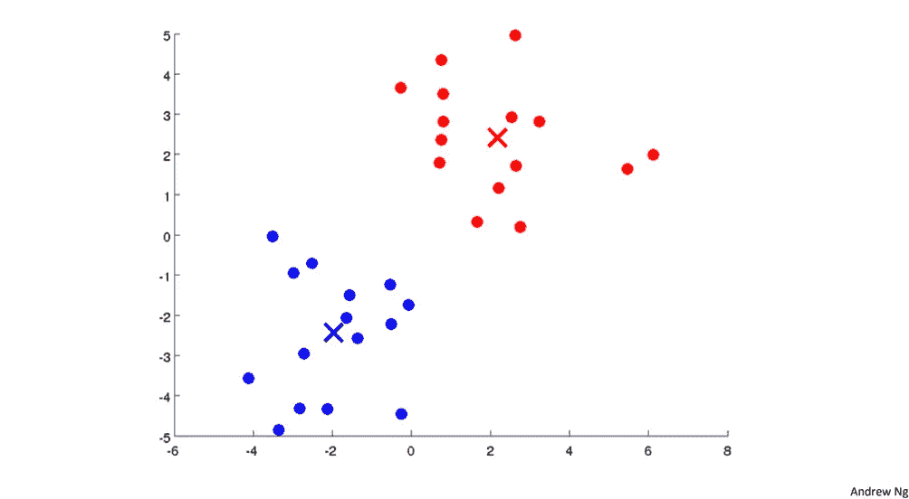

# 基于 K-Means 聚类算法的彩色量化图像压缩

> 原文：<https://medium.com/analytics-vidhya/color-quantization-for-image-reduction-using-k-means-clustering-algorithm-321b33f4d5e8?source=collection_archive---------13----------------------->

**简介:**

有一句话叫‘一图胜千言’[1]。在当今的科技时代，我们都被图像所包围。从官方记录中的图像识别人，到在 Instagram 上上传图片，在 whatsapp、facebook 上更改个人资料图片，使用图片了解太空星系，存储记忆等。图像从四面八方覆盖了我们。

这些图像实际上使用了大量的磁盘空间，一个事件的照片加起来可能有几千兆字节。这就是图像压缩发挥作用的地方。图像压缩基本上意味着在不影响图像质量的情况下减小图像的磁盘大小。一种这样的图像压缩方法是颜色量化。

**颜色量化:**

色彩量化是一个减少图像中不同颜色数量的过程，以使结果图像与原始图像相似，但尺寸减小[2]。一种这样的减少图像颜色的方法是通过 K-均值聚类方法。该算法解释如下

**K-均值聚类**

这种算法在无监督数据(无标签数据)中发挥作用，这意味着给定一些点集，我们希望找到数据中的结构。帮助形成相似数据点聚类的算法称为聚类算法。K 均值聚类是一种将数据点分成 K 个不同聚类的技术。每个群集由群集的质心唯一标识。该算法将相似的颜色值分组到 K 个簇中，并且每个像素值(在最终输出图像中)由它所属的簇的质心值代替。

k 表示将非结构化数据(左)分成两个簇(右)(图片提供:Andre Ng ML 课程[3])

在随机初始化 K 个质心之后，K-Means 的迭代算法主要有两个步骤:

1.  **聚类分配:**我们将质心索引分配给像素值，使得像素和质心之间的欧几里德距离[2]最小。两点(a1，b1，c1)和(a2，b2，c2)之间的距离由下式给出:sqrt((a2-a1) + (b2-b1) + (c2-c1) ) [
2.  **移动质心:**在这里，我们通过取分配给给定质心的所有像素值的平均值来计算新的质心。

**尺寸是如何缩小的？**

彩色图像有 3 个不同的通道，即红色(R)、绿色(G)、蓝色(B)或 RGB，每个像素使用 24 位(8 位(0 到 255 的无符号整数) ,每个代表 R、G 和 B)来表示一种颜色。在这种颜色量化技术中，假设我们将颜色的数量减少到 32 种，从而可以减小图像的大小，因为我们可以只存储这 32 个选定的 RGB 值，因此对于每个像素，我们可以存储这些颜色的索引，这将只占用 5 (2⁵ = 32)位而不是 24 位。在这之后，我们将用 32 种选定的颜色替换像素值[3]。

Satyam Kumar 在他的故事[4]中对尺寸缩减进行了深入的解释。

**结果和结论**

现在我们将看到运行 K-Means 算法的结果。使用 K-Means 压缩时，颜色数量范围为 2、4、8、16、32 和 64，请参见下图。这里给出了使用 K-Means 的颜色量化的实现。我将在下一篇文章中讨论它的实现，在这篇文章中，我们将讨论如何用 python 从头开始实现它，并进行深入的解释。如果你喜欢这个故事，一定要看看我的 [LinkedIn](https://www.linkedin.com/in/keshav-t-7ab782104) 。

原图(图片提供:[学徒 _ 摄影图片](https://www.instagram.com/apprentice_fotografo/))

聚类数(K) = 2

聚类数(K) = 4

聚类数(K) = 8

聚类数(K) = 16

聚类数(K) = 32

聚类数(K) = 64

**参考文献**

[1][https://en . Wikipedia . org/wiki/A _ picture _ is _ worth _ A _ Millennium _ words](https://en.wikipedia.org/wiki/A_picture_is_worth_a_thousand_words)

[2][https://en.wikipedia.org/wiki/Color_quantization](https://en.wikipedia.org/wiki/Color_quantization)

[https://coursera.org/share/f5010265b57b1dd841eb6dde1c554e4b](https://coursera.org/share/f5010265b57b1dd841eb6dde1c554e4b)

[4][https://towards data science . com/image-compression-using-k-means-clustering-aa 0 c 91 bb 0 eeb](https://towardsdatascience.com/image-compression-using-k-means-clustering-aa0c91bb0eeb)