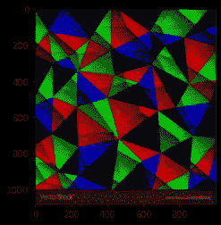

# 使用 Python 使用 KMeans 聚类在图像中进行颜色分离

> 原文：<https://medium.com/analytics-vidhya/color-separation-in-an-image-using-kmeans-clustering-using-python-f994fa398454?source=collection_archive---------1----------------------->


使用机器学习(KMeans 聚类)在图像中分色

图像中的颜色分离是分离图像中的颜色的过程。这个过程是通过 KMeans 聚类算法完成的。K-means 聚类是最简单和最流行的无监督机器学习算法之一。K-means 算法识别 *k* 个质心，然后将每个数据点分配到最近的聚类，同时保持质心尽可能小。K-means 中的*表示*是指数据的平均；也就是求质心。

# 图像分色:-

我们将对 RGB 图像的像素强度进行聚类。给定一个 *MXN* 大小的图像，我们因此有 *MxN* 个像素，每个像素由三个分量组成:分别是红色、绿色和蓝色。我们将把这些 *MxN* 像素作为我们的数据点，并使用 k-means 对它们进行聚类。属于给定聚类的像素在颜色上比属于单独聚类的像素更相似。k-means 的一个注意事项是，我们需要提前 指定我们想要生成的 ***的聚类数。***

在这里，我通过考虑下图来演示这种方法。


1.  **导入库:-**

首先，我们需要从 sklearn 集群库和其他一些库中导入基本库，如 NumPy、pandas、matplotlib、OpenCV 和 Kmeans 模块。

2.**加载图像:-**

现在我们需要加载图像，并使用 OpenCV 将图像转换成图像数组。

上述代码的输出是如下所示的图像:-



3.**从 BGR 转换到 RGB:-**

一般来说，当我们通过 OpenCV 读取图像时，它读取的是 BGR 格式。所以我们需要把它从 BGR 转换成 RGB。

下图显示了 BGR 和转换后的 RGB 图像。


左图是 BGR 格式的图像，右图是 RGB 格式的转换图像。

4.**重塑形象:-**

我们需要一个 RGB 像素强度来聚类。如果图像包含 MXN 像素，那么图像的形状是(M，N，3 ),所以我们将图像阵列整形为(M*N，3)形状。

5.**实现 KMeans 算法:-**

在这里，我们可以确定聚类的数量，或者可以使用肘点来找到。为了简单起见，首先我们将聚类的数量固定为 5，并拟合图像。

6.**确定标签:-**

训练过程结束了。现在我们需要确定每个 RGB 像素强度的标签。

输出是:-

```
array([2, 2, 2, ..., 2, 2, 2], dtype=int32)
```

7.**确定群集的质心:-**

现在我们需要为 RGB 像素强度确定聚类的质心。

上述代码的输出是

```
array([[  4.94156198, 194.05106194,   5.66103601],[  0.99513509,   1.17261867, 159.92115244],[  6.9601887 ,   4.80056827, 11.83784188],[162.89434822,   0.61579429,   0.99808952],[  0.9943044 ,  104.50070668,   1.50686636]])
```

8.**计算百分比:-**

现在我们需要计算每个集群的百分比。

上述代码的输出是:-

```
[0.11026111111111112,  0.2055537037037037,  0.42694444444444446,  0.12552592592592593,  0.1317148148148148]
```

9.**绘制饼图:-**

现在我们得到了图像中每种颜色的百分比。以下颜色以 RGBA 格式出现在形心列表中。一般来说，rgba 值从 0 到 1，所以我们需要将质心中的每个值除以 255，并使用这些百分比和颜色绘制一个饼图。

上述代码的输出是下面生成的图像:-


图像中颜色的分离

现在我们使用 KMeans 聚类得到了图像中的颜色，这里我们修正了 k 值。通常为了简单起见，我们约束 k，但是有一个通过找到肘点来找到最佳 k 的过程。

## **肘击法:-**

**肘法**是确定 k 的最佳值的最流行的方法之一

我们现在定义如下:-

**惯性:**它是样本到它们最近的聚类中心的平方距离之和。

我们从 1 到 n 迭代 k 的值，计算每个 k 值的失真值，并计算给定范围内每个 k 值的失真和惯性。

上述代码的输出是从 1 到 20 的每个 k 值的惯性值。

```
[13107924711.978294,  8433820366.758524,  4507406394.104001,  1906016765.3226116,  1479036935.644275,  1167644004.3794537,  924556364.7463465,  677398333.8710563,  529621680.23856145,  424009662.682969,  359435146.0253957,  297634711.33955854,  252723281.89632946,  220941246.79365787,  193110661.4033114,  172814060.41467503,  155705229.97394535,  142992728.61409003,  131053276.08425024,  118995898.8872379]
```

将相对于每个 k 的惯性值绘制成图表。

输出如下图所示


查找肘点的绘图

在上面的图中，从 k=4 开始，惯性值没有显著变化。所以肘点是 k=4。

考虑 k=4 的相同示例，并重复该过程。

上述代码的输出是如下所示的图像:-


使用肘形法分离图像中的颜色

从而提高了分色的准确性。这样，我们可以使用 KMeans 聚类来实现图像中颜色的分离。

以下是通过这种方法生成的一些示例


如果你喜欢这篇文章，请👏。

点击这里查看我关于使用 Keras 增强图像的文章

[https://medium . com/analytics-vid hya/understanding-image-augmentation-using-keras-tensor flow-a 6341669 d9ca](/analytics-vidhya/understanding-image-augmentation-using-keras-tensorflow-a6341669d9ca)

## 参考资料:-

[](https://scikit-learn.org/stable/modules/generated/sklearn.cluster.KMeans.html) [## sk learn . cluster . k means-sci kit-learn 0 . 23 . 1 文档

### k-均值聚类。了解更多信息。参数 n_clustersint，default=8 要形成的簇的数量以及…

scikit-learn.org](https://scikit-learn.org/stable/modules/generated/sklearn.cluster.KMeans.html)