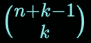
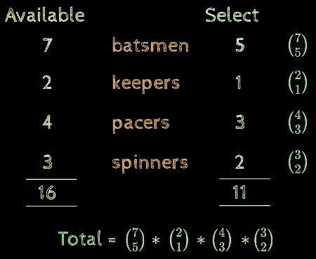

# 组合—顺序不重要！

> 原文：<https://medium.com/analytics-vidhya/combination-order-doesnt-matter-7863f4da7563?source=collection_archive---------10----------------------->

> 这篇文章将帮助你以一种你将永远记住的方式理解组合的概念

在阅读本文之前，请确保您已经阅读了我关于排列的文章:-

 [## 排列——顺序问题！

### 这篇文章将帮助你以一种你将永远记得的方式理解排列的概念

medium.com](/analytics-vidhya/permutation-order-matter-ae18bd212b5) 

**回顾:-**

在一个序列中，顺序很重要

猫！= act(！=意味着不等于)

即使两个单词有相同的字母:{t，c，a}

**收藏:-**

与序列(排列)不同，在集合中顺序并不重要

cat = cta = act = atc = tac = tca，这都 3！这三个字母的排列在集合中的意思是相同的，我们可以认为序列(排列)是我们一个接一个地排成一行的东西，因此顺序很重要。

但是我们可以把收藏看作是我们放在一个袋子里的东西，一旦我们把东西放在一个袋子里，顺序并不重要，你只有一袋东西，这就是收藏。

这 6 个词的意思都一样:{t，c，a}

在继续之前，请确保您已经清楚地理解了顺序问题和顺序无关紧要的类比！

前面我们已经研究了试图从给定的 n 个对象中形成长度为 k 的序列的问题

> **问题:-** 你能组成多少个 3 个字母的序列(无重复)？

我们知道如何去做，这只是(如果不允许重复的话)

现在，如果我问你，而不是序列

> **问题:-** 你能组成多少个 3 个字母的集合(无重复)？

所以请记住，在一个序列中，我们是在数行为，猫，..他们都分开，couting 他们 3！次，但在一个集合中，你不会这样做，所有这些都将被计为 1。那么问题是，如果你把三个字母放在一个袋子里，不按顺序排列，你能组成多少个集合？

所以，我们还不知道！

但是我知道怎么数序列！我们能重复利用这些知识吗？

因此，要做到这一点，让我们来分解创建序列的问题，这是一个两步程序

但是现在我们只对第一步感兴趣，那就是收集。第二步是我们在收集时不关心的事情。

序列数= N * k！=

因此，N =

这个公式有直观的意义，如果它还没有意义，让我们用一个例子来理解它:-

> **Quest:-从 5 个元音中选择 3 个元音的方法有多少种？**

总共有 10 种可能的收藏。并且每个集合具有 6 个序列(即 3！)

序列数= 10 * 3！=收藏数量* k！

= >集合数=序列数/k！

= >收藏数量= n！/(n-k)！*k！=

k 个项目的选择方式数(N)

Acc。问题，并把它放在公式:-

序列数= 60 = 5！/2!

选择的数量，k = 6 = 3！

收藏数量= 60/6 = 5！/2!*3!= 10(这实际上是集合的数量，所以这是公式背后的直觉)

> **练习:-** 假设有 10 个人在开会。如果每个人都和房间里的其他人握手，握手的总数是多少？

**重复收藏:-**

> **问题:-** 考虑一下，你在一家提供 10 种不同菜肴的餐厅，现在你想找到一个组合，你可以从这 5 个项目中选择任何一个，不仅仅是你还可以重复这个项目，即你可以有 2 份 idli 2 份 dosa 和 1 杯咖啡，这些将是 5 个项目的集合，其中某些项目是重复的。所以问题是，你能做多少份早餐套餐？

想象一下一个餐馆的场景，所有这些东西都放在一个柜台上，开始的时候，根据柜台，每样东西只有一份。

现在你决定把第一件物品作为 idli，现在这个计数器是空的，因为只有一个 idli，因为你的收藏中只有 10 件物品，其中一件已经被取走了。

但是现在你想多点一份 idli，那么你会怎么做，因为现在没有柜台供应 idli。所以，现在餐馆需要知道这一点，你被允许重复这些项目，所以它不能只有这么多的柜台，你选择 idli 的那一刻，经理将不得不打开新的柜台，它也为 idli 服务。

现在，您可以选择第二个 idli。

因此，从你的角度来看，你可以认为有这 10 个原始柜台，当你选择一个 idli 时，就会有魔法柜台打开，提供你选择的相同商品。因为那个柜台提供的是你已经选择的同样的东西，你可以选择重复它。

现在，我们再次选择了另一盘 idli，该柜台是空的，我们可以这样看，共有 11 个柜台，其中 2 个为 idli 服务，您选择了 2 个 IDLI。

但是现在，经理必须再次意识到，如果你想你可以选择所有 5 道菜都是 idli，当你选择了另一个 idli 时，将会有另一个神奇的柜台打开并为 idli 服务，现在你可以再次选择它，但是这次你决定不选择 idli，你选择了 poha，当你选择 poha 时，经理必须打开新的柜台，为 poha 服务，所以如果你想，你可以再次选择 poha。

现在你再次选择了 poha，你还有一道菜，如果你可以再次选择 poha，经理必须打开另一个为 poha 服务的柜台，但现在你已经决定选择 vada，所以 vada 已经从柜台上消失了，现在经理不必做任何事情，因为你已经上完了，所有 5 道菜都上完了。

视觉表现

你选择哪个物品并不重要，只有 k-1 个魔法计数器会开启，在我们的例子中 k=5，所以 k-1 个魔法计数器开启了，也就是 4 个

这使我们的原则:—

> 从给定的 n 个重复对象中选择 k 个对象的方式的数量是

**集合-乘法原理:-**

> 考虑一个场景，你是一个板球队的队长，球队当然包括击球手，守门员，步行者和旋转手，有 16 名球员可用，7 名击球手，2 名守门员，4 名步行者和 3 名旋转手。你想选择一个 11 人的球队，作为队长，你会希望有 5 名击球手，1 名守门员，3 名步行者和 2 名旋转手，你如何从 16 名球员中组建一个 11 人的球队。

这个问题的答案肯定不是 16C11

**加减原理:-**

> **有多少种方法可以组成一个至少包含一名妇科医生的 4 人委员会？**

我们已经在置换文章中详细地学习了减法原理，在那里我们研究了一个至少有限制的问题，使用减法原理更容易解决。所以，

A =所有可能的 4 人委员会。

B =至少包含一名妇科医生的所有可能的委员会。

C =所有可能没有妇科医生的委员会。

摘要:-

这都是关于集合(组合)的。有疑问吗？请在下面的评论中告诉我！任何建议/反馈都会受到欢迎。

感谢阅读！

干杯:)