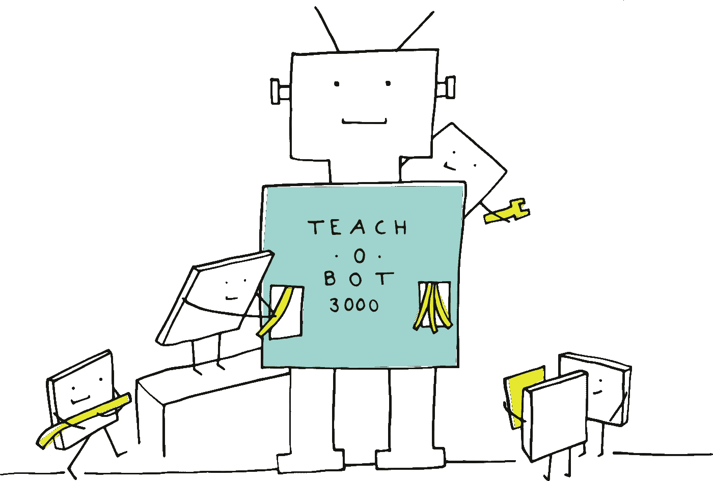

# 使用 PyTorch 在一个模型中组合图像和表格数据

> 原文：<https://medium.com/analytics-vidhya/combine-image-tabular-data-in-one-model-using-pytorch-38dfd23c437c?source=collection_archive---------7----------------------->

下面的博客将帮助读者了解我们如何使用深度学习在 PyTorch 中将图像和表格数据结合在一起，并从模型中生成预测。我将一步一步地理解整个端到端场景:→


## #1#创建自定义数据集类→

这里我将使用 [**OpenVaccine:新冠肺炎 mRNA 疫苗降解预测**](https://www.kaggle.com/c/stanford-covid-vaccine) 数据集。*在清理和处理表格数据*之后，我将为我们的数据创建数据集类，如下所示……

由于有很多代码和语法，我建议阅读代码时参考每个语法旁边的注释。涉及的步骤有:→

1.  首先，我们声明了一些我们将需要的特定库。
2.  我们将为我们创建的数据集类定义构造函数。
3.  然后我们将定义 __len__ 函数来计算数据集的长度
4.  然后我们将定义 __getitem__ 函数，提取输入和目标，我们将把它们输入到我们将要创建的模型中。


## #2#为数据集类和数据加载器创建对象→

## #3#创建模型类→

我已经尽可能多地评论了代码语法，但是读者**如果你仍然觉得你不能理解代码的任何部分，请请随意评论这篇文章，我将非常乐意回答你的疑问**。

在第 15 行的**中仍然有 3 个主要语法，21 & 56，我们将表格和图像数据层结合起来，从中生成预测**。

```
15 self.image_dense_layer_2 = nn.Linear(512, 1) # in constructor 21 self.tabular_dense_layer_4 = nn.Linear(4, 1) # in constructor56 x = torch.cat((x, tab), dim=1) # in forward function
```

## #4#为我们的模型定义损失函数、优化器和训练循环。

在模型创建后，我们将很容易定义以下内容。

如果你发现实施起来有困难或者只是在这里提出你的意见，请考虑浏览一下我写的关于这个主题的笔记本。



我希望你已经理解了我们如何使用 pytorch 在深度学习模型中结合图像数据和表格数据背后的逻辑。如果你对此有任何问题、意见或担忧，请在评论区告诉我；在那之前，享受学习的乐趣。

更多与数据科学相关的博客文章，请查看 medium 上的顶级数据科学博客。

*   拉胡尔·阿加瓦尔
*   [威尔·科尔森](https://medium.com/u/e2f299e30cb9?source=post_page-----d60c71f00c50--------------------------------)
*   卡西·科济尔科夫
*   [丽贝卡·维克里](https://medium.com/u/8b7aca3e5b1c?source=post_page-----d60c71f00c50--------------------------------)
*   [杨致远](https://medium.com/u/10c138087717?source=post_page-----d60c71f00c50--------------------------------)
*   丹尼尔·伯克
*   [艾里克·莱文森](https://medium.com/u/44bc27317e6b?source=post_page-----d60c71f00c50--------------------------------)
*   [本杰明·哈迪博士](https://medium.com/u/5153880ce2ee?source=post_page-----d60c71f00c50--------------------------------)
*   [Moez Ali](https://medium.com/u/fba05660b60f?source=post_page-----d60c71f00c50--------------------------------)
*   [彭慧琳](https://medium.com/u/f4a64ff38660?source=post_page-----d60c71f00c50--------------------------------)