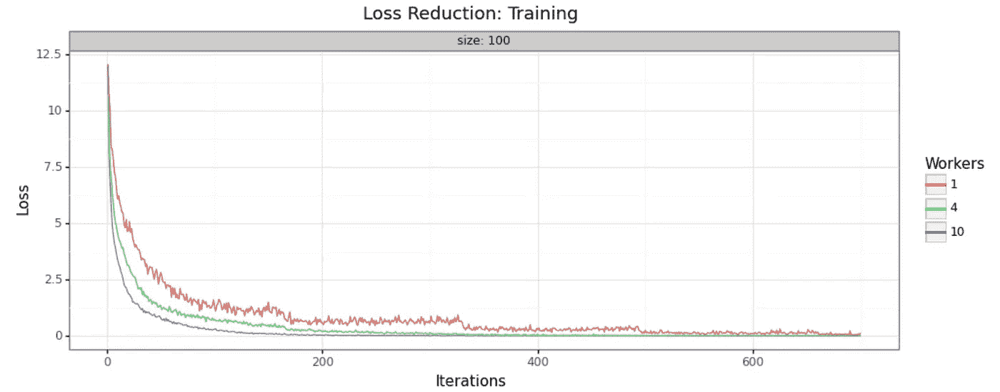
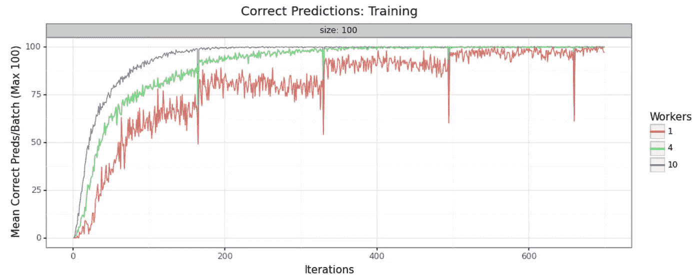
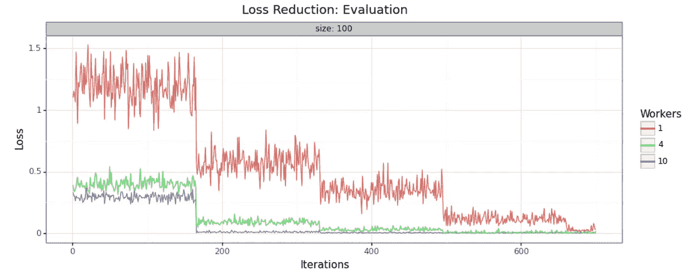
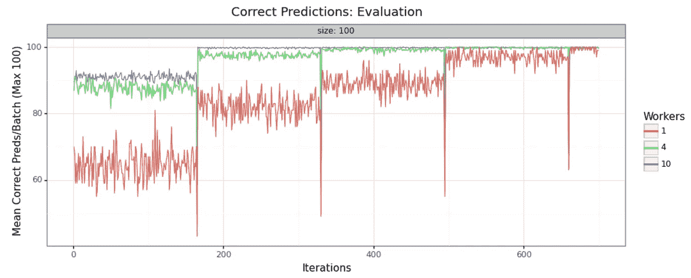

# 结合 Dask 和 PyTorch 实现更好、更快的迁移学习

> 原文：<https://medium.com/analytics-vidhya/combining-dask-and-pytorch-for-better-faster-transfer-learning-6ff64963e685?source=collection_archive---------13----------------------->

## 引入新的 Python 包: [dask-pytorch-ddp](https://pypi.org/project/dask-pytorch-ddp/) ！

> 声明:我是 Saturn Cloud 的一名高级数据科学家，Saturn Cloud 是一个支持使用 Dask 对 Python 进行简单并行化和扩展的平台。
> 
> 本教程在 Saturn 云平台上运行，用户只需点击一个按钮就可以使用 Dask 集群。如果您需要访问集群，那么您可以尝试以下步骤，[我们有免费试用](https://www.saturncloud.io/s/)！


照片由 [Alvan Nee](https://unsplash.com/@alvannee?utm_source=unsplash&utm_medium=referral&utm_content=creditCopyText) 在 [Unsplash](https://unsplash.com/s/photos/dog?utm_source=unsplash&utm_medium=referral&utm_content=creditCopyText) 上拍摄

单台机器内的数据并行性是一种合理的优化深度学习训练性能的良好方法，特别是在 PyTorch 中。然而，从一台机器开始，一次在多台机器上训练单个神经网络似乎很困难和复杂。

本教程将首先演示，GPU 集群计算进行迁移学习允许数据科学家显著提高模型的有效学习；第二，用 Python 实现这一点并不像听起来那么困难或可怕，尤其是有了我们的新库，[*dask-py torch-DDP*](https://pypi.org/project/dask-pytorch-ddp/)。

我们将使用我们在 [PyTorch 并行推理教程](https://www.saturncloud.io/s/computer-vision-at-scale-with-dask-and-pytorch/)中使用的相同数据集，斯坦福狗数据集，可在此处获得:[http://vision.stanford.edu/aditya86/ImageNetDogs/](http://vision.stanford.edu/aditya86/ImageNetDogs/)。我们将使用迁移学习来改进 Resnet50，而不是直接使用它。在正常情况下，这项任务可能非常耗时和耗费资源，但今天您将了解如何通过并行化让 it 学习得更好更快。

> 除了这里提供的信息之外，我们强烈建议不熟悉并行 PyTorch 的用户访问一些官方文档和优秀的现有教程。

*   [分布式 PyTorch 概述](https://pytorch.org/tutorials/beginner/dist_overview.html)
*   [用 PyTorch 编写分布式应用](https://pytorch.org/tutorials/intermediate/dist_tuto.html)
*   [py torch 上的分布式数据并行](https://pytorch.org/docs/stable/notes/ddp.html)
*   [分布式数据并行入门](https://pytorch.org/tutorials/intermediate/ddp_tutorial.html)
*   [分布式数据并行文件](https://pytorch.org/docs/master/generated/torch.nn.DataParallel.html)
*   [大批量训练神经网络:单 GPU、多 GPU 的实用技巧&分布式设置](/huggingface/training-larger-batches-practical-tips-on-1-gpu-multi-gpu-distributed-setups-ec88c3e51255)作者 Thomas Wolf

# 概念介绍

在深入研究这个问题之前，我们应该回顾一下 PyTorch 中并行化是如何实现的基本概念。

## torch . nn . parallel . distributed data parallel/DDP

DistributedDataParallel 是 PyTorch 的本机结构，用于多台机器上的并行模型训练。关于它是如何工作的，有很多东西需要了解，我们无法在这里一一介绍，但是我们有一个概述可以帮助您开始。

从讨论 DataParallel 开始可能会有所帮助，data parallel 是 PyTorch 提供的单机并行化工具。这实际上是在单台机器上实现相同的并行训练，然后 DistributedDataParallel 扩展它，使其能够在多台 GPU 机器上工作。

【PyTorch 官方文档告诉我们:

> *该容器通过在批处理维度中分块，将输入拆分到指定的设备上，从而使给定模块的应用并行化(其他对象将在每个设备上复制一次)。在正向传递中，模块在每个设备上复制，每个副本处理一部分输入。在向后传递期间，来自每个复制品的梯度被加到原始模块中。*

像泥浆一样清澈，对吗？让我们试着分解它。

> *该容器并行化给定模块的应用*

这只是表明我们正在并行化深度学习工作流——在我们的情况下是迁移学习。

> *通过在批处理维度分块将输入拆分到指定设备上*

迁移学习工作流的输入是数据集！好了，这是我们的图像分块批次，这就是并行的。

> *(每个设备将复制一次其他对象)*

例如，我们的起始模型，如果有的话(我们的 Resnet50)根本不会被打破。很高兴知道。

> *在正向传递中，模块在每个设备上被复制，每个副本处理一部分输入。*

好了，我们的模块——培训任务在每台设备上复制。我们有多个作业副本同时工作，每个副本都获得一大块输入图像，而不是整个数据集。

> *在反向传递期间，来自每个复制品的梯度被加到原始模块中。*

然后这些重复的任务中的每一个都将结果(渐变)传递给原始的任务！学习发生在员工/子流程中，然后他们都将结果返回到原始模块/培训流程进行汇总。

因此，DDP 的本质区别在于，它针对多台机器进行了优化，而不是针对具有多个线程的单台机器。它能够有效地跨不同的机器进行通信，因此我们可以使用 GPU 集群进行计算。

## 还和我在一起吗？发现这一切有点令人困惑是有道理的！

如果你在理解这个过程上仍然有困难，把我们所有的工人想象成解决同一个难题的个体可能会有所帮助。在纪元结束时，他们都将自己的发现反馈给主节点，主节点将每个人提交的部分解决方案组合在一起。然后每个人都得到这个组合解决方案的副本，它仍然是不完整的，他们开始在另一个纪元再次工作。不同的是，由于每个人的共同努力，现在他们有了一个良好的开端。

当然，你可以只让一个人做这项工作——他们最终甚至可能达到相同的总体结果。但是他们需要更多的时间才能到达那里，而且一开始结果会更糟。团队解决问题的进度从一开始就会更好，因为每个员工都有略微不同的解决策略，所以你可以同时结合多种方法。

我们不一定能创造出单个节点无法实现的结果，但我们会更快地获得更好的结果，并且能够更快地停止训练。

# 带 PyTorch 去星团

如果你已经学习过我们其他的关于 Saturn Cloud 上的 Dask 集群的教程，你会读到一些关于用于指示客户端的[命令，也就是我们的 Dask 集群。我们在这里使用了与`dask-pytorch-ddp`完全相同的功能，将我们的分布式 PyTorch 作业从单个工作者转移到集群。](https://github.com/saturncloud/dask-saturn)

## torch . distributed . init _ 进程 _ 组

正如【PyTorch 官方文档告诉我们的，工人之间需要一个过程组来相互沟通并协调正在完成的工作。因此，创建进程组是设置中至关重要的第一步。我们已经在`dask-pytorch-ddp`中为您处理了这个问题，这里提供了一个名为`dispatch.run`的函数，我们将在下一节中解释它。您只需提供一个包含 PyTorch 训练步骤的函数，该函数负责将工作适当地传递给集群。

## dask-pytorch-ddp.dispatch.run

[这个特殊的函数](https://github.com/saturncloud/dask-pytorch-ddp/blob/main/dask_pytorch_ddp/dispatch.py)对我们正在进行的任务非常有用，所以我们将花一点时间来研究它并解释它是如何工作的。(如果你对细节非常感兴趣，上面的链接会带你到`dask-pytorch-ddp`的完整代码库。)

在这个函数中，客户端做一些关键的事情:

*   检索关于您的特定 Dask 集群的信息，例如工人数量和规模
*   生成您想要运行的作业列表，例如针对集群中每个工人的培训任务
*   将该列表保留在内存中，直到您指示应该开始计算
*   根据需要创建和销毁进程组，以便您的所有任务都能正确通信。

因此，如果您遇到关于您的集群及其指令解释/理解的挑战，这个函数可能是一个有用的起点。

# 看看它的实际效果

现在我们已经对我们的工具有了一个大致的了解，我们实际上可以构建代码来运行这个迁移学习任务。

## 数据设置

在思考这个问题时，你可能会意识到，像我们这样从 S3 加载图像数据可能会很慢——甚至是我们任务中最慢的部分！我们也是这么想的，这就是为什么我们为这项工作编写了 PyTorch 数据集类的扩展。在`dask-pytorch-ddp`中，你会发现这个名为`S3ImageFolder`的职业。这不是工作流运行所必需的，但它对工作流的执行速度有很大的影响。

它需要的参数是您的 S3 存储桶名称(字符串)、存储桶中的文件前缀，以及您希望使用的任何 PyTorch 转换。下面是一个例子。这样，您在 S3 存储桶中的任何类型的文件都可以以高度并行的方式加载，高效地转换，然后作为数据集类对象返回，供其他 PyTorch 任务使用。我们认为您会对这种处理速度印象深刻！

## 分割样本

当然，我们希望在训练该模型时进行尽职调查，因此我们希望创建训练和评估数据分割，以确保我们看到的改进是有效的，而不是过度拟合。

请注意，这里的 DataLoader 对象被显式定义为使用多处理—这意味着我们可以充分利用并行化，以便在我们最终在培训工作函数中调用它时(如下所述)，使我们的图像摄取更快。

## 设置结果处理

这里我们还有一个新的类要实例化，这样我们就可以有效地监控训练任务的性能。

```
key = uuid.uuid4().hex
rh = results.DaskResultsHandler(key)
```

类对象有一些非常有用的方法，我们将充分利用它们。本课程的主要目的是组织我们模型的训练任务，并为我们监控性能统计数据。

方法之一是`submit_result`。这个方法接受一个路径(我们希望保存结果的地方)和数据(在我们的例子中，一些 JSON 告诉我们模型的当前性能),并为我们处理所有的组织工作。

这里另一个有用的方法是`process_results`，它接受一个目录、一个工作前景列表和一些错误处理指令。在我们创建了未来(分配给集群上的工人的延迟任务)之后，我们使用它来正式启动所有这些任务并开始计算。简而言之，一旦我们所有的工作都被定义、组织并准备好运行，这个任务就是最后一步。

# 培训渠道

因此，这一阶段的工作对于 PyTorch 中从事迁移学习或模型培训的人员来说是非常熟悉的。我们将编写我们的模型任务，就像我们对单节点工作所做的那样，并将它封装在一个函数中，以便可以分发给工作人员。

我们将首先看一下这个函数的各个部分，然后在运行它之前把它们放在一起。

## 收集模型

为了准备模型，我们需要首先从`torchvision`中获取它，然后我们可以将它分配给 GPU 资源。然后我们会像之前说的那样用`DDP`包装。

## 设置模型参数

非常好。现在我们可以建立 PyTorch 模型任务将需要的常规部分——我们的损失函数、优化器和学习率调度器。

您可能会注意到，我选择了一个学习速率调度器，它会在切换前等待损失函数达到平稳状态——这是一个偏好问题，您当然可以在这里使用一个阶跃学习速率调度器(`StepLR`)，而不会产生不良影响。这是一个什么最适合您的数据和基本模型的问题。

## 从 S3 检索数据并进行处理

现在，我们收集数据。我们需要使用我们的`S3ImageFolder`类和训练/测试分割来初始化数据加载器对象，并命名我们的数据加载器以供以后参考。DataLoader 类允许我们在训练循环准备好图像时延迟加载图像——这是这项工作的主要资产。

## 训练迭代

在这一点上，我们已经准备好开始迭代我们所选择的时代数。在这里，我们将模型设置为训练模式，并循环遍历我们的“训练”数据加载器从 S3 引用的一批图像。

然而，这并不是我们循环的结束。我们有`DaskResultsHandler`方法来收集关于每次迭代的统计数据，并在适当的时间间隔检查我们的模型性能。我们知道这一批中正确预测的学习率、损失和计数，所以我们将把所有这些连同“计数”一起写出来，这是这个迭代发生的次数。

## 评估迭代

在这一点上，我们有完整的功能允许我们训练模型！当然，我们还需要评估步骤来验证我们的统计数据，因此我们将添加第二个块(仍然在同一个时期内)来完成这项工作。

这就完成了工作流程——我们有了所有需要传递给每个员工的并行培训！

# 把它们放在一起

这看起来很多，但是一旦我们一条一条地讨论过，它和其他的培训工作流程并没有太大的不同。然而，不要忘记这仍然只是一个函数！在我们准备好真正开始集群上的并行工作之前，我们都处于暂停状态。

最后的工作是将它传递给我们的集群，我们只用几行代码就可以完成。还记得我们之前讨论过在`DaskResultsHandler`上被称为`process_results()`的方法，该方法将检索正在计算的工人的未来。

首先创造未来…

…然后开始计算！

# 探索结果

为了证明这种方法实际上在模型训练中产生了改进，查看收集的统计数据的一些可视化表示会有所帮助。我们使用三个不同大小的集群来运行该作业，以便于查看——1 个工作节点(单节点)、4 个工作节点和 10 个工作节点。

事实上，我们可以看到在降低损耗和精度方面有非常显著的性能提升。批量大小为 100，自适应学习率从 0.01 开始。训练/测试分割是 80/20，如上面的代码所示。

## 训练样本



## 评估样本



正如您所看到的，增加集群中工作人员的数量显著提高了培训的绩效。在 10 个工作线程的集群中，我们大约在 200 次迭代时达到最高性能，而在 4 个工作线程的集群中，我们必须等到 400 次或更多。在单节点示例中，在 600 处，我们在损失值中仍有大量噪声，并且可能在未来的多次迭代中达不到期望的性能。

# 结论

迁移学习的 GPU 集群是否是正确的选择，这在很大程度上取决于所解决的具体问题，有些问题并不复杂，也没有足够的挑战性来要求这种方法。然而，对于许多深度学习问题，尤其是在计算机视觉空间中，通过使用增加的计算资源和加速实现理想的模型性能，可以产生实质性的价值。

对于希望在迁移学习和深度学习建模任务中获得更快、更好性能的数据科学家，我们鼓励您尝试一下土星云上的 GPU 集群！您可以[使用我们的免费试用版](https://www.saturncloud.io/s/)进行实验，看看这种方法是否适合您的问题。