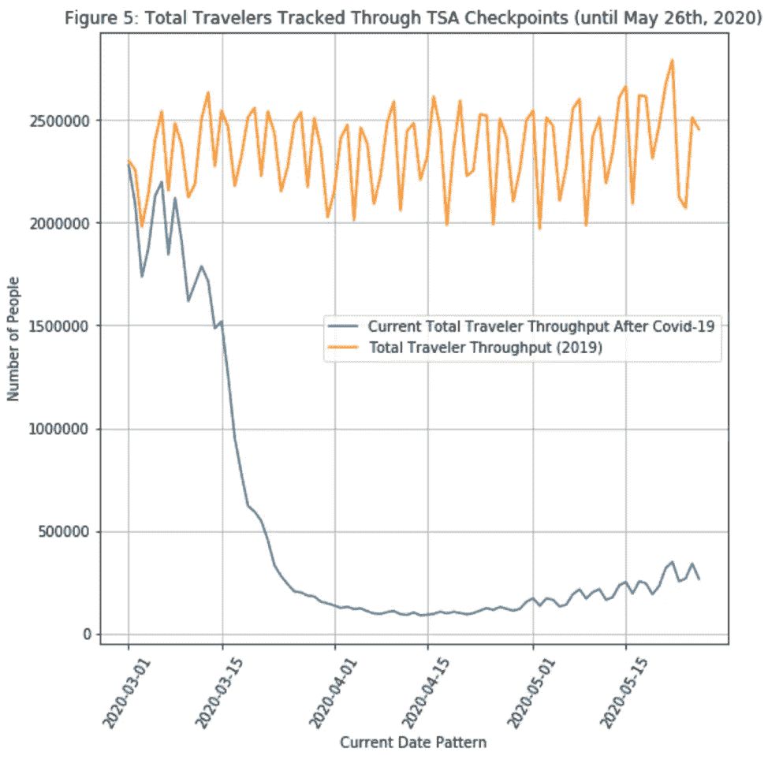
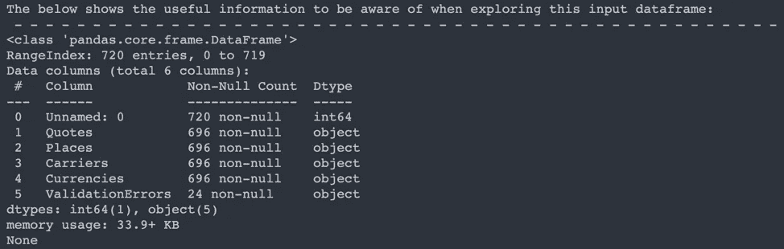

# 将数据科学和机器学习与航空工业相结合:通过顶点项目的个人旅程(第一部分)

> 原文：<https://medium.com/analytics-vidhya/combining-data-science-and-machine-learning-with-the-aviation-industry-a-personal-journey-through-132e59d8380b?source=collection_archive---------8----------------------->


[参考](https://www.wearefinn.com/topics/posts/big-data-two-little-words-huge-impact-in-aerospace/)

# **灵感和博客总结**

*作为一名从机械工程师转型的数据科学家，我的大部分时间都花在了探索将这两个领域结合起来以获得更大利益的方法上。在我个人看来，机械工程行业迫切需要改革，通过一种方式，让新的和充满激情的毕业生直接将他们的知识应用到行业中，而不需要博士学位。通过这个顶点项目，我试图通过创建一个用于航空的潜在商业模型，通过实现一个机器学习算法来解决现实世界的问题，以及通过展示在疫情期间进行此类研究时存在的问题，来展示工程和数据科学之间的这种联系。在这个由两部分组成的系列中，我们将揭示什么是标准的数据科学工作流，研究航空公司和航空业，在 Python 中浏览我们工作流中的问题，向我们展示数据收集 API，并添加尽可能多的与解决此处表达的问题相关的工程思想。这个系列将作为一个非常个人化的故事来阅读，关于项目所面临的压力，以及实施了什么解决方案来克服各种障碍。在这篇特别的博客中，我们将讨论用于理解这个问题的思维过程，讨论用作数据收集工具的 API，讨论政权更迭，以及展示数据清理的过程。让我们从解决这个问题开始。*

# **当前的航空研究**

考虑这样一种情况，一家企业向我们这些数据科学家提出了一个问题: ***“一架客机每次飞行可以向乘客收取的最低成本阈值是多少，我们如何制作一个模型来发现这一点？”*** 数据科学家被外包从事自由职业的情况并不少见；在这种情况下，一家初创企业正试图在航空业立足——在当前的疫情，这是一个非常不幸的时机。稍后将详细介绍。目前，这项业务是客机还是与客机协同工作的第三方服务的细节并不重要。整个问题都是虚构的，这让我们在考虑解决方案时有了一些创造性。

*那么，面对这个问题，数据科学家应该考虑什么？*

我认为计算最低成本门槛最直接的方法是分析目前不同航空公司的不同航班。每天，世界各地数以千计的航班从我们头顶飞过，这给我们留下了大量的数据来寻找解决方案。从这些航班中收集不同的特征并观察它们之间的不同模式是可能的，这可能在如何确定这些航班的机票价格中起作用。我们的目标标签将是价格，这意味着我们计划在这里使用的模型是受监督的机器学习模型。我们的标签以美元衡量，被认为是连续的——不是在无限的&不可数的数学意义上，而是在计算机科学家的意义上，在一系列离散值之间存在如此多的步骤，可以被视为连续的——这最终意味着回归模型将得到最好的实现。在处理定价数据并同时处理业务的过程中，我们希望优化一个在描述模型性能方面最有意义的指标。在这项研究中，我们将求助于使用[平均绝对误差](https://www.statisticshowto.com/absolute-error/)，这是因为它以我们标签的原始单位表示的强度，以及它对受异常值严重影响的抵抗力。可以使用其他回归指标进行优化，但是数据科学家应该考虑他或她的受众是谁，以及用没有任何实际意义的指标来描述性能有多大意义；想象一下，使用均方差并以平方美元表示模型的性能，这样说没有多大意义，不是吗？

*现在，当一个机械工程师被问到这个问题时，他应该考虑什么？*

我会专注于项目的细节。调查飞行距离、使用的飞机类型、高度、天气模式、持续时间、全年的旅行趋势和航空公司可能是值得的。我会更深入地研究一些技术问题，如发动机的输出力和能量，飞机发动机每个循环阶段的温度和压力状态，飞行过程中飞机燃料质量比的变化，飞机乘客的平均质量，周围环境空气密度的变化，顺风效应，飞机滑行时的平均燃料消耗率，以及飞机的大小。我将进一步分析其他各种成本，如飞行员和员工工资、维护成本、燃料价格、诉讼、赞助伙伴和股票趋势。

我们有多少时间进行这项研究？这件事什么时候需要答复？

***“这项业务需要在 30 天内的概念工作证明。”***

考虑目前的工作范围时，了解这一点很有好处。整个项目有能力仅用上述可能的特征和方法进行天文规模的扩展；直到后来才知道我们的模型是否需要这里所表达的所有特性，因为当有太多的特性时，一些模型的性能会更差，并且被认为是过度拟合的。

这一时间限制不足以进行彻底有效的研究，但足以启动一个工作模型和初步方法。现在我们有权决定如何处理假货生意。我们将回顾一下我处理这个问题的方法。我们将了解疫情在我们的分析中是如何发挥作用的，并发现绕过当前数据域障碍的方法。

# 我们对数据有什么访问权限？


[参考](https://flightaware.com/)

***flight XML API***

我们发现 [FlightAware 的 FlightXML API](https://flightaware.com/commercial/flightxml/) 将是一个很好的工具，可以用来访问我们在这项研究中需要的数据。[FlightAware.com](https://flightaware.com)被认为是最受欢迎的航班追踪网站，提供最近历史上所有航班的详细信息。它提供了一个非常全面的 API，被真实的企业广泛使用，以帮助个人以非常程序化的方式收集飞行数据。使用这个 API 的代价是它不是一个可以免费使用的工具。这将增加研究的复杂性，因为我们希望收集尽可能多的数据来帮助我们的研究合法化，同时降低 API 的使用成本。通过 FlightXML API，我们应该可以访问:天气数据、高度数据、速度数据、飞机类型、航班时刻表、距离、航空公司、航班代码、始发地、目的地、航班服务详情、每架飞机的座位数、飞行持续时间等。


[参考](https://www.skyscanner.com)

***Skyscanner API***

Skyscanner.com 是一个旅游网站，旨在帮助人们找到最实惠的酒店、航班、租赁等价格。他们的[ [API](https://skyscanner.github.io/slate/) 可以通过被认可的开发者同意来提供。然而，为了节省与开发人员协商建立安全和个性化 API 密钥的时间， [RapidAPI](https://rapidapi.com) 通过充当查询搜索的主机网站，提供 Skyscanner API 的免费使用。RapidAPI 非常有用，因为它只需要一个 Google 帐户就可以开始使用 API，并提供了执行“密钥轮换”的能力——丢弃受损 API 密钥的行为。使用 RapidAPI 访问 Skyscanner 的 API 有一些小限制(例如无法访问 API 文档中的所有可用命令)，但这并不妨碍搜索航班价格的能力。

# 我们可以访问哪些数据？

***Skyscanner API***

浏览 Skyscanner API 的文档并理解其局限性大约需要 3-5 天的时间。需要一种程序化的方法来访问航班的各种价格，很快就发现访问以前的航班并不容易。手动在不同的网站上搜索“昨天的航班”没有成功，因为没有可用的列表——这可能为航空公司节省了一些服务器空间。具有讽刺意味的是，一个人可以提前几个月到几年诚实地计划一次旅行，但如果没有其他方式的跟踪，他将永远无法单独观察过去的航班价格。这给我们的研究带来了复杂性，因为我们打算使用过去的航班价格趋势来关联过去的航班数据，但即使是我们所依赖的 API 在这方面也被证明是不成功的。另一个建议是获取从 FlightXML API 收集的航班，并在未来为每个价格复制尽可能多的条件——也就是说，确保工作日匹配、月份匹配、航空公司匹配等。然而，这种方法也被证明是浪费时间的，因为在 FlightXML API 中收集和观察的一些航班不能在类似的时间段、航空公司或类似的工作日中找到。此外，Skyscanner API 无法提供基于舱位的机票定价，这阻碍了我们进行更全面研究的能力。Skyscanner API 将只搜索可用的最低价格，这并不是最糟糕的限制，因为从技术上讲，我们必须提供的解决方案是最低成本阈值模型。这种限制被认为是我们在定价中找不到阶级差异的原因。在某些情况下，一个航班会返回不止一个价格，但这些价格中的许多价格非常接近，它们在承运商之间的差异可以忽略不计。

***flight XML API***

花了大约 7 天多的时间来学习如何通过 FlightXML API 进行编程导航，了解其局限性，并发现解决方案。首先，它提醒我们，我们执行的每个搜索都要花费“一便士的一部分”，让我们意识到这个工具必须有效地导航。虽然“一便士的一部分”听起来不像是很多钱，但当查询搜索被迭代处理时，它会增加，并且总是返回不同大小的数据批次——通常情况下，每个查询搜索会返回数千个数据点。不同的 API 通常会带来成本和时间上的损失，因为用户的访问是服务器上的流量和磨损。我们对复杂 API 的测试表明，一些搜索到的数据会重叠，从某些方法获得的一些输出不能作为其他方法的输入，一些搜索返回 null 并仍然向我们收费，一些方法被否决，一些搜索返回的数据被证明对我们自己的目的没有用。令我们沮丧的是，我们发现 FlightXML API 无法搜索当前日期过去三个月的航班数据——至少对于我们付费购买的非订阅许可来说是如此。这极大地限制了我们研究的能力，因为我们更喜欢收集尽可能多的不同航班，跨越更大的日期范围，以显示季节性模式——这不再是我们可用的方法。让事情变得更复杂的是，API 提供了一种不同的方法，它可以让我们收集上千个数据点，这些数据点涉及以前飞行的各个高度、速度、纬度、经度和位置/技术细节，但只能搜索到两周前！如果我们想利用在我们的模型中加入热机分析的能力，我们将不得不在我们的研究中牺牲季节方法的所有方面。最初采取的方法是在美国国内选择六条不同的路线，并在较小的时间范围内进行分析。即使选择了这六个航班，考虑到被分析的六个航班是受欢迎的航线，技术上应该有足够的数据可以收集。根据 Flights.com 的数据，“平均每月有 2197 个航班”往返于 JFK(约翰肯尼迪国际机场)和迈阿密国际机场(迈阿密国际机场)。这是我们最初计划搜索的路线之一。这意味着我们应该每周找到大约 550 个航班，每天找到 74 个航班。在测试这一说法时，**发现在 2020 年 5 月初的两周时间内，只有大约 14-15 次飞行被记录在案。**更复杂的是，我们用来收集这些航班的速度和高度数据的方法只能返回其中三次航班的数据！这背后的原因是因为我们最初使用理想化的偏离协调世界时作为这种方法的输入。不幸的是，我们想要使用的方法只有在我们知道航班的实际出发协调世界时间的情况下才是最好的(由于未知的延迟，我们没有任何直接的方法来以编程方式搜索实际出发时间)。为了最终确定复杂性，我们发现我们希望在 Skyscanner API 上匹配未来价格的过去几天(解析到搜索航班一年后的确切日期)不会返回任何价格。这被认为是由于这些未来日期的航空公司的差异和工作日的可能差异。

上面提到的数据访问只强调了两个 API 相互集成时的一些复杂性。还有几个方面在 API 中发挥作用，例如将[代码共享航班作为重复搜索](https://thepointsguy.com/guide/what-are-codeshare-flights-and-how-do-they-work/)进行处理，以及将唯一的 [ICAO 代码转换为 IATA 代码](https://aviation.stackexchange.com/questions/8767/when-do-we-use-iata-codes-and-when-do-we-use-icao-codes)用于机场和气象站。虽然这里可能有很多问题要处理，但我已经尽最大努力讨论了大多数问题，但最大的问题是一条热门航线在两周内没有航班。通过更多的测试，我们发现世界范围内缺少许多航班，这严重阻碍了我们收集研究所需的所有数据的能力。这也增加了 FlightXML API 的使用成本，因为我们仍然需要为搜索航班的空列表付费，而搜索这些空列表对于继续我们的研究是必要的。

# **外部因素如何影响数据域:新冠肺炎疫情**

当历史学家分析 2020 年时，讨论的最大话题之一将是新冠肺炎疫情。这种疫情在 2019 年底源于中国武汉，此后一直是一种全球威胁。它影响了世界上的大部分地区，并继续在今天人们的生活方式中发挥作用。最终，我们有了一个被认为是“T6”的政权更迭(T7)，这是对社会生活方式的巨大改变。在数据科学中，识别状态变化非常重要，因为它们会严重影响机器学习模型的性能。如果你像我一样生活在疫情，你可能会注意到大多数人都戴着口罩，商店要求顾客在店内保持社交距离，越来越多的人随身携带洗手液。在新冠肺炎获得恶名的几个月前，预测口罩和洗手液购买率的机器学习模型已经在完全不同的制度下接受了训练；就像研究餐馆、地铁和旅游景点中人的步行交通的机器学习模型在不同的制度下被训练一样。它们现在都是不准确的，因为新冠肺炎在先前的模式中引发了一场戏剧性的政权更迭。

观察下图:



自创形象。[引用的源代码](https://github.com/chriskuz/ga_capstone/blob/master/code/project_notebook.ipynb)。[引用数据来源](https://www.tsa.gov/coronavirus/passenger-throughput)。

蓝线代表从 3 月初至 5 月底通过全球 TSA 检查站的旅客总数。与橙色线相比，客流量已经大大减少，橙色线显示了一年前 TSA 跟踪的客流量(同一工作日)。结果，整个航空业都遭受了巨大的利润损失。关于各个机场如何受到疫情影响的具体情况，请参考下图:


自创形象。[引用的源代码](https://github.com/chriskuz/ga_capstone/blob/master/code/project_notebook.ipynb)。[引用的数据源](https://www.tsa.gov/coronavirus)。

步行交通的减少与疫情周围的恐慌以及旅行的关闭和限制有很大关系。巧合的是，FlightXML API 的搜索范围将几乎完全捕捉到这种较低的流量趋势，使我们除了通过这种制度变化进行这样的研究之外没有太多选择。这样做的好处是，我们将有一个为严重限制航空公司业务拓展的体制工作的模型；万一会有另一场可能直接影响航空业的全球性灾难，从技术上来说，我们会有一个可以预测这种灾难的模型。

# **采用的方法**

考虑到上述所有因素，有效收集数据和创建模型的最终方法如下:

*   分析我们选择的机场以及目前在那里飞行的所有航班。选择的机场如下:

纽约约翰·肯尼迪国际机场

— ——芝加哥奥黑尔国际公司——

— ——洛杉矶国际机场——

— ——休斯顿乔治·布什洲际酒店——

— ——迈阿密国际机场——

— ——哈兹菲尔德-杰克逊亚特兰大国际机场——

— ——波特兰国际机场——

*   选择这些机场是因为它们遍布美国。通过 FlightXML API 进行的每次搜索，收集了接近每个机场的 15 个后续航班。这次搜寻发生在 2020 年 5 月 27 日的晚上。最终，我们收集了 60 种不同的飞行组合。
*   收集到每个单独的航班后，我们将有计划地利用相关的航班号作为惟一的标识符来收集 5 月份过去的航班安排数据。通过以 8 小时为增量对航班号和相关的目的地机场进行迭代，我们将能够看到整个 5 月中发生此类航班的所有时间。这有助于我们扩大数据收集流程，接收一个月的不同航班组合的航班时刻表。我们最终收集了大约 5000 个单独的航班。
*   从这些航班中，我们将使用 ICAO 航班代码组合并转换为 IATA 代码航班组合，以编程方式在 Skyscanner API 中收集航班价格(Skyscanner API 仅接受 IATA 代码输入)。
*   最后，我们将从数据集合中构造多个数据帧，以组合成一个用于建模的数据帧。我们希望这种方法可以匹配几个不同的价格以及类似的航班，同时，也可以匹配尽可能多的航班价格，而不会迫使我们放弃数据。

# **数据清理的细微差别**

在每个数据科学家的研究中，清理数据通常是最耗时的过程。数据清理很重要，因为它是利用编程语言中任何有用的工具和方法的主要方式；如果没有适当的方法输入，您将会遇到很多错误。

除了强调一些观察到的最困难的清洁过程之外，我们不会讨论整个项目中所有必要的清洁工作。总的来说，大量的时间花费在清理数据上。当在我的 Github 上查看这个项目的[源代码文件夹时，可以看到这个清理过程的更多内容。具体来说，我们将看看在清理从 Skyscanner API 收集的定价数据帧时观察到的一些困难。](https://github.com/chriskuz/ga_capstone)

Skyscanner API 非常有用，能够为我们的研究提供各种报价，但是接收数据的方式对于建模来说并不理想。

请参见下面两幅分别反映数据帧头部和尾部的图像:


定价数据框架头部的自创图像。[引用源代码](https://github.com/chriskuz/ga_capstone/blob/master/code/project_notebook.ipynb)。


定价数据框架尾部的自创图像。[引用的源代码。](https://github.com/chriskuz/ga_capstone/blob/master/code/project_notebook.ipynb)

我们可以从这里得到的是，我们收集的一些数据是空的。“ValidationErrors”列表示接收价格出错，但如果该列为空，则表示搜索成功。最终，这些空行代表一个搜索，这个搜索成功地进行了，但什么也没有找到(在我个人看来，这是一个非常无用的特性)。

简单地删除空列表也不是一项简单的任务。在思考上述索引行 715 和 717 时，观察下图，以便进行下一次读取:



定价数据框架头部的自创图像。[引用的源代码](https://github.com/chriskuz/ga_capstone/blob/master/code/project_notebook.ipynb)。

上面的输出展示了关于这个定价数据框架的信息。如上图所示，dataframe 信息表的“Dtype”列下的每一行都显示“object”数据类型(不必要的“Unnamed: 0”列除外，该列是“int”或 integer)。进一步的研究已经将该数据帧中的每个单元分类为一个“串”。

在这个清理过程中，我们最终发现**我们的定价数据框架的每个单元格都被解释为一个字典列表，键被解释为字符串，所有这样的数据类型都被完全解释为字符串。**如果你是一名经验丰富的程序员，你肯定想学习如何浏览这种“有毒的数据框架”(正如我的数据分析朋友所说)。删除“空字符串列表”和所有其他空值后，我们运行下面的函数将字符串转换为解释后的数据类型:

```
import pandas as pd #imports the pandas packageimport ast #imports the ast package## Converts the strings as literal expressionsdef take_as_literal(*dataframe*):
    for column in dataframe.columns:
        dataframe[column] = dataframe[column].apply(lambda *element*: ast.literal_eval(element)) #utilizes the ast packagereturn dataframe
```


定价数据框架中清理过的文字表达式的自创图像。[引用源代码](https://github.com/chriskuz/ga_capstone/blob/master/code/project_notebook.ipynb)。

上图展示了我们新的数据框架的结构。我们通过 [ast 包](https://docs.python.org/3/library/ast.html)将每个字符串作为文字表达式，现在有了一个包含字典列表的数据框架。不幸的是，我们似乎只有 110 行定价。这为我们模型中未来的错误打下了坚实的基础，因为我们现在需要考虑我们在清理和数据收集中丢失了哪些数据。在我们成功合并我们的数据帧之前，我们将无法识别我们是否必须在我们的航班的特征数据帧中删除更多的行。然而，幸运的是，我们至少可以通过注意我们的 5000 行特征数据框架和我们的 110 行定价数据框架之间的巨大差异来认识到这一困境。此外，对于如何挽救这项研究以及如何解决这个问题，还有一些希望。

请注意下面两张关于定价数据框架动态调整的图片:


定价数据框架单行中每个元素内容的自行创建的图像。[引用的源代码。](https://github.com/chriskuz/ga_capstone/blob/master/code/project_notebook.ipynb)


定价数据框架不同行中每个元素内容的自行创建的图像。[引用的源代码](https://github.com/chriskuz/ga_capstone/blob/master/code/project_notebook.ipynb)。

每一行显示不同大小的字典列表作为元素。每行特定于某个月内的某个航班。上图显示，我们在多家航空公司的航班上遇到了多个“低价”。展示报价信息和承运商信息的列表在整个数据帧中动态地改变长度。这可能足以挽救我们的研究，因为我们只依靠 60 多个航班组合来保存我们的特征数据。如果幸运的话，我们会在这个定价数据框架的每个列表中找到许多报价。

以下函数用于解包数据帧，并创建最终数据帧，以与我们的建模特征合并。我们最终还利用该数据帧中的额外信息细节作为添加到最终模型数据帧中的特征。我们不必担心这是一种数据泄漏，因为这些特征也被认为是我们可能在 5000 行航班数据帧中找到的数据类型。

```
def create_targetframe(*price_dataframe*): quotes = pd.DataFrame(*columns* = ['QuoteId', 'MinPrice', 'Direct', 'CarrierIds', 'OriginId', 'DestinationId', 'DepartureDate'])
    places = pd.DataFrame(*columns* = ['PlaceId', 'IataCode', 'Name', 'CityName', 'CountryName'])
    carriers = pd.DataFrame(*columns* = ['CarrierId', 'Name']) ## Makes the Quotes Dataframe
        for i in range(len(price_dataframe)):
            for j in range(len(price_dataframe.loc[i, 'Quotes'])):
                quoteid = price_dataframe.loc[i, 'Quotes'][j]['QuoteId']
                minprice = price_dataframe.loc[i, 'Quotes'][j]['MinPrice']
                direct = price_dataframe.loc[i, 'Quotes'][j]['Direct']
                carrierid = price_dataframe.loc[i, 'Quotes'][j]['OutboundLeg']['CarrierIds']
                originid = price_dataframe.loc[i, 'Quotes'][j]['OutboundLeg']['OriginId']
                destinationid = price_dataframe.loc[i, 'Quotes'][j]['OutboundLeg']['DestinationId']
                departuredate = price_dataframe.loc[i, 'Quotes'][j]['OutboundLeg']['DepartureDate'] individual_quotes_dict = {'QuoteId':quoteid,
                        'MinPrice': minprice,
                        'Direct': direct,
                        'CarrierIds': carrierid,
                        'OriginId': originid,
                        'DestinationId': destinationid,
                        'DepartureDate': departuredate}                individual_quotes_df = pd.DataFrame(individual_quotes_dict, *columns* = individual_quotes_dict.keys())
                quotes = pd.concat([quotes, individual_quotes_df]) ## Makes the Places Dataframe
    for i in range(len(price_dataframe)):
        for j in range(len(price_dataframe.loc[i, 'Places'])):
            placeid = price_dataframe.loc[i, 'Places'][j]['PlaceId']
            iatacode = price_dataframe.loc[i, 'Places'][j]['IataCode']
            name = price_dataframe.loc[i, 'Places'][j]['Name']
            cityname = price_dataframe.loc[i, 'Places'][j]['CityName']
            countryname = price_dataframe.loc[i, 'Places'][j]['CountryName']

            individual_places_dict = {'PlaceId':placeid,
                                     'IataCode':iatacode,
                                     'Name':name,
                                     'CityName':cityname,
                                     'CountryName':countryname} individual_places_df = pd.DataFrame(individual_places_dict, *columns* = individual_places_dict.keys(), *index* = [j])
            places = pd.concat([places, individual_places_df]) ## Makes the Carriers DataFrame
    for i in range(len(price_dataframe)):
        for j in range(len(price_dataframe.loc[i, 'Carriers'])):
            carrierid = price_dataframe.loc[i, 'Carriers'][j]['CarrierId']
            name = price_dataframe.loc[i, 'Carriers'][j]['Name'] individual_carriers_dict = {'CarrierId': carrierid,
                                        'Name': name} individual_carriers_df = pd.DataFrame(individual_carriers_dict, *columns* = individual_carriers_dict.keys(), *index* = [j])
            carriers = pd.concat([carriers, individual_carriers_df]) ## Cleans the Quotes DataFrame
    quotes.drop_duplicates(*inplace* = True)
    quotes.reset_index(*inplace* = True)
    quotes.drop(*columns* = 'index', *inplace* = True)
    quotes.rename(*columns* = {'CarrierIds':'CarrierId'}, *inplace* = True) ## Cleans the Places Dataframe
    places.drop_duplicates(*inplace* = True)
    places.reset_index(*inplace* = True)
    places.drop(*columns* = 'index', *inplace* = True)
    places['OriginId'] = places['PlaceId']
    places['DestinationId'] = places['PlaceId']
    places.drop(*columns* = 'PlaceId', *inplace* = True)

    ## Cleans the Carriers Dataframe
    carriers.drop_duplicates(*inplace* = True)
    carriers.reset_index(*inplace* = True)
    carriers.drop(*columns* = 'index', *inplace* = True)
    carriers.rename(*columns* = {'Name':'CarrierName'}, *inplace* = True) #Merging of three dataframes
    quotes = pd.merge(quotes, *right* = places, *how* = 'inner', *on* = 'OriginId')
    quotes.drop(*columns* = 'DestinationId_y', *inplace* = True)
    quotes.rename(*columns* = {'DestinationId_x':'DestinationId', 'IataCode':'OriginIataCode','Name':'OriginName', 'CityName':'OriginCityName', 'CountryName':'OriginCountryName'}, *inplace* = True) quotes = pd.merge(quotes, *right* = places, *how* = 'inner', *on* = 'DestinationId')
    quotes.drop(*columns* = 'OriginId_y', *inplace* = True)
    quotes.rename(*columns* = {'OriginId_x':'OriginId', 'IataCode':'DestinationIataCode','Name':'DestinationName', 'CityName':'DestinationCityName', 'CountryName':'DestinationCountryName'}, *inplace* = True) quotes = pd.merge(quotes, *right* = carriers, *how* = 'inner', *on* = 'CarrierId') return quotes
```

当打开我们的两个定价数据框架(一个，未显示)并执行这种清理时，我们最终发现有 6，350 行新数据，即 6，350 个单独的报价。这比我们研究的理想值要小，但也是可行的，因为它比我们的特征数据框要大。我们收集的引用越多，我们的研究就越有意义，因为我们可以有更多的数据用于回归建模。太少的报价可能会迫使我们求助于分类建模，这对于有意义的价格预测来说没有多大意义。

# **自举**

[Bootstrapping 是数据科学中经常使用的一种有用的实践，用于理解标准误差等指标、构建置信区间以及对数据进行假设检验](http://seaborn.pydata.org/)。这是一个非常有用的技术。它通过替换随机地对数据进行重采样，以生成多个数据集，所有这些数据集都源于一个根数据集。这种技术可以在下面的假数据集图像中进行说明:


[参考](https://statisticsbyjim.com/hypothesis-testing/bootstrapping/)

请注意，每一列都代表原始数据集的长度和使用的元素。虽然它可能不包含原始数据集中所有相同的唯一元素，但它永远不会包含与原始唯一元素集不同的唯一元素，也就是说，每个唯一元素的引导数据集都是原始数据集的子集。

对于我们的例子来说，在我们的模型数据帧上实现引导技术是最明智的。我们最终得到的是一个特征数据框架和一个目标数据框架，没有简单的方法来确定每次飞行的不同报价的有意义的计数。为了充分利用类似航班可能存在的各种报价，实现了一个 for 循环，该循环持续改变我们的目标数据帧中观察到的价格顺序，同时遵循我们的特征数据帧的相同索引，以创建与航班数据帧大小相等的引导价格帧。这个调整后的报价数据框架现在可以与我们的功能完全集成，并允许我们开始建模和数据观察。

# **结束语&观察模型数据帧**

在我们结束这篇博客，并将建模和观察留到本系列的最后一部分之前，请观察下面显示的最终模型数据帧:


模型数据框头部的自创图像。[引用的源代码](https://github.com/chriskuz/ga_capstone/blob/master/code/project_notebook.ipynb)。


模型数据框尾部的自创图像。[引用源代码](https://github.com/chriskuz/ga_capstone/blob/master/code/project_notebook.ipynb)。


模型数据框架列的自行创建的图像。[引用的源代码](https://github.com/chriskuz/ga_capstone/blob/master/code/project_notebook.ipynb)。

dataframe 已经很大了，我们无法在一个图像中显示整个表，但是上面列表中的第三个图像显示了我们在探索性数据分析和建模中包含的所有列。我们将最终分析并潜在地使用所有这些特性来理解在“MinPrice”专栏中观察到的模式。我们最终的建模数据帧将包括某些包含字符串的列的一键编码，这将极大地增加我们的数据帧的大小到大约 4100 列。这种一次性编码对于模型的实现是必要的，因为所有的 string-object 数据类型现在都将被表示为建模的数字输入。

最后，我想最后感谢每一个跟随我踏上这个巅峰之旅的人。我感谢你们所有人阅读了这个旅程的第一部分，并请留意这个系列的第二部分。在第二部分中，我们将深入研究数据的可视化分析和监督机器学习建模，包括 KNN 回归、决策树回归以及集成建模。它原本打算在这个博客中展示这样的结论，但最终决定将阅读分成两个部分是最好的，以免我们被信息淹没。让我们在这个悬而未决的问题上，思考一下哪些模型可以最好地应用到我们的研究中，我们如何才能继续浏览之前讨论的问题，并假设哪个模型在最小化其性能的平均绝对误差方面是最好的(提示:它不会是线性回归，这通常被证明是定价数据的非常可靠的回归模型)。如果你想完整地探索这个项目，源代码可以在我的 Github 上的[链接。请注意，这个项目的某些部分正在不断改进，在后 Covid 时代肯定会再次进行。](https://github.com/chriskuz/ga_capstone)