# 将数据科学和机器学习与航空工业相结合:通过顶点项目的个人旅程(第二部分)

> 原文：<https://medium.com/analytics-vidhya/combining-data-science-and-machine-learning-with-the-aviation-industry-a-personal-journey-through-f063895fbd47?source=collection_archive---------9----------------------->

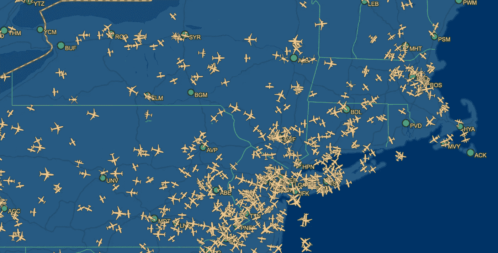

[参考。](https://flightaware.com)

# **博客摘要**

*这篇博客是我在数据科学学院的日子里开始的个人巅峰之旅的第二部分——*[*关于这里将要讨论的内容的补充背景，请参考本系列的第一部分*](/analytics-vidhya/combining-data-science-and-machine-learning-with-the-aviation-industry-a-personal-journey-through-132e59d8380b) *。这项数据科学研究试图展示如何将工程思想和数据科学实践结合起来分析航空业。在这里，我们将进一步研究在研究的第一部分收集的数据，观察模式，讨论从这些模式中获得的关键信息，并了解本研究中使用的各种回归模型，其中一些是集合模型。我们将了解哪一个模型被证明是达到我们目的的最佳表现模型，同时讨论我们的领先模型可能改进的方式。最后，我们也将对一架飞机的引擎进行理想化的热力学分析，作为如何改进这个顶点计划的一个想法。*

# **简要回顾**

在研究的第一部分中，我们研究了数据科学家或工程师应该如何解决以下问题: ***“一架客机每次飞行可以向乘客收取的最低成本阈值是多少，我们如何制作一个模型来发现这一点？”*** 在第一部分中，我们探讨了需要收集哪些数据、应该如何收集数据、应该如何清理数据，以及如何通过引导技术克服数据访问受限或“不太理想”的数据收集障碍。我们研究了清理细微差别的利基案例，还讨论了什么样的性能指标最适合判断我们的模型在回答数据科学问题时是否成功。

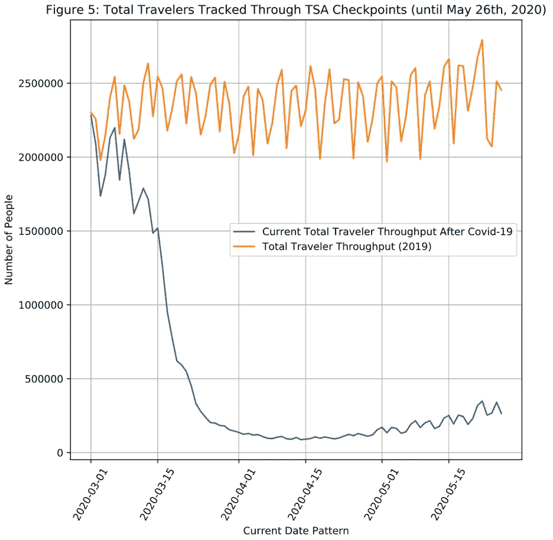

自创形象。[引用源代码。](https://github.com/chriskuz/ga_capstone/blob/master/code/project_notebook.ipynb) [引用数据源。](https://www.tsa.gov/coronavirus/passenger-throughput)

自创形象。[引用的源代码。](https://github.com/chriskuz/ga_capstone/blob/master/code/project_notebook.ipynb) [引用的数据源。](https://www.tsa.gov/coronavirus)

参考上一篇文章中的图 5 和图 6，我们讨论了“政权更迭”的重要性，提出新冠肺炎疫情在全球人口的步行交通和空中交通中发挥着重要作用。我们最终着眼于创建一个在社会中实施的新制度下工作的模型，并为分析和建模准备好我们的数据。

在本文中，正如在摘要部分所表达的，我们将探索数据的内部模式。这将帮助我们发现数据集中更多的潜在偏差，并帮助我们找到任何异常值。然后，我们将深入研究在我们的独热编码数据帧上执行的建模，讨论实现这种模型的优点和缺点。

# **探索数据**

拟用于本研究的模型将是监督模型。监督模型是具有要被确定和预测的预先存在的标签的模型。当数据科学家知道他/她的目标值必须是什么值，并且能够通过使用这样的值作为性能指标的参考来准确地确定模型的性能时，就实施了这些指标。在这种情况下，我们的目标价值就是我们的票价。让我们观察我们的数据中存在哪种定价:

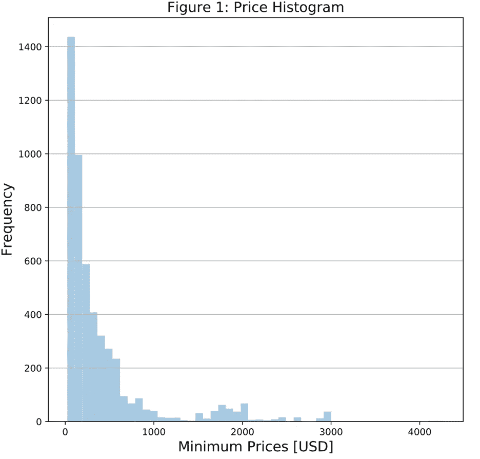

自创形象。[引用的源代码。](https://github.com/chriskuz/ga_capstone/blob/master/code/project_notebook.ipynb)

图 1 显示了我们研究中发现的价格直方图。[直方图](https://statistics.laerd.com/statistical-guides/understanding-histograms.php)显示在数据中发现的价格的频率分布，以最终表达数据的结构或形状。通过一些初步的实验性绘图，并使我们从复杂的数据收集中解脱出来，我们在大约 5000 行数据帧中获得的数据显示了连续的行为。人们担心，由于数据收集的严重限制，数据仍然会显示出分类行为的元素——这一切都要归功于社会制度的变化，也要归功于数据 API 本身的限制。在这种情况下，定价分布在 50 个箱中，我们看到定价数据是右偏的，其中发现较高频率的定价位于低于 1，000 美元的较低成本区域。这对我们来说并不令人惊讶，因为有一种轻微的倾向认为，航班不应该过于昂贵，而且有点负担得起(相对而言)。然而，由于这种偏斜，我们可以预期我们的模型会面临一些偏差。从图 1 中，我们确实看到票价成本在 2000 美元左右有所上升。这种机票费用会由于各种原因而持续存在，这些原因涉及显示什么航线、存在什么可用座位等级、什么航空公司飞行该航线、或者该航班主要是为企业还是非企业做广告。我们确实注意到了研究中的一个异常值，一次飞行的成本超过了 4000 美元。虽然这在疫情的某些情况下是可能的，但它不太适合我们的研究和模型的性能。

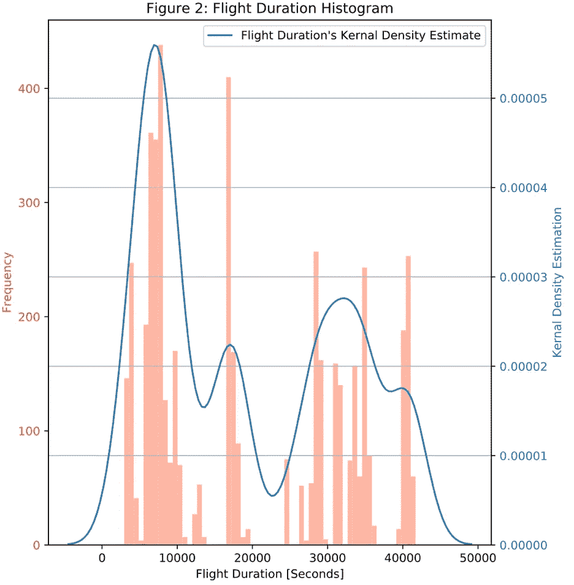

自创形象。[引用的源代码](https://github.com/chriskuz/ga_capstone/blob/master/code/project_notebook.ipynb)。

图 2 是以秒为单位表示不同飞行时间的飞行持续时间直方图。直方图被分成 60 个“橙红色”的区间，表示这样的频率。该图显示了在我们的研究中，什么样的地理限制起了作用，以及在这种新的制度下，出现了什么样的飞行模式。蓝线代表我们对持续时间直方图的核密度估计。内核密度估计(KDE)是一种在连续公理上表示我们数据的相同频率的方法。通过核密度函数对离散值的距离进行加权，可以看出这一点。最终，核密度估计显示了一个值在给定频率范围内存在的概率。KDE 有助于我们更好地确定哪里存在更高密度的值，如图 2 所示。有趣的是，改变上面的 bin 号起到了可视化数据频率的作用；离散的峰值实际上会由于仓的划分而改变。KDE 有助于解决此类问题，同时确定了最能反映 KDE 形状的 bin 号。更常见的持续时间频率约为 7000 秒(2 小时飞行时间)。事实上，我们不会跨越任何主要的海洋，只在 2 小时的飞行时间内到达这些美国机场；记录的航班大部分是国内航班，或者可能来自邻近国家/地区。下一个常见的飞行持续时间是 30，000 秒。通常飞行这么长时间的航班是飞行更远的航班，这表明这些航班中的很大一部分将是跨大陆的。

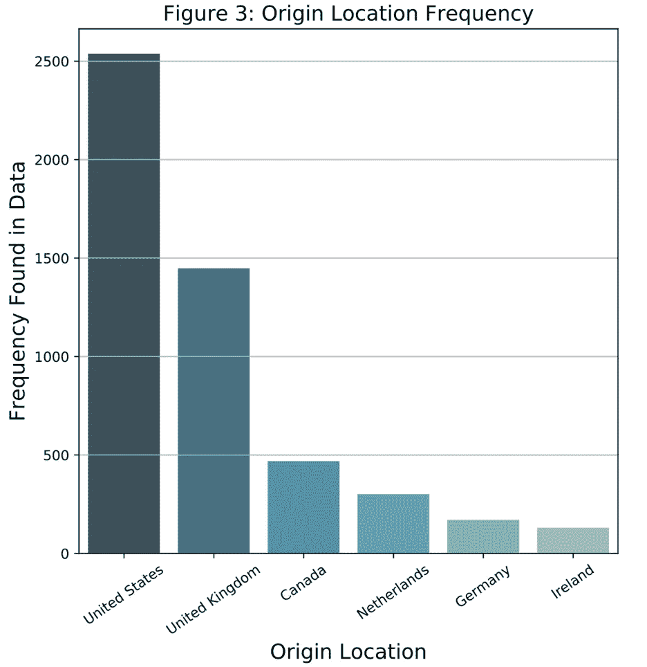

自创形象。[引用的源代码](https://github.com/chriskuz/ga_capstone/blob/master/code/project_notebook.ipynb)。

图 3 非常形象地展示了收集到的航班的始发地。[根据本系列的第一篇文章](/analytics-vidhya/combining-data-science-and-machine-learning-with-the-aviation-industry-a-personal-journey-through-132e59d8380b)，我们已经知道了位于美国境内的所有目的地机场。考虑到这一点，并考虑到我们从图 2 中了解到的情况，这里显示的大多数航班都是国内航班也就不足为奇了。这是我们未来模型引入/发现偏差的一种方式。如果我们的模型是成功的，我们将不得不了解它的局限性，注意到大部分的定价数据反映了国内航班。这也将作为未来体制变化的重要细节，其中我们的成功模型可以用于定价，因为这种未来体制变化应该与我们研究中存在的偏差有很大的相似性——注意，我们目前的数据表明没有观察到跨太平洋航班。更具体地说，所有发现的飞行只存在于北半球。任何不反映这些偏见的未来政权更迭都会影响到我们的模型将证明有多有用。除了上面显示的欧洲国家，一些航班来自邻近的美国国家加拿大，但在我们的数据中没有发现来自另一个陆地相连的邻国墨西哥的航班。在分析我们的模型时，所有这些观察都很重要。

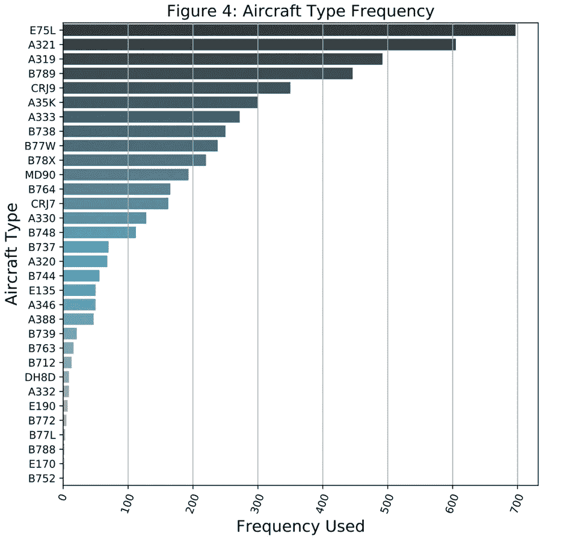

自创形象。[引用的源代码](https://github.com/chriskuz/ga_capstone/blob/master/code/project_notebook.ipynb)。

图 4 显示了研究中发现的最常见的飞机，其中最常见的飞机显示在图的顶部，最不常见的飞机显示在底部。E75L 是我们发现的最常见的飞机，航程为 2150 英里至 2200 英里。 [下一个经常飞行的飞机是 A321，航程为 3500 英里到 4700 英里。](https://simpleflying.com/a321s-compared/) [下一个经常飞行的飞机是 A319，航程为 3600 英里到 4170 英里。](https://jetadvisors.com/airbus-a319-description/)范围限制的差异来自测试中的轻微型号差异、发动机差异和有效载荷差异。不管怎样，这种飞机的流行出现也支持了关于飞行和从哪里起飞的叙述。这些类型的飞机也可能显示出我们的模型从这些数据中学习到的偏差。由于发动机效率低下、制造商差异甚至尺寸差异，一些飞机可能会出现票价上涨的迹象。

今天的文章中没有涉及数据集的许多不同因素，但我们探索性数据分析的上述几个表示应该给出一个数据科学家在对给定数据集使用机器学习模型时必须采取的过程的体面画面。我们使用这种探索性数据分析(EDA)来更好地了解模型的局限性，并从数据模式中获得洞察力。

# **一键编码**

我们用于可视化的数据框架不同于用于建模的数据框架。模型数据帧不包含字符串数据类型，只包含数字数据。由于数字数据易于用机器学习算法进行解释，因此通常更喜欢用数字数据进行建模。然而，人们可能想知道地理类别(如“美国”)或飞机类别(如“A321 ”)是如何转换成数字数据的。

独热编码数据的自创图像。

引入“一键编码”One-Hot 编码是将无序的分类信息转换成数字数据的实践。这些信息被分成它们自己独特的类别，并采用布尔真值来表达它们相对于数据集的存在。在这项研究中，我们为地理类别找到了这样一个实施的例子。每一行自然会有一个反映始发机场地理位置的关联列(让我们称这个列为“OriginCountry”)。从图 3 可以看出，在我们的数据中只发现了六个独特的产地。我们的一键编码器不是将这些信息表示为单个列中的字符串，直接向普通读者解释原产国在哪里，而是将这些信息转换为通过一个布尔表来表示，该布尔表用“OriginCountry_UnitedStates”、“OriginCountry_UnitedKingdom”、“OriginCountry_Canada”等命名约定来表示六个唯一的列。原始列被删除，并替换为六个唯一的列，它们都专用于为“OriginCountry”找到的一组可能的结果

既然信息是以这种方式表达的，那么显示信息与其余数据的关系所需的唯一数据就是用“1”或“0”(真或假)表示的数值真值。因此，参考上面的图像，如果我们的“OriginCountry”最初为一行声明了“UnitedKingdom”(就像它曾经在第 716 行中所做的那样)，那么现在可以在“OriginCountry_UnitedKingdom”列中用值“1”来表示真实，而该行中的其他列用“0”来表示虚假。

一键编码的结果是原始数据集的大小急剧增加——我们自己的数据集已经增长到大约 400，000 列。当实现可视化技术时，信息变得很难处理，但这是为机器学习模型准备数据框架的必要步骤。

# **准备监督机器学习模型**

下一步是通过将数据分成适当的批次进行训练和测试，为监督学习准备我们的模型。监督学习模型在实现到未知数据之前，必须在一些已知数据下进行训练。为了模拟“已知”数据和“未知”数据(或“新”数据)的环境，我们将把整个数据集分成两批。一批将包含大约 75%的专用于训练的原始数据，而剩余的 25%将用于以后的测试。然后，我们的模型将只根据训练数据进行训练和微调。然后，测试数据将暴露在我们调整后的模型中，以显示该算法对新数据的适应程度(就像它在现实世界中对未知变量的实现一样)。用户不应将测试数据与模型的训练混在一起，因为这是一种数据泄露的形式，会损害模型的完整性和合法性。

通常，用户可以在这里挑选在培训和测试中要包含或不包含的特性/专栏。用户也经常在这里选择必须预测哪些标签。Scikit-learn 通过他们的[“训练 _ 测试 _ 分割”方法使这变得非常容易。](https://scikit-learn.org/stable/modules/generated/sklearn.model_selection.train_test_split.html)可将各种参数整合到该方法中(如分层=真),以帮助消除数据中的偏差。

# **机器学习——基线模型**

当对数据集实现监督学习模型时，我们最感兴趣的是有一个基准模型来参考我们成功的算法的性能。基线模型将是一个非常粗糙的模型，我们可以快速实现它，以得出机票价格的最佳猜测答案。基线模型的一个例子是利用有序标签集的中值或标签集的众数。在这种情况下，我们使用标签的平均值(机票价格),并通过测量其平均绝对误差将该平均值与正确值进行比较。

*训练基线平均绝对误差约为 368 美元。*

*测试基线平均绝对误差约为 340 美元。*

这意味着我们实现的机器学习模型必须比基线平均绝对误差表现得更好。任何低于这些值(即平均绝对误差较高)的模型都是一个挫折。我们将要实现的机器学习模型也必须在训练和测试中表现出一致性，同时还要消除过度拟合的问题。由于这些模型中的一些模型需要花费很长时间来计算我们的所有数据，并且考虑到我们的客户在第一部分中对我们提出的时间限制，因此没有花费太多时间来测试各种功能组合或大量微调超参数。随着我们继续前进，我们将看到的结果都会反映这一点，但更重要的阈值是展示解决该客户问题的可行概念证明，同时还要超过我们的基线平均绝对误差，不用说，这不是最大的平均绝对误差。让我们开始吧…

# **机器学习—线性回归**

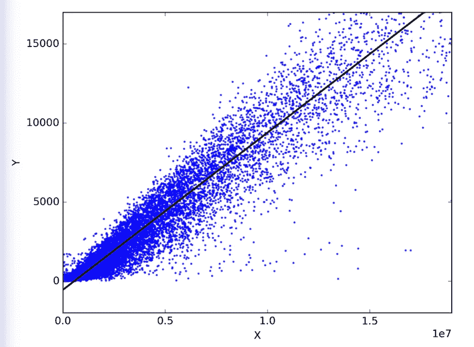

[参考。](/@amarbudhiraja/ml-101-linear-regression-tutorial-1e40e29f1934)

在我们的研究中，没有实施简单的线性回归。相反，我们实现了“多元线性回归”，也称为“多元回归”多元线性回归是一种常用于预测分析的统计算法。它的方程式如下:

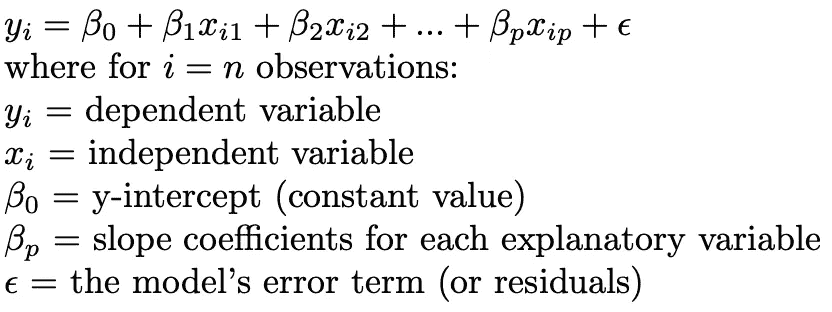

自造乳胶。

它与下面显示的简单线性回归公式非常相似:

自造乳胶。

[多元线性回归采用与简单线性回归相同的原理，不同之处在于多元线性回归使用多个自变量来预测单个因变量。](https://www.investopedia.com/terms/m/mlr.asp)多元线性回归假设因变量和自变量之间的关系是线性的，残差呈正态分布，残差的均值为零，自变量之间的相关性不高。当通过 Scikit-learn 的[线性回归类](https://scikit-learn.org/stable/modules/generated/sklearn.linear_model.LinearRegression.html)实现这样的模型时，我们发现了以下结果:

*训练多元回归模型的平均绝对误差约为 123 美元。*

*测试多元回归模型的平均绝对误差约为 181，653，021 美元。*

*五重交叉验证多元回归模型的平均平均绝对误差为 65，161，825，293 美元。*

多元线性回归模型不是一个很好的实现模型。有了训练数据，该模型成功地超越了基线模型，但当暴露于新数据时就恶化了。此外，5 重交叉验证测试显示了显著的误差(以十亿计！).

# **关于交叉验证的附带课程……**

如果你不熟悉交叉验证分数，查看这篇解释 [K 倍交叉验证的文章会很有帮助，这正是我们的目的。](https://towardsdatascience.com/why-and-how-to-cross-validate-a-model-d6424b45261f)交叉验证的概念很容易理解。交叉验证是在机器学习建模中进行的实践，以验证模型在生产环境中的合法性。它是在各种条件下训练和测试模型的行为——主要关注将数据的不同子集组合迭代成合适的模型。最初，我们将模型分成 75/25 两部分，其中 75%的数据用于训练，25%的数据用于测试。然而，这种实践本身会误导模型在生产环境中的性能，因为模型是通过仅考虑用于训练和调整的单个 75%的数据批次，并且仅考虑用于测试的单个 25%的数据批次所观察到的性能来准备的。如果我们的模型的性能只针对单一的利基环境进行了调整，而没有为数据未知的生产环境做好准备，会发生什么？我们如何解决这个问题？

一个解决方案是获取更多数据来运行模型。然而，通过传统的收集方法获取数据既费钱又费时。通过迭代相同数据的子集，通过模型实际模拟已知和未知的条件会更明智。

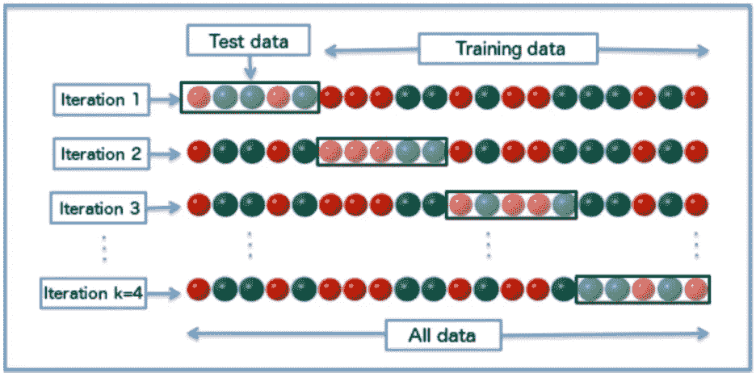

[参考。](https://towardsdatascience.com/why-and-how-to-cross-validate-a-model-d6424b45261f)

5 重交叉验证将以这样的方式分割数据，其中所有数据的 5 分之 4 将用于训练，而剩余的 1/5 将用于测试。一旦模型符合规定的性能指标(在我们的例子中是平均绝对误差)，我们代码的下一次迭代将像以前一样运行模型，但将改变哪 4/5 的数据用于训练，哪 1/5 的数据用于测试。这有助于我们对模型的调整进行一般化，消除了针对小批量数据进行参数调整的情况。在我们的研究中，我们的 5 倍交叉验证分数的平均值被认为是代表五个不同的迭代性能指标所显示的单一值。

# **机器学习— KNN 回归**

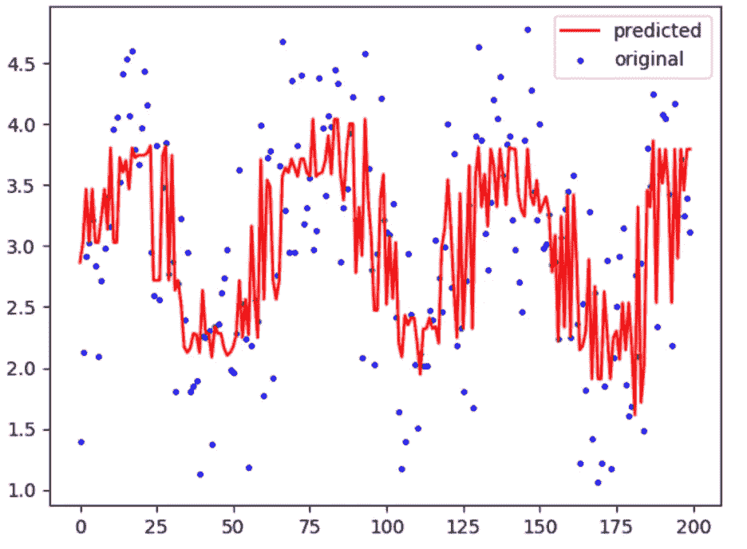

[参考。](https://www.datatechnotes.com/2019/04/regression-example-with-k-nearest.html)

k 近邻(KNN)是一种流行的机器学习算法，以其直观性而闻名。[它通过识别跨特征的相似性度量来预测标签](https://www.saedsayad.com/k_nearest_neighbors_reg.htm)。通常，KNN 中使用的这些相似性度量是距离度量，它寻找值之间的最小数值距离来确定预测的最相关要素-因此它被命名为识别“最近邻”或最近值。此外，KNN 还将依赖于它必须评估多少个最近点来确定预测标签；这最初由用户指定为一个阈值，并且必须始终是奇数个评估点(偶数可能会产生相持预测)。由于 KNN 在很大程度上是基于距离的，因此为了精确起见，它必须需要某种形式的数据缩放，其中所有数据点都应该相对于标准化的距离参考。三个距离公式通常用于测量相似性。它们的名称和表达如下:

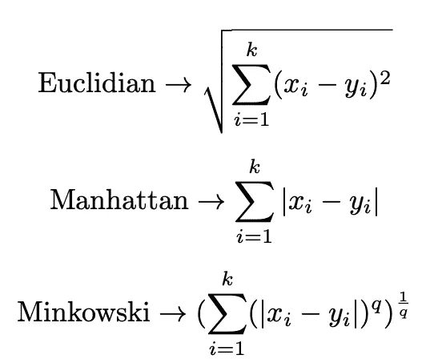

自造乳胶。

[虽然 KNN 可以在其算法中实现更多的距离测量，如 Tanimoto、Jaccard 或 Hamming for binary outcomes，但上述三个方程被认为是更受欢迎的距离公式，可轻松应用于模型](https://machinelearningmastery.com/k-nearest-neighbors-for-machine-learning/)。众所周知，该算法对于分类问题是一种非常有效的算法。然而，上述等式可以互换地用于回归和分类问题。KNN 也有一些缺点，比如对异常值很敏感，用太多的特性表示性能限制，用数据不平衡表示不能很好地执行。在我们的研究中，通过利用[五个最近邻居的测量距离，并最终从这些特征局部内插一个目标，它优于我们的基线模型。](https://scikit-learn.org/stable/modules/generated/sklearn.neighbors.KNeighborsRegressor.html)

*训练 KNN 回归模型的平均绝对误差约为 215 美元。*

*测试 KNN 回归模型的平均绝对误差约为 245 美元。*

*五重交叉验证 KNN 回归模型的平均绝对误差约为 250 美元。*

就一致性而言，KNN 模型表现得非常好。不同的分数之间没有太大的差异，如果进行更多的调整，这个模型可以作为一个非常好的模型。它在训练和测试中的表现优于基线模型。然而，相对而言，票价的平均绝对误差$200+美元似乎相当大，并且对于依赖具有这种误差的预测的公司来说可能是有害的。我们将进一步探索更多的模式。

# **机器学习—决策树回归**

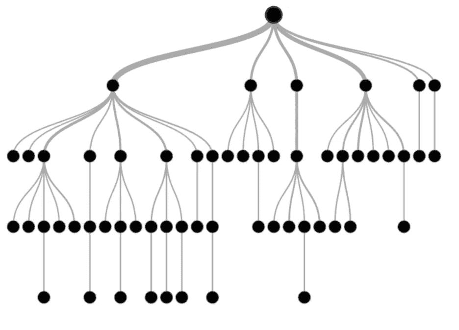

[参考。](https://wiki.pathmind.com/decision-tree)

决策树模型类似于 [20 题](https://www.washingtonpost.com/lifestyle/style/20q-how-does-it-know-that/2011/05/03/gIQAwDSShI_story.html)的游戏。如果你对 20 题游戏不熟悉，可以简单解释一下。想象一个大多数人都知道如何识别的物体，但是不要对任何人大声说出来！在 20 个问题中，会有一个实体向你提问，你必须回答这些问题。所有的问题必须是“是”或“否”的问题，所有的问题都是为了向提问者提供信息。对于提问者来说，这个游戏的目标是通过 20 个“是”或“否”的问题来猜测你在想什么样的物体。如果提问者在 20 个问题或更少的问题中猜对了这个物体，提问者就赢了这场游戏。如果猜错了，提问者就输了。

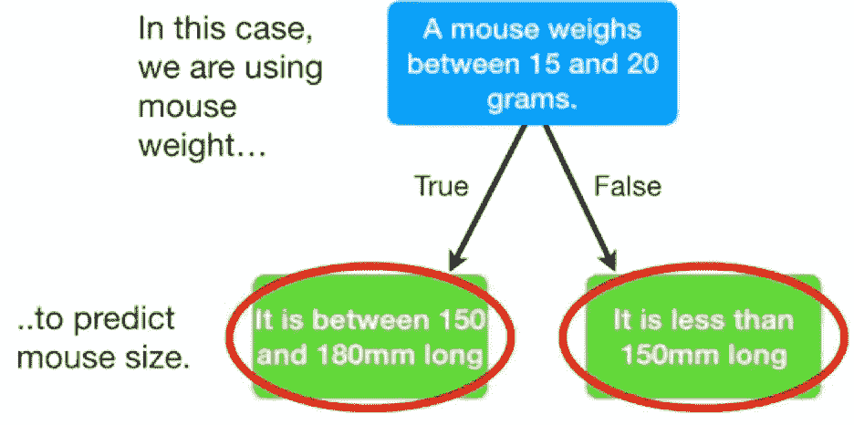

[参考。](https://www.youtube.com/watch?v=7VeUPuFGJHk)

如前所述，决策树算法类似于 20 个问题的游戏，目标是根据问题获得的信息做出预测。在上面来自 [StatQuest 视频](https://www.youtube.com/watch?v=7VeUPuFGJHk)的图片中，显示的简单决策树的目标是通过询问老鼠的体重是否在 15 到 20 克之间来预测老鼠的大小。简单地说，决策树提供了一个问题的答案。然而，通常情况下，这些决策树的结构更加复杂，多个问题相互层叠。

树的顶部被称为根节点，它是决策树的最开始。图中底部的两部分称为叶节点，它标志着决策树的结束。在我们的研究中，我们的模型将不止有一个根节点和两个叶节点。包含在我们的决策树结构中的将是更多的内部节点(称为决策节点)，这些节点将询问另一个问题以引导到另一个子节点(或者也称为在子树中所做决策之后出现的节点)。

计算机在决策树模型中做出的每个决策都有一个信息增益算法作为支持，以数学方式理解通过分析特征获得了什么信息。为了首先分析获得了什么信息，决策树首先测量节点的“纯度”，或者更直观地认为是节点“在特征和标签之间关联适当模式的能力”通过分析节点的“杂质”可以了解节点的纯度，杂质是指根据当前已知的情况，测量分支路径上存在多少模糊性，最终通过对分支路径进行逻辑决策来显示存在哪些错误分类预测的可能性。[典型地，决策树使用“基尼”杂质来进行这样的测量:](https://victorzhou.com/blog/gini-impurity/)

自造乳胶。

基本上，基尼系数通过分支或节点来衡量错误分类的可能性。这种错误分类可以由用户改变，指示数据分组将被分割的位置。一个节点(或分裂处的每个分支)的理想 Gini 杂质将希望为零或尽可能接近零。

为了进一步使决策树在选择分割数据的最佳节点的过程合法化，由于不均匀的数据分割和增加的错误分类的可能性，测量的基尼系数杂质通常相互加权。然后，基尼系数的衡量标准是在一个分支中体现其影响力的点数。这将最终向计算机显示哪种信息增益最大。累积加权杂质，然后从先前可能的误分类概率(分支分裂前的先前杂质)中减去该总和，得到描述信息增益的数。最终，表示信息增益的结果数必须最大化，以更好地表示数据分割的可靠性。

**但是我刚才向你描述的大部分都与分类问题有关！**

首先通过分类问题可以最好地理解决策树——从我的 20 个问题开始，类比决策树构造和过程背后的一些表面数学。但是，在这种情况下，决策树不用于分类，而是用作回归变量。对于包含多个预测器和连续标签的回归问题，如果分支和数据分割都是基于布尔的，那么决策树怎么能用于连续的规模呢？

幸运的是，该算法仍然能够通过创建节点来持续询问一个数字是大于还是小于阈值，从而坚持正确和错误的决策。理论上，预测器本身将受制于树的节点，以确定它们是否大于决策阈值。来自这些节点的结果将最终导致决策树最终确定什么是初始预测器数据的最合适标签。

为了尊重 StatQuest 视频在回归分析树上的视觉准确性(承认其视频在撰写本节时极具信息性，值得那些希望了解更多决策树的人观看)，我们将解释选择阈值和验证其数据分割质量的概念。这类似于分类树如何在分类中分析纯度。阈值本身首先通过预测预测器列内每个数据点分割的残差平方和来确定；选择提供最小残差平方和的分割作为候选阈值来创建根节点。一旦确定了所有预测值的残差平方和，最低值将优先考虑该预测列拆分，作为树中的第一个阈值拆分。然后，在内部节点和分支上重复该过程，直到观察不再能够被分割。结束拆分的决定因素通常由用户设定。

[Scikit-learn 的 DecisionTreeRegresor 类](https://scikit-learn.org/stable/modules/generated/sklearn.tree.DecisionTreeRegressor.html)默认其阈值分割为计算均方误差。虽然上一段中提到的 StatQuest 视频将说明通过使用残差平方和来分割回归树，但决策树算法并不限于使用这种残差。只要我们的目的是最小化残差，替换其他残差度量可以达到确定质量分割的相同目的。scikit-learn 的类设置的缺省终止拆分是 2。需要提醒的是，这些模块的所有默认设置都受到尊重，只是为了展示在我们的研究中采用这种机器学习算法的概念证明。

*训练决策树回归模型的平均绝对误差约为 0 美元。*

测试决策树回归模型的平均绝对误差约为 93 美元。

*五重交叉验证决策树回归模型的平均绝对误差约为 183 美元。*

令人惊讶的是，决策树的训练数据集产生了零美元的平均绝对误差。这个结果是非常可疑的，因为它是完美的(不考虑我们所做的四舍五入)。在等待测试分数和交叉验证分数计算时，假设模型将非常[过度拟合](https://www.investopedia.com/terms/o/overfitting.asp)，测试分数将具有更高的平均绝对误差，验证分数将显示相同类型的方差——过度拟合的模型将不会容易地适应新数据，这就是我们在这里看到的情况。

# **机器学习(集成建模)— Bagging 回归器**

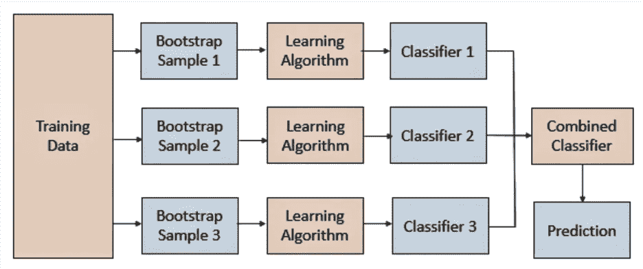

[参考。](https://corporatefinanceinstitute.com/resources/knowledge/other/bagging-bootstrap-aggregation/)

最后，我们开始深入整体建模，除了 Bagging 回归模型之外，还有什么更好的模型可以开始我们的讨论。集成建模是将多个经过训练的模型组合在一起以获得更强大的预测模型的实践。集成建模在计算上要求很高，通常需要更长的时间来训练，好处是可以得到更高性能的模型。大多数集成机器学习可以分为 bagging 模型或 boosting 模型。由于 bagging 的普及性、直观性及其在相关研究中的应用，我们将重点关注它。

在集成学习中，Bagging 是“引导聚合”的行话[这是迄今为止最古老/最早的集成学习方法之一，它涉及创建多个决策树，最终更好地预测标签。](http://www.differencebetween.net/technology/difference-between-bagging-and-random-forest/)这是一个两步算法，首先涉及用替换来引导数据子集，以构建弱学习者模型——传统上是决策树，就像我们之前刚刚谈到的那样。最初建立的模型太弱，不能真正被认为是有效的，因为它只包含少量的真实数据。

[参考。](https://www.pinkconcussions.com/blogreal/2015/12/6/the-6-blind-men-and-the-elephant-the-story-of-concussion)

首先，使用弱学习模型来创建预测可能没有意义，这就是为什么使用多个模型来提高信息增益的原因。就像上面这幅聪明的公民科学家分析大象的漫画一样，通过对数据的小规模分析和相关预测获得的每一个信息都在后来被聚合起来，最终建立一个变化较小的模型。科学家对单个元素的猜测标签子集可以全部组合起来，以更准确地预测整体是一头大象，而不是他们最初的猜测。最终，Bagging 回归器算法的实现消除了“贪婪”,这种“贪婪”可能来自于简单地依赖于主要基于数据的最佳直接分割的决策树；通过识别弱模型之间的预测模式，我们的模型对其预测更有信心。

在我们的研究中，scikit-learn 库中的 [Bagging 回归变量类](https://scikit-learn.org/stable/modules/generated/sklearn.ensemble.BaggingRegressor.html)用于构建价格的回归模型。通过分析不同特征的不可解释的趋势，它能够在默认参数下输出某种程度上可靠的模型，例如使用 10 个估计器/模型并将决策树设置为确定模型。

*训练 Bagging 回归模型的平均绝对误差约为 35 美元。*

*测试 Bagging 回归模型的平均绝对误差约为 81 美元。*

*五重交叉验证 Bagging 回归模型的平均绝对误差约为 183 美元。*

判断上述模型的表现，我们可以比之前表述的单一决策树更信任这个模型的合法性。在所有情况下，平均绝对误差都优于基线模型。它的训练平均绝对误差比决策树的平均绝对误差差，但是由于其可疑的“惊人”性能，我们已经预先决定放弃决策树回归模型的合法性。上述训练分数和测试分数之间的差异是我们研究中观察到的最小的差异之一，与初始训练和测试分数相比，以及与实施的其他模型相比，我们的 5 重交叉验证分数似乎相对较低。它当然不是完美的模型，但通过最小的参数调整也没那么糟糕。

# **机器学习(集成建模)—随机森林**

[参考。](https://www.analyticsvidhya.com/blog/2020/05/decision-tree-vs-random-forest-algorithm/)

本研究中实现的最后一个模型是随机森林回归模型，它很好地过渡到了本文中。[随机森林模型是另一种基于 Bagging 算法和决策树算法原理的集成监督机器学习方法。](http://www.differencebetween.net/technology/difference-between-bagging-and-random-forest/)它非常类似于决策树的 bagging，除了对 Bagging 算法实施的附加随机变化在弱学习器模型中创建了更大的多样性-这确保了要在集成中聚集的每棵树都是唯一的(因此，是随机决策树的森林)。正如这篇 Analytics Vidhya 文章中提到的，集成模型[考虑的每棵树都在随机的特征子集上工作。](https://www.analyticsvidhya.com/blog/2020/05/decision-tree-vs-random-forest-algorithm/)通过消除 Bagging 算法中仍然存在的一些偏差，消除仍然引入 Bagging 模型的可能模式有助于随机森林算法通常优于前者模型。

在我们的研究中，我们依赖于被称为 [RandomForestRegressor 的 scikit-learn 类。](https://scikit-learn.org/stable/modules/generated/sklearn.ensemble.RandomForestRegressor.html)由于最初确信该模型将优于之前的 Bagging 模型，因此仅调整了单个参数，其中在实例化期间针对平均绝对误差优化了分裂质量。其他参数保持默认，例如将模型限制为 100 棵树，并且愚蠢地让模型只在一个内核上运行。Python 已经足够先进，允许对建模进行一些多重处理，这将大大加快计算运行时间，但代价是使用更多的计算能力。相反，该模型仅在一个核心处理器上运行，估计需要大约 5 个小时才能完成(利用 2.8 Ghz 的 i7 处理器)。

*训练随机森林回归模型的平均绝对误差约为 32 美元。*

*测试随机森林回归模型的平均绝对误差约为 84 美元。*

*5 重交叉验证随机森林回归模型的平均绝对误差约为 173 美元。*

从上面的分数来看，如果我们在寻找品质和优势的观察中保持一致性，这个模型是我们在研究中可以依赖的最佳模型。实际上，在这个疫情，一个真正的企业严重依赖这种模式来定价很可能是不合适的，因为可能会将适当的票价提高 100 美元以上。然而，该模型是研究中表现最好的模型，主要是因为它的 5 倍交叉验证分数，部分是因为它在数值和差异方面的训练和测试分数表现接近最佳。

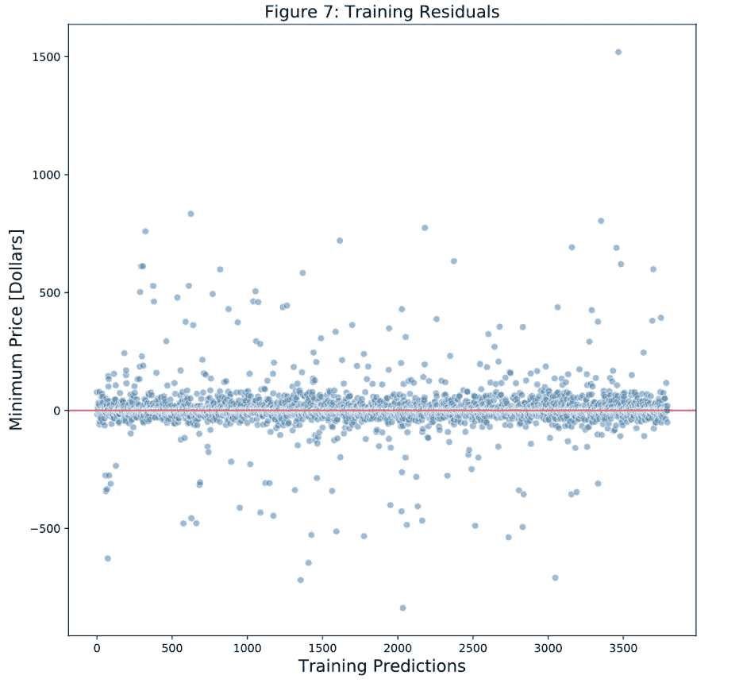

自创形象。[引用的源代码。](https://github.com/chriskuz/ga_capstone/blob/master/code/project_notebook.ipynb)

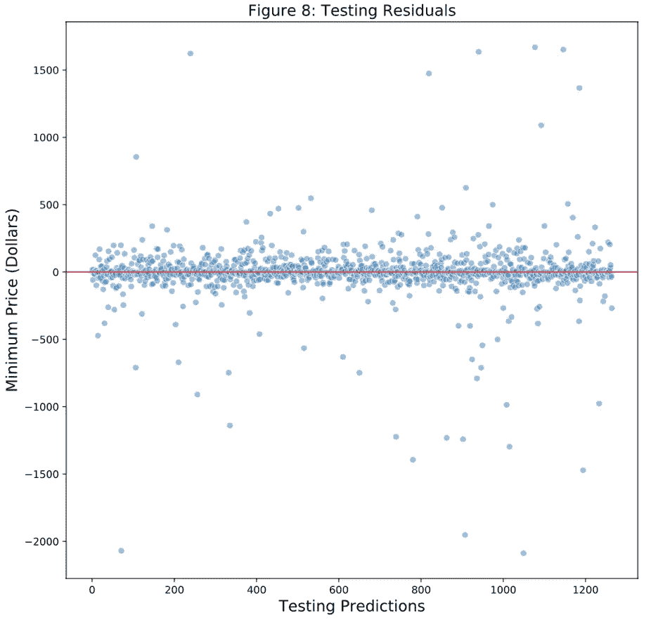

自创形象。[引用的源代码。](https://github.com/chriskuz/ga_capstone/blob/master/code/project_notebook.ipynb)

作为这些初始分数的结果，我们创建了上面的图 7 和图 8 来分析我们的模型中用于训练和测试的残差。每个数字都告诉我们，我们的模型选择得很恰当，因为残差没有显示任何清晰的模式，而且还体面地揭示了水平红线上下点的均匀分布。水平红线代表我们的模型的理想化回归，而分散的点代表每个连续预测和标签的值的差异。用我们自己的眼睛发现残差中的模式将表明我们可以使用更好的模型来描述系统——从逻辑上讲，如果您在您的错误中发现了一个模式，那么这意味着您应该认识到有一种方法可以通过将这样的模式合并到您的模型中来减少该错误。如果两个图中的所有残差都显示不均匀分布-其中一个阈值中存在大量的点，这些点被另一个阈值上的水平线分隔开，或者残差显示出从水平线越来越远的缓慢分布模式-这意味着您的模型仍然可以调整以使残差均匀分布。

# **结论、研究总结、致谢……**

可以肯定地说，这项研究显示出了适度成功的迹象。从各种各样的限制中——例如在新制度变化中有限的航空旅行、将 API 数据集成在一起的问题、不平衡的数据、时间限制、数据访问限制等——我们能够得出一个“概念验证”研究，以展示如何使用机器学习模型来预测新制度中机票的最低成本阈值。相反，仍然有必要提及我们模型的局限性，从商业角度来看，这种尝试可能毫无意义，因为这项研究已经变得非常小众，有些地方必须走捷径，以及模型的实用性/可靠性如何。然而，由于生态位障碍，几乎所有的模型都将面临普遍的限制，这使我们有希望说，我们的模型就像任何其他用于预测同一标签的模型一样(它只能变得更好)。

通过这项研究，涵盖了很多内容，现在可能很难完全收集本文所写两篇文章的内容。总的来说，我们作为数据科学家被一家企业找到来回答这个问题，**“一架客机每次飞行可以向乘客收取的最低成本阈值是多少，我们如何才能制作一个发现这一点的模型？”**我们有一个月的时间进行概念验证。在某种程度上，我们实现了这些目标。通过这一过程，我们了解到政权的变化，以及新冠肺炎疫情如何在我们的数据收集阶段发挥了重要作用。我们了解了使用不同 API 的局限性，以及必须对数据进行何种清理。我们讨论了如何通过使用独特的方法来增加数据并增加数据的多样性，从而克服 data domain 问题并从我们的收集方法中创建数据。我们学习了 bootstrapping 来扩展我们的数据和机器学习方法，如线性回归、交叉验证、KNN 回归和决策树回归。我们学习了集成机器学习，如 Bagging 回归和随机森林，同时讨论了我们发现的趋势中出现的数据不平衡。我们最终创建了一个交叉验证平均绝对误差为 173 美元的模型——所有这些都是在没有大量超参数调整的情况下完成的。

对我来说，这个顶点项目是在数据世界中证明自己的一次非常个人化的旅程。我想利用我对航空航天业的了解，并将其与数据分析结合起来，最终展示一个值得投入更多时间和资源的项目。有了更稳定的制度、更多的数据访问和更多的时间，这个项目有能力扩展以帮助现实世界的业务。写这个系列是一种乐趣，因为我想真正向世界表达我所知道的，并帮助人们从这项研究中学习。机器学习是一个谈论的热门领域，但通常很难找到现实世界的实际实现模型。很多时候，机器学习被留在研究中，因为它在研究中的使用变得过于个性化，围绕着一个特定的问题。最终，我希望那些从一天中抽出宝贵时间来阅读这篇文章的人，从这个系列中学习一些新的东西，并思考如何更好地分析数据，并将机器学习应用于社会问题。我非常感谢你的时间，并给予我最真诚的感谢。不要停止自学，在这个世界上你还能做的时候，努力去做更大更好的事情；在前进的过程中珍惜你所学到的东西。干杯！

# **奖励:学习如何利用热力学预测价格**

我的背景是工程方面的，我尽我所能在这里反映出来，但我知道还可以做得更多，以更好地将工程概念融入到研究中。事实上，这个顶点项目最初是受我在霍夫斯特拉大学本科学习时做的一个项目的启发。我的一个最终设计项目是为了我的热能工程课程，这是研究机器热力学原理的领域。在这个高级设计项目中，我分析了那年早些时候我乘坐的一次跨大西洋飞行，并从 FlightAware.com 收集了有关飞行速度和高度的数据。当时，将这些数据导入 Excel 电子表格要容易得多，不需要抓取——这是在我知道如何使用 Python、如何进行 web 抓取或如何使用 API 之前。仅仅根据这些数据，加上一些理想化的假设，我就能够成功地对飞机的发动机进行全面的理想化的喷气推进发动机分析，并确定通过涡轮风扇的空气的许多重要特性。

我想包括这一部分，作为一个奖金，供人们在思考这项研究时思考，因为它是“失去的链接”，仍然希望被集成到项目中，但由于 FlightXML API 在研究中的限制和由于新冠肺炎缺乏飞行数据而无法实现。相反，我将对我在 2018 年本科课程中执行的项目进行预演描述，作为一个例子来显示可能已经生成了哪些额外的数据来潜在地帮助改进我们的模型。

2018 年 10 月 17 日，我乘坐 [BA115 航班(英国航空公司 115 航班)](https://flightaware.com/live/flight/BAW115)从伦敦希思罗机场前往 JFK 国际机场。此类前期项目的目标是执行和分析发动机的热力循环状态。FlightAware.com 主要用于获取单个航班的准确速度和高度测量值，因为飞机会随着时间的推移将这些信息记录到沿途附近的无线电检查站。从 FlightAware.com 起飞的飞机还被发现是一架[B747–400](https://www.britishairways.com/en-us/information/about-ba/fleet-facts/boeing747-400)，这是一架四引擎飞机，是 B747 系列的变体——众所周知，它被认为是人类飞行史上最著名的飞机设计。

[参考。](https://flightaware.com/live/flight/BAW115)

[引用。](https://flightaware.com/live/flight/BAW115)

上面是 2018 年 10 月 17 日飞行的两张图像。不幸的是，不可能再从 FlightAware.com 访问上图，因为基本访问用户只能访问 3 个月的数据历史。*因此，采用上述图形的参考源，适当考虑它可能不会反映研究中描述的完全相同的路径，但对于我们的预期目的来说足够相似*。

从 FlightAware.com，我能够检索到 BA115 航班的速度、高度、方向、时间等 660 个数据点。根据该数据，确定飞行时间持续 8 小时 15 分钟(相当于 29，700 秒)，飞行总距离为 5，922.386 公里。那天的天气显示整个飞行过程都是晴空万里，不需要大规模的环境约束。

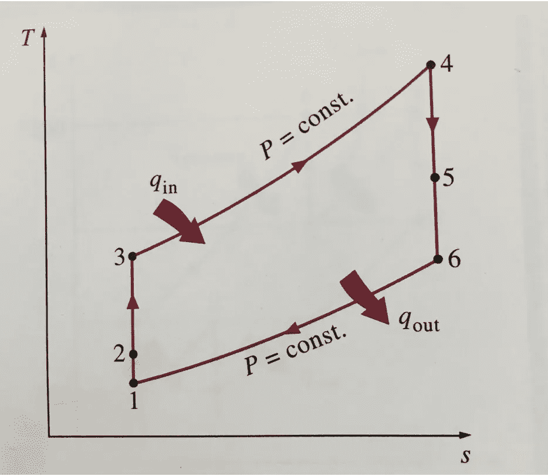

参考 2002 年的《理想喷气推进循环》。*热力学:一种工程方法*。纽约麦格劳-希尔公司。483–487)

在分析热力机器时，如上图所示的图形用于理解机器生命周期中出现的不同属性状态。上图展示了在喷气发动机的理想化生命周期中，熵和温度之间的关系。熵(通常定义为理论热力学中的变量“S”……不同于我们在横轴上用小写“S”表示“特定熵”)是“系统中有多少能量不能做功”的度量。它通常与混沌密切相关，或者是一个系统如何随着时间变得更加无序的量度。熵的单位是焦耳/开尔文。[工程师必须了解熵是什么，但在他们的分析中会更多地使用特定熵，其单位是千焦/(千克*开尔文)，或者更容易定义为每质量的熵。](https://www.nuclear-power.net/nuclear-engineering/thermodynamics/what-is-energy-physics/what-is-entropy/specific-entropy/#:~:text=The%20specific%20entropy%20(s)%20of,the%20total%20mass%20(m).&text=Entropy%20quantifies%20the%20energy%20of,available%20to%20perform%20useful%20work.)比熵常用于分析系统内存在的某种形式的质量，因此分母中包含千克单位。比熵可以根据系统中的不同状态而变化——通常对于水，参考经验蒸汽表来分析水的比熵，以更好地理解系统。在我们的例子中，我们将分析空气，在空气中并不需要这样的表格。

回到我们上面的图表，T-s 图(温度与熵图)显示了在飞机发动机的生命周期中，压力在一些过程中保持不变的情况下，如何分析发动机内的空气能量。在熵状态一到三中，压力通过等熵压缩而增加。在这里，空气首先从发动机的入口通过扩散器，然后通过压缩机。在过程三至过程四中，空气从压缩机经过燃烧器/燃烧室。空气本身在恒定压力下被加热，导致更高的熵值，这同时增加了每单位质量的热传递(表示为变量“q”)。空气目前倾向于更高的能量释放。在第四至第六个过程中，空气经历等熵膨胀，在此过程中，压力从燃烧室、涡轮和喷嘴出口释放。这种压力释放最终会不断地以巨大的力量推动飞机前进。

参考 2002 年的《理想喷气推进循环》。热力学:一种工程方法。纽约麦格劳-希尔公司。483–487)

在整个研究过程中，为了进行分析，需要解决几个不同的假设和基本的初始条件。首先，将空气视为理想气体是很重要的，这意味着空气的特性在标准温度和压力下表现正常。根据 M. David Burghardt 和 James a . har Bach[编写的第四版*工程热力学*的附录 A.1，研究中使用的空气定压比热](https://courses.lumenlearning.com/boundless-physics/chapter/specific-heat/#:~:text=Specific%20Heat%20for%20an%20Ideal%20Gas%20at%20Constant%20Pressure%20and%20Volume&text=This%20represents%20the%20dimensionless%20heat,5%2F2%20(see%20).)为 1.005 千焦/(千克*开尔文)，使用的[玻尔兹曼常数](https://www.nist.gov/si-redefinition/kelvin/kelvin-boltzmann-constant)为 1.4。这两个数字对我们学习发动机性能的数学公式都很重要。比热是一种度量单位，用来衡量要提高一种物质的温度需要多少能量。比热会根据周围的因素而变化，这就是为什么当依赖[理想气体定律](http://hyperphysics.phy-astr.gsu.edu/hbase/Kinetic/idegas.html)时，在这些因素中表示什么保持不变是很重要的(这就是为什么我们在分析中假设空气是理想的)。比热会受到体积和压力值变化的影响，这就是为什么我们只通过保持其中一个独立变量不变来分析这些测量值的原因。在我们的情况下，我们的发动机将经历恒压过程，这就是为什么我们将使用比热数来表示空气的恒压，因为这是研究的确定性。玻尔兹曼常数是一个衡量一种性质的能量与热力学温度的比例的数字。发动机的运行条件被假定为稳定状态，这意味着[系统状态变量将保持不变。](http://www.projects.bucknell.edu/LearnThermo/pages/Equilibrium%20and%20Steady%20State/equilibrium-and-steady-state.html)

自制白板图像。

理论上假设飞机是一个静止的物体，飞机的记录速度被分解为空气自由流速度(表示为“v”下标“∞”)，等于/代表飞机的速度(表示为“v”下标“飞机”)。这样的假设使我们可以说，自由流速度可以作为每个喷气发动机进气道的速度。此外，除了在入口和出口条件下，系统中的动能和势能可以忽略不计，此外，大气温度、压力和空气密度是零到 15000 米高度之间的平均值。从英国民航局发动机型号认证数据表 1048 中发现，波音 747-400 通常使用四台劳斯莱斯 Rb 211-524h 喷气发动机。在这项研究中，将只分析一台发动机，并且从单个发动机分析中得出的这些结果将被假定为适用于安装在飞机上的所有四个喷气发动机。假设长度为 2.19 米的喷射轴具有统一的直径。假设汽轮机功等于压缩机功。假设离开扩散器的空气速度等于 0 米每秒。旁路空气产生的推力可以忽略不计。燃烧室温度假定为 2273 开氏度。压缩比，[总体积与活塞中余隙体积的比率，](https://jalopnik.com/heres-what-compression-ratio-actually-means-and-why-it-1819723873)为 32.9:1。

**广义分析:热力学可以与机器学习融合的地方**

考虑到所有这些假设和初始条件，下面是分析理想喷气推进循环的数学分析。所有这些分析都源于我在大学学习时学到的概念，并遵循伯格哈特博士本人的教导，他写了之前提到的被广泛使用的教科书*工程热力学*。通过这样的分析，我们将主要通过注释一个称为[焓的度量来观察发动机状态，或者我们系统的每单位质量的焓。](http://faculty.chem.queensu.ca/people/faculty/mombourquette/FirstYrChem/thermo1/index.htm)焓是系统与其周围环境之间能量转移的量度。在我们的整个分析中，理解这个焓将帮助我们发现所有的属性状态，这些状态需要告诉我们更多关于我们的发动机发生了什么。

在我看来，这就是神奇之处。以一种相当优雅的方式，我们科学家有能力通过简单地测量发动机内有多少能量在运动来知道我们发动机的每个阶段发生了什么——我们甚至不必亲自在飞机上做这件事。我的目的是使用这样的分析来为我们的初始机器学习研究执行非常全面的 EDA，并包括对我们研究中发现的不同飞机的不同引擎的分析-最终建立一个高度准确的工具，能够对所分析的旅程进行更好的成本估计。从这些已知的数据中，我们可以找到一种方法来分解重要的特征，如测量的平均气温/气压状态、测量的发动机效率、测量的推力输出和测量的推进推力功率。在这方面进一步扩展可以让我们分析空燃比，改变飞行中的燃料质量，也许可以帮助我们了解乘客有效载荷如何在节约成本方面发挥作用。

在观察一些 [MATLAB](https://www.mathworks.com/products/matlab.html) 生成的关于这些因变量的图之前，我们将首先检查所采取的广义分析。

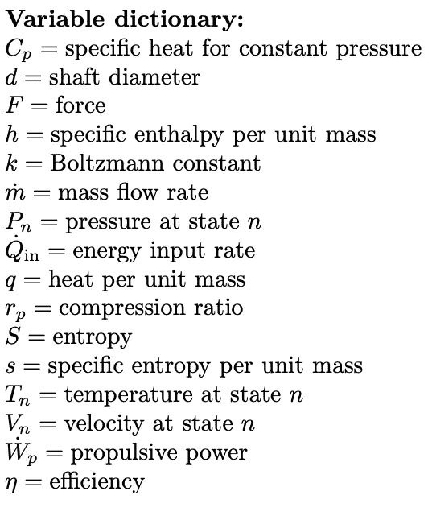

自造乳胶。

自造乳胶。

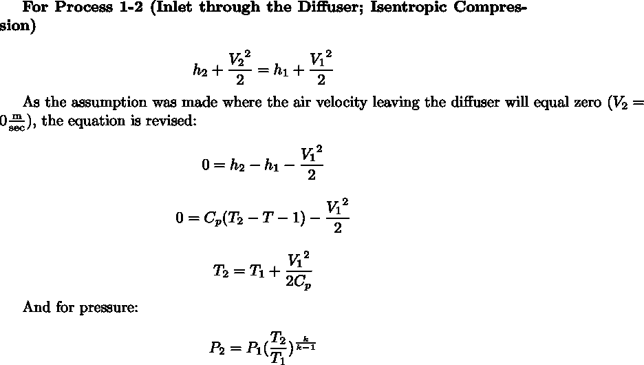

自造乳胶。

自造乳胶。

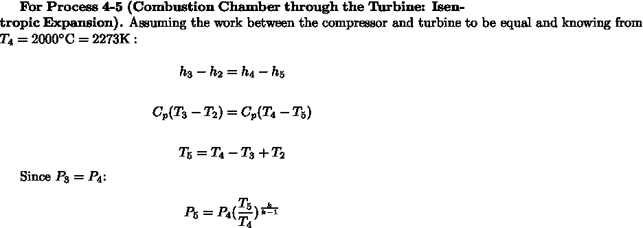

自造乳胶。

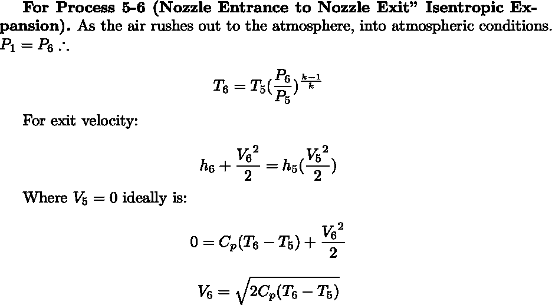

自造乳胶。

自造乳胶。

从这样的分析中，我们得到了显示不同发动机状态随时间变化的曲线图:

自创形象。由于 MATLAB 保护性出版许可，源代码未公开。

上面的初始图表示飞机的速度随时间的变化，我们最初假设它等于发动机的进气速度。这里，空气正通过我们的 T-s 图和喷气发动机横截面图上的第一点。随着我们继续前进，该图的趋势将更频繁地出现，因为我们将分析的许多发动机状态将依赖于系统中的空速。当我们分析入口压缩机的温度随时间的变化时，在下一张图中观察这一现象:

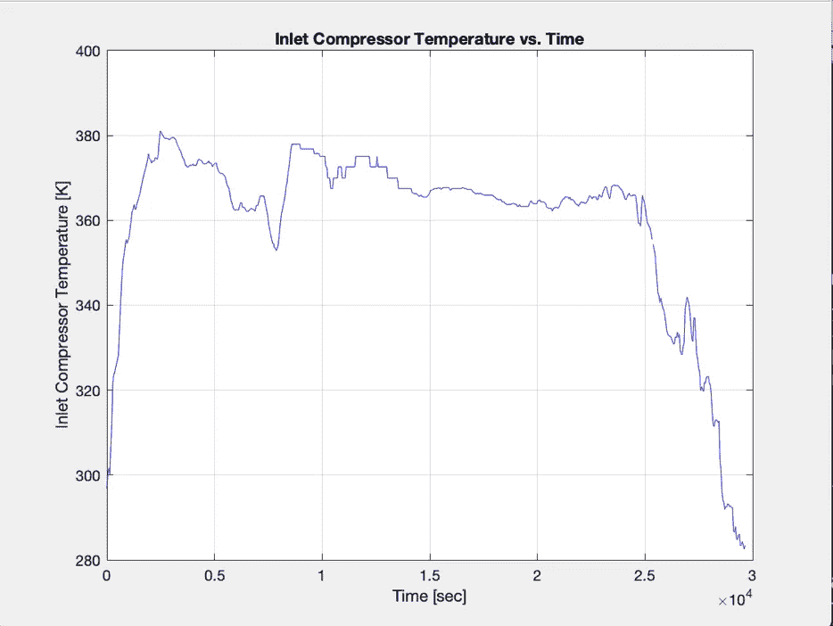

自创形象。由于 MATLAB 保护性出版许可，源代码未公开。

正如预测的那样，图中观察到的总体趋势遵循与上一图相似的稳定模式。随着系统内存在更高的空气速度，存在更多的能量转移。我们可以假设，遵循这样的模式也将意味着飞机的推进效率将在更高的速度下上升，并且这些更高的速度将在体现飞机巡航高度的飞行时间跨度内持续。

自创形象。由于 MATLAB 保护性出版许可，源代码未公开。

正如所预料的那样，当系统内存在更多的能量转移时，发动机的推进效率更高，所有这些都发生在飞机巡航时。上图(以及其他图)中出现的下降和变化可能是由于飞机本身的方向变化、大气条件的变化、一些空气速度的变化以及影响空气如何在入口处进入系统的其他因素。

不同飞行的推进效率等指标可能是我们之前实施的机器学习模型使用的许多有用指标之一。我们最终了解了飞行的经济性，并可以进一步探索环境因素，以揭示影响通过重复飞行表达的经济偶然性的趋势。

重要的是再次提出，就目前的模式而言，这些图中的许多看起来都是一样的。这可能会导致一些担心，在这里学到的任何信息都可能被重复地表达到我们的模型中，并强化另一个仅由不平衡数据支持的偏见。为了平息对此的任何担忧，我注意到这个奖励部分仅涵盖特定飞行路径上的单个飞行，并且这种趋势对于机器学习模型中使用的其他飞行可能有所不同。此外，在该高级设计项目中还发现了其他趋势，这些趋势与上述图表中显示的趋势并不完全相同。

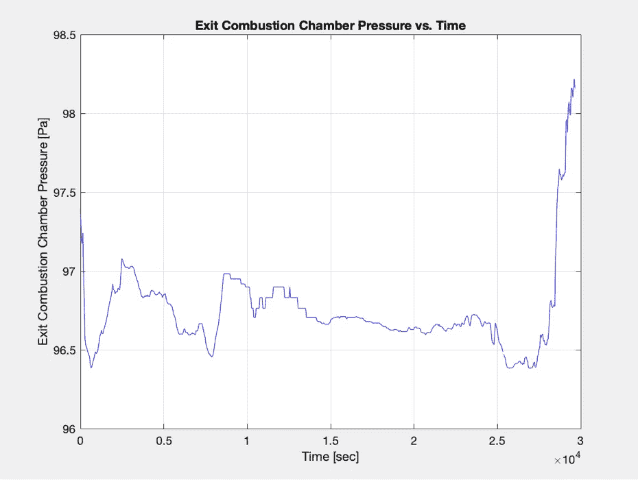

自创形象。由于 MATLAB 保护性出版许可，源代码未公开。

在发动机燃烧段末端发现的压力释放是由于前面提到的等熵膨胀过程。它与上面显示的原始图略有不同，几乎就像是其他图的反映，并且对于分析发动机的各个方面非常重要。在分析所有这些发动机状态时，我们可以进一步了解发动机的推力和功率输出，如下两个图所示。

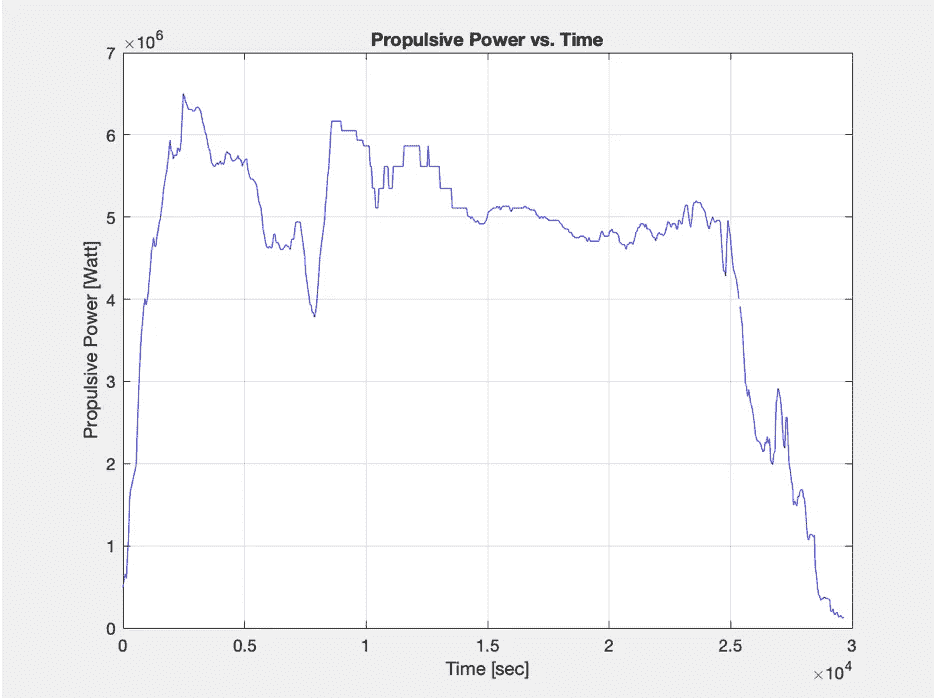

自创形象。由于 MATLAB 保护性出版许可，源代码未公开。

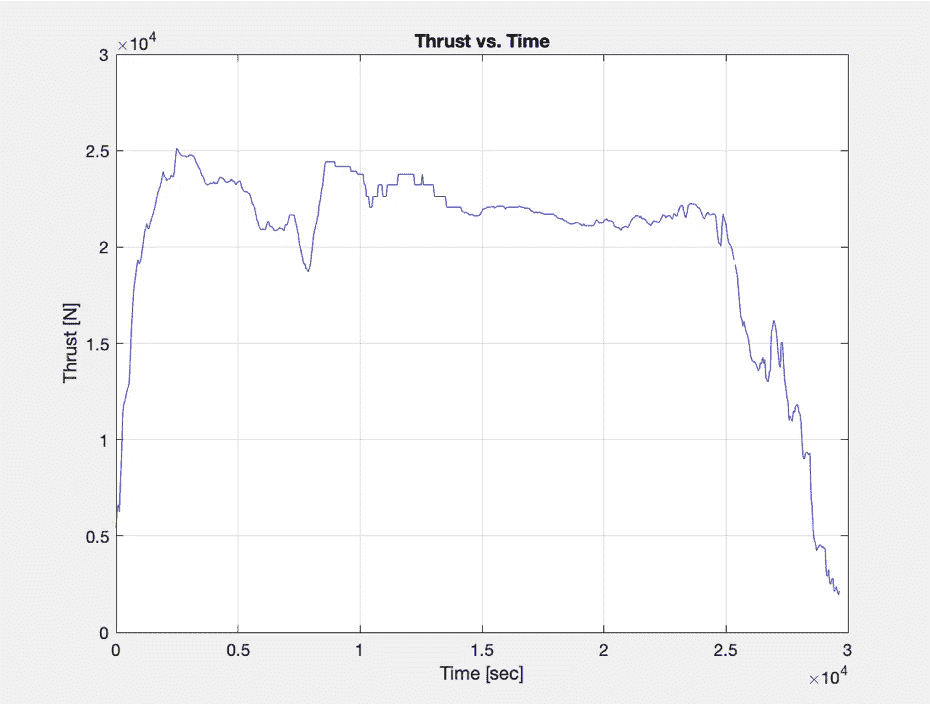

自创形象。由于 MATLAB 保护性出版许可，源代码未公开。

最后，这最后两个图可以产生关于发动机对飞行有什么可理解的影响的重要信息。分析这些类型的特征可以帮助我们推断出更多关于航班上具体存在何种质量的信息。

这里表达的所有图都是单个引擎的代表，当然还有更多从这个本科生研究中生成的图形，由于缩短了文章并减少了今天在这里发现的大量信息，这些图形没有包括在博客中。再一次，我想在这篇文章的奖金部分结束，特别感谢那些希望在结合工程方法和数据分析方面开发更多想法的热心读者。所有这些分析都是以一种非常经济高效的方式进行的，并且可以讲述飞机正在发生的大量情况。机器学习模型总是可以通过利用更多动态和数学原理来扩展，以创建更准确的趋势。将这里执行的分析应用到机器学习研究中还会极大地增加获得结果所需的时间，这一切的潜在好处是可以创建更好的工具。这样的项目将在未来被重新访问，以在这个方向上扩展，但现在，我很高兴分享桥梁存在的地方，人们应该遵循最终创建更好的模型，为生产做好准备。