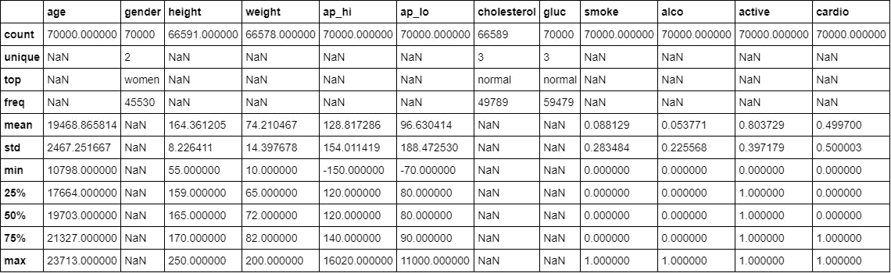
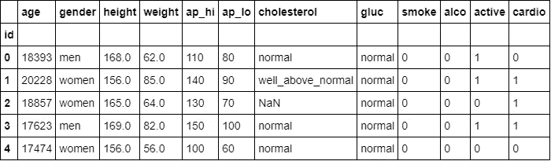
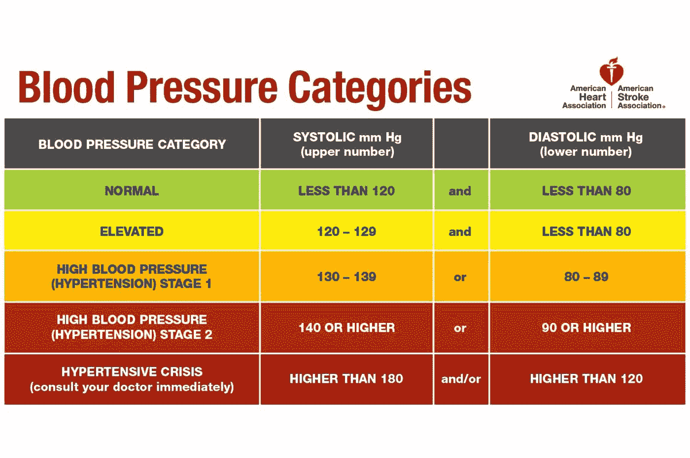

# 将 Scikit-Learn 管道与 CatBoost 和 Dask 结合起来(第 1 部分)

> 原文：<https://medium.com/analytics-vidhya/combining-scikit-learn-pipelines-with-catboost-and-dask-part-1-c08d67b44815?source=collection_archive---------0----------------------->


在 [Unsplash](https://unsplash.com?utm_source=medium&utm_medium=referral) 上由 [Rodion Kutsaev](https://unsplash.com/@frostroomhead?utm_source=medium&utm_medium=referral) 拍照

“**我走在一条孤独的路上**”这句话是 1986 年组建的一个美国摇滚乐队的一首歌中的歌词，当时我正试图写一段代码，但公开互联网上没有人愿意分享这段代码。

在下面的帖子中，我将讨论如何以一种简单而健壮的方式将 Sklearn 管道与 CatBoost 模型和 Dask 集成在一起，这种方式将使用 Pandas 的接口来更好地与数据科学家进行交互。

Catboost 是一个基于决策树库的开源梯度提升，支持复杂的分类特征。

Dask 是一个用于分析的开源灵活并行计算库，提供了高级数组、包和 DataFrame 集合，这些集合模仿 NumPy、lists 和 Pandas，但可以在不适合主内存的数据集上并行操作。对于大型数据集，Dask 的高级集合是 NumPy 和 Pandas 的替代方案。

[](https://catboost.ai/) [## CatBoost——最先进的开源梯度增强库，支持分类特性

### CatBoost 是一个开源的决策树梯度提升库，支持分类特征。

catboost.ai](https://catboost.ai/) [](https://dask.org/) [## dask:Python 中的可扩展分析

### Dask 为分析提供了先进的并行性，能够为您喜爱的工具提供大规模性能

达斯克。](https://dask.org/) 

在我们深入研究所有组件的集成之前，让我们一步一步地开始(没有双关语的意思)来更好地理解这个问题。

直到今天(2019 年 6 月 30 日)，Sklearn 的变形金刚不**不**有返回熊猫数据帧的能力。熊猫 DataFrame 给我们的一切美好，在它遇到 Sklearn 的变形金刚时都是无用的。

在本文的第 1 部分，我将讨论如何使用 sklearn-pandas 包将心爱的 Pandas DataFrame 与 Sklearn 管道和转换结合起来。

# sk learn-熊猫

> 这个模块在 [Scikit-Learn](http://scikit-learn.org/stable) 的机器学习方法和 [pandas](https://pandas.pydata.org/) 风格的数据帧之间提供了一座桥梁。

它提供了一种将 DataFrame 列映射到 Sklearn 转换器的方法，这样最终结果将是 Pandas DataFrame 而不是 Numpy 数组。

[](https://github.com/scikit-learn-contrib/sklearn-pandas) [## sci kit-learn-contrib/sk learn-pandas

### 熊猫与 sklearn 的整合。通过创建帐户为 scikit-learn-contrib/sk learn-pandas 的发展做出贡献…

github.com](https://github.com/scikit-learn-contrib/sklearn-pandas) 

## sk learn-熊猫装置

```
pip install sklearn-pandas
```

# 简单解释一下 sklearn-pandas

## 将列映射到转换

映射器获取元组列表。每个元组的第一个元素是来自 pandas 数据帧的列名，或者是包含一个或多个列的列表。第二个元素是一个对象，它将执行将应用于该列的转换。第三个是可选的，是一个包含转换选项的字典。

让我们看一个例子:

```
>>> mapper = DataFrameMapper([
...     ('column_name1', sklearn.preprocessing.LabelBinarizer()),
...     (['column_name2'], sklearn.preprocessing.StandardScaler())
... ])
```

将列选择器指定为`'column'`(作为一个简单的字符串)和`['column']`(作为一个包含一个元素的列表)的区别在于传递给转换器的数组的形状。在第一种情况下，将传递一维数组，而在第二种情况下，它将是具有一列的二维数组，即列向量。

这种行为模仿了熊猫的数据帧`__getitem__`索引的相同模式:

```
>>> data['children'].shape
(8,)
>>> data[['children']].shape
(8, 1)
```

请注意，有些变形金刚期望一维输入(面向标签的)，而有些变形金刚，如`OneHotEncoder`或`Imputer`，期望二维输入，形状为`[n_samples, n_features]`。

关于 sklearn-pandas 内部工作方式的进一步解释可以在他们的 [**GitHub 的自述**](https://github.com/scikit-learn-contrib/sklearn-pandas) **中找到。**

# 结合 sklearn-pandas 和 sklearn 管道的完整示例

在这一节中，我将展示一个使用 sklearn-pandas 的示例，其中包含一个真实数据集:

1.  将数字列映射到转换。
2.  将列映射到自定义转换器，以设计新功能。
3.  用以上所有内容构造一个 DataFrameMapper 对象。
4.  集成 Sklearn 管道来运行模型。

## 数据集熟人

我们将从 Kaggle 的心血管疾病数据集(带有我们自己的小[变化](https://github.com/kinir/catboost-with-pipelines/blob/master/mess-the-data.ipynb))开始探索 sklearn-pandas 包。

[](https://www.kaggle.com/sulianova/cardiovascular-disease-dataset) [## 心血管疾病数据集

### 该数据集由 70 000 条患者数据记录、11 个特征+目标组成。

www.kaggle.com](https://www.kaggle.com/sulianova/cardiovascular-disease-dataset) 

修改后的心血管疾病数据集的描述。



修改后的心血管疾病数据集的前 5 行。

## 数字列映射

我们将使用 sklearn-pandas 的函数 gen_features 对多个列应用相同的转换器。
输入特征将以列表列表的形式发送，因为我们想向每个变压器发送一个二维数据帧。

要执行的步骤:

*   简单估算-用平均值填充 nans。
*   标准缩放器-通过移除平均值并缩放至单位方差来标准化要素。

## **血压定制变压器**

自定义转换器负责根据血压测试的收缩压和舒张压值创建新的血压分类特征。
转换器将根据美国心脏协会的血压范围值创建一个新的分类特征:



图片来自[美国心脏协会](https://www.heart.org/-/media/data-import/downloadables/pe-abh-what-is-high-blood-pressure-ucm_300310.pdf?la=en&hash=CAC0F1D377BDB7BC3870993918226869524AAC3D)

现在我们将定义创建新血压特征所需的步骤。
输入特征将作为列表发送，因为我们希望将两列都发送到 BloodPressureTransformer 进行处理。

要执行的步骤:

*   血压变压器-基于“ap_hi”、“ap_lo”创建血压特征。
*   简单估算-用最频繁的值填充 nans。
*   OneHotEncoder 将分类值编码为一个独热数值数组。

## 使用 DataFrameMapper 映射上述所有内容

现在，我们将定义数据帧映射器的操作过程，并指明输入和输出将是 Pandas 数据帧。

## Sklearn 管道集成

现在，我们将之前的所有定义拼凑在一起，定义完整的管道:

*   预处理-sk learn-pandas data frame mapper。
*   估计器— Sklearn RandomForestClassifier。

**在我的** [**GitHub**](https://github.com/kinir/catboost-with-pipelines/blob/master/sklearn-pandas.ipynb) **上可以找到一个更丰富的例子包括特征选择步骤和网格搜索过程的笔记本。**

[](https://github.com/kinir/catboost-with-pipelines) [## kinir/catboost-带管道

### 将 catboost 回归器与 sklearn 管道一起使用的示例。-kinir/带管道的 catboost

github.com](https://github.com/kinir/catboost-with-pipelines) 

# 结论

在本文的第 1 部分中，我解释了如何使用 sklearn-pandas 包和 sklearn 管道来维护整个管道中的数据帧结构。在本文的第 2 部分，我将解释如何将 CatBoost 模型集成到我们现有的代码中。

回头见！:)