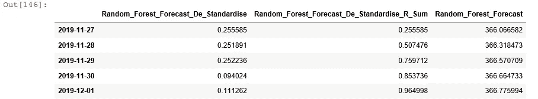
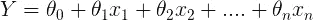

# 时间序列分析与人工智能的结合:预测的未来

> 原文：<https://medium.com/analytics-vidhya/combining-time-series-analysis-with-artificial-intelligence-the-future-of-forecasting-5196f57db913?source=collection_archive---------6----------------------->

## 在 python 中构建流行预测模型的集合，如 XGBoost、LSTM、Random Forest、SARIMAX、VAR、VECM 等等！


欢迎来到我关于构建卓越预测引擎的 3 博客系列的最后一部分。准确的预测有可能加速企业的发展，因为它们会影响战略业务决策，如销售目标、股票价值、财务规划、原材料采购、制造甚至供应链决策。虽然猜测和传统的时间序列分析是预测的流行方法，但人工智能的出现使得*和*有必要重新思考旧的做法以提高准确性。

本博客系列描述了一种创新的预测方法，该方法能够通过无缝融合时间序列分析和人工智能(AI)来克服与预测相关的挑战。预测本质上属于时间序列分析。但在提高预测准确性方面，人工智能可以成为一种力量倍增器，因为它有能力自动研究和发现数据中的迷人模式。我们的预测方法中有两个关键因素:

1.  智能设计和识别目标变量的关键驱动因素
2.  在由成功的时间序列和人工智能模型组成的整体建模方法中使用这些驱动因素

博客系列的第一部分简要介绍了时间序列分析和理解这种数据集所需的工具(链接[此处](https://link.medium.com/cwvlEzX1u9))，而第二部分侧重于特征工程和选择(链接[此处](/@indraneeldb1993ds/demystifying-feature-engineering-and-selection-for-driver-based-forecasting-50ba9b5a0fbc))。在这篇博客中，我们将深入探讨基于驱动因素的预测方法中的最终预测引擎。它由 10 个模型(5 个时间序列和 5 个人工智能模型)组成，最后我们将所有模型预测的平均值作为我们预测引擎的最终预测。鉴于模型数量众多，我们将对每个模型进行简要介绍，并详细说明如何用 python 实现它们。在另一篇博客中，我们将讨论优化这些模型的最佳实践。

这里使用的数据集与本系列之前的博客相同。这是香港房价和 12 个宏观经济变量的每日数据集。预测的目标变量是“私人住宅(价格指数)”即香港住宅价格。正如上一篇博客中所强调的，我们选择了香港房价的三个驱动因素:

1.  总库存
2.  M3(百万港元)
3.  M3 第一级(百万港元)

# 型号列表:

1.  单变量时间序列
2.  霍尔特温特斯指数平滑法(HWES)或三重平滑法(单变量时间序列)
3.  多元时间序列
4.  多元时间序列
5.  多元时间序列
6.  LSTM(单变量时间序列)
7.  随机森林(多元人工智能)
8.  多元人工智能
9.  线性回归(多元人工智能)
10.  多变量人工智能

**1。萨里玛**

季节性自回归综合移动平均(SARIMA 或季节性 ARIMA)是一种针对单变量时间序列数据的预测方法，适用于具有季节性成分的数据。它支持自回归和移动平均元素，而集成元素指的是差分，允许该方法支持非平稳时间序列数据。该型号总共有 7 个参数需要配置:

*   **p** :趋势自回归顺序。
*   **d** :趋势差序。
*   **q** :趋势移动平均订单。
*   **P** :季节性自回归顺序。
*   **D** :季节性差异订单。
*   **Q** :季节性移动平均订单。
*   **m** :单个季节周期的时间步数。

要了解更多关于 SARIMA 和这些参数的信息，请参考加州大学伯克利分校的这个[实验室](https://www.stat.berkeley.edu/~arturof/Teaching/STAT248/lab07_part1.html)。

```
# fitting a stepwise model to find the best paramters for SARIMA:
stepwise_fit = pm.auto_arima(target_final, start_p=1, start_q=1, max_p=3, max_d=2,max_q=3,m=7,
                             start_P=0,start_Q=0,max_P=3, max_D=3,max_Q=3, seasonal=True, trace=True,
                             error_action='ignore',  # don't want to know if an order does not work
                             suppress_warnings=True,  # don't want convergence warnings
                             stepwise=True)  # set to stepwisestepwise_fit.summary()
```


图 1:寻找 SARIMA 最佳参数值的逐步模型

我们通过[网格搜索](https://stackabuse.com/grid-search-optimization-algorithm-in-python/)找到每个参数的最佳值，该网格搜索符合开发人员指定的参数值范围。我们选择具有最低 AIC 分数的一组参数值。

```
# SARIMA# Using parameters automatically based on grid serach
SARIMA_Forecast = pd.DataFrame(stepwise_fit.predict(n_periods= 365))
SARIMA_Forecast.columns = ['SARIMA_Forecast']
SARIMA_Forecast.index = HWES_Forecast.index
SARIMA_Forecast.head(5)# Manually fit the model
#sarima_model = SARIMAX(series, order=(5, 2, 2), seasonal_order=(0, 0, 1, 7))
#sarima_model_fit = sarima_model.fit(disp=False)
# make prediction
#SARIMA_Forecast = model_fit.predict(len(data), len(data))
#print(yhat)
```


图 2:使用 SARIMA 模型进行预测

如果我们对提供最低 AIC 的参数集不满意，我们可以用我们首选的参数值集手动拟合模型(查看图 2 中代码的注释掉部分)。

**2。霍尔特-温特斯指数平滑或三重平滑**

霍尔特-温特斯技术基于以下三种预测技术:

1.  加权平均值
2.  简单指数平滑
3.  霍尔特线性方法

霍尔特-温特斯指数平滑是这些模型的升级版本，因为它可以用于显示趋势和季节行为的时间序列数据。这种方法有两种变体:

1.  加法:当季节变化在整个系列中大致不变时，这是首选方法
2.  乘法:当季节变化与系列水平成比例变化时，这是首选方法。

要了解更多关于该模型的信息，请参考 Rob J Hyndman 的这本[书](https://otexts.com/fpp2/holt-winters.html)。在我们的案例中，我们使用了加法方法，如下所示:

```
# Holt Winter’s Exponential Smoothing (HWES)or Triple Smoothing
# fit modelrandom.seed(10)model = ExponentialSmoothing(series, trend = 'add',seasonal= 'add', seasonal_periods= 7)
model_fit = model.fit()
# make prediction
HWES_Forecast = pd.DataFrame(model_fit.forecast(steps=365))
HWES_Forecast.columns = ['HWES_Forecast']
HWES_Forecast.head(5)
```


图 3:使用 HWES 模型进行预测

3.**萨里马克斯**

SARIMAX 类似于 SARIMA，代表带外生因素的季节性自回归综合移动平均线。SARIMA 和 SARIMAX 的关键区别在于外因。如前一篇博客所强调的，我们选择了目标变量的 3 个驱动因素，这些将是我们用于 SARIMAX 模型的外生因素。

在我们拟合 SARIMAX 模型之前，我们需要确保外生因素和目标变量是稳定的，我们还将对它们进行标准化，以确保它们在同一尺度上。为了检查稳定性，我们运行了一个 [ADF 测试](https://en.wikipedia.org/wiki/Augmented_Dickey%E2%80%93Fuller_test):

```
# Function to check stationaritydef adfuller_test(series, signif=0.05, name='', verbose=False):
    """Perform ADFuller to test for Stationarity of given series and print report"""
    r = adfuller(series, autolag='AIC')
    output = {'test_statistic':round(r[0], 4), 'pvalue':round(r[1], 4), 'n_lags':round(r[2], 4), 'n_obs':r[3]}
    p_value = output['pvalue'] 
    def adjust(val, length= 6): return str(val).ljust(length)# Print Summary
    print(f'    Augmented Dickey-Fuller Test on "{name}"', "\n   ", '-'*47)
    print(f' Null Hypothesis: Data has unit root. Non-Stationary.')
    print(f' Significance Level    = {signif}')
    print(f' Test Statistic        = {output["test_statistic"]}')
    print(f' No. Lags Chosen       = {output["n_lags"]}')for key,val in r[4].items():
        print(f' Critical value {adjust(key)} = {round(val, 3)}')if p_value <= signif:
        print(f" => P-Value = {p_value}. Rejecting Null Hypothesis.")
        print(f" => Series is Stationary.")
    else:
        print(f" => P-Value = {p_value}. Weak evidence to reject the Null Hypothesis.")
        print(f" => Series is Non-Stationary.")# Data PrepAI_Model_data = pd.concat([target_final, features_final], axis=1, sort=False)# Check stationarity# ADF Test on each column
for name, column in AI_Model_data.iteritems():
    adfuller_test(column, name=column.name)
    print('\n')
```


图 4:检查稳定性的 ADF 测试

如图 4 所示，所有的特征和目标变量都是不稳定的，所以我们首先将它们区分为稳定的。如前所述，我们也将它们标准化。

```
# 1st difference
AI_Model_data_differenced = AI_Model_data.diff().dropna()# Check stationarity# ADF Test on each column
#for name, column in AI_Model_data_differenced.iteritems():
    #adfuller_test(column, name=column.name)
    #print('\n')x = AI_Model_data_differenced.values #returns a numpy array# Standardise Datasetsstandard_scaler = StandardScaler()
x_scaled = standard_scaler.fit_transform(x)
scaled_AI_Model_data = pd.DataFrame(x_scaled)
scaled_AI_Model_data.columns = AI_Model_data_differenced.columns# Check stationarity on diffrenced and scaled data# ADF Test on each column
for name, column in scaled_AI_Model_data.iteritems():
    adfuller_test(column, name=column.name)
    print('\n')
```


图 5:差异和标准化数据集上的 ADF 测试

对数据集进行差分和标准化后，我们可以看到所有字段都是固定的，我们将使用它们来拟合 SARIMAX 模型。SARIMAX 模型的参数与 SARIMA 相同，因此，我们使用相同的网格搜索方法在差异和标准化数据集上寻找最佳值。

```
# fitting a stepwise model to find the best paramters for SARIMAX:
stepwise_fit_2 = pm.auto_arima(scaled_AI_Model_Target, start_p=1, start_q=1, max_p=3, d=0,max_q=3,m=7,
                             start_P=0,start_Q=0,max_P=3, max_D=3,max_Q=3, seasonal=True, trace=True,
                             error_action='ignore',  # don't want to know if an order does not work
                             suppress_warnings=True,  # don't want convergence warnings
                             stepwise=True)  # set to stepwisestepwise_fit_2.summary()
```


图 6:寻找 SARIMAX 的最佳参数值

一旦我们获得了参数的最佳值，我们就可以拟合模型。该模型所需的关键参数是“exog ”,它是外生回归量的数据集。在我们的例子中，回归变量是我们在本系列的第二篇博客中选择的三个驱动因素。在使用拟合模型进行预测时，我们需要提供驾驶员的预测作为模型的输入。我们使用 SARIMA 模型生成这些驱动因素预测。请注意，驱动因素预测是基于标准化的静态数据。这些驱动因素预测也将在所有多元人工智能模型中得到利用。

```
#Driver Forecast using SARIMAforecast_index = pd.date_range('2019/11/27', '2020/11/25')driver_forecasts = pd.DataFrame(index=forecast_index, columns= features_final.columns)scaled_AI_Model_Features_1 = scaled_AI_Model_Features.copy()
date_index = pd.date_range('2003-01-06', '2019/11/26')
scaled_AI_Model_Features_1.index = date_indexfor i in range(len(features_final.columns)):df_series = scaled_AI_Model_Features_1.asfreq('D')
                                            series_features = pd.Series(df_series.iloc[:,i], index= df_series.index)stepwise_fit_features = pm.auto_arima(series_features, start_p=1, start_q=1, max_p=2, max_d=2,max_q=2,m=7,
                                                                         start_P=0,start_Q=0,max_P=2, max_D=2,max_Q=2, seasonal=True, trace=True,
                                                                         error_action='ignore',  # don't want to know if an order does not work
                                                                         suppress_warnings=True,  # don't want convergence warnings
                                                                         stepwise=True)  # set to stepwiseSARIMA_Forecast_features = stepwise_fit_features.predict(n_periods= 365)
                                            #Add to driver forecast dataset
                                            driver_forecasts.iloc[:,i] = SARIMA_Forecast_featuresdriver_forecasts.head(5)
```


图 6:使用 SARIMA 的驾驶员预测

最后一步是使用最佳参数值以及目标变量和驱动因素的静态和标准化历史值来拟合模型。然后，我们使用拟合的模型和驾驶员预测来预测未来。由于模型预测基于差分和标准化数据集，我们需要对其进行去标准化，并取消第一次差分，以获得最终预测。

```
# SARIMAX 
# contrived dataset
data1 = scaled_AI_Model_Target
data2 = scaled_AI_Model_Features
# fit model
model = SARIMAX(data1, exog=data2, order=stepwise_fit_2.order, seasonal_order=stepwise_fit_2.seasonal_order)
model_fit = model.fit(disp=False)
# make prediction
exog2 = driver_forecasts
SARIMAX_Forecast = pd.DataFrame(model_fit.predict(len(data1),len(data1)+364, exog=exog2))
SARIMAX_Forecast.columns = ['Raw_Forecast']
SARIMAX_Forecast['SARIMAX_Forecast_De_Standardise_R_Sum'] = SARIMAX_Forecast['Raw_Forecast'].cumsum()
SARIMAX_Forecast['SARIMAX_Forecast'] = SARIMAX_Forecast['SARIMAX_Forecast_De_Standardise_R_Sum'] + Latest_target[0]SARIMAX_Forecast.index = HWES_Forecast.index
SARIMAX_Forecast.head(5)
```


图 8:拟合 SARIMAX 模型以生成预测

**4。VAR**

向量自回归(VAR)是一种预测算法，可以在两个或多个时间序列相互影响时使用。它被称为自回归模型，因为每个变量都被建模为过去值的函数，也就是说，预测值只不过是它们自己的滞后。为了更好地理解 VAR，请浏览宾夕法尼亚州立大学的这一课。

由于 VAR 模型自动计算变量的滞后，我们不能将变量的滞后作为一个单独的变量添加到模型中。因此，我们在训练模型之前删除变量:“M3(百万港元)_Lag1”，因为我们已经将“M3(百万港元)”作为变量。与 SARIMAX 模型类似，我们需要在建模之前使数据集保持静止。我们对数据集进行差分，使其保持稳定。

```
# Data Prep for VAR/VECM - First Difference and check stationarity# Data Prep for VAR - check stationarityvarma_vecm_data = pd.concat([target_final, features_final], axis=1, sort=False)
varma_vecm_data  = varma_vecm_data.drop(columns=['M3 (HK$ million)_Lag1'])# 1st difference
varma_vecm_data_differenced = varma_vecm_data.diff().dropna()# ADF Test on each column
for name, column in varma_vecm_data_differenced.iteritems():
    adfuller_test(column, name=column.name)
    print('\n')
```


图 9:对数据集进行差分，使其保持静止

下一步是选择 VAR 模型的正确顺序。我们使用“select_order”函数来迭代拟合 VAR 模型的递增阶数，并选择使模型具有最小 AIC 的阶数。然后，我们将 VAR 模型拟合到具有最佳滞后数的静态数据集上。我们使用拟合的模型来预测目标变量的变化，然后取消差异以获得最终预测。

```
#VAR Modelmodel = VAR(varma_vecm_data_differenced)
lag_selection_VAR = model.select_order(maxlags=12)list(lag_selection_VAR.selected_orders.values())[0]# Get the lag order
lag_order = list(lag_selection_VAR.selected_orders.values())[0]model_fitted = model.fit(lag_order)# Input data for forecasting
forecast_input = varma_vecm_data_differenced.values[-lag_order:]
forecast_input# Forecast
VAR_FC = model_fitted.forecast(y=forecast_input, steps= 365)
VAR_FC_2 = pd.DataFrame(VAR_FC , index= driver_forecasts.index, columns=varma_vecm_data_differenced.columns + '_1d')
VAR_FC_2#VAR Forecastdef invert_transformation(df_train, df_forecast, second_diff=False):
    """Revert back the differencing to get the forecast to original scale."""
    df_fc = df_forecast.copy()
    columns = df_train.columns
    for col in columns:        
        # Roll back 2nd Diff
        if second_diff:
            df_fc[str(col)+'_1d'] = (df_train[col].iloc[-1]-df_train[col].iloc[-2]) + df_fc[str(col)+'_2d'].cumsum()
        # Roll back 1st Diff
        df_fc[str(col)+'_forecast'] = df_train[col].iloc[-1] + df_fc[str(col)+'_1d'].cumsum()
    return df_fcdf_results = invert_transformation(varma_vecm_data, VAR_FC_2, second_diff=False)
VAR_Forecast = pd.DataFrame(df_results['Private Domestic (Price Index)_forecast'])
VAR_Forecast.columns = ['VAR_Forecast']
VAR_Forecast.index = HWES_Forecast.index
VAR_Forecast.head(5)
```


图 10:使用风险值模型的预测

5.VECM 模型

VAR 模型的缺点是忽略了变量之间可能重要的(*【长期】*)*【协整】*)关系。通常的方法是使用 Johansen 的方法来检验协整是否存在。如果答案是肯定的，那么应该使用向量误差修正模型(VECM)来考虑协整关系*。为了更好地理解 VECM 模型，你可以浏览迈克尔·豪泽的这些讲座幻灯片。我们使用与 VAR 模型相同的数据集，并执行 [Johansen 协整](https://www.imf.org/external/pubs/ft/wp/2007/wp07141.pdf)测试，以找到协整关系的最佳数量。*

```
# VECM - Johansen Cointegration Testrank_test = select_coint_rank(varma_vecm_data_differenced,-1, lag_order, method="trace",
                              signif=0.05)
print(rank_test)
```


图 11.1: Johansen 协整检验

我们可以看到，在图 11.1 中有 3 个统计上显著的协整关系。我们为参数‘k _ ar _ dif’设置了与 VAR 模型相同的滞后阶数，并基于协整检验为参数‘coint _ rank’设置了最优值。类似于 VAR 模型，我们取消差异以获得最终预测。

```
#VECMmodel = VECM(varma_vecm_data_differenced, deterministic="ci",
             k_ar_diff=lag_order,  
             coint_rank=rank_test.rank)vecm_res = model.fit()VECM_FC = vecm_res.predict(steps=365)VECM_FC_2 = pd.DataFrame(VECM_FC , index= driver_forecasts.index, columns=varma_vecm_data_differenced.columns + '_1d')df_results_2 = invert_transformation(varma_vecm_data, VECM_FC_2, second_diff=False)VECM_Forecast = pd.DataFrame(df_results_2['Private Domestic (Price Index)_forecast'])
VECM_Forecast.columns = ['VECM_Forecast']
VECM_Forecast.index = HWES_Forecast.index
VECM_Forecast.head(5)
```


图 11.2:使用 VECM 模型进行预测

**人工智能模型**

对于我们预测引擎中的所有人工智能模型(线性回归除外)，我们将使用以下方法:

1.  将差异和缩放数据(用于 SARIMA 模型)分为训练和测试数据。我们使用这些数据，因为平稳性和统一缩放通常会提高模型性能。最近一年被分离出来作为测试数据。在处理时间序列数据时，我们不应该对训练和测试分割使用随机抽样，因为数据集是按时间顺序相关的。
2.  通过使用关键参数的不同值在训练数据上训练模型来执行网格搜索。
3.  使用训练好的模型在测试时间段内进行预测。
4.  根据 [MAPE 得分](https://en.wikipedia.org/wiki/Mean_absolute_percentage_error)计算模型的预测精度
5.  选择提供最佳精度的参数值
6.  在整个历史数据集中使用最佳拟合模型的参数值来训练模型
7.  使用拟合的模型和驾驶员预测进行预测
8.  取消标准化和消除差异，以获得最终预测

这种方法确保我们在优化模型性能的同时，确保数据集的时间序列属性不被违反。第 1 步到第 5 步用于超参数调整，而其余步骤集中于从最终模型生成预测。在另一篇博客中，我们将深入探讨优化模型性能的其他方法，如回溯测试策略，以及每个参数如何影响模型的细节。在这篇博客中，我们将简要介绍这些模型及其参数，并重点介绍它在 python 中的实现。

**6。LSTM**

LSTM(长短期记忆)是一种扩展递归神经网络记忆的模型。通常，递归神经网络具有“短期记忆”，因为只有最近的信息用于当前的任务。LSTM 将长期记忆引入递归神经网络。它通过使用一系列“门”来减轻消失梯度问题。请参考 Christopher Olah 在[的博客](https://colah.github.io/posts/2015-08-Understanding-LSTMs/)了解更多关于这款车型的细节。

在创建 LSTM 模型之前，我们需要创建一个[时间序列生成器](https://keras.io/api/preprocessing/timeseries/)对象。此外，我们将尝试优化一组三个参数:*输出序列的长度、每批中时间序列样本的数量以及时期的数量*。下面这段代码用于按照前面提到的方法执行超参数调整:

```
#LSTM# Data Prep
dataset = pd.DataFrame(target_train).values
dataset = dataset.astype('float32')# Batch Size
batch_size = [1,2,4]
# Epochs
epoch_size = [5,7,10]
# lenght
lenght = [7,30,120]n_features = 1LSTM_Test_Accuracy_Data = pd.DataFrame(columns = ['batch_size','epoch_size','lenght','Test Accurcay'])for x in list(itertools.product(batch_size, epoch_size,lenght)):
            generator = TimeseriesGenerator(dataset, dataset,batch_size=x[0], length= x[2])lstm_model = Sequential()
            lstm_model.add(LSTM(200, activation='relu', input_shape=(x[2], n_features)))
            lstm_model.add(Dense(1))
            lstm_model.compile(optimizer='adam', loss='mse')
            lstm_model.fit_generator(generator,epochs=x[1])lstm_predictions_scaled = list()batch = dataset[-x[2]:]
            current_batch = batch.reshape((1, x[2], n_features))
            # Test Data
            for i in range(len(target_test)):   
                lstm_pred = lstm_model.predict(current_batch)[0]
                lstm_predictions_scaled.append(lstm_pred) 
                current_batch = np.append(current_batch[:,1:,:],[[lstm_pred]],axis=1)predictions_test = pd.DataFrame(lstm_predictions_scaled)
            predictions_test.index = target_test.index
            # Calculate the absolute errors
            errors_test = abs(predictions_test.iloc[:,0] - target_test)
             # Calculate mean absolute percentage error (MAPE)
            mape_test = 100 * (errors_test/ target_test)
            # Calculate and display accuracy
            accuracy_test = 100 - np.mean(mape_test)LSTM_Test_Accuracy_Data_One = pd.DataFrame(index = range(1),columns = ['batch_size','epoch_size','lenght','Test Accurcay'])LSTM_Test_Accuracy_Data_One.loc[:,'batch_size'] = x[0]
            LSTM_Test_Accuracy_Data_One.loc[:,'epoch_size'] = x[1]
            LSTM_Test_Accuracy_Data_One.loc[:,'lenght'] = x[2]
            LSTM_Test_Accuracy_Data_One.loc[:,'Test Accurcay'] = accuracy_testLSTM_Test_Accuracy_Data = LSTM_Test_Accuracy_Data.append(LSTM_Test_Accuracy_Data_One)

LSTM_Test_Accuracy_Data
```


图 12:LSTM 的超参数调整

根据参数的最佳值，我们拟合 LSTM 模型，并生成最终预测，如下图 13 所示。

```
#LSTM# Data Prep
dataset = pd.DataFrame(scaled_AI_Model_Target).values
dataset = dataset.astype('float32')
Latest_target = target_final.tail(1).values.tolist()# Best Fit ModelBest_Fit_LSTM = LSTM_Test_Accuracy_Data.loc[LSTM_Test_Accuracy_Data['Test Accurcay'] == max(LSTM_Test_Accuracy_Data['Test Accurcay'])]Best_Fit_LSTM = Best_Fit_LSTM.values.flatten().tolist()# Fit  Model
generator = TimeseriesGenerator(dataset, dataset,batch_size=Best_Fit_LSTM[0], length= Best_Fit_LSTM[2])lstm_model = Sequential()
lstm_model.add(LSTM(200, activation='relu', input_shape=(Best_Fit_LSTM[2], n_features)))
lstm_model.add(Dense(1))
lstm_model.compile(optimizer='adam', loss='mse')
lstm_model.fit_generator(generator,epochs=Best_Fit_LSTM[1])lstm_predictions_scaled = list()batch = dataset[-Best_Fit_LSTM[2]:]
current_batch = batch.reshape((1, Best_Fit_LSTM[2], n_features))
# Test Data
for i in range(365):   
    lstm_pred = lstm_model.predict(current_batch)[0]
    lstm_predictions_scaled.append(lstm_pred) 
    current_batch = np.append(current_batch[:,1:,:],[[lstm_pred]],axis=1)LSTM_Forecast = pd.DataFrame(lstm_predictions_scaled)# De-Standardise 
LSTM_Forecast_Adjusted_1 = (LSTM_Forecast*std_target)+ mean_target
LSTM_Forecast_Adjusted_1LSTM_Forecast_Adjusted_2 = pd.DataFrame({'LSTM_Forecast_De_Standardise': LSTM_Forecast_Adjusted_1.iloc[:,0]})#Roll back first difference#LSTM_Forecast_Adjusted_3 = AI_Model_dataLSTM_Forecast_Adjusted_2['LSTM_Forecast_De_Standardise_R_Sum'] = LSTM_Forecast_Adjusted_2['LSTM_Forecast_De_Standardise'].cumsum()
LSTM_Forecast_Adjusted_2['LSTM_Forecast'] = LSTM_Forecast_Adjusted_2['LSTM_Forecast_De_Standardise_R_Sum'] + Latest_target[0]LSTM_Forecast_Adjusted_2.index = HWES_Forecast.index
LSTM_Forecast_Adjusted_2.head(5)
```


图 13:使用 LSTM 的预测

**7。随机森林**

随机森林是决策树算法的集合。创建了许多决策树，其中每棵树都是从不同的[引导](https://en.wikipedia.org/wiki/Bootstrapping_(statistics))样本创建的。它可用于分类或回归。在我们的例子中，最终预测是整个决策树的平均预测。在本练习中，我们将调整以下参数:*决策树的最大深度、叶节点所需的最小样本数、分割内部节点所需的最小样本数以及森林中的树数(参见图 14)。*为了更好地了解兰登森林，你可以查看利奥·布雷曼的[原始论文](https://www.stat.berkeley.edu/~breiman/randomforest2001.pdf)。

```
#Random Forest
# Number of trees in random forest
n_estimators = [500,1000,2000]
# Maximum number of levels in tree
max_depth = [10,50,100]
# Minimum number of samples required to split a node
min_samples_split = [50,100,200]
# Minimum number of samples required at each leaf node
min_samples_leaf = [2,4,10]RF_Test_Accuracy_Data = pd.DataFrame(columns = ['n_estimators','max_depth','min_samples_split','min_samples_leaf','Train Accurcay','Test Accurcay'])for x in list(itertools.product(n_estimators, max_depth,min_samples_split,min_samples_leaf)):
            rf = RandomForestRegressor(n_estimators = x[0],max_depth = x[1], min_samples_split = x[2],min_samples_leaf=x[3], random_state = 10,n_jobs=-1, max_features= "auto")
            # Train the model on training data
            rf.fit(features_train, target_train)# Train Data
            # Use the forest's predict method on the train data
            predictions_train = rf.predict(features_train)
            # Calculate the absolute errors
            errors_train = abs(predictions_train - target_train)
             # Calculate mean absolute percentage error (MAPE)
            mape_train = 100 * (errors_train/ target_train)
            # Calculate and display accuracy
            accuracy_train = 100 - np.mean(mape_train)# Test Data
            # Use the forest's predict method on the test data
            predictions_test = rf.predict(features_test)
            # Calculate the absolute errors
            errors_test = abs(predictions_test - target_test)
             # Calculate mean absolute percentage error (MAPE)
            mape_test = 100 * (errors_test/ target_test)
            # Calculate and display accuracy
            accuracy_test = 100 - np.mean(mape_test)RF_Test_Accuracy_Data_One = pd.DataFrame(index = range(1),columns = ['n_estimators','max_depth','min_samples_split','min_samples_leaf','Train Accurcay','Test Accurcay'])RF_Test_Accuracy_Data_One.loc[:,'n_estimators'] = x[0]
            RF_Test_Accuracy_Data_One.loc[:,'max_depth'] = x[1]
            RF_Test_Accuracy_Data_One.loc[:,'min_samples_split'] = x[2]
            RF_Test_Accuracy_Data_One.loc[:,'min_samples_leaf'] = x[3]
            RF_Test_Accuracy_Data_One.loc[:,'Train Accurcay'] = accuracy_train
            RF_Test_Accuracy_Data_One.loc[:,'Test Accurcay'] = accuracy_testRF_Test_Accuracy_Data = RF_Test_Accuracy_Data.append(RF_Test_Accuracy_Data_One)

RF_Test_Accuracy_Data
```


图 14:随机森林的超级参数调整

下面这段代码符合基于最佳参数值的最终随机森林模型(参见图 15)。

```
#Random Forest# Best Fit ModelBest_Fit_Random_Forest = RF_Test_Accuracy_Data.loc[RF_Test_Accuracy_Data['Test Accurcay'] == max(RF_Test_Accuracy_Data['Test Accurcay'])]Best_Fit_Random_Forest = Best_Fit_Random_Forest.values.flatten().tolist()# Fit  Model
rf = RandomForestRegressor(n_estimators = Best_Fit_Random_Forest[0],max_depth = Best_Fit_Random_Forest[1], min_samples_split = Best_Fit_Random_Forest[2],min_samples_leaf=Best_Fit_Random_Forest[3], random_state = 10,n_jobs=-1, max_features= "auto")# Train the model on training data
rf.fit(features_train, target_train)# Use the forest's predict method on the test data
Random_Forest_Forecast = rf.predict(driver_forecasts)
Random_Forest_Forecast# De-Standardise 
Random_Forest_Forecast_Adjusted_1 = (Random_Forest_Forecast*std_target)+ mean_target
Random_Forest_Forecast_Adjusted_2 = pd.DataFrame({'Random_Forest_Forecast_De_Standardise': Random_Forest_Forecast_Adjusted_1[:]})#Roll back first difference#Random_Forest_Forecast_Adjusted_3 = AI_Model_dataRandom_Forest_Forecast_Adjusted_2['Random_Forest_Forecast_De_Standardise_R_Sum'] = Random_Forest_Forecast_Adjusted_2['Random_Forest_Forecast_De_Standardise'].cumsum()
Random_Forest_Forecast_Adjusted_2['Random_Forest_Forecast'] = Random_Forest_Forecast_Adjusted_2['Random_Forest_Forecast_De_Standardise_R_Sum'] + Latest_target[0]Random_Forest_Forecast_Adjusted_2.index = HWES_Forecast.index
Random_Forest_Forecast_Adjusted_2.head(5)
```



图 15:使用随机森林的预测

**8。XGBoost**

XGBoost(极限梯度提升)提供了梯度提升决策树的高性能实现。XG Boost 不是像 random forest 那样单独训练所有模型，而是连续训练模型。每一个新模型都被训练来纠正前一个模型所犯的错误。模型按顺序添加，直到不能再进一步改进。我们为该模型调整一组 5 个参数:*梯度提升树的数量、基础学习者的最大树深度、提升学习速率、在叶节点上进行进一步划分所需的最小损失减少以及子节点中所需的所有观察的最小权重和。*XGBoost 上的原纸可以在这里找到[。](https://www.kdd.org/kdd2016/papers/files/rfp0697-chenAemb.pdf)

```
#XG Boost
# Number of trees
n_estimators = [500,1000,2000]
# Maximum number of levels in tree
max_depth = [10,50,100]
#minimum sum of weights of all observations required in a child
min_child_weight = [1,2]
#Gamma specifies the minimum loss reduction required to make a split
gamma = [1,5]
# boosting learning rate
learning_rate = [.1,.05,.01]xgb_Test_Accuracy_Data = pd.DataFrame(columns = ['n_estimators','max_depth','min_child_weight','gamma','learning_rate','Train Accurcay','Test Accurcay'])for x in list(itertools.product(n_estimators, max_depth,min_child_weight,gamma,learning_rate)):
            xgb_reg = xgb.XGBRegressor(n_estimators=x[0],max_depth =x[1],min_child_weight = x[2],gamma = x[3],learning_rate = x[4])

            # Train the model on training data
            xgb_reg.fit(features_train, target_train)# Train Data
            # Use the forest's predict method on the train data
            predictions_train = xgb_reg.predict(features_train)
            # Calculate the absolute errors
            errors_train = abs(predictions_train - target_train)
             # Calculate mean absolute percentage error (MAPE)
            mape_train = 100 * (errors_train/ target_train)
            # Calculate and display accuracy
            accuracy_train = 100 - np.mean(mape_train)# Test Data
            # Use the forest's predict method on the test data
            predictions_test = xgb_reg.predict(features_test)
            # Calculate the absolute errors
            errors_test = abs(predictions_test - target_test)
             # Calculate mean absolute percentage error (MAPE)
            mape_test = 100 * (errors_test/ target_test)
            # Calculate and display accuracy
            accuracy_test = 100 - np.mean(mape_test)xgb_Test_Accuracy_Data_One = pd.DataFrame(index = range(1),columns = ['n_estimators','max_depth','min_child_weight','gamma','learning_rate','Train Accurcay','Test Accurcay'])xgb_Test_Accuracy_Data_One.loc[:,'n_estimators'] = x[0]
            xgb_Test_Accuracy_Data_One.loc[:,'max_depth'] = x[1]
            xgb_Test_Accuracy_Data_One.loc[:,'min_child_weight'] = x[2]
            xgb_Test_Accuracy_Data_One.loc[:,'gamma'] = x[3]
            xgb_Test_Accuracy_Data_One.loc[:,'learning_rate'] = x[4]
            xgb_Test_Accuracy_Data_One.loc[:,'Train Accurcay'] = accuracy_train
            xgb_Test_Accuracy_Data_One.loc[:,'Test Accurcay'] = accuracy_testxgb_Test_Accuracy_Data = xgb_Test_Accuracy_Data.append(xgb_Test_Accuracy_Data_One)

xgb_Test_Accuracy_Data
```


图 16:XG Boost 的超参数调整

如下图 17 所示，我们拟合了最终的 XG Boost 模型，并在超参数调整期间根据最佳拟合模型生成了预测。

```
#XG Boost# Best Fit ModelBest_Fit_XG_Boost = xgb_Test_Accuracy_Data.loc[xgb_Test_Accuracy_Data['Test Accurcay'] == max(xgb_Test_Accuracy_Data['Test Accurcay'])]Best_Fit_XG_Boost = Best_Fit_XG_Boost.values.flatten().tolist()# Fit  Model
xgb_reg = xgb.XGBRegressor(n_estimators=Best_Fit_XG_Boost[0],max_depth =Best_Fit_XG_Boost[1],min_child_weight = Best_Fit_XG_Boost[2],gamma = Best_Fit_XG_Boost[3],learning_rate = Best_Fit_XG_Boost[4])
xgb_reg.fit(features_train, target_train)# Use the forest's predict method on the test data
XGB_Forecast = xgb_reg.predict(driver_forecasts)# De-Standardise 
XGB_Forecast_Adjusted_1 = (XGB_Forecast*std_target)+ mean_target
XGB_Forecast_Adjusted_2 = pd.DataFrame({'XGB_Forecast_De_Standardise': XGB_Forecast_Adjusted_1[:]})#Roll back first differenceXGB_Forecast_Adjusted_2['XGB_Forecast_De_Standardise_R_Sum'] = XGB_Forecast_Adjusted_2['XGB_Forecast_De_Standardise'].cumsum()
XGB_Forecast_Adjusted_2['XGB_Forecast'] = XGB_Forecast_Adjusted_2['XGB_Forecast_De_Standardise_R_Sum'] + Latest_target[0]XGB_Forecast_Adjusted_2.index = HWES_Forecast.index
XGB_Forecast_Adjusted_2.head(5)
```


图 17:使用 XGBoost 进行预测

**9。线性回归**

[线性回归](https://www.kdd.org/kdd2016/papers/files/rfp0697-chenAemb.pdf)模型的目的是找出一个或多个特征与目标变量之间的关系。它可以用下面的等式来表示



*   *Y* 是模型预测
*   *θ* ₀是常数项。
*   *θ* ₁,…， *θ* ₙ为模型系数
*   *x* ₁、 *x* ₂,…、 *x* ₙ为特征值

我们不需要对这个模型进行参数调整，因此可以直接对模型进行拟合和预测。

```
#Linear Regressionreg = LinearRegression().fit(features_final, target_final)Regression_Forecast = reg.predict(driver_forecasts)Regression_Forecast#XG Boostreg = LinearRegression().fit(features_train, target_train)# Use the forest's predict method on the test data
Regression_Forecast = reg.predict(driver_forecasts)# De-Standardise 
Regression_Forecast_Adjusted_1 = (Regression_Forecast*std_target)+ mean_target
Regression_Forecast_Adjusted_2 = pd.DataFrame({'Regression_Forecast_De_Standardise': Regression_Forecast_Adjusted_1[:]})#Roll back first differenceRegression_Forecast_Adjusted_2['Regression_Forecast_De_Standardise_R_Sum'] = Regression_Forecast_Adjusted_2['Regression_Forecast_De_Standardise'].cumsum()
Regression_Forecast_Adjusted_2['Regression_Forecast'] = Regression_Forecast_Adjusted_2['Regression_Forecast_De_Standardise_R_Sum'] + Latest_target[0]Regression_Forecast_Adjusted_2.index = HWES_Forecast.index
Regression_Forecast_Adjusted_2.head(5)
```


图 18:使用线性回归的预测

**10。SVR**

支持向量回归(SVR)是一种支持线性和非线性回归的支持向量机。预测的关键方程类似于线性回归，被称为超平面。超平面的任一侧上最接近它的数据点被称为支持向量，用于绘制边界线。SVR 试图在一个阈值内拟合最佳直线，即SVR 模型试图满足条件:

`-a < y-wx+b < a`其中 a 是阈值

我们尝试为这个模型调整两个参数:*正则化参数和核系数。*要了解更多关于 SVR 的信息，请参考玛丽埃特·阿瓦德和拉胡尔·康纳的这本[书](https://link.springer.com/chapter/10.1007/978-1-4302-5990-9_4)

```
#SVR
# Regularization parameter 
C = [0.1, 1, 10, 100, 1000]
#Kernel coefficient 
gamma = [1,5]svr_Test_Accuracy_Data = pd.DataFrame(columns = ['C','gamma','Train Accurcay','Test Accurcay'])for x in list(itertools.product(C,gamma)):
                svr_reg = SVR(kernel= 'rbf', C = x[0], gamma= x[1])
                # Train the model on training data
                svr_reg.fit(features_train, target_train)# Train Data
                # Use the forest's predict method on the train data
                predictions_train = svr_reg.predict(features_train)
                # Calculate the absolute errors
                errors_train = abs(predictions_train - target_train)
                 # Calculate mean absolute percentage error (MAPE)
                mape_train = 100 * (errors_train/ target_train)
                # Calculate and display accuracy
                accuracy_train = 100 - np.mean(mape_train)# Test Data
                # Use the forest's predict method on the test data
                predictions_test = svr_reg.predict(features_test)
                # Calculate the absolute errors
                errors_test = abs(predictions_test - target_test)
                 # Calculate mean absolute percentage error (MAPE)
                mape_test = 100 * (errors_test/ target_test)
                # Calculate and display accuracy
                accuracy_test = 100 - np.mean(mape_test)svr_Test_Accuracy_Data_One = pd.DataFrame(index = range(1),columns = ['C','gamma','Train Accurcay','Test Accurcay'])svr_Test_Accuracy_Data_One.loc[:,'C'] = x[0]
                svr_Test_Accuracy_Data_One.loc[:,'gamma'] = x[1]
                svr_Test_Accuracy_Data_One.loc[:,'Train Accurcay'] = accuracy_train
                svr_Test_Accuracy_Data_One.loc[:,'Test Accurcay'] = accuracy_testsvr_Test_Accuracy_Data = svr_Test_Accuracy_Data.append(svr_Test_Accuracy_Data_One)svr_Test_Accuracy_Data
```


图 19:SVR 的超参数调整

类似于 LSTM、随机森林和 XG Boost，我们基于测试数据集上的最佳拟合模型来拟合最终模型。

```
# SVR# Best Fit ModelBest_Fit_SVR = svr_Test_Accuracy_Data.loc[svr_Test_Accuracy_Data['Test Accurcay'] == max(svr_Test_Accuracy_Data['Test Accurcay'])]Best_Fit_SVR = Best_Fit_SVR.values.flatten().tolist()# Fit  Model
svr_reg = SVR(kernel= 'rbf', C = Best_Fit_SVR[0], gamma= Best_Fit_SVR[1])
# Train the model on training data
svr_reg.fit(features_train, target_train)# Use the forest's predict method on the test data
svr_Forecast = svr_reg.predict(driver_forecasts)# De-Standardise 
svr_Forecast_Adjusted_1 = (svr_Forecast*std_target)+ mean_target
svr_Forecast_Adjusted_2 = pd.DataFrame({'svr_Forecast_De_Standardise': svr_Forecast_Adjusted_1[:]})#Roll back first differencesvr_Forecast_Adjusted_2['svr_Forecast_De_Standardise_R_Sum'] = svr_Forecast_Adjusted_2['svr_Forecast_De_Standardise'].cumsum()
svr_Forecast_Adjusted_2['SVM_Forecast'] = svr_Forecast_Adjusted_2['svr_Forecast_De_Standardise_R_Sum'] + Latest_target[0]svr_Forecast_Adjusted_2.index = HWES_Forecast.index
svr_Forecast_Adjusted_2.head(5)
```


图 20:使用 SVR 的预测

# 最终预测

在大多数项目中，我们不能确定单个模型的适用性，这会干扰预测的质量。根据我的项目经验，解决这个问题的最好方法是在许多模型之间达成共识。这里的想法是，一些模型将正好适合预测点，而一些将低估或高估。通过平均，我们可以消除高估和低估。这正是我们在预测引擎中所做的。

```
Final_Forecast = pd.concat([HWES_Forecast,SARIMA_Forecast,SARIMAX_Forecast['SARIMAX_Forecast'],VAR_Forecast,VECM_Forecast,LSTM_Forecast_Adjusted_2['LSTM_Forecast'],Random_Forest_Forecast_Adjusted_2['Random_Forest_Forecast'],XGB_Forecast_Adjusted_2['XGB_Forecast'],svr_Forecast_Adjusted_2['SVM_Forecast'],Regression_Forecast_Adjusted_2['Regression_Forecast']],1)
Final_Forecast['Final_Forecast'] = Final_Forecast.mean(axis=1)
Final_Forecast.tail(5)
```


```
Final_Forecast.plot()
```


如果我们清楚模型的适用性，我们也可以做加权平均，而不是简单的平均，或者我们也可以根据测试数据性能取前 n 个模型的平均值。最终的预测应该基于手头的业务问题，但是创建一个健壮的预测引擎所需的所有工具都可以在这个博客系列中找到。

# **结论**

对产品或服务的需求不断变化。没有哪家企业能够在不准确估计消费者需求和产品/服务未来销售的情况下提高其财务业绩。这个博客系列描述了一种预测方法，它利用了时间序列分析和人工智能模型的优点。在实践中，建议方法的细节，如要使用的最终模型列表，需要根据业务需求进行适当的调整和测试。

我们可以将预测方法的主要优势分为两类:

1.  **一种创新的特征工程和选择方法:**预测引擎不仅能够从现有数据集中提取相关特征，如滞后、周期差异等，还允许用户轻松添加第三方数据集，如节假日标志、公司股价和标准普尔 500 指数&。这是一个非常强大的组合，因为它允许用户基于各种角度创建一个全面的驱动程序列表。然后，我们接着使用一个人工智能驱动的特征选择模块，该模块使用一组 5 种不同的算法。它有一种创新的方法来结合多种算法的结果，使我们的特征选择更加稳健，并帮助我们确定目标变量的最强驱动因素。

2.**结合** **一流的人工智能和时间序列模型:**预测本质上属于时间序列分析的范畴。我们的预测引擎不仅使用了一系列最强大的时间序列模型，如 SARIMA、VAR 和 VECM，还有效地将流行的人工智能模型如 LSTM、XGboost 和 Random Forest 应用于时间序列数据集。从确保平稳性和标准化到选择测试数据集，人工智能模型在每一步都保护数据集的时间序列属性。再加上广泛的超参数调整，我们拥有一个强大的预测引擎。

我希望这个博客系列能够帮助我的数据科学家同事们追求卓越的预测能力！整个分析的代码可以在[这里](https://github.com/IDB-FOR-DATASCIENCE/Predictive-Excellence-Engine.git)找到。我将继续关注一个关于细分和聚类的有趣系列。如果你喜欢这个系列，请鼓掌。一如既往，任何想法，评论或反馈都将不胜感激。


你对这个博客有什么问题或建议吗？请随时留言。

# 感谢您的阅读！

如果你和我一样，对人工智能、数据科学或经济学充满热情，请随时添加/关注我的 [LinkedIn](http://www.linkedin.com/in/indraneel-dutta-baruah-ds) 、 [Github](https://github.com/IDB-FOR-DATASCIENCE) 和 [Medium](/@indraneeldb1993ds) 。