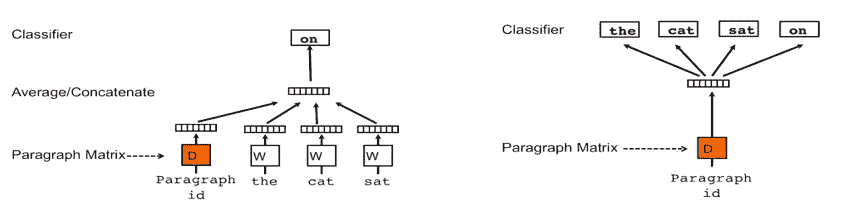
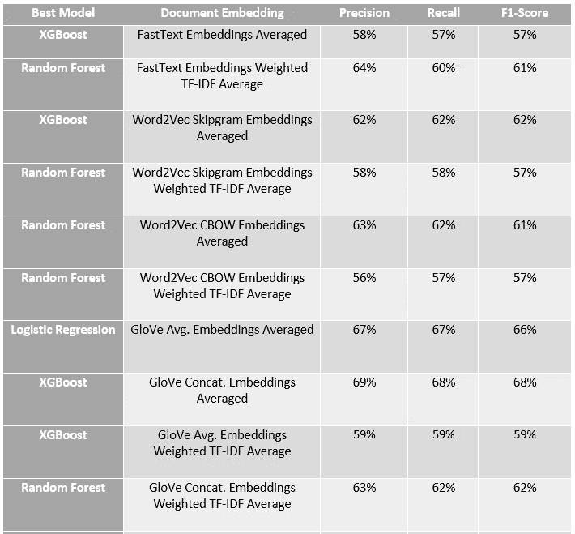
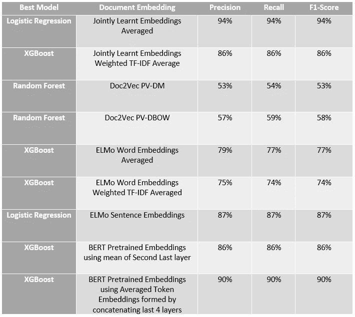

# 组合单词嵌入以形成文档嵌入

> 原文：<https://medium.com/analytics-vidhya/combining-word-embeddings-to-form-document-embeddings-9135a66ae0f?source=collection_archive---------3----------------------->

这篇文章是关于单词嵌入的介绍性文章的后续，可以在这里找到。

既然我们已经探索了单词嵌入的领域，并且对它非常熟悉，那么让我们进入如何使用单词嵌入来生成可以传递给传统机器学习算法(如 random forests、xgboost 等)的特征。

## **我们为什么要研究这样一种表示文档的方法？**

我们经常用于文本的广泛使用的特征提取技术是 TF-IDF。这种技术已经被证明可以很好地处理文本数据和传统算法，而且也很容易解释。TF-IDF 生成大小为 N x V 的特征，其中 N 是观察的数量，V 是词汇的大小。这种方法有助于减小特征的大小，以选择嵌入的大小。

本文是[“用 TF-IDF 增强词向量”](https://towardsdatascience.com/supercharging-word-vectors-be80ee5513d)文章的扩展，该文章将 FastText 嵌入与 TF-IDF 结合起来。本文探讨了不同的单词嵌入生成算法，如 Word2Vec (Skip-Gram 和 CBOW)、FastText 等。以及组合这些单词嵌入的不同方式。

## 结合单词嵌入的不同方法有:

*   **tf-idf 加权单词嵌入:**通过将单词嵌入与单词在句子中的 tf-idf 分数相乘，将这些嵌入与每个句子中每个单词的 TF-IDF 分数相结合，对句子中的所有单词都这样做，并且将单词 TF-IDF 与单词嵌入相乘的结果进行累加，并除以句子中单词的累加 TF-IDF 分数。获得的向量被用作句子嵌入。
*   **doc 2 vec**:doc 2 vec 算法使用 word2vec 模型将文档嵌入向量空间，同时添加另一个特征(段落 ID)，该特征是文档唯一的。每个段落被映射到由矩阵 D 中的列表示的唯一向量，并且每个单词也被映射到由矩阵 w 中的列表示的唯一向量。段落向量和单词向量被平均或连接以预测上下文中的下一个单词。上面的模型被称为段落向量的分布式存储版本(PV-DM)。PV-DM 更胜一筹，但训练速度较慢。doc2vec 的另一种方法是段落向量的分布式单词包版本(PV-DBOW)。这种算法速度更快，占用内存更少，因为不需要保存字向量。

PV-DM 模型和 PV-DBOW 模型

*   **平均单词嵌入:**嵌入也作为模型的一部分被学习。这些嵌入用于通过平均文档中所有单词的嵌入来生成文档嵌入。

使用的数据是亚马逊评论，用评论的情绪标记为正面或负面。嵌入大小选择为 20，上下文大小选择为 5。前 1000 个观察值用于进行分析。

实验结果如下:

**结论**
当单词的嵌入被平均时，作为训练基于情感标签的网络的一部分的共同学习的嵌入看起来更准确。因此，增加 TF-IDF 信息对模型精度没有太大影响。

经过预训练的 ELMo 和 BERT 表示接近特定于任务的嵌入，从而证明了它们对不同任务的现成适用性。

结果表证明，平均单词嵌入以形成文档嵌入优于实验中尝试的其他备选方案。

我希望你喜欢这篇文章，如果你觉得这篇文章有用，请留下评论。

这个实验的笔记本可以在[这里](https://github.com/ytnvj2/DocumentEmbedding/blob/master/TFIDFwithEmbeddings.ipynb)找到。

**参考文献**
[https://towards data science . com/suppression-word-vectors-be 80 ee 5513d](https://towardsdatascience.com/supercharging-word-vectors-be80ee5513d)
[https://medium . com/scale about/a-gentle-introduction-to-doc 2 vec-db 3 e 8 c 0 CCE 5 e](/scaleabout/a-gentle-introduction-to-doc2vec-db3e8c0cce5e)