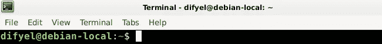

# 命令行编辑键盘快捷键

> 原文：<https://medium.com/analytics-vidhya/command-line-editing-keyboard-shortcuts-9b6e2f0d895e?source=collection_archive---------17----------------------->

命令行是您输入命令的地方，由 shell 解释和执行。

命令行位于 shell 提示符之后，通常格式为:`username@host:currentWorkingDirectory$`。在 shell 提示符后，光标在命令行上用矩形表示。



这些是编辑命令行的快捷键。这些快捷方式适用于 linux、freeBSD 和 macOS。

其中一些键盘快捷键也适用于 emacs。当他们这样做时会被记录下来。

# 移动光标

所有的光标移动，键盘快捷键，也在 emacs 中工作。

*   `CTRL-B`或向左箭头:*向后移动光标，向左移动一个字符。*
*   `ALT-B`:将光标向后移动一个单词。
*   `CTRL-A` : *将光标向后移动到行首。*
*   `CTRL-F`或向右箭头:将光标向前移动，向右移动一个字符。
*   `ALT-F` : *将光标向前移动一个字*。
*   `CTRL-E`:将光标向前移动到命令行的末尾。

# 删除

*   `CTRL-H`或退格:*删除光标左侧的字符*。
*   `CTRL-D`或删除:删除字符，光标在。在 emacs 工作。

# 切割

*   `CTRL-W` : *剪切一个单词，在光标的左边。*
*   `CTRL-U`:剪切光标左侧的所有内容。
*   `ALT-D` : *从光标所在的位置开始剪切一个单词。在 emacs 中工作*
*   `CTRL-K` : *剪切光标所在字符到行尾的所有内容。在 emacs 工作。*

剪切的文本只能在终端中粘贴。要粘贴，必须使用`CTRL-Y`。

如果你想复制终端中的文本，要粘贴到另一个程序中，你可以用鼠标选中所有的文本，然后你可以使用键盘快捷键:`CTRL-SHIFT-C`，来复制选中的文本。

之后，您可以使用您的操作系统粘贴键盘快捷键将其粘贴到另一个程序，例如 macOS 上的`COMMAND+V`。

# 涂

*   `CTRL-Y` : *从命令行粘贴剪切的文本，放到命令行上。这个键盘快捷键也适用于 emacs。*
*   `CTRL-SHIFT-V`:将任何地方复制的文本粘贴到命令行。

# 在输入的命令中循环

*   `CTRL-P`或向上箭头:*在输入的命令中向后循环。在 emacs 中，这个键盘快捷键将光标移动到上一行。*
*   `CTRL-N`或向下箭头:在输入的命令中向前循环。在 emacs 中，这将把光标移动到下一行。

# 取消

*   `CTRL-_` : *可以用来撤销*。

# 插入控制字符

要插入一个控制字符，例如`CTRL-C`、`CTRL-V`或`CTRL-Z`，在输入控制字符序列之前，先输入键盘序列:`CTRL-V`。

# 跨越命令行多行

这不是键盘快捷键，但与命令行编辑有关。

要跨命令行多行，可以使用反斜杠字符:`\`。输入反斜杠字符:`\`，并按回车键，将光标移动到下一行，而不是终止命令行编辑。

```
$ ls -\
> al
total 8
drwxr-xr-x  2 difyel difyel 4096 Sep 22 05:46 .
drwxr-xr-x 17 difyel difyel 4096 Nov  8 15:47 ..
```

*原载于 2020 年 11 月 9 日 https://twiserandom.com*[](https://twiserandom.com/unix/command-line-editing-keyboard-shortcuts/)**。**