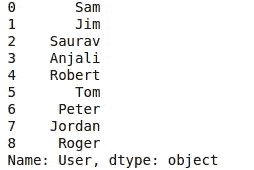

# Python 中常见的 Excel 公式

> 原文：<https://medium.com/analytics-vidhya/common-excel-formulas-in-python-c5a7ce0ae07a?source=collection_archive---------0----------------------->


我已经写了一篇关于如何在 Excel 中自动化常见数据分析任务的文章。接下来我写了一篇关于如何用 python 制作数据分析 GUI 的[中型文章](/analytics-vidhya/how-to-make-gui-in-python-for-data-analysis-f5cee63f4ff8)。在本文中，我将深入探讨如何在 python 中实现常见的 Excel 函数。

我们在文件“medium.xls”中有以下数据。


它包含不同组和位置的用户列表。收入和费用列包含每个用户给公司带来的收入和费用。

我们有第二个文件“group.xls ”,如下所示


它包含每个组号的组名。

现在我将展示如何用 python 实现常见的 excel 函数

**1 阅读文件**

我们可以使用 pandas [read_excel](https://pandas.pydata.org/pandas-docs/stable/reference/api/pandas.read_excel.html) 函数读取 pandas 库中的 excel 文件。它读取 excel 文件并将文件数据作为 pandas dataframe 对象返回。

```
data = pandas.read_excel(r'path to/medium.xls')
group = pandas.read_excel(r'path to/group.xlsx')
```

**2 数据检查**

现在我们要检查数据是否被正确读取。我们可以使用 head 方法检查数据帧的前五行，如下所示:

```
data.head(5)
```


我们可以使用 tail 方法检查数据帧的最后五行，如下所示:

```
data.tail(5)
```


如果我们想检查 dataframe 的第 2 行到第 7 行，我们可以如下使用 dataframe 对象的 iloc 方法:

```
data.iloc[2:8]
```

**2。Vlookup**

Vlookup 可能是 Excel 中使用最多的函数。它用于连接 excel 中的两个表。

这可以在 pandas 库中使用合并功能完成，如下所示:

```
data.merge(group, on = 'Group')
```


对于“on”关键字，将给出两个数据帧之间的公共列名的名称。

使用 merge 关键字，将第二组数据帧中的组名添加到数据数据帧中。

合并功能可以做更多的事情。你可以在这里了解更多

[https://www . shanelynn . ie/merge-join-data frames-python-pandas-index-1/](https://www.shanelynn.ie/merge-join-dataframes-python-pandas-index-1/)

**2 透视表**

数据透视表在 Excel 中用于执行数据聚合。这是 Excel 中最常用的函数之一。

我们可以使用 dataframe 的 pivot_table 方法在 pandas 库中创建数据透视表，如下所示:

```
data.pivot_table(values='Revenue', index='Location', columns ='Group').fillna(0)
```


在 Excel 中，您可以使用 GUI 为行、列和索引选择列。在熊猫图书馆，你必须提供他们使用关键字。Pivot_table 函数以数据帧的形式返回输出，可以进一步处理。

**3 字符串函数——连接、长度、修剪、左、中、右**

Excel 有几个字符串函数。在 pandas 库中，您可以通过首先应用 str 访问器方法来逐列应用 python 字符串方法。然后就可以对它应用 python 中所有的原生字符串函数了。

在 Excel 中，您可以使用 upper 函数将文本转换成大写字母。在 pandas 中，您可以将列中的所有文本转换为大写，如下所示:

```
data['User'].str.upper()
```


在 excel 中，您可以使用 LOWER 函数将文本转换为小写。在 Pandas 中，我们可以使用 lower 函数将其转换为小写，如下所示:

```
data['User'].str.lower()
```


在 Excel 中，你可以使用 LEN 函数得到字符串的长度。在 pandas 中，我们可以使用 len 函数获得字符串的长度，如下所示:

```
data['User'].str.len()
```


在 excel 中，您可以使用 LEFT 函数获取字符串的第一个字符。在 pandas 中，我们可以使用 str 方法上的切片操作获得字符串的前 2 个字符，如下所示:

```
data['User'].str[:2]
```


在 excel 中，您可以使用右函数获得字符串的最后一个字符。在 pandas 中，我们可以使用 str 方法上的切片操作获得字符串的最后 2 个字符，如下所示:

```
data['User'].str[-2:]
```


同样，你可以使用切片来实现 pandas 中 Excel 的 mid 功能。

在 excel 中，您可以使用 CONCATENATE 函数合并两个字符串。在 pandas 中，字符串可以被加在一起连接在一起。

```
data['User'] + data['Location']
```


4 个求和函数

在 Excel 中，Sumifs 用于对满足特定条件的单元格区域求和。在 pandas 中，sumifs 函数可以使用 sum 函数实现。

例如，如果我们想知道集团的收入和支出，那么我们可以对 groupby 方法应用 sum 函数。

```
data.groupby('Group').sum()
```


这将返回集团的收入和费用。

Groupby 方法允许您基于作为参数提供给 groupby 方法的列“Group”中的唯一值来分组隔离数据。它允许拆分数据，并通过您选择的聚合方法进行组合。你可以在这里阅读更多关于 groupby 的信息

https://realpython.com/pandas-groupby/

和 sumifs 一样，可以添加更多的条件。假设您只想要位于纽约的组的组智能收入和支出。我们可以通过在应用 groupby 之前过滤数据来实现这一点，如下所示:

```
data[data['Location']=="Newyork"].groupby('Group').sum()
```


**5 个县，平均年数**

COUNTIFS 函数在 excel 中用于对满足一个或多个条件的单元格区域进行计数。AVERAGEIFS 在 excel 中用于计算满足一个或多个条件的单元格的平均值。

Groupby 方法还支持计数和平均聚合方法。当我们应用这些方法时，我们可以得到类似 sumifs 和 countifs 的结果。

假设我们想知道每组中元素的数量。然后我们可以使用 groupby 和 count 来完成，如下所示:

```
data.groupby('Group')['Revenue'].count()
```


假设我们想知道每组的平均收入和支出。那么我们可以这样做:

```
data.groupby('Group').mean()
```


**6 总和、最大值、最小值、平均值**

Sum、Max、Min 和 Average 是必不可少的 Excel 函数。它们返回选定范围内数值的总和、最大值、最小值和平均值。

Pandas dataframe 和 series 对象都支持 sum、max、min 和 mean 函数，可以用来实现上述功能。我已经计算了收入栏的总和、最大值、最小值和平均值，如下所示:

```
data['Revenue'].sum()
```


```
 data['Revenue'].max()
```


```
data['Revenue'].min()
```


```
data['Revenue'].mean()
```


**9 If 函数**

如果函数在 excel 中用于根据条件在值中进行选择。可以使用 Numpy 库的 where 函数实现。首先，我们必须导入 numpy，如下所示

```
import numpy
```

Numpy 库包含一个 where 函数，其功能类似于 excel 中的 IF 公式。它根据条件从两个数组中返回值。你可以在这里了解更多。

[https://docs . scipy . org/doc/numpy/reference/generated/numpy . where . html](https://docs.scipy.org/doc/numpy/reference/generated/numpy.where.html)

我们可以使用 numpy where 函数来实现一个 if 公式，其中基于一个条件，我们希望返回 1 或 0。

```
numpy.where(data['Revenue']>400,1,0)
```


我们还可以比较两列数据帧，如下所示:

```
numpy.where(data['Revenue']<data['Expense'],1,2)
```


**10 号指标与比赛**

在 Excel 中，索引和匹配的组合被用来替代 Vlookup。Index 函数返回指定索引范围内单元格的值。Match 返回符合指定条件的单元格区域中单元格的索引。

在 pandas 中使用 Loc 访问器方法来访问 dataframe 中的值。

如果只向 loc 方法传递一个参数。它通过索引标签选择数据帧的行

```
data.loc[0]
```


如果我们想按行和列访问。然后，我们必须为 loc 方法提供两个参数

```
data.loc[0,'User']
```


如果我们想要访问特定的列，那么我们可以提供“:”作为第一个参数来访问所有的行。

```
data.loc[:,"User"]
```



您可以在这里阅读关于锁定方法更多信息

[https://pandas . pydata . org/pandas-docs/stable/reference/API/pandas。DataFrame.loc.html](https://pandas.pydata.org/pandas-docs/stable/reference/api/pandas.DataFrame.loc.html)

Loc 方法也接受布尔数组作为参数。因此，如果我们将 condition 作为参数之一传递，那么它就相当于索引和匹配。

假设如果想知道收入为 500 时的费用。那么我们可以这样实现它:

```
data.loc[data['Revenue']==500,'Expense']
```


如果我们想知道收入等于费用时的费用，那么我们可以实现如下:

```
data.loc[data['Revenue']==data['Expense'],'Expense']
```


**13 和积**

在 Excel 中，SUMPRODUCT 函数用于计算两个范围的乘积之和。在熊猫中，它可以按如下方式实现:

```
sum(data['Revenue']*data['Expense'])
```


这利用了算术运算可以在 pandas 数据帧上按元素方式完成的事实，如下所示:

```
data['Revenue']*data['Expense']
```


```
data['Revenue']+data['Expense']
```


```
data['Revenue']/data['Expense']
```


**14 保存文件**

我们可以将分析结果保存为 csv 或 excel 格式。为了保存到 csv，使用 to_csv 函数。To_excel 函数用于保存为 excel 格式。在这里，我将数据对象保存为 csv 和 excel 格式，如下所示:

```
data.to_csv('data.csv')
data.to_excel('data.xls')
```

**15 摘要**

我们可能有一个 excel 工作表，其中有许多公式。而且我们想用 Python 实现工作表的逻辑。在这种情况下，使用这些 python 函数，我们可以轻松地从 Excel 过渡到 Python。