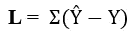
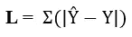
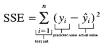
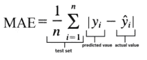
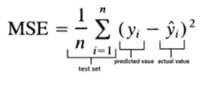
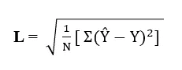
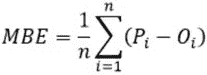
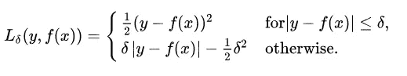

# 回归模型机器学习中的常见损失函数

> 原文：<https://medium.com/analytics-vidhya/common-loss-functions-in-machine-learning-for-a-regression-model-27d2bbda9c93?source=collection_archive---------5----------------------->

凯文·Ku 在 [Unsplash](https://unsplash.com/s/photos/coding?utm_source=unsplash&utm_medium=referral&utm_content=creditCopyText) 上的照片

> 为任何算法找到正确的损失函数是至关重要的，因为损失函数的不准确选择将导致错误的解决方案，并可能成为优化机器学习模型的麻烦制造者。

机器学习是人工智能的先驱子集，机器使用可用的数据集进行自我学习。对于任何机器学习模型的优化，必须选择可接受的损失函数。一个**损失函数**描述了模型在训练数据集上的表现。损失函数表达了被训练模型的预测和实际问题实例之间的差异。如果预测结果和实际结果之间的偏差太大，那么损失函数将具有非常高的值。逐渐地，在一些优化函数的帮助下，损失函数学习减少预测中的误差。在本文中，我们将介绍几种损失函数及其在机器/深度学习领域的应用。

不存在适用于所有机器学习模型的普适损失函数。根据问题陈述和模型的类型，需要从可用的集合中选择合适的损失函数。不同的参数，如机器学习算法的类型、所提供的数据集中异常值的百分比程度、计算导数的容易程度等。在选择损失函数中发挥作用。

损失函数主要分为两大类**回归损失**和**分类损失**。在本文中，将只讨论回归损失，分类损失将在另一篇文章中发表。(注:回归函数通常预测一个值/数量，而分类函数预测一个标签/类别)

## 回归损失:

**1。误差总和(SE)**

这是一个基本的损失函数，只需在每次迭代中将预测值和实际值之间的所有误差差相加即可计算出来。数学表示如下:

误差总和

其中ŷ代表预测值，y 代表实际值。

误差和(SE)不是一个有效的函数，因为预测结果与实际结果的偏差可能是正的，也可能是负的。因此，误差总和(se)值可能小于与期望实际结果的实际总偏差。

**2。绝对误差之和(SAE)**

绝对误差之和(SAE)是每次迭代中预测值和实际值之间所有误差差的绝对值的总和。下面显示了数学表示:

绝对误差之和

其中ŷ代表预测值，y 代表实际值。

这里，在绝对误差总和(SAE)中，产生的误差将显示总偏差，预测结果与期望的实际结果有偏差，因为正方向和负方向的偏差不会对彼此的值有任何影响，因此它们各自的值不会减小。

**3。误差平方和(SSE)**

误差平方和(SSE)是误差平方的总和，它是从数据的实际期望值预测的偏差。它是数据和估计模型之间差异的度量。较小的 SSE 表明模型与数据紧密吻合。该函数如下所示:

误差平方和

预测结果与实际结果的微小偏差将对误差值产生平方影响。这个函数给出非负值，并且可以在所有点上求导。

**4。平均绝对误差(MAE) / L1 损耗**

平均绝对误差(MAE) / L1 损失被测量为预测和实际结果之间的绝对差之和的平均值。这将计算差值的大小。

绝对平均误差

误差的方向/符号对 MAE 计算没有影响。无论差异是正还是负。MAE 对异常值更鲁棒，但是它需要更复杂的工具来计算梯度。

**5。均方误差(MSE) / L2 损耗**

均方误差(MSE) / L2 损失通过取预测值和实际值之间的平方差的和的平均值来计算。MSE 给出了误差的平均大小，与它们的方向无关。

均方误差

当预测值和实际值相差很小时，MSE 值会发生很大的变化。由于平方，根据预测值和实际值之间的差异，它对模型的惩罚很重。用 MSE 计算梯度更容易。

**6。均方根误差(RMSE)**

**均方根误差** ( **RMSE** )是最常用的误差函数。它是模型预测值和实际期望值之间的差异。RMSE 可以通过取上述**均方误差(MSE) / L2 损耗的平方根来计算。**每个误差对 RMSE 的影响与误差平方的大小成正比。它表示预测模型值和实际值之间偏差的第二个采样时刻的平方根。

均方根误差

更大的误差对 RMSE 的影响更大。这些偏差被称为误差。RMSE 用于将不同时间的预测中的误差大小聚合到一个度量中。RMSE 描述了模型的准确性，并有助于比较不同模型对特定数据集的预测误差。

模型预测偏差符号对 RMSE 值没有影响，它总是非负的。RMSE 的零值表明模型是 100%准确的，但在实践中，这种情况从未发生过。对于模型优化，在实践中尽可能降低 RMSE 值。

7.**平均偏差误差(MBE)**

平均偏差误差不经常作为损失函数用于任何机器模型。MBE 主要用于计算机器学习模型中的平均偏差。虽然它在实践中不太准确，但它可以确定模型是有正偏差还是负偏差。

平均偏差误差

它有助于优化模型。它有助于决定是否需要考虑模型偏差的任何步骤。MBE 的输出是预测中的平均偏差。MBE 与 MSE 相同，唯一的区别是它不像 MSE 那样采用绝对值。MBE 的正值表示价值被高估，负值表示价值被低估。

**8。胡贝尔损失**

在统计学中，Huber 损失可能是稳健回归中使用的损失函数，与平方误差损失相比，它对数据中的异常值不太敏感。有时还会使用分类的变体。Huber 损耗结合了 MSE 和 MAE 的最简单特性。对于较小的误差，它是二次的，否则就是线性的(对于它的梯度也是如此)。它通过它的 delta 参数来识别。数学上定义如下:

胡伯损失

也可以用 0 来区分。它是一个绝对误差，当误差很小时，它变成二次误差。超参数𝛿(δ)决定了误差必须有多小才能使其为二次误差。𝛿(德尔塔)也可以调整。当𝛿近似为零时，胡伯损失接近 MAE，当𝛿近似为无穷大时，胡伯损失接近 MSE(大数。)

# 参考

1.  AgriMetSoft (2019)。在线计算器。发售地点:【https://agrimetsoft.com/calculators/Mean%20Bias%20Error 
2.  [https://medium . com/@ phu ctrt/loss-functions-why-what-where-when-189815343 d3f](/@phuctrt/loss-functions-why-what-where-or-when-189815343d3f)
3.  [https://towards data science . com/common-loss-functions-in-machine-learning-46 af 0 ffc 4d 23 #:~:text = Broadly % 2C % 20 loss % 20 functions % 20 can % 20 be，Regression % 20losses %和% 20Classification % 20losses。](https://towardsdatascience.com/common-loss-functions-in-machine-learning-46af0ffc4d23#:~:text=Broadly%2C%20loss%20functions%20can%20be,Regression%20losses%20and%20Classification%20losses.)
4.  [https://towards data science . com/common-loss-functions-in-machine-learning-46 af 0 ffc 4d 23](https://towardsdatascience.com/common-loss-functions-in-machine-learning-46af0ffc4d23)

# 注意

此外，如果你是机器学习的初学者，并且热衷于了解更多，那么你可以搜索 GitHub 帐户 **sushantkumar-estech** 或者可以使用链接[https://github.com/sushantkumar-estech](https://github.com/sushantkumar-estech)来了解有趣的项目

从你的练习愿望中选择任何项目，如果有任何问题，你可以写信给我。我很乐意帮忙。

享受阅读，快乐学习！！