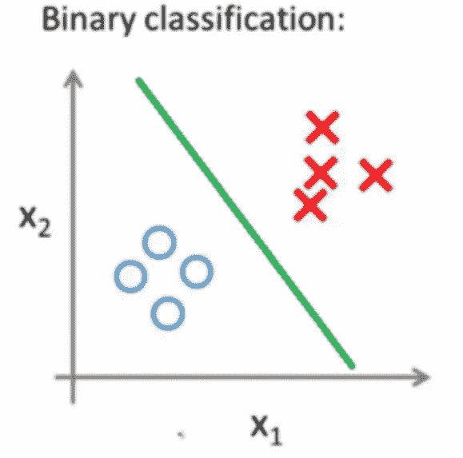
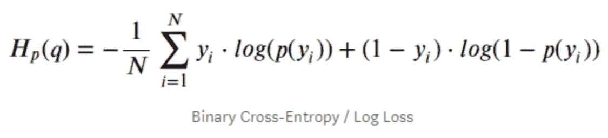
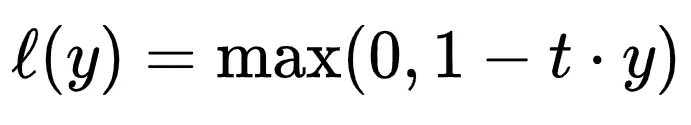
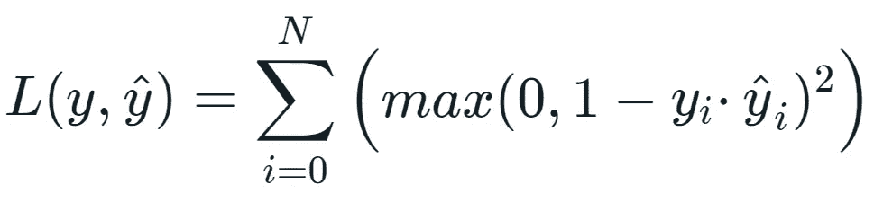
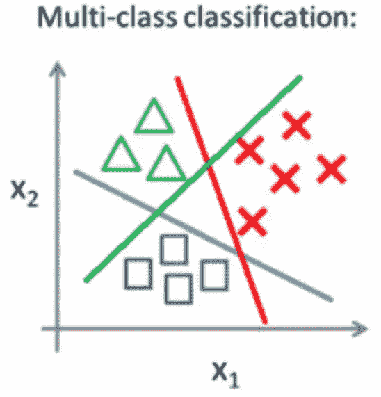
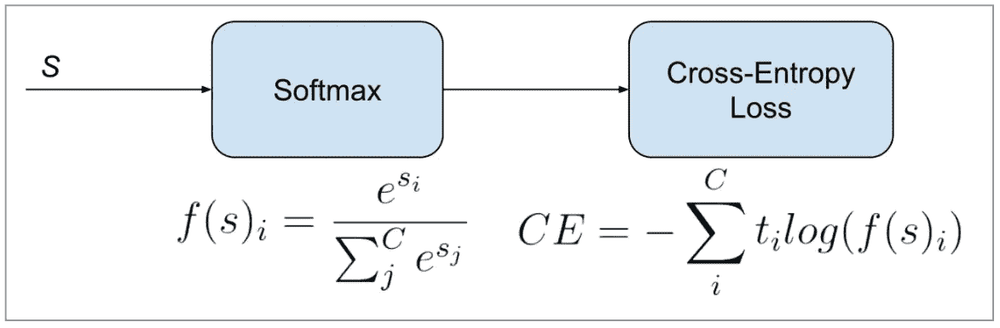

# 分类模型机器学习中的常见损失函数

> 原文：<https://medium.com/analytics-vidhya/common-loss-functions-in-machine-learning-for-classification-model-931cbf564d42?source=collection_archive---------7----------------------->

马库斯·温克勒在 [Unsplash](https://unsplash.com/s/photos/programming?utm_source=unsplash&utm_medium=referral&utm_content=creditCopyText) 上的照片

> 为任何算法找到一个正确的损失函数是非常关键的，因为损失函数的不准确选择将导致错误的解决方案，并可能成为优化机器学习模型的麻烦制造者。

机器学习是人工智能的先驱子集，机器使用可用的数据集进行自我学习。对于任何机器学习模型的优化，必须选择可接受的损失函数。一个**损失函数**描述了模型在训练数据集上的表现。损失函数表达了被训练模型的预测和实际问题实例之间的差异。如果预测结果和实际结果之间的偏差太大，那么损失函数将具有非常高的值。逐渐地，在一些优化函数的帮助下，损失函数学习减少预测中的误差。在本文中，我们将介绍几种损失函数及其在机器/深度学习领域的应用。

不存在适用于所有机器学习模型的普适损失函数。根据问题陈述和模型的类型，需要从可用的集合中选择合适的损失函数。不同的参数，如机器学习算法的类型、所提供的数据集中异常值的百分比程度、计算导数的容易程度等。在选择损失函数中发挥作用。

损失函数主要分为两大类**回归损失**和**分类损失**。在本文中，将只讨论分类损失。要了解更多关于回归损失的信息，请访问链接[https://medium . com/analytics-vid hya/common-loss-functions-in-machine-learning-for-a-Regression-model-27 D2 bbda 9 c 93](/analytics-vidhya/common-loss-functions-in-machine-learning-for-a-regression-model-27d2bbda9c93)。

(注:回归函数通常预测一个值/数量，而分类函数预测一个标签/类别)

# 分类损失:

## 1.二元分类损失函数；

在二元分类中，最终结果是两个可用选项中的一个。这是一项基于分类规则将元素分为两组的任务。

通常，问题是预测第一类或第二类的值为 0 或 1。它被实现为概率预测，以决定元素属于第一类还是第二类。二元分类适用于实际情况。在许多实际的二进制分类问题中，这两组是不对称的，而不是总体精度，不同类型的误差的相对比例是感兴趣的。

以下是二元分类的几个例子:

*   确定病人是否患有某种疾病的医学测试；
*   工业中的质量控制，决定是否符合规范；
*   在信息检索中，决定一个页面是否应该出现在搜索结果集中。
*   垃圾邮件检测(垃圾邮件与否)。
*   流失预测(流失与否)。
*   转化预测(买不买)。

**1.1 二元交叉熵**

二元交叉熵是二元分类问题中常用的损失函数。它旨在用于只有两个类别的情况，要么是 0 或 1，要么是 1 类或 2 类。这是在二元分类任务中使用的损失函数。这些任务只回答两个选项(是或否，A 或 B，0 或 1，左或右)。从形式上看，这种损失是许多两类任务中特定交叉熵损失的共同结果。

它测量分类模型的性能，其输出是 0 到 1 之间的概率值。如果预测的概率不同于实际标签，交叉熵损失增加。因此，如果一个元素的预测概率是 0.02，而实际观察值是 1，这将是不好的，并导致高损失值。理论上完美的模型的二进制交叉熵损失为 0。

**1.2 铰链损耗**

铰链损失函数是交叉熵的另一种形式，用于二分类问题。它主要开发用于机器学习中的支持向量机(SVM)模型。铰链损失函数旨在与目标值在集合内的二元分类一起使用，因此使用铰链损失函数时，必须确保目标变量必须被修改为拥有集合内的值，而不仅仅是在二元交叉熵的情况下。

铰链损失函数

这个功能鼓励范例拥有正确的符号。当特定类别值和预测类别值之间的符号存在差异时，会产生更多的误差。
关于铰链损失的性能报告是混合的，有时在二元分类问题上导致比交叉熵更好的性能。

**1.3 平方铰链损耗**

铰链损失函数有许多扩展，通常是 SVM 模型研究的主题。平方铰链损失是用于“最大限度”二元分类问题的损失函数。数学上它被定义为:

平方铰链损耗

一个流行的扩展称为平方铰链损失，它简单地计算分数铰链损失的平方。它的作用是平滑误差函数的表面，使其在数值上更容易处理。

如果使用铰链损失在给定的二元分类问题上确实导致更好的性能，则平方铰链损失可能是合适的。与使用铰链损失函数一样，目标变量必须修改为集合{-1，1}中的值。

在涉及是/否(二元)决策的问题上，以及当您对知道分类器对分类的确定程度不感兴趣时(即，当您不关心分类概率时)，使用平方铰链损失函数。与最后一层中的 tanh()激活函数结合使用。

## 2.多类分类损失函数

多类分类是那些预测建模问题，其中实例被分配到两个以上的类中的一个。

该问题通常被构造为预测一个整数值，其中每个类被分配一个从 0 到 n 的唯一整数值(取决于类的数量)。该问题通常被实现为预测实例属于每个已知类的概率。

以下是多类分类问题的几个例子

*   人脸分类。
*   植物种类分类。
*   光学字符识别。

**2.1 多类交叉熵损失**

与二进制分类问题相同，这里交叉熵也是一个常用的损失函数。在这种情况下，它用于多类分类，其中目标元素在{0，1，…的集合中..，n}。在这种情况下，每个类被分配一个唯一的整数值。

多类交叉熵损失

交叉熵将计算一个分数，该分数将给出一个值，该值表示问题中所有类别的预测值与实际标签的不同程度。理论上，一个完美的交叉熵值一定是 0。

首先要评估的是损失函数，只有在你有充分理由的情况下才会改变。

**2.2 Kullback Leibler 发散损失**

在数理统计中，**kull back-lei bler 散度**(也称为**相对熵**)是一个概率分布与第二个参考概率分布如何不同的度量。

基本上，它是两个概率分布之间的距离度量:在由模型和地面真实概率分布返回的类别标签上的 ML 概率分数的情况下。

**2.3 稀疏多类交叉熵损失**

人们对范畴交叉熵和稀疏范畴交叉熵的理解普遍存在混乱。

分类交叉熵和稀疏分类交叉熵都用于多类分类。

主要区别在于前者的输出是一位热编码向量的形式，而后者是整数形式。稀疏版本还可以帮助您在遇到内存约束问题时使用多类分类。稀疏交叉熵通过执行相同的误差交叉熵计算来解决这个问题，而不需要在训练之前对目标变量进行一次性编码。

# 参考

*   [https://machine learning mastery . com/how-to-choose-loss-functions-when-training-deep-learning-neural-networks/](https://machinelearningmastery.com/how-to-choose-loss-functions-when-training-deep-learning-neural-networks/)
*   [https://en . Wikipedia . org/wiki/Binary _ class ification #:~:text = Binary % 20 class ification % 20 is % 20 task，basis % 20 of % 20a % 20 class ification % 20 rule](https://en.wikipedia.org/wiki/Binary_classification#:~:text=Binary%20classification%20is%20the%20task,basis%20of%20a%20classification%20rule)。
*   [https://www . machine curve . com/index . PHP/2019/10/15/how-to-use-hinge-squared-hinge-loss-with-keras/](https://www.machinecurve.com/index.php/2019/10/15/how-to-use-hinge-squared-hinge-loss-with-keras/)
*   [https://medium . com/@ b . terry jack/tips-and-tricks-for-multi-class-classification-c 184 AE 1c 8 ffc](/@b.terryjack/tips-and-tricks-for-multi-class-classification-c184ae1c8ffc)
*   [https://machine learning mastery . com/types-of-class ification-in-machine-learning/](https://machinelearningmastery.com/types-of-classification-in-machine-learning/)
*   [https://data science . stack exchange . com/questions/52144/negative-range-for-binary-cross-entropy-loss](https://datascience.stackexchange.com/questions/52144/negative-range-for-binary-cross-entropy-loss)

# 注意

此外，如果你是机器学习的初学者，并且热衷于了解更多，那么你可以搜索 GitHub 帐户 **sushantkumar-estech** 或者可以使用链接[https://github.com/sushantkumar-estech](https://github.com/sushantkumar-estech)来了解有趣的项目

从你的练习愿望中选择任何项目，如果有任何问题，你可以写信给我。我很乐意帮忙。

享受阅读，快乐学习！！