# 社区与犯罪分析和预测

> 原文：<https://medium.com/analytics-vidhya/communities-and-crime-analysis-and-prediction-be6100ca6790?source=collection_archive---------11----------------------->

犯罪现在是世界上的一个主要问题，仅次于全球变暖。带着这种社会问题搬到一个新地方是非常可怕的。法律机构一直在努力使用犯罪分析来确保每个人的安全和健康。

用于该实验的数据集是真实可信的。数据集是从 UCI 机器学习知识库网站获取的。它是利用 1990 年美国人口普查的社会经济数据、1990 年美国 LEMAS 调查的执法数据和 1995 年美国联邦调查局 UCR 的犯罪数据编制的。这个数据集总共包含 147 个属性和 2216 个实例。

[*链接到数据集。*](http://archive.ics.uci.edu/ml/datasets/communities+and+crime)

我们将首先进行探索性的数据分析来理解数据，然后根据给定的数据点对每个地区的犯罪率进行预测。

## **在争论数据集之前，我们想找到以下问题的答案:**

1.  根据该数据集，哪个区域受犯罪影响最大？
2.  犯罪是否与婚姻、单身等关系状态有关？
3.  与犯罪相关的最主要的 5 个因素是什么？

# **导入数据集& EDA :**

我们从导入数据集开始，展示几个数据点。

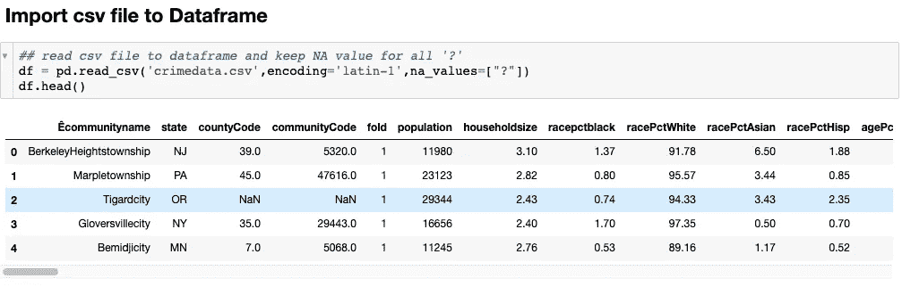

然后，我们对列进行一些*重命名*，并删除不必要的列。

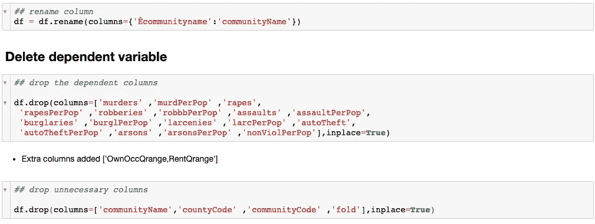

然后我们将使用 pandas 函数打印一般的统计数据。

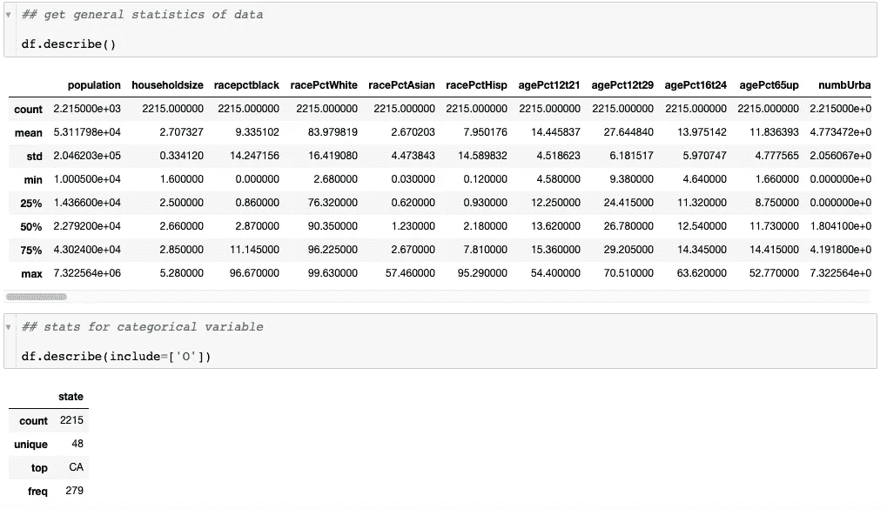

之后，我们分析了一些列分布及其对犯罪率的依赖性。

**年龄百分比:**

举个例子，如果我们画一张人口百分比和犯罪率的图表。我们可以观察到，在大多数数据点中，最暴力的犯罪发生在 25%至 35%的 12 至 29 岁的人群中。

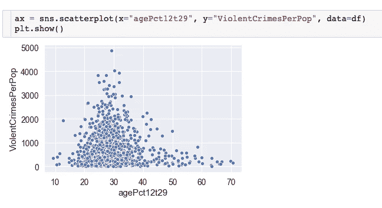

# **1。拥有**最高犯罪率的州 **:**

然后我们走向**状态**变量和犯罪率。我们可以清楚地说，DC 州位居榜首，其次是洛杉矶和南卡罗莱纳州。

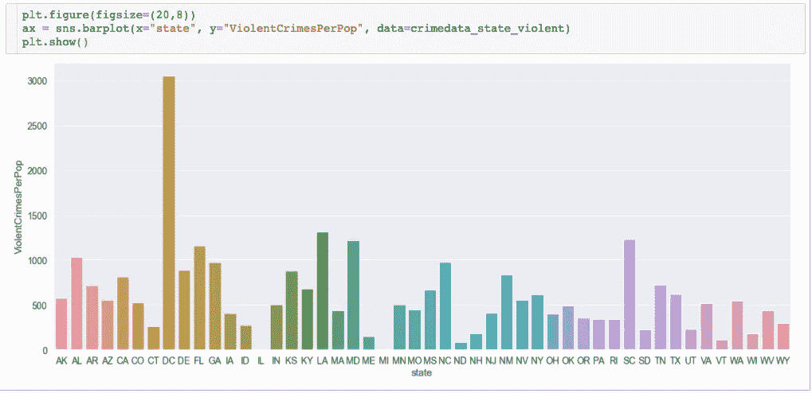

这回答了我们一开始提出的一个问题。

# **2。关系状态与犯罪率的关系:**

*   然后我们前进到下一个变量。我们可以看到，在那个地区，离婚率和犯罪率之间有明显的关系。
*   这种关系也可以从未婚男性的比例中看出。这种情况下还是有那么多杂音。

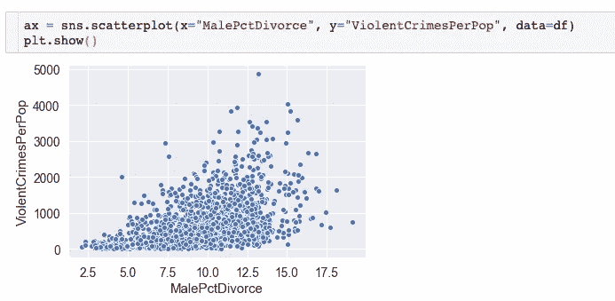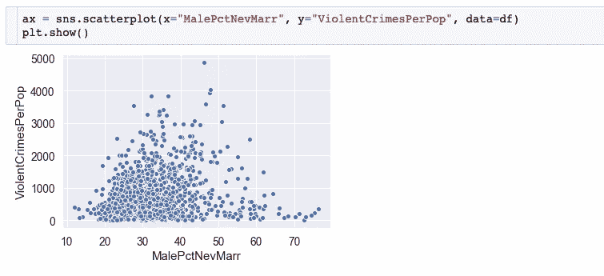

这两个图回答了我们第二个问题:

答案是肯定的。一个地区的社会地位百分比与他们的犯罪率有一定的关系。

# 数据预处理:

现在，我们做了一些分析，我们走向建模。但在此之前，我们需要有干净的数据来填充模型。

因此，我们将检查任何丢失的数据，看看我们如何处理它。

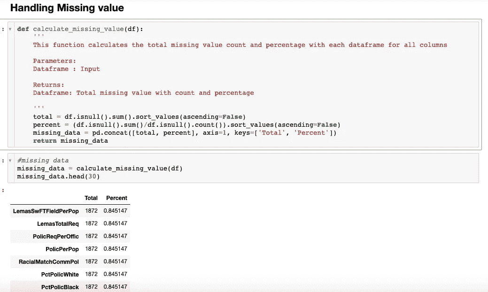

我们看到，存在一些缺失值，其中大约 85%的值缺失。

我们将通过删除几列并用平均值代替来处理。

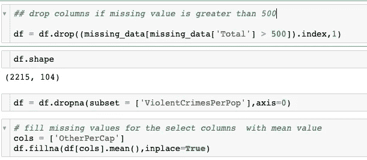

**将分类值转换为数值:**

我们将做的另一个预处理是将所有的分类值转换成数值。我们可以通过以下步骤进行归档。

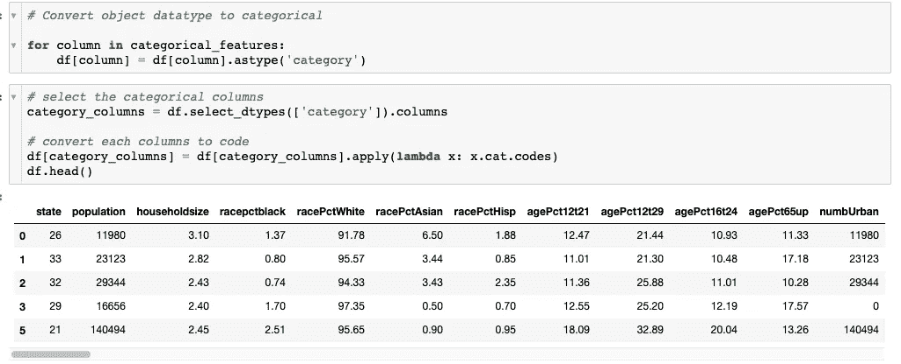

我们可以看到现在**状态**值从字符串变为数字。现在我们可以把这个输入到一个模型中，得到一些预测。

**相关矩阵:**

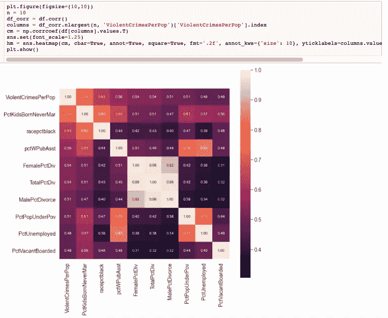

我们用 ViolentCrimePerPop 绘制了前 10 大相关特征的关联矩阵。

由此我们可以肯定地说:

# **3。与其他变量相比，与犯罪率密切相关的前 5 个因素是:**

*   **未婚生子的比例**
*   **男性/女性离婚率**
*   **贫困线以下人口的百分比**
*   **失业人口的百分比**
*   **被封闭的空置房屋的百分比**

# **建模:**

现在我们将应用加权线性回归模型来预测给定数据点的犯罪率。

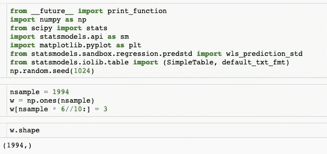

为了简单起见，我们只选取了 23 个对预测犯罪率最重要的特征来检验我们模型的有效性。

现在我们可以看到所有特性的所有统计数据:

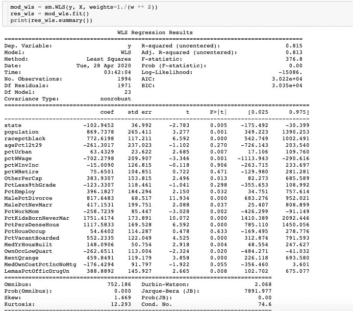

从这里我们可以看到，R2 值几乎为 0.815。

# 结论:

通过这种分析，我们至少对犯罪与一些变量的关系有了一些了解。通过利用这些因素，我们可以最大限度地减少社区中的犯罪，并采取适当的行动来减少犯罪。

我们也回答了开始时提出的三个问题。