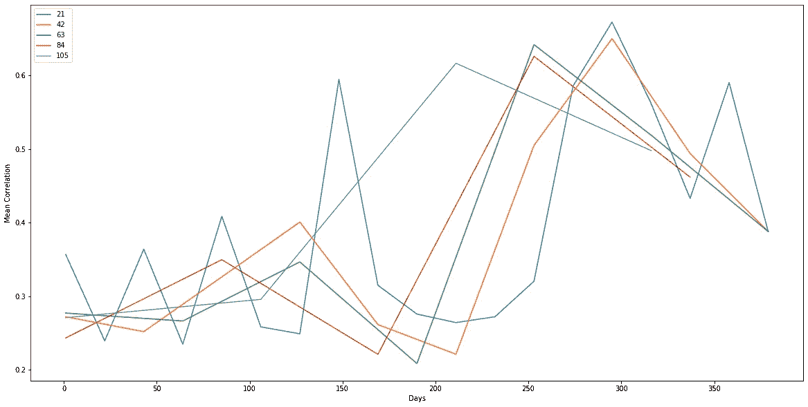
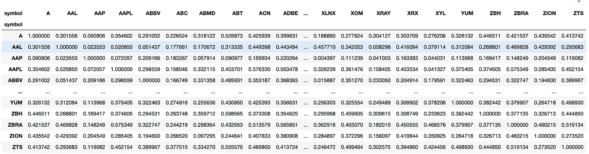
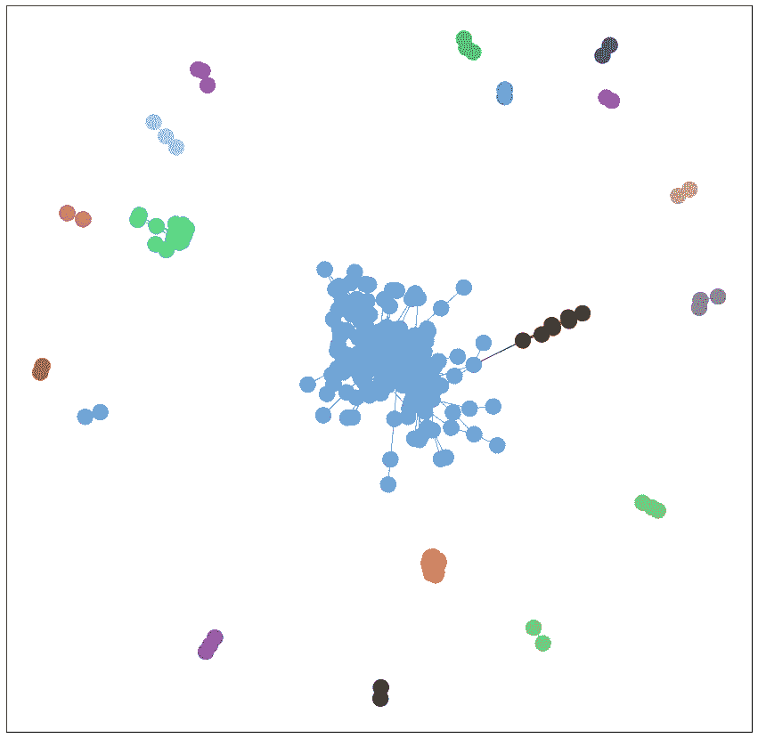
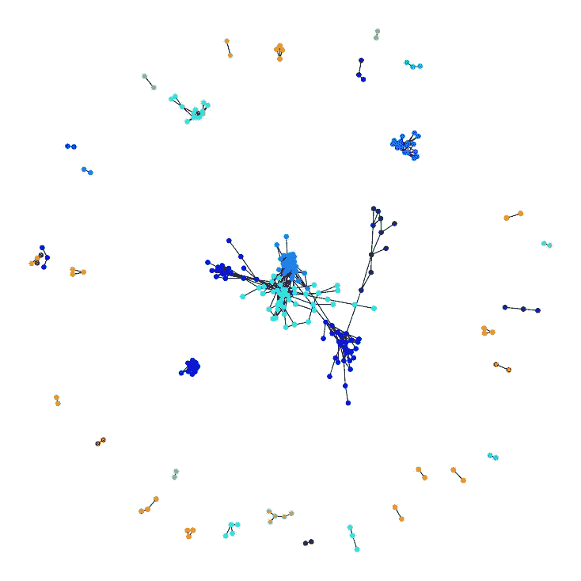
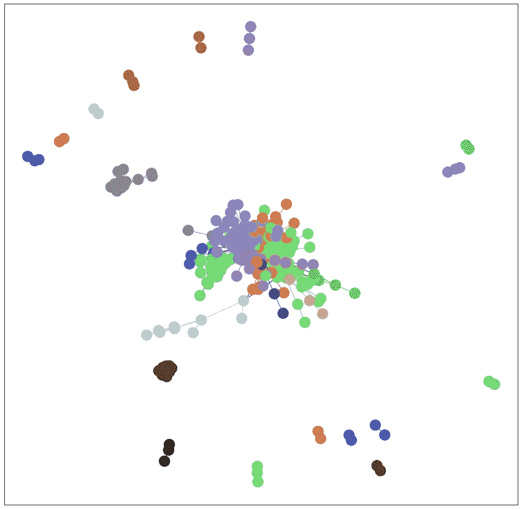
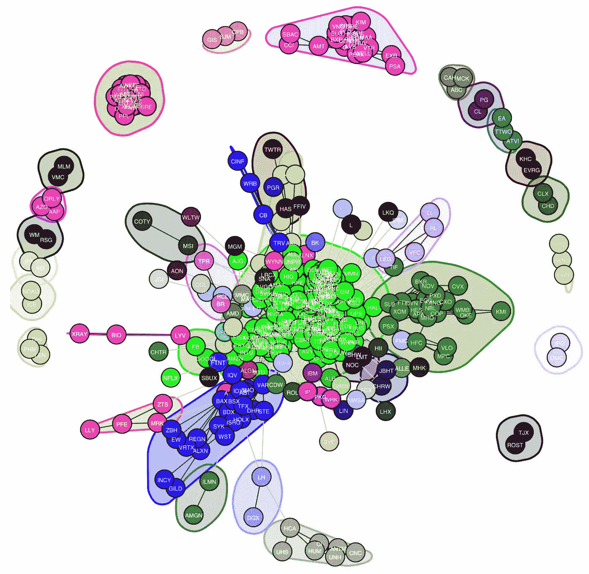
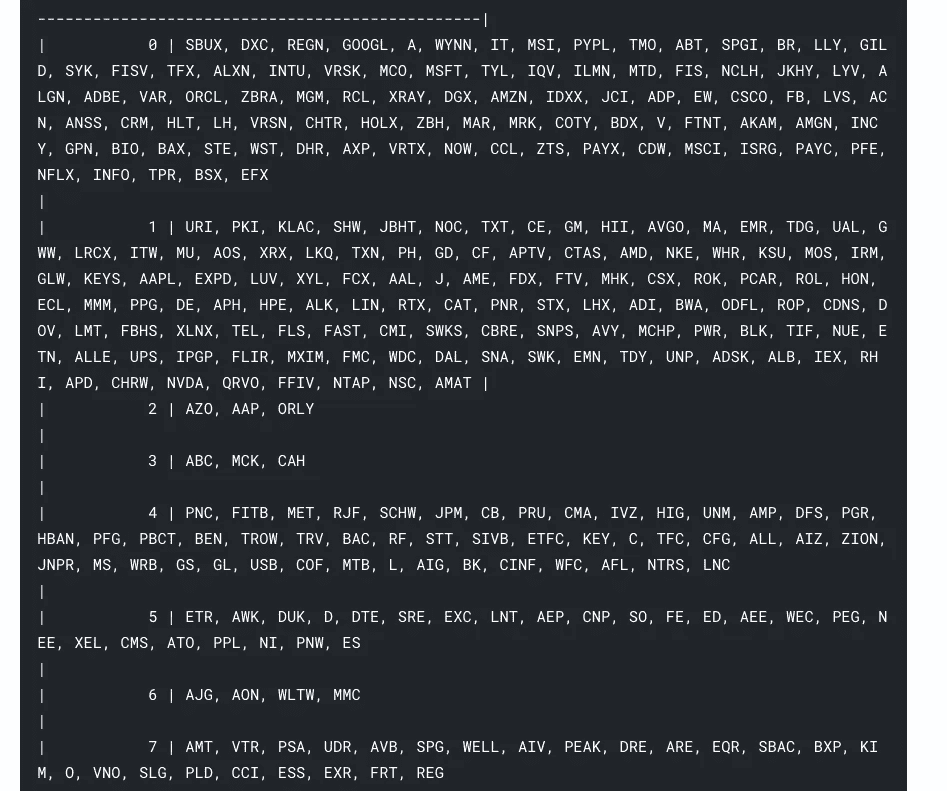
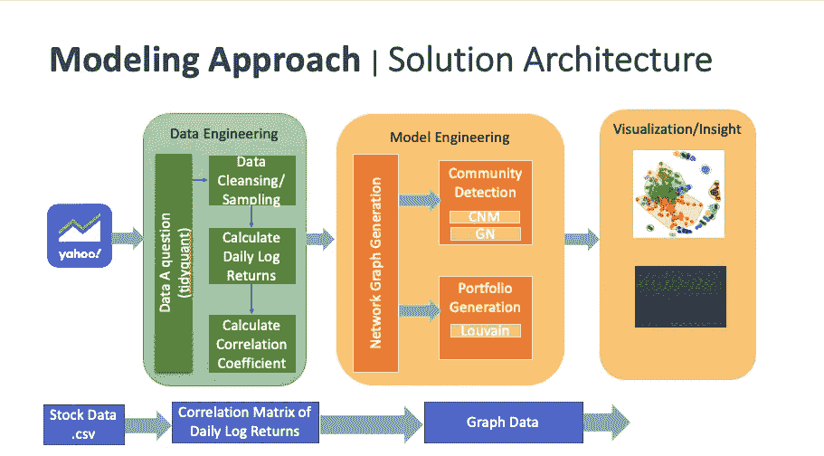

# Python & R 中股票市场的社区检测和网络分析—第二部分

> 原文：<https://medium.com/analytics-vidhya/community-detection-network-analysis-of-the-stock-market-in-python-r-part-2-9b5a5dbe5d5b?source=collection_archive---------10----------------------->

这是之前展示数据收集和清理的[博客](/@akiboy96/community-detection-network-analysis-of-the-stock-market-in-python-r-part-1-a8a3366dc5a5)的延续。我们现在将着手对我们的网络进行建模，并使用聚类算法形成社区，这些算法最终将被用于[创建我们的投资组合](/@akiboy96/community-detection-network-analysis-of-the-stock-market-in-python-r-part-3-ca4e0fbb8ca9)，这可能会超过间谍平均回报率[的 8.93%](https://www.investopedia.com/articles/investing/122215/spy-spdr-sp-500-trust-etf.asp#:~:text=SPY%20Performance&text=The%20SPDR%20S%26P%20500%20ETF%20Trust%20(SPY)%20has%20generated%20an,average%20annual%20returns%20of%208.93%25.) 。


## 第 2 部分:建模

这种端到端的解决方案架构展示了股票信息将如何转化为一个网络，该网络通过随时间推移的价格变动来构建相关股票的社区。

下一步是通过计算相关系数来建立股票之间的关系，如下所示。

**时间序列互相关计算:**

我们将创建一个函数来计算不同时间窗口内股票的交叉相关性。

```
*# Function to calculate corr*
def calculate_corr(df_stock_returns, returns_window, corr_window_size, corr_method):
    stocks_cross_corr_dict = {}
    *#Calculate mean correlation by window for plot*
    x_days = []
    y_mean_corr = []        
*#     W = corr_window_size*
    for i **in** range(returns_window,len(df_stock_returns),corr_window_size):
        dic_key = i
        stocks_cross_corr_dict[dic_key]=df_stock_returns.iloc[i:(i+W)].corr(method='pearson')
        stocks_cross_corr_dict[dic_key].fillna(0,inplace=True)
        x_days.append(dic_key)
        y_mean_corr.append(np.mean([abs(j) for j **in** stocks_cross_corr_dict[dic_key].values.flatten().tolist()]))        
    return stocks_cross_corr_dict, x_days,y_mean_corr
```

一旦建立了相关函数，我们就可以在不同的时间窗口内对其进行可视化。在下面的代码中，我们选择 21 作为时间窗口，并在 5 个滚动窗口中进行计算。

```
%matplotlib inline
*# stocks_cross_corr_dict = {}*
*#Time Window width*
*#TO DO: try different windows and different algorithms*
*#t= 21 #21 based on the paper Asset trees and asset graphs in financial markets J.-P. Onnela et all*
*# Try window from 1 month to 6 months of trading days*
*# 21 days is one month trading days*
start = 21
end = 126
step = 21;
plt.figure(figsize=(20, 10))
*#Find corr for the entire time period* 
*# _, x_days, y_mean_corr = calculate_corr(df_stock_prices,1,len(df_stock_prices), 'pearson')*
*# x_days_t = range(0,len(df_stock_prices), 1)*
*# y_mean_corr_t = np.empty(len(df_stock_prices))*
*# y_mean_corr_t.fill(y_mean_corr[0])*
*# plt.plot(x_days_t, y_mean_corr_t)*
for t **in** range(start, end, step):
    x_days = []
    y_mean_corr = []
    W = t
    _, x_days, y_mean_corr = calculate_corr(df_stock_prices,1,W, 'pearson')
    plt.plot(x_days, y_mean_corr)
    plt.xlabel('Days')
    plt.ylabel('Mean Correlation')
    l = list(range(start, end, step))
*#     l.insert(0, len(df_stock_prices))*
    plt.legend(l, loc='upper left')     

plt.show()
```



该图显示了 21、42、63、84 和 105 天窗口跨度内滚动平均值的平均相关性。*它显示了标准普尔 500 指数中的股票在不同时间间隔*内的平均相关性的周期性变化。可视化后，我们可以选择我们的间隔，并得到如下所示的相关性。

```
*#Calculate corr for the entire period.*
stocks_cross_corr, _, _ = calculate_corr(df_stock_prices,1, len(df_stock_prices), 'pearson')
stocks_cross_corr[1]
```



标准普尔 500 股票的互相关输出

## 现在我们已经在矩阵中找到了股票之间的相关性。我们可以继续构建将用于网络分析和社区检测的图表。模型工程过程中的第一步是将上述相关矩阵转换成无向加权图形数据结构，其中节点*表示公司/股票代号，节点之间的 ***边*** 是股票之间的互相关。*

*使用 Python 中的 ***networkx*** 和 ***社区*** 包来构建图形。我们在上面看到的相关矩阵将被转换成图形数据结构，如下面的代码所示。*

```
**#Build the Graph with stocks as nodes and corr as edges*
import networkx as nx
import networkx.algorithms.community as nxcom
import community

edge_weights = []
def build_graph(stocks_cross_corr, threshold):
    graph_edges = []
    for x **in** stocks_cross_corr.keys():
        for y **in** stocks_cross_corr[x].keys():
            *#print(x, y)* 
            *# Filter by absolute value of the corr*
            if abs(stocks_cross_corr[x][y]) > threshold:
                *#if same stock, continue*
                if  x == y:
                    continue
                if x < y: *#Avoid duplicates, AxAAL vs AALxA*
                    graph_edges.append([x,y,dict(weight=abs(stocks_cross_corr[x][y]))])
                    edge_weights.append(abs(stocks_cross_corr[x][y]))
                else:
                    None*
```

*一旦构建图的函数完成，我们就可以开始实现 ***CNM、GN 和 Louvain*** 算法了。*

****实现 GN****

*对于格文·纽曼的实现，我们将相关阈值设置为 0.6。**格文-纽曼**算法的基本思想是基于通过最短路径最多的边的迭代消除。请随意使用下面的代码，看看当您增加或减少关联阈值时，有多少社区被检测到。*

```
**#Community detection using Girvan Newman (GN)*
stocks_cross_corr, _, _ = calculate_corr(df_stock_prices,1, len(df_stock_prices), 'pearson')
stocks_cross_corr = stocks_cross_corr[1]

cor_thresold = 0.6
G = build_graph(stocks_cross_corr, cor_thresold)
result = nxcom.girvan_newman(G)
communities_gn = next(result)
*# Set node and edge communities*
set_node_community(G, communities_gn)
set_edge_community(G)
print("GN Communities: ", len(communities_gn))

*# Set community color for nodes*
node_color = [    
    get_color(G.nodes[v]['community'])    
    for v **in** G.nodes]

*# Set community color for internal edgese*
external = [    
    (v, w) for v, w **in** G.edges    
    if G.edges[v, w]['community'] == 0]
internal = [    
    (v, w) for v, w **in** G.edges    
    if G.edges[v, w]['community'] > 0]
internal_color = [    
    get_color(G.edges[e]['community'])    
    for e **in** internal]

stock_pos = nx.spring_layout(G)
plt.rcParams.update({'figure.figsize': (15, 15)})
*# Draw external edges*
nx.draw_networkx(    
    G, pos=stock_pos, node_size=0,    
    edgelist=external, edge_color="#333333", with_labels=False)
*# Draw nodes and internal edges*
nx.draw_networkx(    
    G, pos=stock_pos, node_color=node_color,    
    edgelist=internal, edge_color=internal_color, with_labels=False)*
```

**

*用 0.6 相关阈值形成的 GN 社区:19*

****鲁汶的实现:****

*对于格文·纽曼的实现，我们将相关阈值设置为 0.7，您可以随意将其设置为您喜欢的任何值。 **Louvain** 算法的基本思想是分层聚类，递归地将社区合并到单个节点，并在浓缩图上执行模块性聚类。*

```
**# Louvian*
%matplotlib inline
stocks_cross_corr, _, _ = calculate_corr(df_stock_prices,1, len(df_stock_prices), 'pearson')
stocks_cross_corr = stocks_cross_corr[1]

cor_thresold = 0.7
G = build_graph(stocks_cross_corr, cor_thresold)
partition = community.best_partition(G)
modularity = community.modularity(partition, G)
values = [partition.get(node) for node **in** G.nodes()]
plt.figure(figsize=(10,10))
nx.draw_spring(G, cmap = plt.get_cmap('jet'), node_color = values, node_size=30, with_labels=False)
#print(modularity)
print("Total number of Communities=", len(G.nodes()))*
```

**

*使用 0.7 阈值的 Louvain 形成的社区总数:271*

****实现 CNM****

*对于**子句集、纽曼-摩尔算法**的实现，我们将相关阈值设置为 0.6。就像卢万算法一样， **CNM** 算法使用模块化作为它的度量和目标。也就是说，它被构造成最大化模块性得分 q。*

```
**#Community detection using CNM*
cor_thresold = 0.6
G = build_graph(stocks_cross_corr, cor_thresold)

communities_cnm = sorted(nxcom.greedy_modularity_communities(G), key=len, reverse=True)
*# Set node and edge communities*
set_node_community(G, communities_cnm)
set_edge_community(G)
print("CNM Communities: ", len(communities_cnm))

*# Set community color for nodes*
node_color = [    
    get_color(G.nodes[v]['community'])    
    for v **in** G.nodes]

*# Set community color for internal edgese*
external = [    
    (v, w) for v, w **in** G.edges    
    if G.edges[v, w]['community'] == 0]
internal = [    
    (v, w) for v, w **in** G.edges    
    if G.edges[v, w]['community'] > 0]
internal_color = [    
    get_color(G.edges[e]['community'])    
    for e **in** internal]

stock_pos = nx.spring_layout(G)
plt.rcParams.update({'figure.figsize': (15, 15)})
*# Draw external edges*
nx.draw_networkx(    
    G, pos=stock_pos, node_size=0,    
    edgelist=external, edge_color="#333333", with_labels=False)
*# Draw nodes and internal edges*
nx.draw_networkx(    
    G, pos=stock_pos, node_color=node_color,    
    edgelist=internal, edge_color=internal_color, with_labels=False)*
```

**

*使用相关阈值为 0.6 的 CNM 发现 27 个社区*

*由于 **CNM** 创建了最佳数量的社区，我们可以使用 [**iGraph**](https://igraph.org/python/) 创建一个 graphML 对象，以便更容易地在不同的相关性阈值上实现该模型。下面的代码可以做到这一点*

```
**#Create graph and write it as GraphML*
stocks_cross_corr, _, _ = calculate_corr(df_stock_prices,1, len(df_stock_prices), 'pearson')
stocks_cross_corr = stocks_cross_corr[1]
cor_thresold = 0.6
G = build_graph(stocks_cross_corr, cor_thresold)

*#sp_500_graph_06.graphml*
*#sp_500_graph_08.graphml*
*#stocks_2B_graph_06.graphml*
*#stocks_2B_graph_08.graphml*
nx.write_graphml(G,'sp_500_graph_06.graphml')
stocks_cross_corr, _, _ = calculate_corr(df_stock_prices,1, len(df_stock_prices), 'pearson')
stocks_cross_corr = stocks_cross_corr[1]
cor_thresold = 0.8
G = build_graph(stocks_cross_corr, cor_thresold)

nx.write_graphml(G,'sp_500_graph_08.graphml')*
```

*使用 ***igraph*** 包，我们可以用下面的代码读取并可视化 graphML 对象:*

```
*import igraph as ig
from tabulate import tabulate

Gix08 = ig.read('sp_500_graph_08.graphml',format="graphml")
Gix06 = ig.read('sp_500_graph_06.graphml',format="graphml")*# Community detection with CNM* 
dendrogram_cnm = Gix06.community_fastgreedy(weights="weight")
optimal_count_cnm = dendrogram_cnm.optimal_count
print("CNM Optimum community count: ", optimal_count_cnm)
*# convert it into a flat clustering*
clusters_cnm = dendrogram_cnm.as_clustering()
*# get the membership vector*
membership_cnm = clusters_cnm.membership
modularity_cnm = clusters_cnm.q
print("Modularity: ", modularity)CNM Optimum community count:  27
Modularity:  0.3010881432242652import random
random.seed(1)

ig.plot(clusters_cnm, label=True, mark_groups = True)*
```

**

*使用 CNM 算法形成的股票社区*

*一旦我们可视化了不同股票的社区，我们可以将它们打印出来，以便更好地了解它们是如何聚集在一起的，如下所示:*

```
*community_list_cnm = []
for name, membership **in** zip(Gix06.vs["id"], membership_cnm):
    community_list_cnm.append([name, membership])
*#     print(name, membership)*
df_community_cnm = pd.DataFrame(community_list_cnm, columns = ['symbol', 'community'])
*# df_community_cnm.set_index('symbol',inplace=True)*
*# df_community_cnm.sort_values(by=['community', 'symbol'], inplace=True)*

df_community_cnm = df_community_cnm.groupby('community', as_index=True).agg(lambda x: ', '.join(set(x.astype(str))))
print(df_community_cnm.to_markdown())*
```

**

> *现在，我们已经找到了价格运动相关的股票社区，如上所示，例如第四指数:***AmerisourceBergen Corporation****(**ABC)、McKesson Corporation (MCK)、Cardinal Health，Inc. (CAH)** ，我们可以开始确定我们的投资组合中需要什么样的股票了。就你所知，找出 ABC、MCK 和 CAH 的共同点。**

**唷！我们现在就上到最酷的部分，[](/@akiboy96/community-detection-network-analysis-of-the-stock-market-in-python-r-part-3-ca4e0fbb8ca9)****。**现在我们有了股票社区，我们可以使用 **Louvain** 算法中的中心性和模块性指标，在下一部分[中更有效地理解和选择股票。](/@akiboy96/community-detection-network-analysis-of-the-stock-market-in-python-r-part-3-ca4e0fbb8ca9)****

> ****整个架构如下图所示，以使生活更轻松。所有这些的代码库也可以在 [Kaggle](https://www.kaggle.com/akiboy96/stock-network-analysis) 上找到:****

********