# 机器学习算法的比较分析

> 原文：<https://medium.com/analytics-vidhya/comparative-analysis-of-machine-learning-algorithms-888182847e84?source=collection_archive---------7----------------------->

机器学习是人工智能(AI)的一种应用，它为系统提供了自动学习和根据经验改进的能力，而无需显式编程。

机器学习算法通常分为有监督的和无监督的。

机器学习算法

# 什么是有监督的机器学习？

在监督学习中，你使用标记为的数据来训练机器。这意味着一些数据已经用正确的答案标记了。这可以比作在有监督人或老师在场的情况下进行的学习。

监督学习算法从标记的训练数据中学习，帮助您预测不可预见数据的结果。

在监督学习中，采用一种算法来学习从输入变量(x)到输出变量(y)的映射函数；即 y = f(X)。

> 这种问题的目标是尽可能精确地逼近映射函数(f ),以便每当有新的输入数据(x)时，可以预测数据集的输出变量(y)。

监督学习可以进一步分为两类:回归和分类

## 回归

在机器学习中，回归算法试图估计从输入变量(x)到数字或连续输出变量(y)的映射函数(f)。

例如，当提供了一个关于房屋的数据集，并要求您预测其价格时，这是一个回归任务，因为价格将是一个连续的输出。

## 分类

另一方面，分类算法试图估计从输入变量(x)到离散或分类输出变量(y)的映射函数(f)。

在房价数据集的情况下，房屋将被分类，无论其价格属于两个离散的类别:高于或低于上述价格。

## 回归与分类

它们之间的主要区别在于，回归中的输出变量是数字的(或连续的)，而分类中的输出变量是分类的(或离散的)。

# 什么是无监督学习？

无监督学习是一种机器学习技术，其中你不需要监督模型。相反，您需要允许模型自己工作来发现信息。它主要处理未标记的数据。

与监督学习相比，无监督学习算法允许您执行更复杂的处理任务。

今天，我将关注一个回归问题(监督学习)。

我选择的数据集可以从[这里](https://archive.ics.uci.edu/ml/datasets/Behavior+of+the+urban+traffic+of+the+city+of+Sao+Paulo+in+Brazil)下载

# **关于数据集**

该数据库是根据 2009 年 12 月 14 日至 2009 年 12 月 18 日(周一至周五)巴西圣保罗市的城市交通行为记录创建的。7 点到 20 点每 30 分钟注册一次。

# 导入库

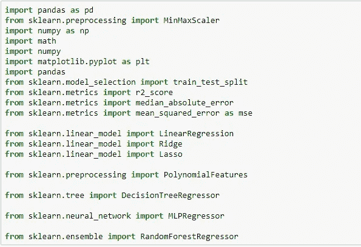

*建议:pip 安装包(万一出现错误)*

# 获取数据

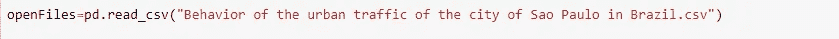

# 数据探索/分析

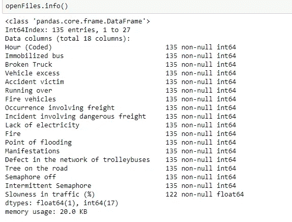

**训练集有 135 个例子和 17 个特征+目标变量(交通缓慢%)** 。1 个特征是浮点数，其余 17 个是整数。

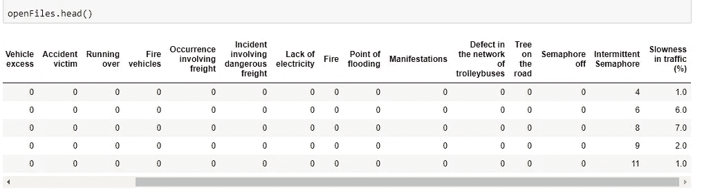

检查哪些列有 NaN 值。

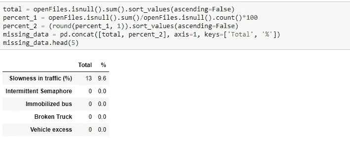

我们看到只有“交通缓慢(%)”有 NaN 值。我们必须替换这些 NaN 值。

> 讨论:数据预处理重要吗？？
> 
> 是啊！！！
> 
> 在任何数据挖掘过程中，数据预处理都是至关重要的，因为它们直接影响项目的成功率。这降低了被分析数据的复杂性，因为真实世界中的数据是不干净的。
> 
> 如果数据缺少属性、属性值、包含噪声或离群值以及重复或错误的数据，则称其为不干净的。任何这些因素的存在都会降低结果的质量
> 
> 建议:在应用模型之前，不要忘记预处理数据集。

# 数据预处理

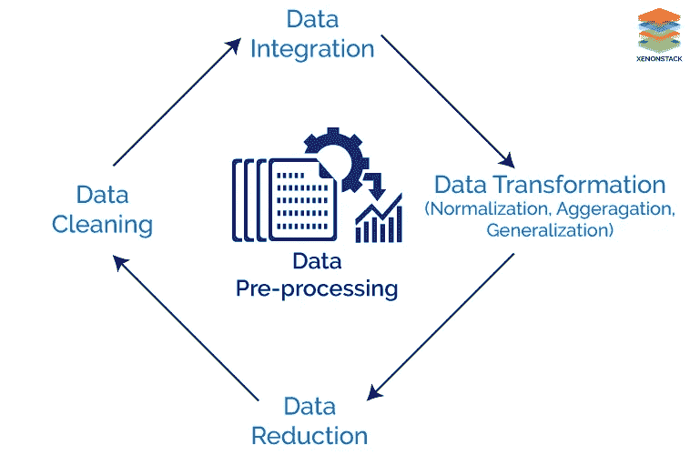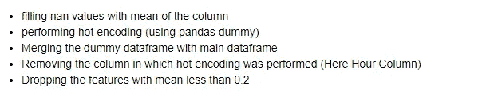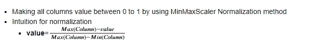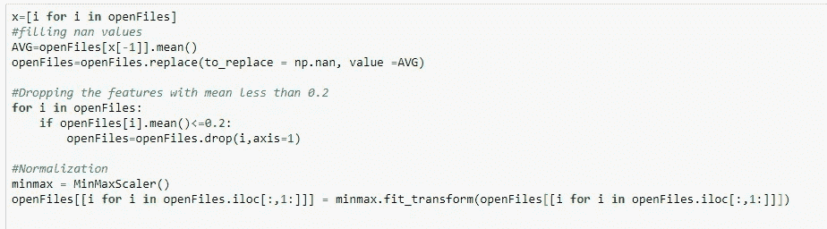

“小时”可以被离散成早晨、中午、下午、晚上、夜晚，这些可以使用一键编码来进一步编码。

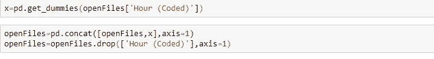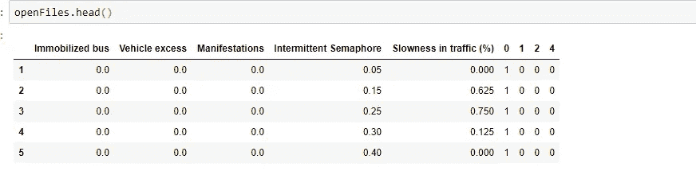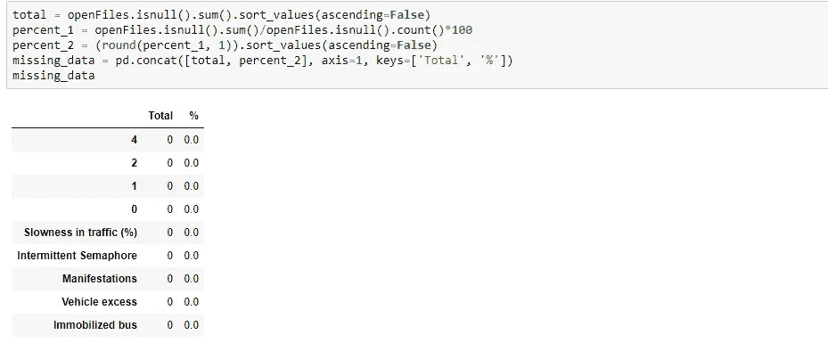

我们可以看到列的数量显著减少(从 18 列减少到 9 列)。

# 构建机器学习模型

现在我们将训练几个机器学习模型，并比较它们的结果。

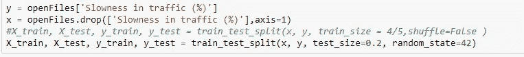

## 线性回归

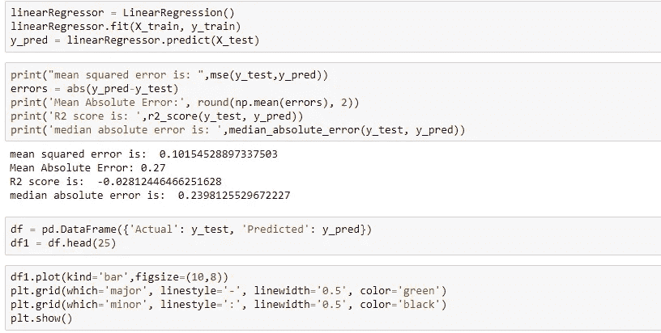

*建议:尽可能地想象。这真的有助于建立理解。*

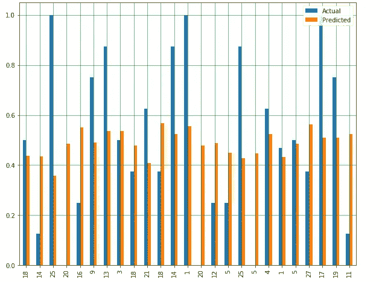

## 里奇/L2 正则化

*阿尔法=0.01*

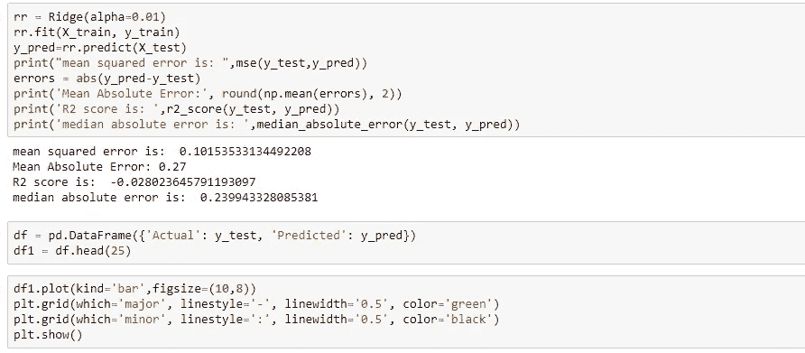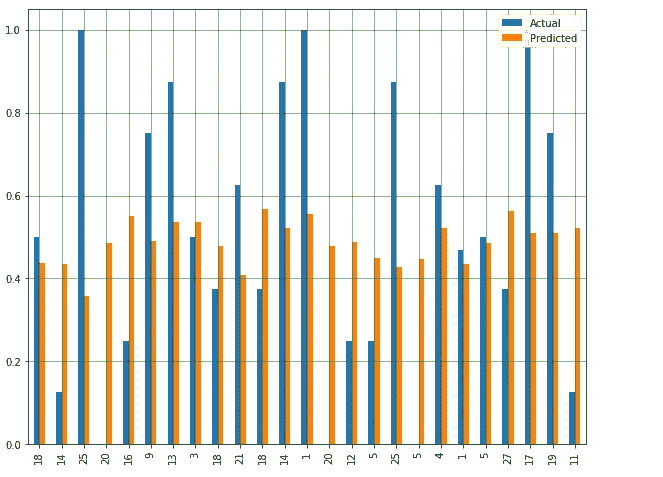

*阿尔法=100*

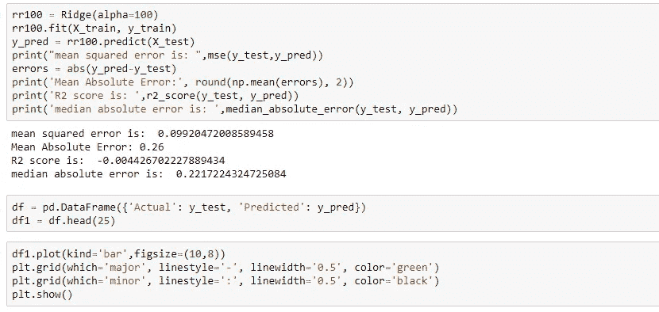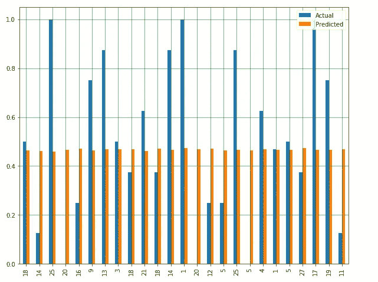

## 拉索/L1 正则化

*阿尔法=0.01*

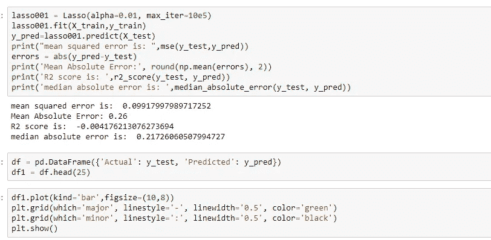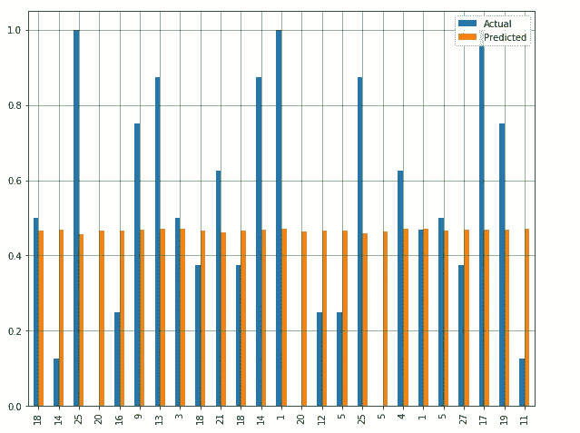

*阿尔法=0.0001*

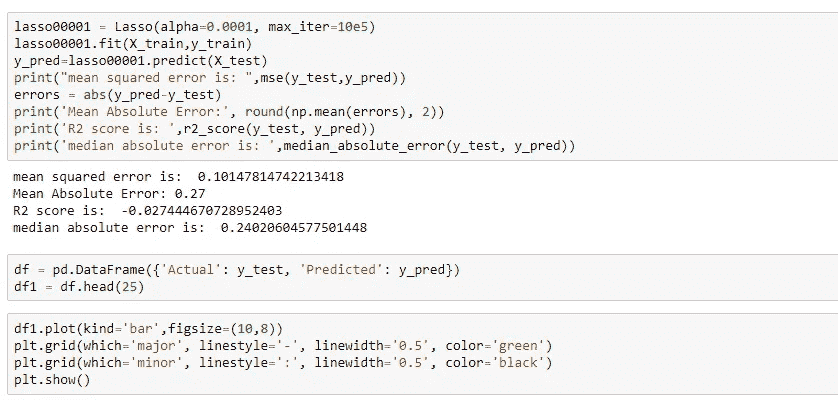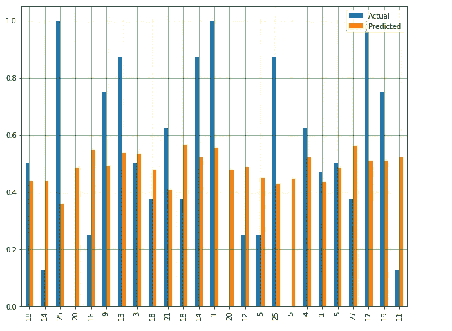

我们可以看到，L1 和 L2 正则化在一定程度上改善了某些α值的 R2 得分。

## 多项式回归

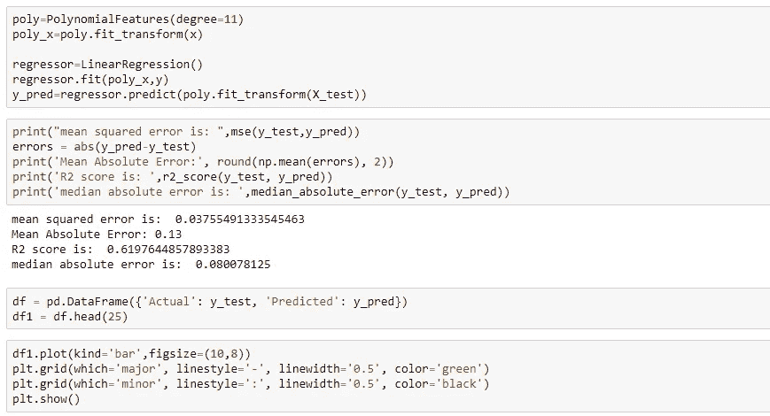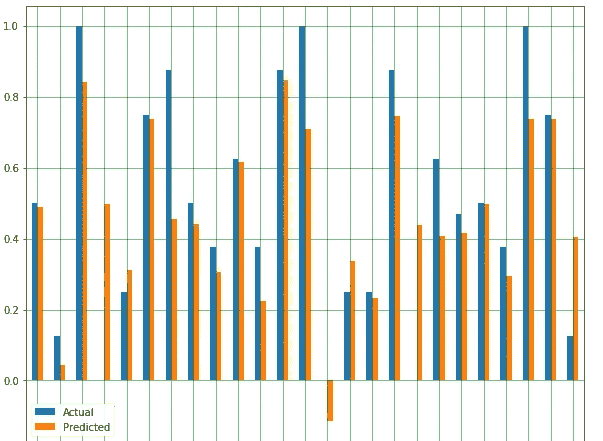

## 决策图表

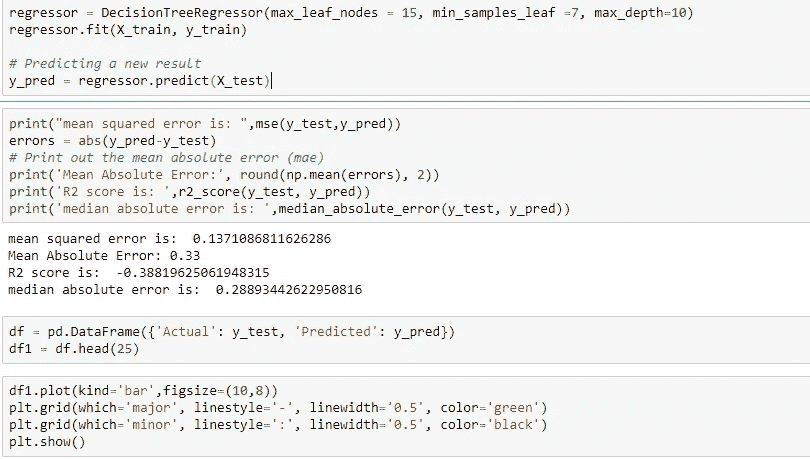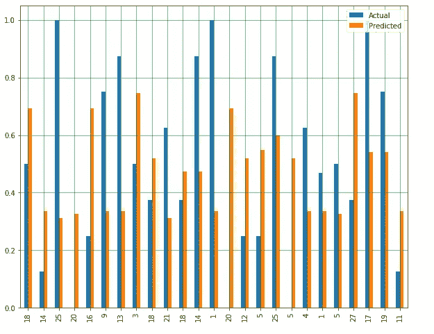

让我们改变参数，看看会发生什么。

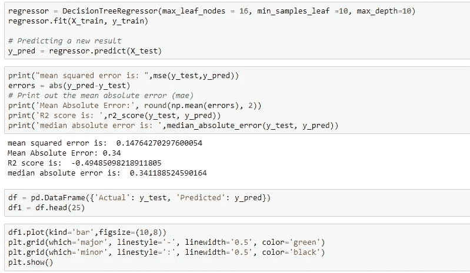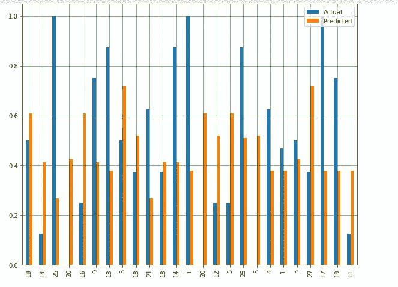

## 随机森林

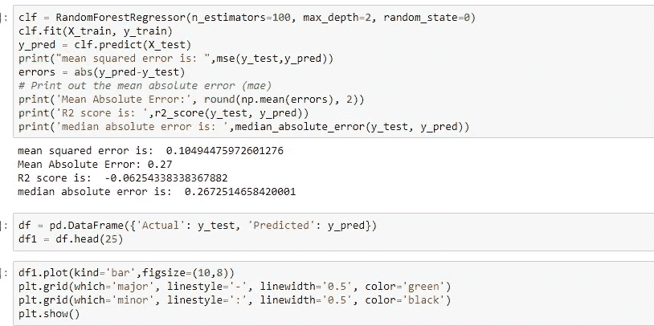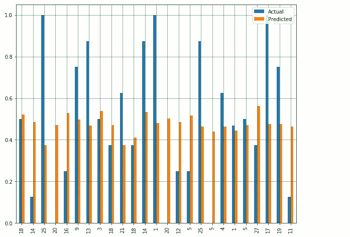

## 神经网络

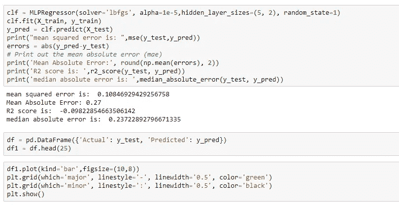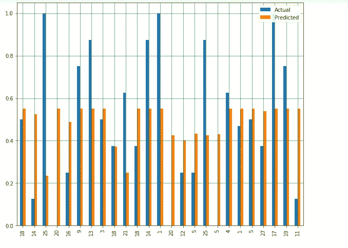

*讨论:你认为这里哪一个是最好的模型？？？*

# 哪个是最好的型号？

多项式回归模型具有最接近 1 的 R2 分数和最小均方误差。因此，它是我们的最佳模型。