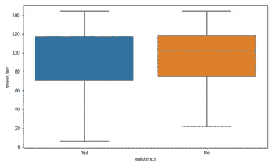
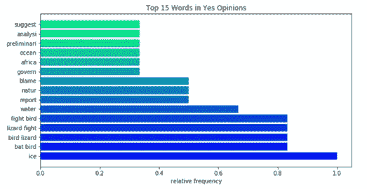
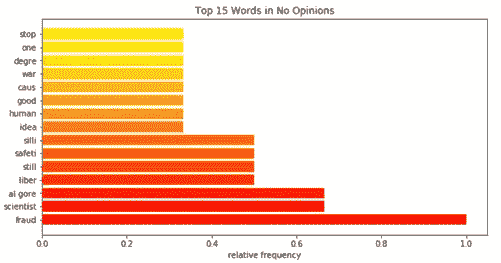

# 情感分析技术的比较研究(一)

> 原文：<https://medium.com/analytics-vidhya/comparative-study-of-sentiment-analysis-techniques-part-1-d2a6c6b49068?source=collection_archive---------13----------------------->

## 全球变暖推特数据的例子

# **1。简介**

自然语言处理是现代机器学习的一个重要领域，其目标是理解、分析和处理人类语言。在这个分析中，我将应用 NLP 技术对全球变暖的推文进行情感分析，同时尝试探索各种类型的单词嵌入方法。数据由 Kent Cavender-Bares 提供，可从 figure-eight.com 网站下载。这个数据集由 6090 个 twitter 条目组成，然后对这些条目进行评估，看它们是否相信全球变暖或气候变化的存在。如果推文暗示全球变暖正在发生，可能的答案是“是”，如果推文暗示全球变暖没有发生，可能的答案是“否”。有 1673 条推文观点缺失。

这种情感分析主要有三个阶段:1 .探索性数据分析(EDA)和数据清理。2.为机器学习准备数据。3.运用机器学习算法。编码部分可以在这里找到[。](https://github.com/wendysg/Sentiment_analysis_global_warming_tweets/blob/master/aly6040_capstone_Python_HuiwenLi.ipynb)

# **2。数据中可能存在偏差**

之所以选择这个数据集，是因为它可以在网上大量获得，并且有相对充足的数据条目。它还带有标签化的观点，这使得数据处理变得稍微容易一些。然而，数据中的一个主要偏差是在意见部分。人类的判断用于访问特定的推文是否与全球变暖/气候变化相关。由于人类的判断受到个人观点、感觉和先验知识的影响，因此标签化的观点是主观的。偏见的另一个来源来自那些存在标签缺失的推文。6090 条推文中有 1673 条没有标签，累积起来几乎占整个数据集的 31%。当我们仔细查看这些推文时，其中一些与全球变暖或气候变化有关，这表明人们认为全球变暖正在发生。这表明丢失标签的一组推文也包含重要信息。在后面的分析中使用半监督学习方法可以很好地利用它们。

# **3。EDA 和数据清理**

探索性数据分析(EDA)是分析数据集以总结其主要特征的一种重要方法。当我们查看数据以找出更多信息时，EDA 通常是第一步。在支持我们从数据中获得的有趣或有用的信息时，可视化或图表通常是必不可少的。在探索性数据分析和数据清理过程中执行了以下步骤。

## 3.1.检查数据集的维度。

数据集由 6090 个数据条目和 3 个变量组成:tweet、existence、existence.confidence。由于我们不打算使用最后一列，所以我们将删除它。

全球变暖推文快照

## 3.2.检查重复的条目并删除它们

由于提取问题或人为错误，在 twitter 数据中看到重复条目是很常见的。我们应该只保留第一个条目，并删除所有其余的条目，因为重复的条目如果大量出现，可能会导致过度拟合。删除重复项后，我们还剩 5471 个条目。

## 3.3.检查缺失值并进行插补

对于第一列“tweet ”,没有遗漏条目。然而，对于第二列“存在”，我们有 1673 条缺失意见的推文。我们将这些推文分组，标注为“失踪”。在分析的第一部分，只有带有“是”或“否”意见的推文被用来建立分类器。在这个阶段，数据集中有 3798 个观察值。

## 3.4.总结每个意见的数量和百分比

从统计和百分比总结中，我们注意到有更多(73.6%)的推文认为全球变暖存在，26.4%的推文认为全球变暖不存在。根据这些信息，这个数据集由不平衡的类组成，因此我们必须小心选择正确的性能指标来比较模型性能。在数据不平衡的情况下，精确度、召回率和 F1 值比精确度更合适。

推文的类别分布百分比

## 3.5.清理推文

由于推文通常带有@ #、标点符号和网站链接等符号，我们需要删除这些符号和链接，因为它们在稍后使用机器学习算法的情感分析中没有用处。

## 3.6.探索观点和推文长度之间的关系

每条推文的长度能告诉我们作者对全球变暖的看法吗？为了找到答案，我们将研究推文长度的细节。下图 3 显示了推文长度的分布。从分布来看，我们看到大多数推文的长度在 20 到 140 个字符之间，这被认为是一个相对较大的范围。峰值出现在 120 个字符处，约占 21%，计算方法为(800/3798) * 100 = 21%。

推文长度分布

为了探索推文长度和不同意见之间的关系，boxplot 被用来说明推文长度在不同意见类别中的分布，如下图所示。总的来说，不同观点类别的推文长度相差不大。“是”和“否”类的中等长度都是大约 100 个字符。这可以用当时 Twitter 设置的长度限制(140 个字符)来解释。

不同观点类别中推文长度的分布

## 3.7.推文中的文本挖掘

数据准备包括文本挖掘技术，如句子标记化、词干化和词条化、去除停用词。

## 3.8.两个班级的热门词汇

在这一步中，我们使用“是”和“否”意见过滤数据，以创建两组独立的数据，然后应用词云技术显示每类中出现率最高的前几个词。由于“全球、温暖、气候、变化”在这两个类别中同样频繁地出现，最好将它们过滤掉，以便更好地比较其他关键指示词。下面显示了结果。

“是”意见中的热门词汇的词汇云

认为“是”的前 15 个词的条形图

结合两个图表中的信息，我们可以更好地了解“是”数据集中出现频率最高的 15 个单词。“冰”这个词出现频率最高，原因相当明显——正如格利克在《大解冻》(The Big Thaw)中提到的，全球变暖和气候变化导致冰山融化。第二到第五个高频词都是关于动物的——蝙蝠、鸟和蜥蜴。你可能想知道为什么这些动物的名字在全球变暖相关的推文中出现的频率如此之高。经过一些研究，我意识到全球变暖和气候变化导致某些种类的蝙蝠、鸟类和蜥蜴濒临灭绝。水、自然、海洋等其他热门词汇是全球变暖带来的变化的重要指标。

“反对”意见中的热门词汇云

“否”意见中前 15 个单词条形图

同样，在“不”的意见数据中，最突出的词是“欺诈”，这反映了那些不相信全球变暖的人对气候变化的看法。

机器学习部分将在第 2 部分继续。