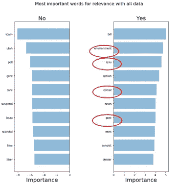

# 情感分析技术的比较研究——第二部分

> 原文：<https://medium.com/analytics-vidhya/comparative-study-of-sentiment-analysis-techniques-part-2-710060d7ba63?source=collection_archive---------19----------------------->

## 全球变暖推特数据示例

图片由 FernandoEnríquezJosé、A.Troyano、TomáSLO pez-Solaz 拍摄

这是上一篇文章[情感分析技术的比较研究—第一部分](/@wendysg22/comparative-study-of-sentiment-analysis-techniques-part-1-d2a6c6b49068)的延续。我们已经在第 1 部分详细讨论了数据集和探索性数据分析(EDA)，第 2 部分将重点讨论机器学习。

# **4。机器学习**

## **4.1 袋字**

使用的第一种算法是单词袋(BOW)方法，用于与逻辑回归一起提取文本特征。在这个模型中，我们对每个观察使用标记化的词，并找出每个标记的频率。在 3798 条有“是”或“否”意见的推文中，90%用于模型训练，剩下的 10%用于测试。使用 BOW，我们得到如下所示的预测结果。由于这是一个不平衡的数据，我们将更喜欢使用精度，召回和 F1 分数作为性能指标，而不是准确性。通过对“是”和“否”组进行加权平均，我们总体上有大约 85%的精确度、召回率和 F1 分数。

词汇袋模型性能

虽然结果看起来相当不错，但我们将更深入地研究算法拾取的重要单词，以检查 BOW 模型的可靠性。下面的图片显示了 BOW 算法为“是”和“否”组挑选的前 10 个最重要的单词。通过扫描单词，两组中的大多数重要单词都与我们所期待的相关，除了少数不相关的单词，如“否”组中的“是”、“fanat”和“是”组中的“点”、“部分”。总的来说，BOW 算法在为各自的观点挑选相关指标方面做得相当好。

## **4.2 术语频率—逆文档频率(TF-IDF)**

TF-IDF 是另一种从文本中提取特征的方法。它是一种评分方法，反映了一个单词与语料库中的一个文档的相关性或意义。如果一个文档中的一个常用词(TF)也经常出现在其他文档中，这意味着这个词只是整个语料库中的一个常用词，而与特定文档(IDF)无关或没有意义。正如许多研究表明，TF-IDF 算法能够比 BOW 提取更多的相关词，因此我们也将尝试 TF-IDF 算法并比较其性能。TF-IDF 的结果总结如下，见图 10。TF-IDF 方法的结果稍有改进。

TF-IDF 模型性能

虽然我们在性能上没有看到太大的改进，但我们仍然很想知道 TF-IDF 算法是否比 BOW 算法拾取了更多的相关词。以下是 TF-IDF 模型中最重要的 10 个词。我们注意到 BOW 模型中“No”组中的不相关单词“yeah”、“fanat”已被两个新单词“liber”、“sweden”替换。对于“是”组，“建议”、“部分”、“水”已被“混乱”、“反驳”、“国家”取代。这些新词似乎与我们的预测更相关。这可能解释了结果中 0.01%的改进。

## **4.3 与 TF-IDF 的二元模型**

TF-IDF 二元模型还被用于探索推文中是否存在任何重要的二元模型词汇，这有助于提取重要的词进行预测。结果如下所示。我们没有看到性能上的改进，TD-IDF 二元模型算法只选取了几个重要的二元模型词汇，例如“stop global”、“chang climat”。

TF-IDF 二元模型性能

## **4.4 半监督学习**

一开始，我们遗漏了一组没有标签的推文，并将它们归类为“缺失”。我们也想好好利用它们。这里，我们应用用“是”和“否”组训练的 TF-IDF 模型来预测“缺失”组的标签。之后，这两组数据结合起来，建立一个新的模型，并作出预测。实验结果表明，该方法在准确率、召回率和 F1 值上均有约 0.4%的提高。

不同模型性能的比较

当我们从模型中提取最重要的词时，我们注意到更多相关的词，如“环境”、“issu”、“climat”、“post”被模型用于预测，这解释了测试数据中预测结果的改善。

## **4.5 Word2Vec**

在分析的最后一部分，我们希望探索更高级的情感分析深度学习算法。Word2Vec 是一个很好的选择，因为它是一种通过 n 维向量表示有效地创建单词嵌入的方法。Word2Vec 的用途是在 vectorspace 中将相似单词的向量分组。给定足够的数据，Word2Vec 可以根据上下文和周围出现的其他单词，对特定单词的含义做出相当准确的猜测。结果如下所示。然而，它的表现不如其他模型，可能是由于相对较小的数据集。

# **5。结论和未来工作**

下面的直方图显示了我们执行的所有模型的性能比较。其中半监督学习模型的性能最好。然而，有一些关于如何提高模型的可靠性和准确性的建议。由于当未标记数据的大小比标记数据的大得多时，半监督学习通常会产生良好的结果，因此我们可以向模型中添加更多的未标记推文，以验证这是否也会产生良好的结果。为了提高 Word2Vec 的性能，我们可以应用 XGBoost 来看看是否有助于显示结果。

精确度、召回率、F1、准确度的模型比较

参考资料:

阿梅森，e .(2018 年 1 月 24 日)。如何解决 90%的 NLP 问题:循序渐进指南？中等。检索自[https://blog . insightdatascience . com/how-to-solve-90-of-NLP-problems-a-step-by-step-guide-FDA 605278 E4 e](https://blog.insightdatascience.com/how-to-solve-90-of-nlp-problems-a-step-by-step-guide-fda605278e4e)

格里克博士(未注明)。大解冻。国家地理。检索自[https://www . national geographic . com/environment/global-warming/big-thaw/](https://www.nationalgeographic.com/environment/global-warming/big-thaw/)