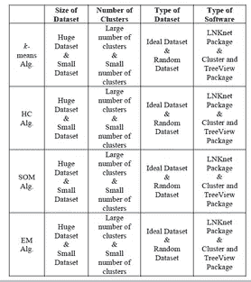
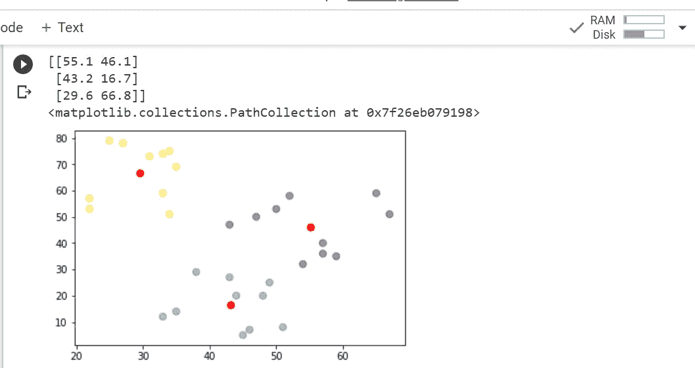
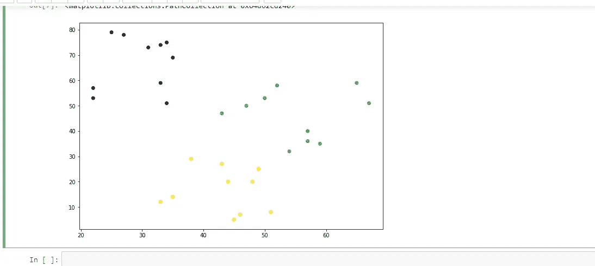
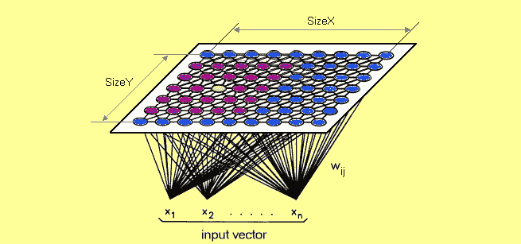
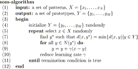
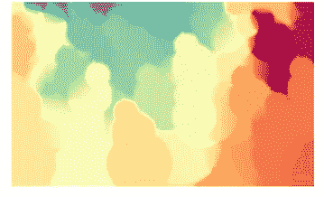
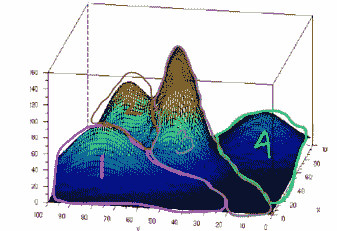

# 聚类算法的比较研究

> 原文：<https://medium.com/analytics-vidhya/comparative-study-of-the-clustering-algorithms-54d1ed9ea732?source=collection_archive---------2----------------------->


聚类基本上被定义为将数据分成相似对象的组。被称为簇的每个组由彼此相似的对象和与其他组相比不相似的对象组成。让我们比较不同类型的集群。讨论的算法有: ***k-means 算法、层次聚类算法、自组织映射算法和期望最大化聚类算法。***

# **对比指标:**

现在，我将决定讨论聚类算法之间比较的因素:

1.  数据集的大小
2.  聚类数
3.  数据集类型和使用的软件类型
4.  算法的性能
5.  算法的准确性
6.  算法的质量

# **算法是如何实现的**？

LNKnet 软件:麻省理工学院林肯实验室提供的公共领域软件。

**聚类和树形视图软件:**聚类和树形视图软件是为分析从不同数据集发现的数据提供计算和图形环境的程序。

选择该软件的原因是它们是实现几种数据聚类算法的最流行的软件。



比较

**现在**我将开始单独详细讨论聚类算法，并展示如何实现的代码。

# **1—K-表示:**


k 均值的工作原理

K-means 是一种众所周知的划分方法。对象被分类为 k 个组中的一个，k 被选作先验。通过计算每个组的质心并将每个对象分配给质心最近的组来确定簇成员。这种方法通过重复重新分配集群成员来最小化集群内的总体分散。

在一般意义上，k 划分算法将一组对象 S 和一个整数 k 作为输入，并将 S 划分成子集 S1、S2、S3…Sk。它使用平方和作为优化准则，设 xri 是 Si 的第 r 个元素，|Si|是 Si 中元素的数量，d(xri，xsi)是 xri 和 xsi 之间的距离。

## **算法:**

第一步:选择 K 作为聚类数。

步骤 2:初始化 K 个簇的码本向量(例如，随机地)

步骤 3:对于每个新的样本向量:计算新向量和每个簇的码本向量之间的距离。使用在**时间内减少的学习率，用新矢量重新计算最近的码本矢量。**

## **时间复杂度和空间复杂度**复杂度 **:**

其时间复杂度为 O(nkl)，其中 n 为模式数，k 为聚类数，l 为算法收敛所需的迭代次数。其空间复杂度为 O(k+n)。它需要额外的空间来存储数据矩阵。它是顺序独立的；对于给定的聚类中心初始种子集，它生成相同的数据分区，而不管模式呈现给算法的顺序。

## **如何实现 K-means？**

我们有 sklearn 来实现 k-means。

**K-Means 的代码样本:**

```
from pandas import DataFrame
import matplotlib.pyplot as plt
from sklearn.cluster import KMeans
#making a toy dataset
Data = {'x': [25,34,22,27,33,33,31,22,35,34,67,54,57,43,50,57,59,52,65,47,49,48,35,33,44,45,38,43,51,46],
        'y': [79,51,53,78,59,74,73,57,69,75,51,32,40,47,53,36,35,58,59,50,25,20,14,12,20,5,29,27,8,7]
       }
#converting into dataframe
df = DataFrame(Data,columns=['x','y'])

kmeans = KMeans(n_clusters=3).fit(df)#applying kmeans on the dataset                      #with number of clusters=3
centroids = kmeans.cluster_centers_
print(centroids)

plt.scatter(df['x'], df['y'], c= kmeans.labels_.astype(float), s=50, alpha=0.5)
plt.scatter(centroids[:, 0], centroids[:, 1], c='red', s=50)
```

在上面的代码片段中，我使用 kmeans 算法来解释如何在代码中使用 kmeans。kmeans 的应用非常简单。sklearn 货源充足。在这里，我做了一个玩具数据集，并在上面应用了 kmeans。

**输出:**



# 2 —分层聚类算法:


分层聚类的工作原理

分区算法基于指定组的初始数量，并迭代地在组之间重新分配对象以收敛。相比之下，分层算法组合或划分现有的组，创建反映组被合并或划分的顺序的分层结构。在凝聚方法中，通过合并建立层次结构，对象最初属于一个单例集合列表 S1，…，S2，Sn。然后，使用成本函数从列表中找到要合并的“最便宜”的集合对{Si，Sj}。一旦合并，Si 和 Sj 将从集合列表中删除，并替换为 Si U Sj。这个过程重复进行，直到所有对象都在一个组中。凝聚层次聚类算法的不同变体可以使用不同的成本函数。完全连锁、平均连锁和单一连锁方法分别使用两个聚类成员之间的最大、平均和最小距离。

## **算法:**

步骤 1-计算包含每对模式之间距离的邻近矩阵。将每个模式视为一个集群。

步骤 2-使用邻近度矩阵找到最相似的聚类对。将这两个集群合并为一个集群。

步骤 3-如果所有模式都在一个集群中，停止。否则，转到步骤 2

**优点:**

关于粒度级别的嵌入式灵活性。

易于处理任何形式的相似性或距离。

因此适用于任何属性类型。

分层聚类算法更加通用。

## **时间复杂度和空间复杂度**复杂度 **:**

时间复杂度= O(n)其中 n 是数据点的数量。

空间复杂度= O(n)其中 n 是数据点的数量。

## **如何实现层次聚类算法？**

```
from sklearn.cluster import AgglomerativeClustering
cluster = AgglomerativeClustering(n_clusters=3, affinity=’euclidean’, linkage=’ward’) 
cluster.fit_predict(df)
plt.figure(figsize=(10, 7)) 
plt.scatter(df[‘x’], df[‘y’], c=cluster.labels_)
```

我在同一个玩具数据集上应用了层次聚类算法。有三个集群。

**输出:**



# 3 —自组织映射算法



受大脑中神经网络的启发，自组织映射(SOM)使用竞争和合作机制来实现无监督学习。在经典的 SOM 中，一组节点以几何图案排列，通常是二维点阵。每个节点都与一个与输入空间维数相同的权重向量相关联。SOM 的目的是找到从高维输入空间到节点的 2-D 表示的良好映射。使用 SOM 进行聚类的一种方式是将由相同节点表示的输入空间中的对象视为分组到一个聚类中。

**算法:**

下面简单讨论一下算法。



**优势:**

*   som 简化了聚类，并允许用户直观地识别同质数据组。在 Viscovery 中，有几种聚类算法(SOM Single Linkage、Ward 和 SOM-Ward)可用于自动构建聚类。这很容易理解，而且效果很好。

**时间复杂度:**

T=O(NC)=O(S^2)

**如何实现 SOM**

我在同一个玩具数据集上使用 SOM。

```
import numpy as np
import matplotlib.pyplot as plt
from mpl_toolkits.mplot3d import Axes3D
import somoclu
data = np.float32(df)
n_rows, n_columns = 100, 160
som = somoclu.Somoclu(n_columns, n_rows, data=data)
som.train()
som.view_component_planes()
```

**输出:**



# 4 —期望值最大化聚类算法



让我们开始讨论这个算法。期望最大化(EM)是统计界公认的聚类算法。EM 是一种基于距离的算法，它假设数据集可以建模为多元正态分布的线性组合，并且该算法可以找到最大化模型质量度量(称为对数似然)的分布参数。

**算法:**

下面开始讨论一下算法步骤。

步骤 1:给定一组不完整的数据，考虑一组起始参数。

步骤 2:期望步骤(E-step):使用数据集的观察到的可用数据，估计(猜测)缺失数据的值。

步骤 3:最大化步骤(M-步骤):使用期望(E)步骤之后生成的完整数据，以便更新参数。

第四步:重复第二步和第三步，直到收敛。

**优点:**

*   它收敛缓慢。
*   它只收敛到局部最优。
*   它需要向前和向后的概率(数值优化只需要向前的概率)。

**时间复杂度:**

O(m.n)，其中 m 是迭代次数，n 是参数个数。

**如何实现 EM 算法？**

因为期望最大化算法是高斯混合模型。

```
import numpy as np
import matplotlib.pyplot as plt
from sklearn.mixture import GaussianMixture
gmm = GaussianMixture(n_components=3)
gmm.fit(data)
plt.scatter(df['x'], df['y'])
```

**我想就此结束对算法的比较研究。希望我已经对算法进行了清晰的对比研究。非常感谢你的阅读！**

# **参考文献:**

[](https://en.wikipedia.org/wiki/Mixture_model) [## 混合模型

### 在统计学中，混合模型是一种概率模型，用于表示一个样本中存在的子群体

en.wikipedia.org](https://en.wikipedia.org/wiki/Mixture_model) [](https://en.wikipedia.org/wiki/Hierarchical_database_model) [## 分层数据库模型

### 分层数据库模型是一种数据模型，其中数据被组织成树状结构。数据是…

en.wikipedia.org](https://en.wikipedia.org/wiki/Hierarchical_database_model) [](https://en.wikipedia.org/wiki/Hierarchical_clustering) [## 分层聚类

### 在数据挖掘和统计中，层次聚类(也称为层次聚类分析或 HCA)是一种方法…

en.wikipedia.org](https://en.wikipedia.org/wiki/Hierarchical_clustering)