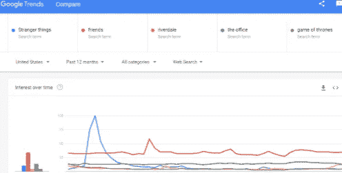
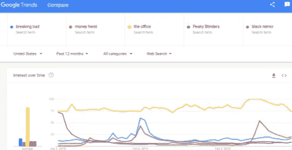
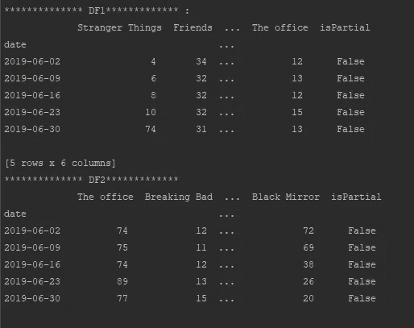
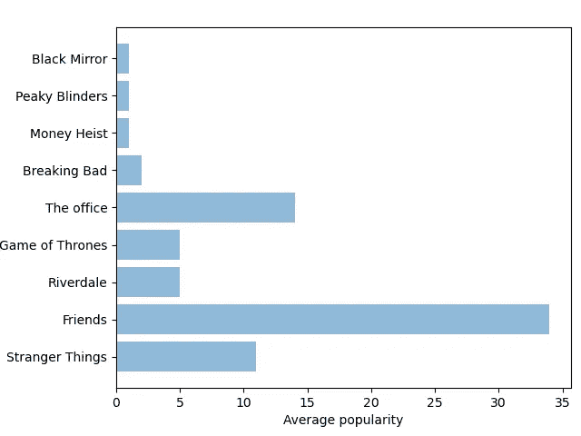
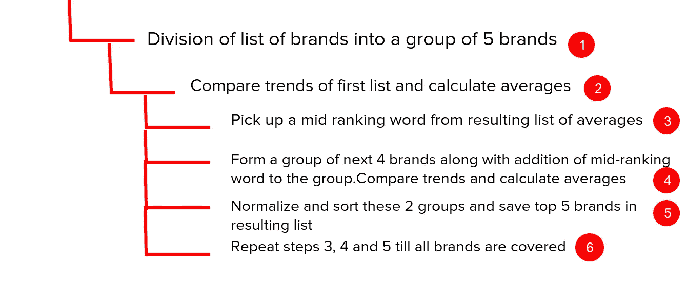

# 使用 pytrends 比较谷歌趋势搜索中的 5 个以上关键词

> 原文：<https://medium.com/analytics-vidhya/compare-more-than-5-keywords-in-google-trends-search-using-pytrends-3462d6b5ad62?source=collection_archive---------5----------------------->

你想在 pytrends 中比较 5 个以上的关键词，但是谷歌趋势搜索的限制禁止你这样做吗？嗯，你来对地方了。我从这篇文章中获得了灵感，并尝试使用 pytrends 和 matplotlib 实现相同的操作以实现自动化。首先，通读本文以获得正确的基础知识，然后我们将使用 pytrends 和 matplotlib->[linkto article](https://digitaljobstobedone.com/2017/07/10/how-do-you-compare-large-numbers-of-items-in-google-trends/)跳转到 python 实现

考虑一个场景，我想比较以下电视连续剧的趋势:

```
Stranger Things,Friends, Riverdale,Game of Thrones, The office, Breaking Bad ,Money Heist,Peaky Blinders and Black Mirror
```

因为谷歌趋势搜索最多允许比较 5 个关键词。让我们把这个列表分成两半，这样两半都包含一个共同的电视连续剧(一个共同的关键字)。这个常见的关键字是我们玩把戏的王牌，把所有的关键字放在一起比较。下图显示了我如何将列表分成两半，其中“The office”是一个常见的电视剧(关键字)。(任何电视剧都可以随机拿起作为普通电视剧，我拿起了《办公室》)


将电视连续剧列表分成两个单独的列表，其中有一个共同的电视连续剧“办公室”



列表 1 的趋势图



列表 2 的趋势图

这两个结果怎么结合？正如我前面提到的，两个列表中的公共关键字将帮助我们组合结果。我们需要首先处理数据，因为两个列表的趋势图的缩放比例不同。

让我们从实现开始，并利用 pytrends 来达到预期的结果。

```
#Import TrendReq to connect to Google
from pytrends.request import TrendReq
```

从上面提到的电视连续剧列表中创建两个单独的列表。我更喜欢将公共关键字保存在索引 0 处，以便在数据操作时容易检索。

```
list1=['The office','Stranger Things','Friends', 'Riverdale','Game of Thrones']
list2=['The office', 'Breaking Bad' ,'Money Heist','Peaky Blinders ,'Black Mirror']
```

让我们使用 TrendReq 方法连接到 Google

```
pytrends1=TrendReq()
pytrends2=TrendReq()
```

现在，我们需要为列表和传递参数构建有效负载，以便根据我们的需求过滤数据进行趋势比较。在这里，我认为美国是目标地理位置，时间范围是 1 年，因此是 12-m(是的，m 是几个月)

```
pytrends1.build_payload(list1,geo='US',timeframe="today 12-m")
pytrends2.build_payload(list2,geo='US',timeframe="today 12-m")
```

interest_over_time 方法返回熊猫。Dataframe 对象，包含列表中每个电视连续剧在给定时间范围内(在本例中为 1 年)的趋势值

```
df1=pytrends1.interest_over_time()
df2=pytrends2.interest_over_time()
```



两个数据框中的前 5 行:df1 和 df2

正如您所注意到的，这些值在 0 到 100 的范围内。这些值表示相对搜索量或谷歌趋势指数，其中 100 表示在一段时间内基于受欢迎程度的最高搜索量，50 表示特定关键字在一段时间内受欢迎程度的一半。

你一定注意到了我们常见的电视剧(办公室)那一栏的数值。**如果您还没有注意到，那么请密切注意数据框 df1 和 df2 中的“办公室”一栏。这两个值不一样。**奇怪吧？这是因为两个列表的缩放比例不同。现在我们需要在第二个列表的基础上规范化第一个列表。让我们使用列表 1 作为参考来规范化列表 2。

我们需要计算两个数据框中每一列的平均值。让我们先做那件事。

```
averageList1=[]
averageList2=[]
for item in list1:
    averageList1.append(df1[item].mean().round(0))for item in list2:
    averageList2.append(df2[item].mean().round(0))
```


列表 1 和列表 2 的平均值列表

现在我们有了两个列表的每一列的平均值，让我们计算归一化因子以均衡列表 2。

> 归一化因子=(列表 1 中常用电视剧的平均值)/列表 2 中常用电视剧的平均值)

由于“The office”(两个列表中常见的电视连续剧)存储在 list1 和 list2 中的索引 0 处，因此我需要从两个列表中检索索引 0 处的值。

averageList1[0]表示列表 1 中“办公室”的平均值，averageList2[0]表示列表 2 中“办公室”的平均值。

```
normalizationFactor=averageList1[0]/averageList2[0]
```

为了均衡列表 2 中的平均值，需要将归一化因子与列表 2 中的每个条目相乘

```
for i in range(len(averageList2)):
    normalisedVal=normalizationFactor*averageList2[i]
    averageList2[i]=normalisedVal.round(0)
```


list1 和 list2 的平均值列表(归一化后)

可以观察到，两个列表中“办公室”的平均值现在相同。这仅仅意味着列表 2 中的平均值已经被缩放到与列表 1 相同的比例。现在，我们可以使用这些数据绘制图表，并在相同的绘图区域比较电视剧。

现在，我将从列表 2 中删除“办公室”(常见的电视连续剧)，因为我不希望它在图表中被绘制两次。从 averageList2 中删除“The office”的平均值是有意义的，因为我们要从 List2 的系列列表中删除“The office”。

```
averageList2.pop(0)
list2.pop(0)
```

既然共同的电视连续剧“办公室”的重复条目已经从列表 2 中移除，那么这两个列表可以被合并以用于进一步的比较。

合并电视剧列表，即列表 1 和列表 2

```
TVSeriesList=list1+list2
```

组合 list1 和 list2 的平均值列表，即组合 averageList1 和 averageList2

```
finalAverageList=averageList1+averageList2
```


TVSeriesList 和 FinalAverageList 的代码片段

下面是为所有列出的电视剧绘制趋势图的有趣部分。

```
import numpy as np
import matplotlib.pyplot as plt
y_pos=np.arange(len(TVSeriesList))
plt.barh(y_pos,finalAverageList,align='center',alpha=0.5)
plt.yticks(y_pos,TVSeriesList)
plt.xlabel('Average popularity')
plt.show()
```



所有列出的电视连续剧的趋势比较

我希望这篇文章有助于理解使用 pytrends 比较大量的关键字。请随意提出你的方法和建议。*让我们互相帮助，更好地理解简单而重要的概念。*

更新—

您可以使用这种方法比较两个以上的列表。我将很快在这里实现和更新它，但现在，这里是思维过程。:)



使用这种方法比较多个关键字