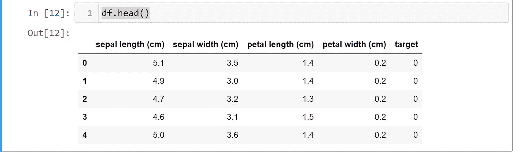
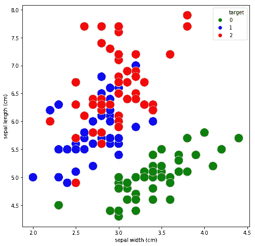
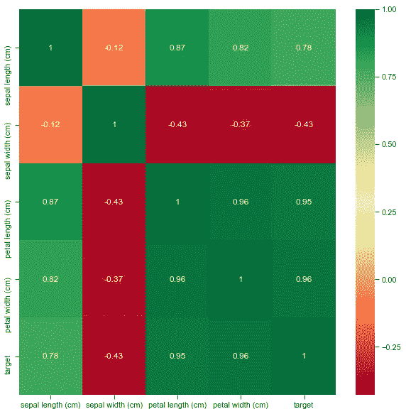
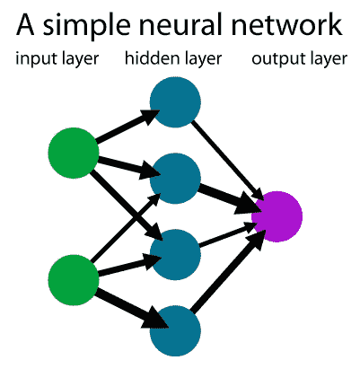

# 比较 Tensorflow 深度学习模型与经典机器学习模型-KNN、朴素贝叶斯、逻辑回归、SVM-虹膜分类

> 原文：<https://medium.com/analytics-vidhya/compare-tensorflow-deep-learning-model-with-classical-machine-learning-models-knn-naive-bayes-61b40bb3382?source=collection_archive---------13----------------------->

在本练习中，我们将为鸢尾花预测构建经典的机器学习模型，您将学习如何为 KNN、朴素贝叶斯、逻辑回归和 SVM 构建模型。然后将结果与使用 Tensorflow/Keras 框架构建的深度学习模型进行比较

虹膜数据集总共有 150 个样本。有 3 种不同类型的花，鸢尾、海滨鸢尾和杂色鸢尾，每种 50 朵。每个花样品由花的 4 种不同属性/特征组成，即萼片和花瓣的长度和宽度，以厘米为单位。


# **导入库**

*导入 os
导入熊猫为 pd
导入 numpy 为 np
导入 matplotlib.pyplot 为 plt
导入 seaborn 为 sns
从 sklearn.model_selection 导入 train_test_split*

*从 sklearn 导入数据集、svm、指标
从 sklearn.naive_bayes 导入高斯 B
从 sklearn.metrics 导入混淆 _marix，accuracy_score
从 sklearn.linear_model 导入逻辑回归*

# **加载数据**

*iris = datasets . load _ iris()*

**检查数据(iris.data，iris . target iris . feature _ names)**

虹膜.数据.形状

```
(150, 4)
```

虹膜.目标.形状

```
(150,)
```

iris.feature _ names

```
['sepal length (cm)',
 'sepal width (cm)',
 'petal length (cm)',
 'petal width (cm)']
```

虹膜目标

```
array([0, 0, 0, 0, 0, 0, 0, 0, 0, 0, 0, 0, 0, 0, 0, 0, 0, 0, 0, 0, 0, 0,
       0, 0, 0, 0, 0, 0, 0, 0, 0, 0, 0, 0, 0, 0, 0, 0, 0, 0, 0, 0, 0, 0,
       0, 0, 0, 0, 0, 0, 1, 1, 1, 1, 1, 1, 1, 1, 1, 1, 1, 1, 1, 1, 1, 1,
       1, 1, 1, 1, 1, 1, 1, 1, 1, 1, 1, 1, 1, 1, 1, 1, 1, 1, 1, 1, 1, 1,
       1, 1, 1, 1, 1, 1, 1, 1, 1, 1, 1, 1, 2, 2, 2, 2, 2, 2, 2, 2, 2, 2,
       2, 2, 2, 2, 2, 2, 2, 2, 2, 2, 2, 2, 2, 2, 2, 2, 2, 2, 2, 2, 2, 2,
       2, 2, 2, 2, 2, 2, 2, 2, 2, 2, 2, 2, 2, 2, 2, 2, 2, 2])
```

**创建一个熊猫数据框架**来保存 iris.data 和 iris.target 以及特性 iris.feature_names

*df = pd。DataFrame(iris.data，columns = iris . feature _ names)
df[' target ']= PD。系列(iris.target)*

**检查数据框**

df.head()



df['目标']。每种类型有 50 朵花

```
2    50
1    50
0    50
Name: target, dtype: int64
```

**根据萼片宽度绘制萼片长度图**



# **检查特征相关性**

特性关联是通过调用 pandas 函数 df.corr()来完成的，这将告诉我们哪些特性与目标变量最相关，这里我们注意到所有 4 个特性都与目标有很好的关联。因此，我们需要使用 ML 模型中的所有 4 个特征来预测虹膜花型

*导入 seaborn 作为 snssns.set(style="ticks "，color _ codes = True)
PLT . fig(figsize =(10，10))
#plot 热图
corr _ matrix = df . corr()
g = SNS . heat map(corr _ matrix，annot=True，cmap="RdYlGn")*



# **提取 X 和 Y**

*X=df.iloc[:，0:4]
y = df['target']*

# 分割测试和训练数据

分裂训练和测试，这里分裂的比例是 80:20，这在大多数 ML 问题中是非常典型的。还要注意，我们已经设置了“分层=y ”,这将确保测试和训练数据中目标标签的比率保持不变。在这种情况下，我们的比例为 1:1:1，目标标签的这一比例在拆分过程中保持不变。

*X_train，X_test，y_train，y_test = train_test_split(X，y，test_size =0.2，shuffle=True，random_state=35，strategy = y)*

# 定义模型，训练和测试模型

这包括三个步骤

1.  通过实例化 SKLEARN 函数来定义模型

2.Model . fit()-训练模型

3.model.predict() —对测试数据的预测

# 1.SKLearn 的 k-最近邻分类器(KNN)

*从 sklearn.neighbors 导入 KNeighborsClassifier
KNN = KNeighborsClassifier(n _ neighbors = 5)
KNN . fit(X _ train，y _ train)
y _ pred = KNN . predict(X _ test)
KNN . score(X _ test，y_test)*

```
0.9333333333333333
```

*混淆 _ 矩阵(y _ 测试，y _ 预测)*

```
array([[10,  0,  0],
       [ 0,  9,  1],
       [ 0,  1,  9]], dtype=int64)
```

# **2。SKLearn 的 GuassianNB 分类器**

*classifier = GaussianNB()
classifier . fit(X _ train，y _ train)
y _ pred = classifier . predict(X _ test)
score = Accuracy _ score(y _ test，y_pred)
print("Accuracy "，score)*

```
Accuracy 0.8666666666666667
```

*混淆 _ 矩阵(y _ 测试，y _ 预测)*

```
array([[10,  0,  0],
       [ 0,  8,  2],
       [ 0,  2,  8]], dtype=int64)
```

# 3.SKLearn 的逻辑回归分类器

*logistic _ regression = logistic regression(C = 25.0，solver='lbfgs '，multi_class='auto '，max _ ITER = 1000)
logistic _ regression . fit(X _ train，y _ train)
y _ pred = logistic _ regression . predict(X _ test)
score = accuracy _ score(y _ test，y_pred)
score*

```
0.9333333333333333
```

*混淆 _ 矩阵(y _ 测试，y _ 预测)*

```
array([[10,  0,  0],
       [ 0,  9,  1],
       [ 0,  1,  9]], dtype=int64)
```

# **4。SVM 分类器**

*分类器= svm。SVC(gamma = 0.001)
classifier . fit(X _ train，y _ train)
y _ pred = classifier . predict(X _ test)
score = accuracy _ score(y _ test，y_pred)
score*

```
0.8
```

*混淆 _ 矩阵(y _ 测试，y _ 预测)*

```
array([[10,  0,  0],
       [ 0,  9,  1],
       [ 0,  5,  5]], dtype=int64)
```

# **5。利用 Tensorflow/Keras 进行深度学习**



一个简单的神经网络

*从 tensorflow 导入 keras* 导入 tensorflow 作为 tf

**定义张量流/Keras 模型**

定义输入形状= 4 的深度神经网络模型，因为我们有 4 个输入特征，3 层，分别具有 5、3、3 个神经元单元。产量必须是 3 个单位，我们有 3 个类来预测。

输入(4 个输入)→ X1，X2，X3，X4 → 5 个神经元→ 3 个神经元→ 3 个输出神经元

注意，可以在第一层(目前 5 个神经元)和第二层(目前 3 个神经元)中用不同数量的神经元进行实验

*型号= keras。顺序([
keras.layers.Dense(5，activation=tf.nn.relu，input_shape=[4])、
keras.layers.Dense(3，activation=tf.nn.relu)、
keras.layers.Dense(3，activation = TF . nn . soft max)
)*

**定义优化器、损失函数和指标**

*optimizer = TF . keras . optimizer . Adam()
model . compile(optimizer = ' Adam '，
loss = TF . keras . loss . sparsecategoricalcrossentropy(from _ logits = True)，
metrics=['accuracy'])*

**最后用 model.fit 函数训练模型**

*model.fit(X_train，y_train，epochs=2000)*

模型在第一个历元以低精度开始

```
Epoch 1/2000
4/4 [==============================] - 0s 2ms/step - loss: 1.1194 - accuracy: 0.3333
```

以接近 2000 个历元的高精度收敛

```
Epoch 2000/2000
4/4 [==============================] - 0s 2ms/step - loss: 0.6042 - accuracy: 0.9750
```

**根据测试数据预测**

*y _ pred = model . predict(X _ test)*

这将为每个输入生成一个包含 3 个数字的数组，但是正如所预测的，我们只需要一个目标标签

```
array([[1.4601685e-03, 3.7447622e-03, 9.9479502e-01],
       [9.9999571e-01, 4.8816267e-09, 4.2581619e-06],
       [1.4601685e-03, 3.7447622e-03, 9.9479502e-01],
       [3.4476686e-03, 9.1026098e-02, 9.0552616e-01],
       [1.4601685e-03, 3.7447622e-03, 9.9479502e-01],
       [2.5093075e-06, 9.9999738e-01, 1.2542409e-07],
       [1.4601685e-03, 3.7447622e-03, 9.9479502e-01],
       [8.4952539e-04, 9.5092177e-01, 4.8228655e-02],
```

预测标签是这三个数字的最大值的索引，所以这是由 np.argmax()得到的

*y_pred_new = np.argmax(y_pred，axis=1)*

*得分=准确度 _ 得分(y _ 测试，y _ 预测 _ 新)
得分*

```
0.9666666666666667
```

*混淆 _ 矩阵(y _ 测试，y _ 预测)*

```
array([[10,  0,  0],
       [ 0,  9,  1],
       [ 0,  0, 10]], dtype=int64)
```

# 结论

注意这里不同模型的精度，我们得到的 **SVM、高斯朴素贝叶斯、逻辑回归、KNN 和深度学习模型**的精度分别为 0.8 →0.86 → 0.93 →0.93 →0.967

深度学习技术可以学习和预测任何目标函数。我们可以微调深度学习模型，使其性能优于经典的机器学习模型，但深度学习的缺点是网络的复杂性和对大数据集的需求。深度学习模型更容易过度拟合，但有一些技术可以用来对抗过度拟合。