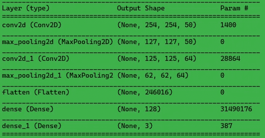
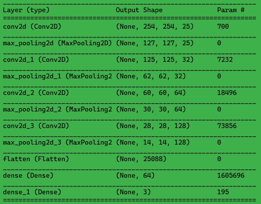
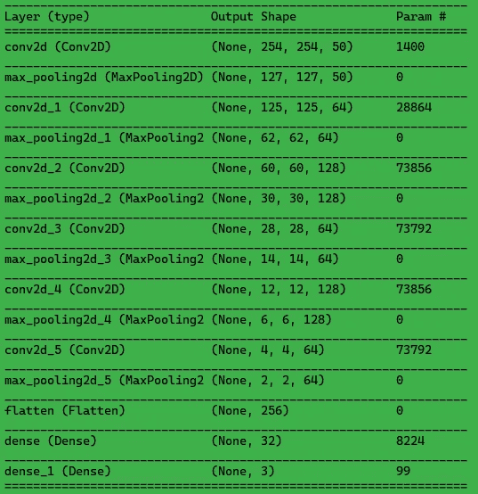
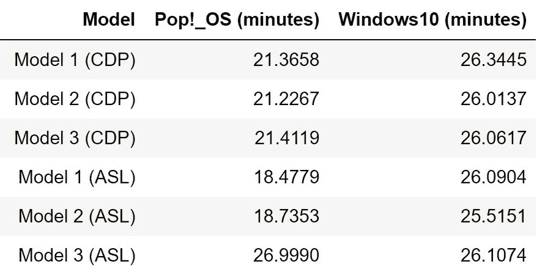

# 比较 Linux 和 Windows 之间深度学习的 GPU 性能。

> 原文：<https://medium.com/analytics-vidhya/comparing-gpu-performance-for-deep-learning-between-pop-os-ubuntu-and-windows-69aa3973cc1f?source=collection_archive---------2----------------------->

## 有关系吗？

对峙

# 介绍

作为一个深度学习爱好者，我总是发现自己被同一个问题所困扰。 ***深度学习应该选择哪个 OS？*** 随之而来的问题是:我应该选择 Windows，还是 Linux？如果是 Linux，那么是什么发行版？

有些人认为，在 2020 年的今天，你选择 Windows 还是 Linux 并不重要；如果你决定使用 Linux，你选择哪个 Linux 发行版并不重要。如果您在搜索我应该为 ML/DL 选择什么操作系统，下面是您得到的一些答案:

*   *没关系。*
*   Linux，因为大多数库和工具都是先移植到 Linux 的。
*   *让 CUDA 和 CuDNN 与 Windows 一起工作是一件麻烦事。*

现在有了 WSL (Windows Subsystem for Linux)，可以直接在 Windows 10 中运行任何 Linux 发行版，而不需要专门的虚拟机(Virtual Box 等)。).微软正在与英伟达密切合作，将 GPU 计算引入 WSL2。它已经可以在 Windows Insider 程序中预览。我真的很期待。你可以在这里 阅读更多关于这个 [*的内容。*](https://developer.nvidia.com/blog/announcing-cuda-on-windows-subsystem-for-linux-2/)

因为我没有找到任何有助于比较性能的答案，所以我决定自己来做。因此，我写了这篇文章。随着最近流行音乐的流行！_OS，我选择它作为我的 Linux 发行版进行比较。在这篇文章中，我将在 Pop 上运行相同的模型！_OS 和 Windows 10。根据配置的不同，不同电脑的性能也会有所不同。

## 我的系统配置(外星人极光 R9):

*   **处理器:英特尔酷睿 i7–9700 @ 3.00 GHz(内核:8 个，线程:8 个)**
*   **内存:16 GB DDR4 (8x2)**
*   **显卡:英伟达 GeForce RTX 2060 (6GB)**

我知道人们会说 RTX 2060 不适合机器学习，试试 2070、2080 或 2080 Ti，但我没有足够的钱投资新的钻机。

我不打算详细介绍如何设置环境和下载库，因为如果你正在阅读这篇文章，我相信你已经走在了前面。

***注*** :我最喜欢使用 Anaconda 作为我的主要 Python 发行版。因此，用 *cuda-toolkit* 和 *cudnn* 设置 Tensorflow 只需要一行代码:*conda install tensor flow-GPU =(* version *)。这在任何操作系统上都有效。*

以前，使用**conda install**可以完美地工作。最近，我遇到了问题，不得不单独安装所有的东西。我很快会发布一篇关于在 Windows 10 上安装 TensorFlow、cuda-toolkit 和 cudnn(有多个版本)的新文章。

# 数据集和模型摘要

由于这只是一个性能对比，所以我就不把重点放在车型和有多好上了。不过，我打算很快用 Tensorflow 2.x 发布一篇关于图像分类的文章。测试比较基于两个图像数据集，即猫-狗-熊猫和 ASL(美国手语)。

猫狗熊猫各有 1000 张图片。我将这些数据分成 2400 张图片用于训练，525 张用于验证，75 张用于测试(预测)。另一方面，ASL 有 29 个不同类别的 3000 张图片(每张)用于训练，其中我取了 450 张用于验证。测试包含 29 个图像，每个类别一个。

猫、狗和熊猫数据集中的例子

来自美国手语数据集的示例

我决定测试三个不同的模型，并对两个数据集使用相同的模型，从浅层卷积网络到深层网络。

以下是所用模型的总结:

模型 1

模型 2

模型 3

# 结果

我训练了一百个纪元的模型，下表显示了 GPU 在两种操作系统上训练模型所用时间的性能比较。

训练 100 个时期的模型所花费的时间

# 结论

如果我们考虑上面的结果，模型在操作系统上训练所用的时间似乎没有太大的差别。是的，模特们接受过流行音乐的训练！_ 操作系统比 Windows 10 更快。但是，对于小型数据集和模型，我不认为这有多大关系。

在我看来，如果你习惯于把 Linux 作为你的日常驱动，它会帮你节省一些时间，而且你还会得到额外的好处，那就是尽早更新软件包和驱动。另一方面，对于不太适应 Linux 的人来说，Windows 10 也不远了。此外，如前所述，使用 WSL2(不久 GPU 计算也将使用 WSL2)，我个人会继续使用 Windows，因为这让我感觉更舒服，而且我可以同时拥有两种操作系统的额外功能。

## 封面图片参考:

Windows 10 壁纸:[https://venturebeat . com/2019/08/16/Microsoft-releases-new-windows-10-preview-with-task-manager-virtual-desktop-and-mouse-cursor-improvements/](https://venturebeat.com/2019/08/16/microsoft-releases-new-windows-10-preview-with-task-manager-virtual-desktop-and-mouse-cursor-improvements/)

砰！_ OS:【https://github.com/pop-os/system76-wallpapers/issues/1 