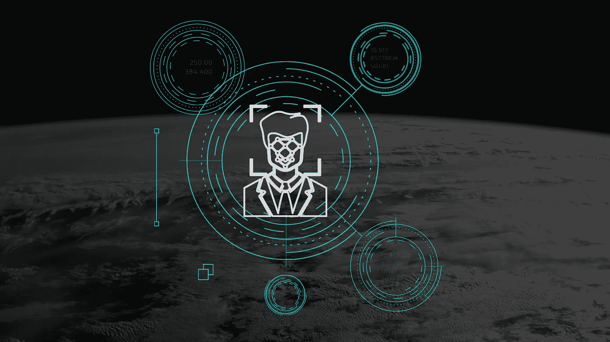
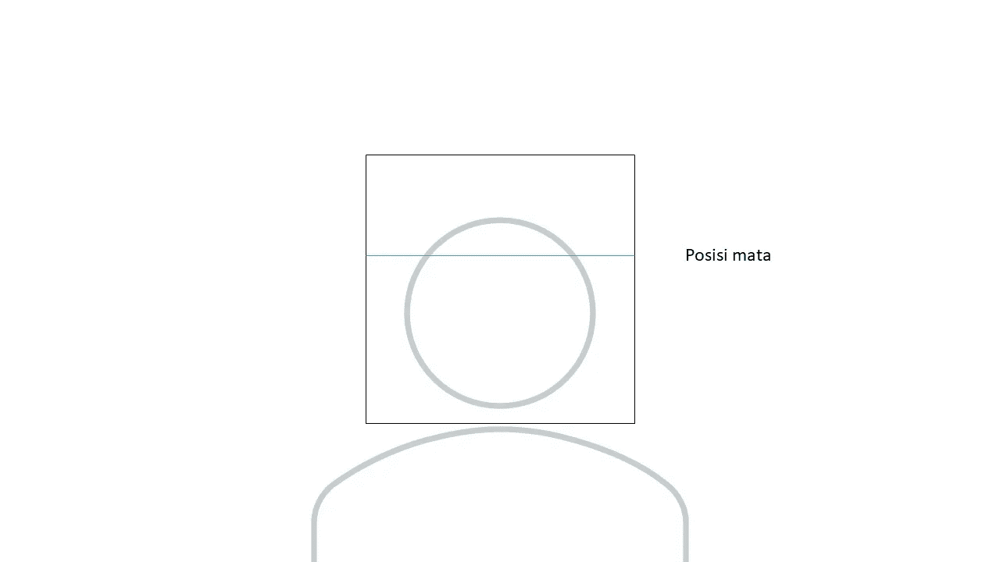
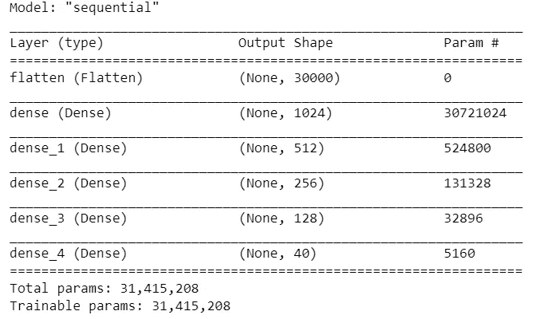
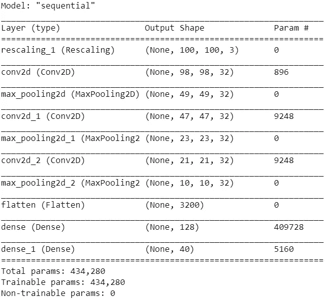
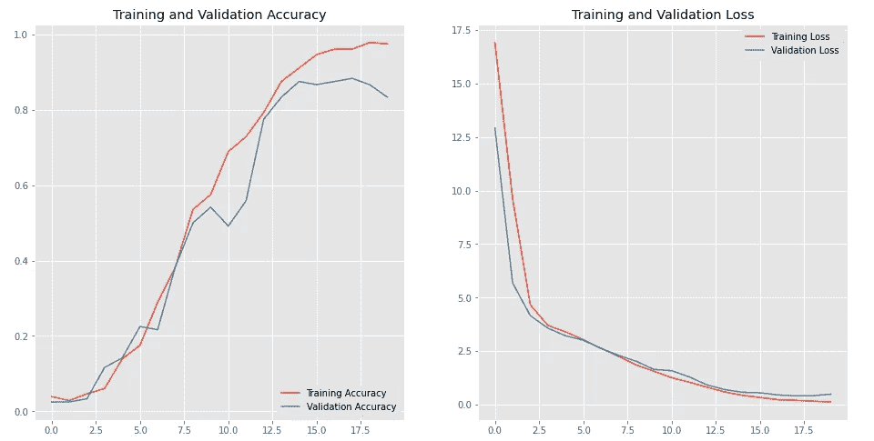
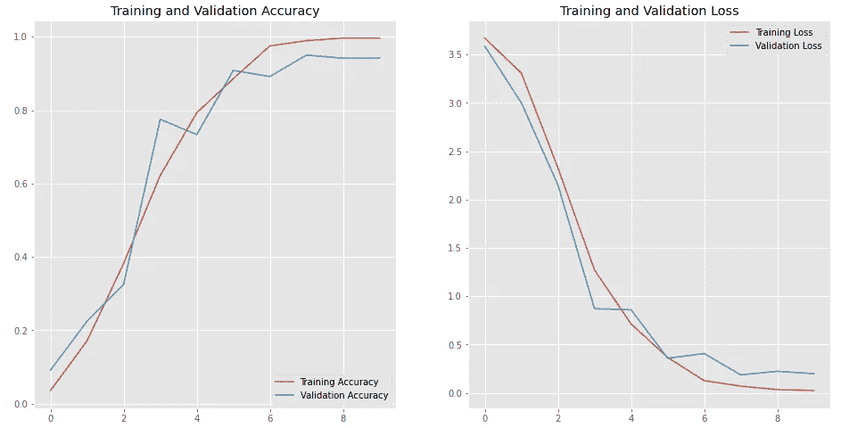

# 稠密神经网络和卷积神经网络在图像分类中的比较

> 原文：<https://medium.com/analytics-vidhya/comparing-image-classification-with-dense-neural-network-and-convolutional-neural-network-5f376582a695?source=collection_archive---------5----------------------->

本文将展示用于对 40 类人脸图像进行分类的深度神经网络模型的差异。

# 介绍

图像分类是使用机器学习实现的技术之一。这种方法也被称为计算机视觉，它允许计算机具有理解图像并将其分类到相应类别的能力。深度神经网络是机器学习的后续，即使用神经网络进行建模，通过反向传播来最小化损失函数。用于图像分类的最佳深度学习模型之一是卷积神经网络(CNN)，它被证明可以获得图像分类的最高精度。我将使用一个具有几个隐藏层的密集神经网络模型和一个卷积神经网络，将用于人脸识别的简单图像分类与 40 个不同的类别进行比较。

# 数据收集

这个分类我得到的数据是我一个班的同学给我的。有 40 个人有不同的名字，每个名字对应于将要预测的类别。这些照片是用网络摄像头在一个在线会议应用平台上拍摄的，每个人从不同的角度拍摄 10 张照片。我们使用特定的背景图像来拍摄照片，使其更具一般性。

这是我们使用的背景图片。

图像中的蓝色水平线将有助于眼睛的定位。然后，在得到照片后，我们将在黑色线条的正方形中裁剪图像，并将其整形为 100 x 100 像素。

最后，我们从 40 个不同的类中得到 400 个 100×100 像素的图像，每个类有 10 个不同的图像。

# 数据处理

我将使用 **Tensorflow-Keras** API 来分离用于训练和测试的数据，训练数据，并对数据建模。处理完数据后，我们将数据分成 70%用于培训，30%用于验证和测试。

我用的是 **TensorFlow。keras . preprocessing . image _ dataset _ from _ directory**包从一个目录创建一个数据集，并将数据分成 70%和 30%。这也将从文件目录中重新生成类名，由此我们得到了 40 个不同的类。

我们得到的数据是 RGB 图像。也就是说，每个图像将包含 100×100×3，每个像素的范围从 0 到 255。在我们得到两个不同的数据集，即训练数据集和验证数据集之后，我们使用 MinMaxScaler 来处理数据，并得出每个像素的范围从 0 到 1。

# 建模

在这一部分中，使用了两个建模部分，密集神经网络和卷积神经网络。首先，我们将寻找密集的神经网络模型。

## 密集神经网络/深度神经网络

密集的神经网络意味着每个神经元都与下一层的每个神经元紧密相连。我将使用 Tensorflow-Keras sequential 来构建这个密集的神经网络模型。该模型有 1 个输入层、4 个隐藏层和 1 个输出层。

输入层是一个展平层，将从 100x100x3 三维张量输入到一维张量。第一个到最后一个隐藏层是一个密集连接的层，第一个隐藏层中有 1024 个神经元，第二个隐藏层中有 512 个神经元，第三个隐藏层中有 256 个神经元，最后一个隐藏层中有 128 个神经元。最后是输出层，这也是一个密集层，有 40 个神经元，对应于模型的每个类别。

对于这个模型中的每个隐藏层，我选择整流器线性单元作为激活函数，在输出层选择 softmax 激活。最后，我们用 adam 优化器编译模型，并使用稀疏分类交叉熵作为损失函数。

这是模型总结。

## 卷积神经网络

CNN(卷积神经网络)模型是一种使用卷积概念的深度学习模型。该模型最常用于机器学习中的图像分析。当使用 CNN 时，有一个称为 conv2d 的层，它接受张量的输入，并将二维核的大小指定为参数。

我们的模型采用第一个输入图层，使用最小最大缩放器方法重新缩放图像，因此每个像素的值都在 0 和 1 之间。我们的模型有 3 个卷积层，每个卷积层的滤波器大小为 32 像素，内核大小为 3x3。在每个卷积层之间，我们有一个最大图像采样池层，它采用 pool_size 中的最大值。

在几个卷积层之后，我们用展平层展平图像，得到大小为 3200 的 1 维张量。然后，我们使用具有 128 个神经元的密集连接层和具有 40 个神经元的输出层，每个神经元代表一个类。

对于激活函数，我在隐藏卷积层和隐藏密集层使用了整流器线性单元。并且使用 softmax 作为输出层中的激活函数来进行预测。然后，我们用 adam 作为优化器，用稀疏分类交叉熵作为损失函数来编译模型。

这是模型总结。

# 培养

我使用一台个人电脑，通过启用 GPU 的 Tensorflow API 来训练数据。我用几个时期来训练模型，并使用验证数据集来验证数据。我还使用 python 时间包测量了训练数据所花费的时间。这是密集神经网络和卷积神经网络的训练结果。

## DNN

我使用 100 个历元进行训练，并在训练数据时使用 Keras 早期停止进行回调。所得到的训练数据仅使用了 20 个时期，并且具有 97%的准确度和 83%的验证准确度。在这个模型中，训练 20 个历元所花费的时间大约是 17.2 秒。

## 美国有线新闻网；卷积神经网络

对于 CNN 模型，我使用 10 个历元进行训练，而没有使用 Keras 提前停止进行回调。当训练数据完成 10 个时期时，它具有 99%的准确度和 94%的验证准确度。训练数据所需的时间在 8.15 秒左右。

# 结果

两种模型的结果都显示了很好的图像分类效果。虽然 DNN 模型被认为是过度拟合的，因为当我测试测试数据时，训练数据的准确性很高，但它成功地对 30 幅图像中的 27 幅进行了正确分类。对于 CNN 模型，它显示了验证数据的更好的准确性，这意味着该模型更通用，而不仅仅是记忆训练数据。CNN 模型成功地将 30 张图片中的 29 张分类正确。

# 准确度和损耗图

在得到 DNN 和 CNN 模型的训练结果后，我用 Matplotlib 库绘制了准确率和损失结果。它显示了两个模型的数据达到收敛。

## DNN 图

DNN 模型的精确度和损失图。

## CNN 图表

CNN 模型的精确度和损失图。

# 结论

在比较了 DNN 和 CNN 图像分类模型后，我们得出结论，CNN 是图像分类的最佳解决方案。虽然在这个问题中，我使用了一张具有特定背景和相同大小的图像，这也使得用 DNN 进行图像分类仍然是可能的，并且得到了一个很好的结果。对于训练数据，在这个给定模型的特定问题中，DNN 需要 20 个历元 17 秒的训练时间来达到收敛。而用 CNN 模型，只需要 8 秒的训练时间 10 个历元就能达到收敛。