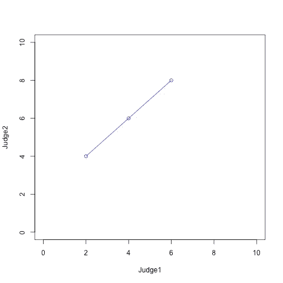
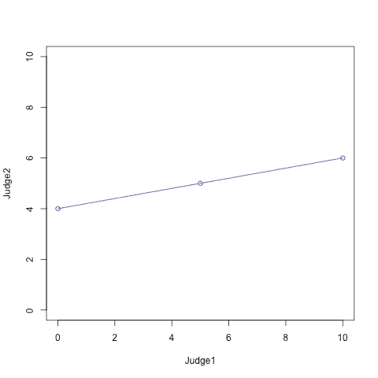
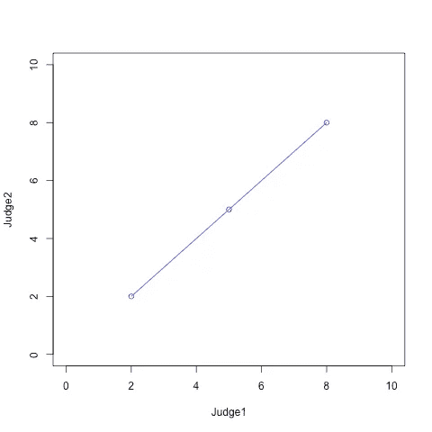

# 比较组内相关性和皮尔逊相关系数(带 R)

> 原文：<https://medium.com/analytics-vidhya/comparing-intraclass-correlation-to-pearson-correlation-coefficient-with-r-d78086127216?source=collection_archive---------0----------------------->


组内相关(ICC)和皮尔逊相关系数(Pearson's r)都是确定数据集中不同组之间关系程度的方法。Pearson 的 r 和每个 ICC 模型都有不同的用例，在不同的情况下会给出非常不同的结果。如果在这种情况下使用不正确的关系模型，可能会导致误导性的结果。

在本文中，我们用三个易于理解的数据集将三个最常见的 ICC 模型的结果与 Pearson 的 r 进行了比较。

## 数据集 1

```
 Judge 1 Judge 2
[1,]       2       4
[2,]       4       6
[3,]       6       8
```



在数据集 1 中，我们有三个值对，代表两位评委的三个评分。两个评委评分之间的值
彼此具有线性的 ann 相加关系。加法关系来自于这样一个事实，即通过给每个判断 1 评级加 2，它们等于判断 2 评级。

接下来，我们比较不同 ICC 模型的结果和第一个数据集的 Pearson’s r。

```
># Pearson's r
>cor(data1[,1], data1[,2])
 1># ICC(C, 1)
>icc(data1, model = "twoway", type="consistency")$value
 1># ICC(C, 2)
>icc(data1, model = "twoway", type="agreement")$value
 0.6666667># ICC(k)
>icc(data1, model = "oneway")$value
 0.6
```

皮尔逊 r 衡量变量之间的线性相关性。该数据集在两位评委的评分之间具有完美的线性关系。对此，Pearson 的 r 给出的相关结果为 1，这表明完全正相关。

ICC(C，1)也给出 1 分。这是因为该模型将法官之间的加性关系视为完美关系。

另一方面，ICC(k)和 ICC(C，2)给出 0 和 1 之间的值，这表明与法官之间存在某种程度的正相关，但不是完美的正相关。这是因为这两个模型都需要评委之间的绝对一致才能得到满分。这意味着评委之间的评分需要相等才能得到满分。

## 数据集 2

```
 Judge1 Judge2
[1,]      0      4
[2,]      5      5
[3,]     10      6
```



在数据集 2 中，两个评委的评分之间的值彼此具有线性关系，但是这一次它们没有相加关系。

在这里，我们比较了不同的 ICC 模型和 Pearson 的 r 对 seccond 数据集给出的结果

```
># Pearson's r
>cor(data2[,1], data1[,2])
 1># ICC(C, 1)
>icc(data2, model = "twoway", type="consistency")$value
 0.3846154># ICC(C, 2)
>icc(data2, model = "twoway", type="agreement")$value
 0.483871># ICC(k)
>icc(data2, model = "oneway")$value
 0.5428571
```

由于这两个变量再次具有线性关系，皮尔逊 r 给出了 1 的完美正相关。

这一次数据集没有加法关系，因此 ICC(C，1)没有给出完美的正关系。事实上，它给出了所有方法中最差的相关分数。

ICC(k)和 IC(C，2)在 0 和 1 之间给出了与第一个数据集相似的结果。

## 数据集 3

```
 Judge 1 Judge 2
[1,]       4       4
[2,]       5       5
[3,]       6       6
```



在数据集 3 中，两位评委的评分值相等。

```
># Pearson's r
>cor(data2[,1], data1[,2])
 1># ICC(C, 1)
>icc(data2, model = "twoway", type="consistency")$value
 1># ICC(C, 2)
>icc(data2, model = "twoway", type="agreement")$value
 1># ICC(k)
>icc(data2, model = "oneway")$value
 1
```

评委之间的平等评分与所有模特之间形成了完美的正面关系。

*感谢您的阅读！*

参考资料:

*   Shrout，p .和 Fleiss，j .，1979 年。组内相关性:用于评估评分者的可靠性。*心理通报*，86 卷 2 期，第 420–428 页。
*   McGraw，k .和 Wong，s .，1996 年。形成关于一些组内相关系数的推论。*心理学方法*，1(1)，第 30–46 页。