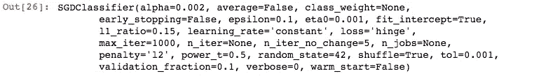
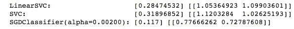

# Iris 数据集上 LinearSVC、SVM 和 SGDClassifier(结果比较展示)的比较

> 原文：<https://medium.com/analytics-vidhya/comparison-between-linearsvc-svm-and-sgdclassifier-results-comparison-showcase-on-iris-dataset-8437657df276?source=collection_archive---------10----------------------->

有没有想过 LinearSVC 和 SGDClassifier 之间用什么比较好？

当然，这取决于数据集，当然还有许多其他因素增加了权重，但今天在这篇小文章中，我将通过 Python 代码演示如何使用 LinearSVC、SVC 分类器和 SGD 分类器，并比较同一数据集的结果。

由于分类器对离群值非常敏感，我们需要对它们进行缩放，但在我们需要选择正确的数据集之前，为了获得更简单的结果，我将展示所有分类器的基准数据集 Iris 数据集。

**数据集特征:**多元

**实例数量:** 150

**地区:**生活

**属性特征:**真实

**属性数量:** 4

**关联任务:**分类

**缺失值？**否

**属性信息:**

1.  萼片长度厘米
    2。萼片宽度厘米
    3。以厘米为单位的花瓣长度
    4。以厘米为单位的花瓣宽度
    5。类别:
    —刚毛鸢尾
    —杂色鸢尾
    —海滨鸢尾

出于我们的目的，我们将对 Setosa 和 Versicolour 类进行分类。

让我们先加载数据集，然后导入所有分类器。你可以在这里阅读数据集—[https://archive.ics.uci.edu/ml/datasets/Iris](https://archive.ics.uci.edu/ml/datasets/Iris)

```
from sklearn import datasetsiris = datasets.load_iris()X = iris[“data”][:, (2, 3)] # petal length, petal widthy=iris[“target”]#Since Target Variable also has Virginica in it so we’re just taking #out indexes which have 0 or 1 (you can print y and check for #yourself just write print(y))setosa_or_versicolor = (y == 0) | (y == 1)X = X[setosa_or_versicolor]y = y[setosa_or_versicolor]Now that we have data ready we’re now going to import all classifiers.
```

```
from sklearn.svm import SVC, LinearSVC
from sklearn.linear_model import SGDClassifier
from sklearn.preprocessing import StandardScalerlin_clf = LinearSVC(loss=”hinge”, C=5, random_state=42) #LinearSVC classifier#SVM classifier 
svm_clf = SVC(kernel=”linear”, C=C)#SGDClassifier 
sgd_clf = SGDClassifier(loss=”hinge”, learning_rate=”constant”, eta0=0.001,
 max_iter=1000, tol=1e-3, random_state=42)
```



现在是时候使用标准缩放器来缩放数据集了。

```
lin_clf.fit(X_scaled, y)
svm_clf.fit(X_scaled, y)
sgd_clf.fit(X_scaled, y)
```

打印结果的时间到了

```
print(“LinearSVC: “, lin_clf.intercept_, lin_clf.coef_)
print(“SVC: “, svm_clf.intercept_, svm_clf.coef_)
print(“SGDClassifier(alpha={:.5f}):”.format(sgd_clf.alpha), sgd_clf.intercept_, sgd_clf.coef_)
```



LinearSVC、SVM 和 SGD 分类器的结果比较

源代码—[https://github.com/Madmanius/Comparison_SVM_LinearSVM_SGD](https://github.com/Madmanius/Comparison_SVM_LinearSVM_SGD)