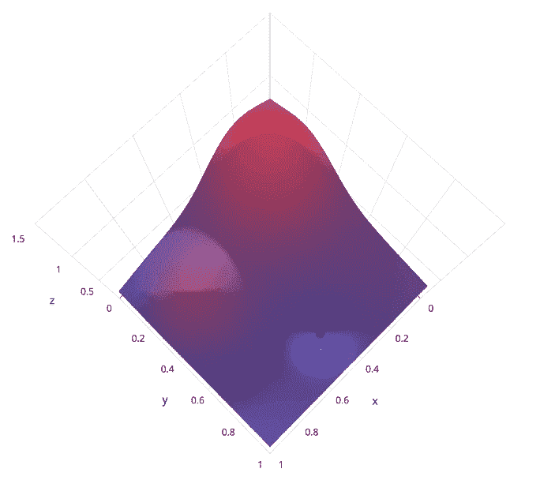
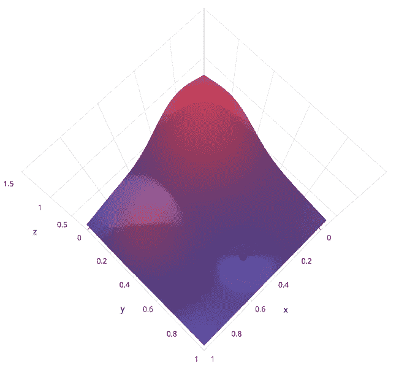
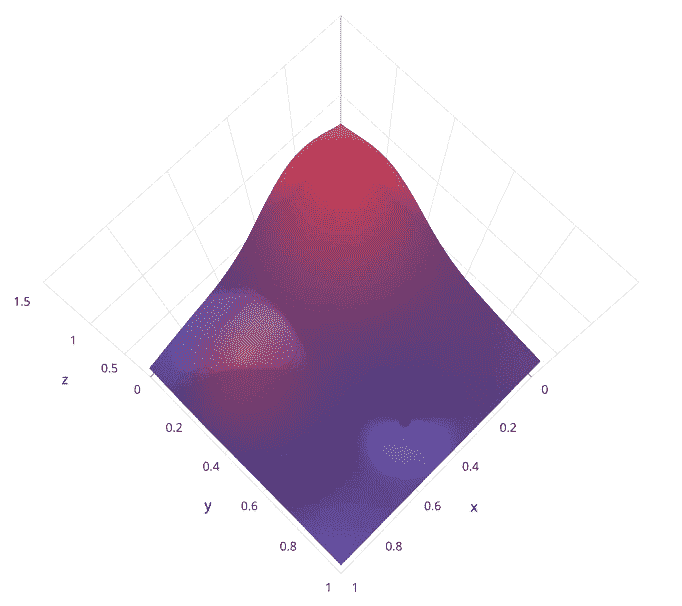

# 超参数调整算法的比较:网格搜索、随机搜索、贝叶斯优化

> 原文：<https://medium.com/analytics-vidhya/comparison-of-hyperparameter-tuning-algorithms-grid-search-random-search-bayesian-optimization-5326aaef1bd1?source=collection_archive---------1----------------------->

在模型训练阶段，模型学习其参数。但也有一些秘密旋钮，称为*超参数*，模型无法自行学习——这些留给我们*来调整*。调整超参数可以显著提高模型性能。不幸的是，没有明确的程序来计算这些超参数值。这就是为什么超参数调整通常被认为是一门艺术而不是科学。

在本文中，我讨论了 3 种最流行的超参数调优算法——网格搜索、随机搜索和贝叶斯优化。


调整你的模型的秘密旋钮称为 ***超参数***

# 什么是超参数调谐？

模型训练是模型学习其参数的过程。除此之外，每个模型也有一些超参数，它不能*学习，*但可以*调整*。与在训练期间学习的模型参数相反，模型超参数由数据科学家在训练之前设置。这个调整各种超参数值的过程称为超参数调整。(注意术语超参数*调谐*的用法，而不是超参数*训练*)。

> 模型**参数**在训练过程中自动从数据中学习。
> 模型**超参数**是手动设置和调整的，在训练过程中使用，以帮助学习模型参数。

# **超参数调整算法**

## 1.网格搜索

这是最基本的超参数调优方法。你定义一个超参数值的*网格*。调整算法**以连续的方式彻底地**搜索这个空间，并为每个 可能的超参数值组合 ***训练一个模型。***

例如，为了训练 SVM 模型，我们可以如下定义我们的超参数网格空间( *C，gamma，kernel* )。网格搜索算法训练多个模型(每个组合一个)，最终保留超参数值的*最佳*组合。

```
{ 
  'C': [0.1, 1, 10, 100, 1000], 
  'gamma': [0.1, 0.01 ,0.001, 0.0001], 
  'kernel': ['rbf', 'linear']
}
```

> 网格搜索**在实践中并不**经常使用，因为随着要训练的超参数数量的增加，要训练的模型数量呈指数增长。这在计算能力和时间上都非常低效。



来源— [SigOpt](https://sigopt.com/blog/common-problems-in-hyperparameter-optimization)

## 2.随机搜索

随机搜索不同于网格搜索，因为我们**不再为每个超参数提供一组明确的可能值**；相反，我们**为每个超参数**提供一个统计分布，从其中**采样**值。本质上，我们为每个超参数定义一个采样分布，以执行随机搜索。

使用随机搜索，我们还可以**控制或限制使用的超参数组合**的数量。与网格搜索不同，网格搜索评估每一个可能的组合；在随机搜索中，我们可以指定只训练固定数量的模型，并在此之后终止优化算法。搜索迭代的次数也可以基于时间或资源来设置。

例如，为了训练 SVM 模型，我们可以将超参数( *C，gamma* )定义为对数均匀分布。(其他一些常见的分布有`exponential`、`normal`、`lognormal`、`uniform`和`random`)。随机搜索算法从它们各自的分布中为 *C* 和*γ*采样一个值，并使用它来训练一个模型。这个过程重复几次，训练多个模型。最终保留超参数值的*最佳*组合。

```
{
  'C': loguniform(1e-1, 1e3),
  'gamma': loguniform(1e-4, 1e-1),
  'kernel': ['rbf', 'linear']
}
```



来源— [SigOpt](https://sigopt.com/blog/common-problems-in-hyperparameter-optimization)

## 3.贝叶斯优化

在前两种方法中，我们通过建立具有各种超参数值的多个模型来执行单独的实验。所有这些实验都是相互独立的。因为每个实验都是独立进行的，所以我们不能使用一个实验的信息来改进下一个实验。

> 贝叶斯优化是一种基于 ***序列模型的优化* (SMBO)** 算法，该算法使用来自 **先前迭代的**结果来决定下一个超参数值候选**。**
> 
> 因此，这种方法不是盲目地搜索超参数空间(如网格搜索和随机搜索)，而是提倡使用智能来挑选下一组超参数，这将提高模型性能。我们反复重复这个过程，直到我们收敛到一个最优值。

一个有趣的类比是将这比作装袋和增压。仔细想想，想法很像！
在装袋中，我们平行且相互独立地建造许多树。另一方面，Boosting 是一个连续的过程，在这个过程中，每增加一棵树，我们都要学习纠正它的前身树中的错误。

贝叶斯优化创建了概率模型，将超参数映射到目标函数得分的概率。更多数学细节，请参考[这个](https://towardsdatascience.com/a-conceptual-explanation-of-bayesian-model-based-hyperparameter-optimization-for-machine-learning-b8172278050f)。



来源— [SigOpt](https://sigopt.com/blog/common-problems-in-hyperparameter-optimization)

# 摘要

贝叶斯优化方法是高效的，因为它们以*知情的方式* **选择超参数。**通过对从过去的结果看起来更有希望的超参数进行优先排序，贝叶斯方法可以在比网格搜索和随机搜索更少的时间(更少的迭代)内找到最佳超参数。

# 选择最佳超参数

我们已经讨论了很多关于*最佳*超参数的内容。但是我们如何选择最好的呢？哪个度量用于区分好的和坏的超参数？

嗯，最简单的方法如下:

1.  将数据集分为训练集(70%)和验证集(30%)。
2.  选择任何超参数调整算法—网格搜索、随机搜索或贝叶斯优化。
3.  决定并创建您希望优化的超参数列表。
4.  训练多个模型-为每个超参数值组合训练一个模型。
5.  计算每个模型的验证集准确性。
6.  选择在验证集上达到最高准确度的模型。

这是您的*最佳模型*，用于训练该模型的超参数是您的*最佳超参数*。

## 交叉验证

虽然上述方法是合理的，但是将数据集直接拆分为训练集和验证集是不可取的，因为您可能会丢失进入验证集且从未用于训练的数据点中的许多重要信息。为了避免这种情况，我们通常使用**交叉验证(CV)** 来调整我们的超参数。

> Scikit-learn 是一个流行的库，它提供了 GridSearchCV、RandomizedSearchCV 和 BayesSearchCV 的现成实现。

尽管我们很想通过使用交叉验证的超参数调整来提高我们的模型性能，但重要的是要记住，它会显著地**增加总的** **模型训练时间**。

我列出了一些免费和开源的超参数优化库。一定要去看看！

*   [Optuna](https://optuna.org/)
*   [远视](https://github.com/hyperopt/hyperopt)
*   [贝叶斯优化](https://github.com/fmfn/BayesianOptimization)
*   [留兰香](https://github.com/HIPS/Spearmint)
*   [sci kit-优化](https://scikit-optimize.github.io/#skopt.Optimizer)