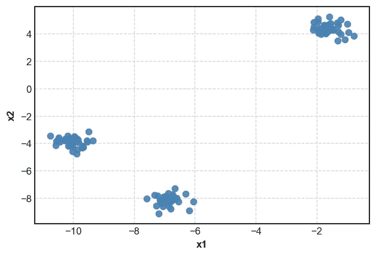
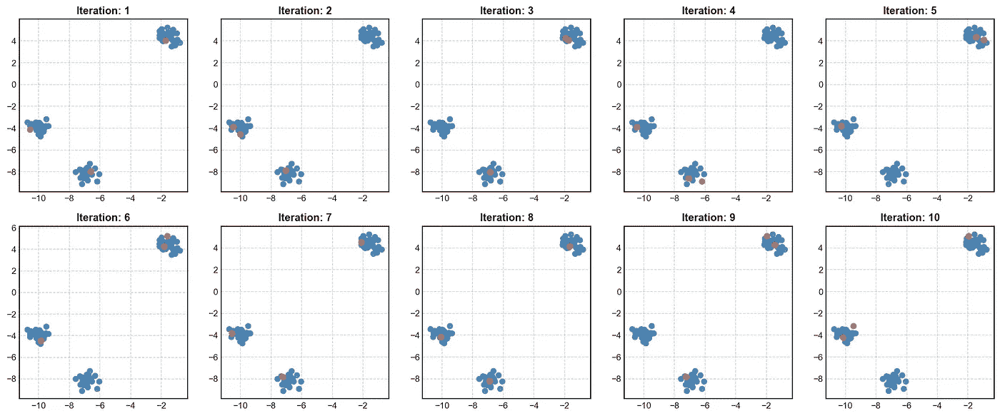
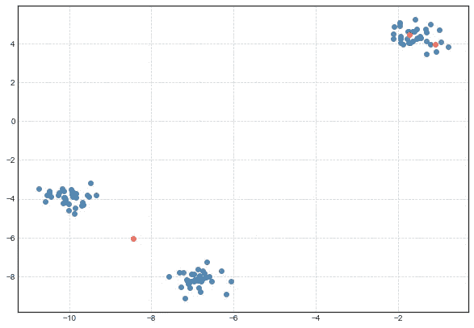
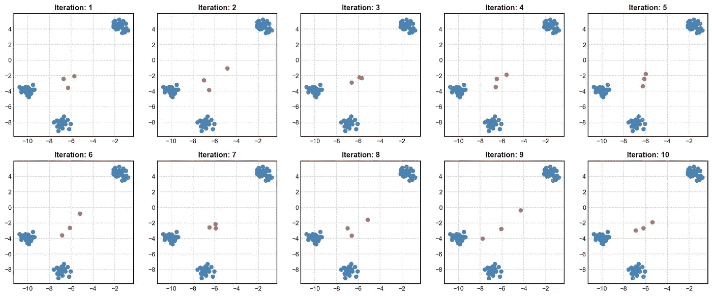
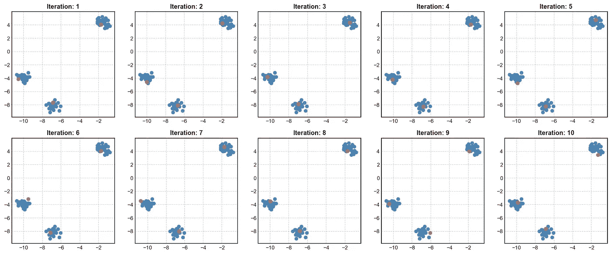

# k-均值聚类:初始化策略的比较。

> 原文：<https://medium.com/analytics-vidhya/comparison-of-initialization-strategies-for-k-means-d5ddd8b0350e?source=collection_archive---------2----------------------->

k-Means 是一种数据划分算法，是聚类算法中最直接的选择之一。k-Means 流行的一些原因是:

1.  执行速度快。
2.  在线和小批量实施也可用，因此需要更少的内存。
3.  容易解读。聚类的质心通常给出了聚类中存在的数据的大致概念。对于能够检测质心甚至可能不在聚类内的非凸聚类的一些其他聚类算法来说，这是不可能的。
4.  k-Means 的结果可以用作其他算法的起点。通常的做法是使用 k 均值的质心作为高斯混合模型的起始点。

然而，k-Means 的**结果严重依赖于初始化**。在下面的文章中，我们将比较通过以下初始化策略获得的结果:

1.  Forgy 初始化
2.  随机分区初始化
3.  kmeans++初始化

标准做法是从不同的起始点开始 k 均值，并记录每次初始化的 WSS(平方和内)值。然后，我们接受对应于最小 WSS 的聚类解决方案。

**为了比较这些方法，我们将选择一个具有 3 个聚类和 2 个变量的人工数据。然后，我们将使用每种方法重复初始化过程 10 次，并可视化初始化策略选择的初始点。**

*请注意，我们只是比较各种初始化方法的结果。执行 k-Means 后的最终聚类在本文中没有详细讨论。*

**用于试验的数据**



# **Forgy 初始化**

该方法是 k-Means 的快速初始化方法之一。如果我们选择 k 个聚类，Forgy 方法从数据中随机选择任意 k 个点作为初始点。

这种方法是有意义的，因为通过 k-Means 检测的聚类更有可能接近数据中存在的模式。通过从数据中随机选择点，我们更有可能得到接近模式的点。

以下是 Forgy 在 Python 中的初始化实现:

```
def forgy_initialize(X, k):
    '''Return Randomly sampled points from the data''' return X[np.random.choice(range(X.shape[0]), replace = False,     size = k), :]
```

让我们用 Forgy 的方法来看看 10 种不同的初始化:



用 Forgy 方法选择的 10 种初始构型

我们可以观察到以下情况:

1.  在迭代 1、7、8 中:Forgy 的方法在每个聚类中初始化一个中心。这是运行 k-Means 的**良好起点**的指示，因为起点已经在各自的群集中，因此接近真实的质心。k-Means 最有可能在几次迭代中收敛到全局最优。
2.  在第 2、3、4、5、6、9、10 次迭代中:Forgy 的方法将 2 个点初始化为位于同一聚类内。这不是一个理想的状态。这可能会导致算法达到局部最优解，但结果不佳。举例来说，下面是我从这个配置运行 k-Means 时发生的情况:



从不正确的初始点运行 k 均值的结果(条件 2)

如果我们记得从不同的初始配置运行 k-Means(然后我们可能得到一些好的配置，如在迭代 1、7、8 中),可以避免上述情况，这将产生全局最优。

# **随机分割法**

在这种方法中，我们将数据中的每个点随机分配给一个随机的聚类 ID。然后，我们根据聚类 ID 对这些点进行分组，并取平均值(每个聚类 ID)来产生初始点。众所周知，随机分割法可以产生接近数据平均值的初始点。

下面是使用随机分区方法生成初始点的代码:

```
def random_partition(X, k):
    '''Assign each point randomly to a cluster. Then calculate the             Average data in each cluster to get the centers'''
    indices = np.random.choice(range(0, k), replace = True, size = X.shape[0])
    mean = []
    for count in range(k):
        mean.append(X[indices == count].mean(axis=0))

    return np.concatenate([val[ None, :] for val in mean], axis = 0)
```

让我们来看看使用随机分区方法的 10 种不同的初始化:



随机分割法选取初始点

正如我们所见，选择的初始点非常接近数据的全局平均值。这不是初始化 k 均值的推荐方法。请参考 https://dl.acm.org/doi/10.1145/584792.584890 的[的结论部分，其中总结了随机划分相对有效的聚类算法。](https://dl.acm.org/doi/10.1145/584792.584890)

如果使用这种方法初始化，k-Means 更容易陷入局部最优。

# **kmeans++**

这是一种标准方法，通常比 Forgy 的方法和初始化 k-Means 的随机划分方法效果更好。

该方法在[http://ilpubs.stanford.edu:8090/778/1/2006-13.pdf](http://ilpubs.stanford.edu:8090/778/1/2006-13.pdf)中有详细描述

这里，想法是选择初始点，它们彼此尽可能远离。

1.  我们从从数据中选择一个随机点开始。
2.  然后，我们选择下一个点，使得它更有可能位于离第一个点很远的地方。我们通过从概率分布中采样一个点来做到这一点，该概率分布与一个点到第一个中心的距离的平方成比例。
3.  剩余的点由概率分布生成，该概率分布与每个点到其最近中心的距离的平方成比例。因此，离其最近中心距离较远的点更有可能被采样。

下面是使用 kmeans++生成初始点的代码

```
def dist(data, centers):
    distance = np.sum((np.array(centers) - data[:, None, :])**2, axis = 2)
    return distancedef kmeans_plus_plus(X, k, pdf_method = True):
    '''Initialize one point at random.
    loop for k - 1 iterations:
        Next, calculate for each point the distance of the point from its nearest center. Sample a point with a 
        probability proportional to the square of the distance of the point from its nearest center.'''
    centers = []
    X = np.array(X)

    # Sample the first point
    initial_index = np.random.choice(range(X.shape[0]), )
    centers.append(X[initial_index, :].tolist())

    print('max: ', np.max(np.sum((X - np.array(centers))**2)))

    # Loop and select the remaining points
    for i in range(k - 1):
        print(i)
        distance = dist(X, np.array(centers))

        if i == 0:
            pdf = distance/np.sum(distance)
            centroid_new = X[np.random.choice(range(X.shape[0]), replace = False, p = pdf.flatten())]
        else:
            # Calculate the distance of each point from its nearest centroid
            dist_min = np.min(distance, axis = 1)if pdf_method == True:
                pdf = dist_min/np.sum(dist_min)# Sample one point from the given distribution
                centroid_new = X[np.random.choice(range(X.shape[0]), replace = False, p = pdf)]
            else:
                index_max = np.argmax(dist_min, axis = 0)
                centroid_new = X[index_max, :]
        centers.append(centroid_new.tolist())

    return np.array(centers)
```

让我们看看使用 kmeans++方法的 10 种不同的初始化:



用 kmeans++方法选择初始点

正如我们可以看到的，在所有 10 个案例中，所有的初始点都在各自的集群内。这种生成初始点的方法有助于 k-Means 在几次迭代中收敛到全局最小值。**这是 k-Means 算法生成初始点的推荐方法。**

# **结论**

总的来说，我们看到初始化 k-Means 的方法给出了最好的初始点是 kmeans++。即使我们通过运行 kmeans++获得了很好的初始点，仍然建议从不同的起点运行 k-Means。

尽管 k-Means 是一种相对简单的算法，它做出了许多假设，但由于其速度、可扩展性和易于解释，它在各种设置中仍然非常有用。