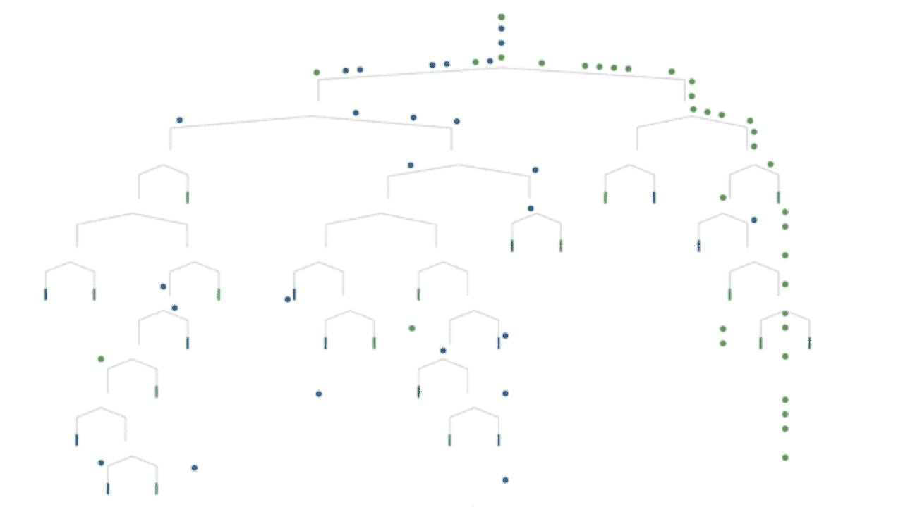

# ML 算法结果的比较

> 原文：<https://medium.com/analytics-vidhya/comparison-of-ml-algorithms-for-prediction-8277ed77f119?source=collection_archive---------26----------------------->

# 介绍

我将比较 ML 分类算法和 Python。

1.  逻辑回归
2.  KNN
3.  SVM
4.  天真 b。
5.  随机森林
6.  人工神经网络

这个内核的 Kaggle 链接:[https://www . ka ggle . com/burakkahveci/comparison-of-ml-algorithms-For-prediction](https://www.kaggle.com/burakkahveci/comparison-of-ml-algorithms-for-prediction)

```
Created By Burak KahveciKaggle: [https://www.kaggle.com/burakkahveci](https://www.kaggle.com/burakkahveci)Linkedin: [https://www.linkedin.com/in/kahveciburak/](https://www.linkedin.com/in/kahveciburak/)Twitter: [https://twitter.com/ImpartialBrain](https://twitter.com/ImpartialBrain)Youtube: [https://www.youtube.com/channel/UCvswVzsYEsAeA4iPXAkn3qA?view_as=subscriber](https://www.youtube.com/channel/UCvswVzsYEsAeA4iPXAkn3qA?view_as=subscriber)Github: [https://github.com/burakkahveci](https://github.com/burakkahveci)
```

# 图书馆

```
import numpy as np 
import pandas as pd 
import matplotlib.pyplot as plt
import seaborn as sns
```

# 阅读和检查数据集

数据集资源:【https://www.kaggle.com/uciml/pima-indians-diabetes-database 

```
*#read data*
data = pd.read_csv("../input/diabetes.csv")*#data.info()**#data.head()**#Split Data as M&B*p = data[data.Outcome == 1]
n = data[data.Outcome == 0]
```

# 形象化

```
sns.countplot(x='Outcome',data=data)
plt.title("Count 0 & 1")
plt.show()
```


**糖尿病病例分析**

```
*#General Analysis*

data1 = data[data["Outcome"]==1]
columns = data.columns[:8]
plt.subplots(figsize=(18,18))
length =len(columns)
for i,j **in** itertools.zip_longest(columns,range(length)):
    plt.subplot((length/2),3,j+1)
    plt.subplots_adjust(wspace=0.2,hspace=0.5)
    plt.ylabel("Count")
    data1[i].hist(bins=20,edgecolor='black')
    plt.title(i)
plt.show()
```


**非糖尿病病例分析**

```
data1 = data[data["Outcome"]==0]
columns = data.columns[:8]
plt.subplots(figsize=(18,18))
length =len(columns)
for i,j **in** itertools.zip_longest(columns,range(length)):
    plt.subplot((length/2),3,j+1)
    plt.subplots_adjust(wspace=0.2,hspace=0.5)
    plt.ylabel("Count")
    data1[i].hist(bins=20,edgecolor='black')
    plt.title(i)
plt.show()
```


妊娠糖尿病阳性与阴性病例的比较

```
*#Visualization, Scatter Plot*

plt.scatter(p.Pregnancies,p.Glucose,color = "brown",label="Diabet Positive",alpha=0.4)
plt.scatter(n.Pregnancies,n.Glucose,color = "Orange",label="Diabet Negative",alpha=0.2)
plt.xlabel("Pregnancies")
plt.ylabel("Glucose")
plt.legend()
plt.show()
```


*我们看来这是明显的隔离。*

妊娠糖尿病阳性与阴性病例的比较

```
*#Visualization, Scatter Plot*

plt.scatter(p.Age,p.Pregnancies,color = "lime",label="Diabet Positive",alpha=0.4)
plt.scatter(n.Age,n.Pregnancies,color = "black",label="Diabet Negative",alpha=0.2)
plt.xlabel("Age")
plt.ylabel("Pregnancies")
plt.legend()
plt.show()
```


病例葡萄糖—胰岛素值的比较

```
plt.scatter(p.Glucose,p.Insulin,color = "lime",label="Diabet Positive",alpha=0.4)
plt.scatter(n.Glucose,n.Insulin,color = "black",label="Diabet Negative",alpha=0.1)
plt.xlabel("Glucose")
plt.ylabel("Insulin")
plt.legend()
plt.show()
```


# 编辑和分离数据集

```
*#separate data as x (features) & y (labels)*
y= data.Outcome.values
x1= data.drop(["Outcome"],axis= 1) *#we remowe diagnosis for predict
#normalization*
x = (x1-np.min(x1))/(np.max(x1)-np.min(x1))
```

# 最大似然分类算法比较

```
*#Train-Test-Split* 
from sklearn.model_selection import train_test_split
xtrain, xtest, ytrain, ytest =  train_test_split(x,y,test_size=0.3,random_state=42)
```

# 逻辑回归分类

```
from sklearn.linear_model import LogisticRegression
LR = LogisticRegression()*#K-fold CV*
from sklearn.model_selection import cross_val_score
accuraccies = cross_val_score(estimator = LR, X= xtrain, y=ytrain, cv=10)
print("Average Accuracies: ",np.mean(accuraccies))
print("Standart Deviation Accuracies: ",np.std(accuraccies))
```

平均精度:0.7597309573724669
标准偏差精度:0.000000001

```
LR.fit(xtrain,ytrain)
print("Test Accuracy **{}**".format(LR.score(xtest,ytest))) 

LRscore = LR.score(xtest,ytest)
```

测试精度:0 . 58686 . 68868686861

## *混淆矩阵*

```
yprediciton1= LR.predict(xtest)
ytrue = ytest

from sklearn.metrics import confusion_matrix
CM = confusion_matrix(ytrue,yprediciton1)

*#CM visualization*

import seaborn as sns
import matplotlib.pyplot as plt

f, ax = plt.subplots(figsize=(5,5))
sns.heatmap(CM,annot = True, linewidths=0.5,linecolor="red",fmt=".0f",ax=ax)
plt.xlabel("Prediction(Ypred)")
plt.ylabel("Ytrue")
plt.show()
```


# k-神经网络

```
*#Create-KNN-model*
from sklearn.neighbors import KNeighborsClassifier
KNN = KNeighborsClassifier(n_neighbors = 40) *#n_neighbors = K value**#K-fold CV*
from sklearn.model_selection import cross_val_score
accuraccies = cross_val_score(estimator = KNN, X= xtrain, y=ytrain, cv=10)
print("Average Accuracies: ",np.mean(accuraccies))
print("Standart Deviation Accuracies: ",np.std(accuraccies))
```

平均精度:0.7430642907058
标准偏差精度:0.0000000001

```
KNN.fit(xtrain,ytrain) *#learning model*
prediction = KNN.predict(xtest)
*#Prediction*
print("**{}**-NN Score: **{}**".format(40,KNN.score(xtest,ytest)))

KNNscore = KNN.score(xtest,ytest)
```

40 分-神经网络得分:0。56460 . 48648648661

```
*#Find Optimum K value*
scores = []
for each **in** range(1,100):
    KNNfind = KNeighborsClassifier(n_neighbors = each)
    KNNfind.fit(xtrain,ytrain)
    scores.append(KNNfind.score(xtest,ytest))

plt.figure(1, figsize=(10, 5))
plt.plot(range(1,100),scores,color="black",linewidth=2)
plt.title("Optimum K Value")
plt.xlabel("K Values")
plt.ylabel("Score(Accuracy)")
plt.grid(True)
plt.show()
```


```
*#Confusion Matrix*

yprediciton2= KNN.predict(xtest)
ytrue = ytest

from sklearn.metrics import confusion_matrix
CM = confusion_matrix(ytrue,yprediciton2)

*#CM visualization*

import seaborn as sns
import matplotlib.pyplot as plt

f, ax = plt.subplots(figsize=(5,5))
sns.heatmap(CM,annot = True, linewidths=0.5,linecolor="red",fmt=".0f",ax=ax)
plt.xlabel("Prediction(Ypred)")
plt.ylabel("Ytrue")
plt.show()
```


# SVM

```
*#SVM with Sklearn*

from sklearn.svm import SVC

SVM = SVC(random_state=42)
*#K-fold CV*
from sklearn.model_selection import cross_val_score
accuraccies = cross_val_score(estimator = SVM, X= xtrain, y=ytrain, cv=10)
print("Average Accuracies: ",np.mean(accuraccies))
print("Standart Deviation Accuracies: ",np.std(accuraccies))
```

平均精度:0.7596597323012417
标准偏差精度:0.000000001

```
SVM.fit(xtrain,ytrain)  *#learning* 
*#SVM Test* 
print ("SVM Accuracy:", SVM.score(xtest,ytest))

SVMscore = SVM.score(xtest,ytest)
```

SVM 精度:0.77686768686

```
*#Confusion Matrix*

yprediciton3= SVM.predict(xtest)
ytrue = ytest

from sklearn.metrics import confusion_matrix
CM = confusion_matrix(ytrue,yprediciton3)

*#CM visualization*

import seaborn as sns
import matplotlib.pyplot as plt

f, ax = plt.subplots(figsize=(5,5))
sns.heatmap(CM,annot = True, linewidths=0.5,linecolor="red",fmt=".0f",ax=ax)
plt.xlabel("Prediction(Ypred)")
plt.ylabel("Ytrue")
plt.show()
```


# 朴素贝叶斯分类

```
*#Naive Bayes*
from sklearn.naive_bayes import GaussianNB
NB = GaussianNB()*#K-fold CV*
from sklearn.model_selection import cross_val_score
accuraccies = cross_val_score(estimator = NB, X= xtrain, y=ytrain, cv=10)
print("Average Accuracies: ",np.mean(accuraccies))
print("Standart Deviation Accuracies: ",np.std(accuraccies))
```

平均精度:0.7596583884319733
标准偏差精度:0.000000001

```
NB.fit(xtrain,ytrain) *#learning*
*#prediction*
print("Accuracy of NB Score: ", NB.score(xtest,ytest))

NBscore= NB.score(xtest,ytest)
```

NB 评分的准确度:0.7458678676866

```
*#Confusion Matrix*

yprediciton4= NB.predict(xtest)
ytrue = ytest

from sklearn.metrics import confusion_matrix
CM = confusion_matrix(ytrue,yprediciton4)

*#CM visualization*

import seaborn as sns
import matplotlib.pyplot as plt

f, ax = plt.subplots(figsize=(5,5))
sns.heatmap(CM,annot = True, linewidths=0.5,linecolor="red",fmt=".0f",ax=ax)
plt.xlabel("Prediction(Ypred)")
plt.ylabel("Ytrue")
plt.show()
```


# 决策图表



```
*#Decision Tree Algorithm*

from sklearn.tree import DecisionTreeClassifier
DTC = DecisionTreeClassifier()*#K-fold CV*
from sklearn.model_selection import cross_val_score
accuraccies = cross_val_score(estimator = DTC, X= xtrain, y=ytrain, cv=10)
print("Average Accuracies: ",np.mean(accuraccies))
print("Standart Deviation Accuracies: ",np.std(accuraccies))
```

平均精度:0.7128326076439284
标准偏差精度:0.000000001

```
DTC.fit(xtrain,ytrain) *#learning*
*#prediciton*
print("Decision Tree Score: ",DTC.score(xtest,ytest))
DTCscore = DTC.score(xtest,ytest)
```

决策树得分:0.70967675767

```
*#Confusion Matrix*

yprediciton5= DTC.predict(xtest)
ytrue = ytest

from sklearn.metrics import confusion_matrix
CM = confusion_matrix(ytrue,yprediciton5)

*#CM visualization*

import seaborn as sns
import matplotlib.pyplot as plt

f, ax = plt.subplots(figsize=(5,5))
sns.heatmap(CM,annot = True, linewidths=0.5,linecolor="red",fmt=".0f",ax=ax)
plt.xlabel("Prediction(Ypred)")
plt.ylabel("Ytrue")
plt.show()
```


# 随机森林

```
*#Decision Tree Algorithm*

from sklearn.tree import DecisionTreeClassifier
DTC = DecisionTreeClassifier()
DTC.fit(xtrain,ytrain) *#learning*
*#prediciton*
print("Decision Tree Score: ",DTC.score(xtest,ytest))
```

决策树得分:0.70001676767

```
*#Random Forest*

from sklearn.ensemble import RandomForestClassifier
RFC= RandomForestClassifier(n_estimators = 24, random_state=42) *#n_estimator = DT**#K-fold CV*
from sklearn.model_selection import cross_val_score
accuraccies = cross_val_score(estimator = RFC, X= xtrain, y=ytrain, cv=10)
print("Average Accuracies: ",np.mean(accuraccies))
print("Standart Deviation Accuracies: ",np.std(accuraccies))
```

平均精度:0.7597296135031985
标准偏差精度:0.000000001

```
RFC.fit(xtrain,ytrain) *# learning*
print("Random Forest Score: ",RFC.score(xtest,ytest))
RFCscore=RFC.score(xtest,ytest)
```

随机森林分数:0.77767676767

```
*#Find Optimum K value*
scores = []
for each **in** range(1,30):
    RFfind = RandomForestClassifier(n_estimators = each)
    RFfind.fit(xtrain,ytrain)
    scores.append(RFfind.score(xtest,ytest))

plt.figure(1, figsize=(10, 5))
plt.plot(range(1,30),scores,color="black",linewidth=2)
plt.title("Optimum N Estimator Value")
plt.xlabel("N Estimators")
plt.ylabel("Score(Accuracy)")
plt.grid(True)
plt.show()
```


```
*#Confusion Matrix*

yprediciton6= RFC.predict(xtest)
ytrue = ytest

from sklearn.metrics import confusion_matrix
CM = confusion_matrix(ytrue,yprediciton6)

*#CM visualization*

import seaborn as sns
import matplotlib.pyplot as plt

f, ax = plt.subplots(figsize=(5,5))
sns.heatmap(CM,annot = True, linewidths=0.5,linecolor="red",fmt=".0f",ax=ax)
plt.xlabel("Prediction(Ypred)")
plt.ylabel("Ytrue")
plt.show()
```


# 人工神经网络

```
*#Import Library*
from keras.wrappers.scikit_learn import KerasClassifier
from sklearn.model_selection import cross_val_score
from keras.models import Sequential 
from keras.layers import Dense
```

使用 TensorFlow 后端。

```
def buildclassifier():
    classifier = Sequential() *#initialize NN*
    classifier.add(Dense(units = 8, kernel_initializer = 'uniform',activation = 'tanh', input_dim =xtrain.shape[1]))
    classifier.add(Dense(units = 8, kernel_initializer = 'uniform',activation = 'tanh'))
    classifier.add(Dense(units = 8, kernel_initializer = 'uniform',activation = 'relu'))
    classifier.add(Dense(units = 8, kernel_initializer = 'uniform',activation = 'relu'))
    classifier.add(Dense(units = 1, kernel_initializer = 'uniform',activation = 'sigmoid'))
    classifier.compile(optimizer = 'adam',loss = 'binary_crossentropy',metrics = ['accuracy'])
    return classifierclassifier = KerasClassifier(build_fn = buildclassifier, epochs = 200)
accuracies = cross_val_score(estimator = classifier, X = xtrain, y= ytrain, cv = 6)
mean = accuracies.mean()
variance = accuracies.std()
print(“Accuracy mean: “+ str(mean))
print(“Accuracy variance: “+ str(variance))
```

输出:

```
WARNING:tensorflow:From /opt/conda/lib/python3.6/site-packages/tensorflow/python/framework/op_def_library.py:263: colocate_with (from tensorflow.python.framework.ops) is deprecated and will be removed in a future version.
Instructions for updating:
Colocations handled automatically by placer.
WARNING:tensorflow:From /opt/conda/lib/python3.6/site-packages/tensorflow/python/ops/math_ops.py:3066: to_int32 (from tensorflow.python.ops.math_ops) is deprecated and will be removed in a future version.
Instructions for updating:
Use tf.cast instead.
Epoch 1/200
447/447 [==============================] - 0s 996us/step - loss: 0.6923 - acc: 0.6398
Epoch 2/200
447/447 [==============================] - 0s 44us/step - loss: 0.6903 - acc: 0.6398
Epoch 3/200
447/447 [==============================] - 0s 51us/step - loss: 0.6878 - acc: 0.6398
Epoch 4/200
447/447 [==============================] - 0s 44us/step - loss: 0.6847 - acc: 0.6398
Epoch 5/200
447/447 [==============================] - 0s 45us/step - loss: 0.6813 - acc: 0.6398
Epoch 6/200
447/447 [==============================] - 0s 45us/step - loss: 0.6756 - acc: 0.6398
Epoch 7/200
447/447 [==============================] - 0s 44us/step - loss: 0.6701 - acc: 0.6398
Epoch 8/200
447/447 [==============================] - 0s 44us/step - loss: 0.6631 - acc: 0.6398
Epoch 9/200
447/447 [==============================] - 0s 45us/step - loss: 0.6585 - acc: 0.6398
Epoch 10/200
447/447 [==============================] - 0s 43us/step - loss: 0.6563 - acc: 0.6398
Epoch 11/200
447/447 [==============================] - 0s 44us/step - loss: 0.6555 - acc: 0.6398
Epoch 12/200
447/447 [==============================] - 0s 46us/step - loss: 0.6558 - acc: 0.6398
Epoch 13/200
447/447 [==============================] - 0s 46us/step - loss: 0.6543 - acc: 0.6398
Epoch 14/200
447/447 [==============================] - 0s 44us/step - loss: 0.6538 - acc: 0.6398
Epoch 15/200
447/447 [==============================] - 0s 51us/step - loss: 0.6531 - acc: 0.6398
Epoch 16/200
447/447 [==============================] - 0s 44us/step - loss: 0.6525 - acc: 0.6398
Epoch 17/200
447/447 [==============================] - 0s 43us/step - loss: 0.6509 - acc: 0.6398
Epoch 18/200
447/447 [==============================] - 0s 43us/step - loss: 0.6502 - acc: 0.6398
Epoch 19/200
447/447 [==============================] - 0s 43us/step - loss: 0.6483 - acc: 0.6398
Epoch 20/200
447/447 [==============================] - 0s 44us/step - loss: 0.6462 - acc: 0.6398
Epoch 21/200
447/447 [==============================] - 0s 44us/step - loss: 0.6432 - acc: 0.6398
Epoch 22/200
447/447 [==============================] - 0s 44us/step - loss: 0.6399 - acc: 0.6398
Epoch 23/200
447/447 [==============================] - 0s 44us/step - loss: 0.6345 - acc: 0.6398
Epoch 24/200
447/447 [==============================] - 0s 45us/step - loss: 0.6278 - acc: 0.6398
Epoch 25/200
447/447 [==============================] - 0s 44us/step - loss: 0.6194 - acc: 0.6398
Epoch 26/200
447/447 [==============================] - 0s 46us/step - loss: 0.6099 - acc: 0.6398
Epoch 27/200
447/447 [==============================] - 0s 44us/step - loss: 0.5985 - acc: 0.6398
Epoch 28/200
447/447 [==============================] - 0s 44us/step - loss: 0.5885 - acc: 0.6398
Epoch 29/200
447/447 [==============================] - 0s 43us/step - loss: 0.5758 - acc: 0.6555
Epoch 30/200
447/447 [==============================] - 0s 43us/step - loss: 0.5681 - acc: 0.6957
Epoch 31/200
447/447 [==============================] - 0s 44us/step - loss: 0.5591 - acc: 0.7047
Epoch 32/200
447/447 [==============================] - 0s 45us/step - loss: 0.5525 - acc: 0.7047
Epoch 33/200
447/447 [==============================] - 0s 44us/step - loss: 0.5459 - acc: 0.7047
Epoch 34/200
447/447 [==============================] - 0s 45us/step - loss: 0.5412 - acc: 0.7069
Epoch 35/200
447/447 [==============================] - 0s 45us/step - loss: 0.5349 - acc: 0.7136
Epoch 36/200
447/447 [==============================] - 0s 44us/step - loss: 0.5333 - acc: 0.7159
Epoch 37/200
447/447 [==============================] - 0s 43us/step - loss: 0.5283 - acc: 0.7204
Epoch 38/200
447/447 [==============================] - 0s 44us/step - loss: 0.5251 - acc: 0.7226
Epoch 39/200
447/447 [==============================] - 0s 44us/step - loss: 0.5245 - acc: 0.7248
Epoch 40/200
447/447 [==============================] - 0s 43us/step - loss: 0.5220 - acc: 0.7248
Epoch 41/200
447/447 [==============================] - 0s 44us/step - loss: 0.5190 - acc: 0.7293
Epoch 42/200
447/447 [==============================] - 0s 47us/step - loss: 0.5170 - acc: 0.7248
Epoch 43/200
447/447 [==============================] - 0s 44us/step - loss: 0.5163 - acc: 0.7293
Epoch 44/200
447/447 [==============================] - 0s 44us/step - loss: 0.5145 - acc: 0.7383
Epoch 45/200
447/447 [==============================] - 0s 44us/step - loss: 0.5176 - acc: 0.7293
Epoch 46/200
447/447 [==============================] - 0s 44us/step - loss: 0.5111 - acc: 0.7315
Epoch 47/200
447/447 [==============================] - 0s 44us/step - loss: 0.5109 - acc: 0.7315
Epoch 48/200
447/447 [==============================] - 0s 44us/step - loss: 0.5092 - acc: 0.7315
Epoch 49/200
447/447 [==============================] - 0s 43us/step - loss: 0.5097 - acc: 0.7360
Epoch 50/200
447/447 [==============================] - 0s 46us/step - loss: 0.5058 - acc: 0.7405
Epoch 51/200
447/447 [==============================] - 0s 45us/step - loss: 0.5058 - acc: 0.7450
Epoch 52/200
447/447 [==============================] - 0s 44us/step - loss: 0.5049 - acc: 0.7360
Epoch 53/200
447/447 [==============================] - 0s 43us/step - loss: 0.5045 - acc: 0.7315
Epoch 54/200
447/447 [==============================] - 0s 44us/step - loss: 0.5020 - acc: 0.7360
Epoch 55/200
447/447 [==============================] - 0s 45us/step - loss: 0.5012 - acc: 0.7360
Epoch 56/200
447/447 [==============================] - 0s 47us/step - loss: 0.5031 - acc: 0.7427
Epoch 57/200
447/447 [==============================] - 0s 45us/step - loss: 0.4996 - acc: 0.7450
Epoch 58/200
447/447 [==============================] - 0s 45us/step - loss: 0.4980 - acc: 0.7427
Epoch 59/200
447/447 [==============================] - 0s 46us/step - loss: 0.4972 - acc: 0.7450
Epoch 60/200
447/447 [==============================] - 0s 47us/step - loss: 0.4963 - acc: 0.7472
Epoch 61/200
447/447 [==============================] - 0s 46us/step - loss: 0.4950 - acc: 0.7517
Epoch 62/200
447/447 [==============================] - 0s 45us/step - loss: 0.4946 - acc: 0.7472
Epoch 63/200
447/447 [==============================] - 0s 44us/step - loss: 0.4963 - acc: 0.7450
Epoch 64/200
447/447 [==============================] - 0s 44us/step - loss: 0.4962 - acc: 0.7405
Epoch 65/200
447/447 [==============================] - 0s 46us/step - loss: 0.4917 - acc: 0.7584
Epoch 66/200
447/447 [==============================] - 0s 44us/step - loss: 0.4930 - acc: 0.7472
Epoch 67/200
447/447 [==============================] - 0s 46us/step - loss: 0.4929 - acc: 0.7517
Epoch 68/200
447/447 [==============================] - 0s 45us/step - loss: 0.4901 - acc: 0.7562
Epoch 69/200
447/447 [==============================] - 0s 44us/step - loss: 0.4887 - acc: 0.7562
Epoch 70/200
447/447 [==============================] - 0s 44us/step - loss: 0.4875 - acc: 0.7539
Epoch 71/200
447/447 [==============================] - 0s 45us/step - loss: 0.4877 - acc: 0.7539
Epoch 72/200
447/447 [==============================] - 0s 44us/step - loss: 0.4871 - acc: 0.7562
Epoch 73/200
447/447 [==============================] - 0s 44us/step - loss: 0.4920 - acc: 0.7494
Epoch 74/200
447/447 [==============================] - 0s 45us/step - loss: 0.4865 - acc: 0.7494
Epoch 75/200
447/447 [==============================] - 0s 44us/step - loss: 0.4857 - acc: 0.7584
Epoch 76/200
447/447 [==============================] - 0s 44us/step - loss: 0.4850 - acc: 0.7562
Epoch 77/200
447/447 [==============================] - 0s 44us/step - loss: 0.4867 - acc: 0.7517
Epoch 78/200
447/447 [==============================] - 0s 43us/step - loss: 0.4853 - acc: 0.7539
Epoch 79/200
447/447 [==============================] - 0s 45us/step - loss: 0.4847 - acc: 0.7539
Epoch 80/200
447/447 [==============================] - 0s 44us/step - loss: 0.4844 - acc: 0.7584
Epoch 81/200
447/447 [==============================] - 0s 44us/step - loss: 0.4829 - acc: 0.7606
Epoch 82/200
447/447 [==============================] - 0s 45us/step - loss: 0.4863 - acc: 0.7562
Epoch 83/200
447/447 [==============================] - 0s 45us/step - loss: 0.4837 - acc: 0.7562
Epoch 84/200
447/447 [==============================] - 0s 44us/step - loss: 0.4844 - acc: 0.7562
Epoch 85/200
447/447 [==============================] - 0s 44us/step - loss: 0.4820 - acc: 0.7606
Epoch 86/200
447/447 [==============================] - 0s 44us/step - loss: 0.4848 - acc: 0.7517
Epoch 87/200
447/447 [==============================] - 0s 43us/step - loss: 0.4897 - acc: 0.7450
Epoch 88/200
447/447 [==============================] - 0s 44us/step - loss: 0.4810 - acc: 0.7606
Epoch 89/200
447/447 [==============================] - 0s 43us/step - loss: 0.4838 - acc: 0.7562
Epoch 90/200
447/447 [==============================] - 0s 44us/step - loss: 0.4821 - acc: 0.7562
Epoch 91/200
447/447 [==============================] - 0s 45us/step - loss: 0.4818 - acc: 0.7539
Epoch 92/200
447/447 [==============================] - 0s 44us/step - loss: 0.4836 - acc: 0.7472
Epoch 93/200
447/447 [==============================] - 0s 43us/step - loss: 0.4812 - acc: 0.7606
Epoch 94/200
447/447 [==============================] - 0s 43us/step - loss: 0.4809 - acc: 0.7584
Epoch 95/200
447/447 [==============================] - 0s 45us/step - loss: 0.4803 - acc: 0.7539
Epoch 96/200
447/447 [==============================] - 0s 46us/step - loss: 0.4813 - acc: 0.7606
Epoch 97/200
447/447 [==============================] - 0s 45us/step - loss: 0.4810 - acc: 0.7629
Epoch 98/200
447/447 [==============================] - 0s 45us/step - loss: 0.4827 - acc: 0.7584
Epoch 99/200
447/447 [==============================] - 0s 54us/step - loss: 0.4817 - acc: 0.7584
Epoch 100/200
447/447 [==============================] - 0s 43us/step - loss: 0.4808 - acc: 0.7629
Epoch 101/200
447/447 [==============================] - 0s 43us/step - loss: 0.4808 - acc: 0.7539
Epoch 102/200
447/447 [==============================] - 0s 43us/step - loss: 0.4830 - acc: 0.7584
Epoch 103/200
447/447 [==============================] - 0s 43us/step - loss: 0.4802 - acc: 0.7606
Epoch 104/200
447/447 [==============================] - 0s 44us/step - loss: 0.4806 - acc: 0.7562
Epoch 105/200
447/447 [==============================] - 0s 47us/step - loss: 0.4855 - acc: 0.7405
Epoch 106/200
447/447 [==============================] - 0s 43us/step - loss: 0.4902 - acc: 0.7494
Epoch 107/200
447/447 [==============================] - 0s 43us/step - loss: 0.4888 - acc: 0.7517
Epoch 108/200
447/447 [==============================] - 0s 43us/step - loss: 0.4819 - acc: 0.7584
Epoch 109/200
447/447 [==============================] - 0s 45us/step - loss: 0.4823 - acc: 0.7606
Epoch 110/200
447/447 [==============================] - 0s 45us/step - loss: 0.4800 - acc: 0.7517
Epoch 111/200
447/447 [==============================] - 0s 43us/step - loss: 0.4832 - acc: 0.7584
Epoch 112/200
447/447 [==============================] - 0s 45us/step - loss: 0.4794 - acc: 0.7562
Epoch 113/200
447/447 [==============================] - 0s 45us/step - loss: 0.4799 - acc: 0.7629
Epoch 114/200
447/447 [==============================] - 0s 45us/step - loss: 0.4816 - acc: 0.7606
Epoch 115/200
447/447 [==============================] - 0s 43us/step - loss: 0.4794 - acc: 0.7629
Epoch 116/200
447/447 [==============================] - 0s 44us/step - loss: 0.4798 - acc: 0.7539
Epoch 117/200
447/447 [==============================] - 0s 44us/step - loss: 0.4831 - acc: 0.7539
Epoch 118/200
447/447 [==============================] - 0s 45us/step - loss: 0.4799 - acc: 0.7584
Epoch 119/200
447/447 [==============================] - 0s 44us/step - loss: 0.4812 - acc: 0.7584
Epoch 120/200
447/447 [==============================] - 0s 44us/step - loss: 0.4797 - acc: 0.7562
Epoch 121/200
447/447 [==============================] - 0s 44us/step - loss: 0.4788 - acc: 0.7629
Epoch 122/200
447/447 [==============================] - 0s 45us/step - loss: 0.4799 - acc: 0.7606
Epoch 123/200
447/447 [==============================] - 0s 44us/step - loss: 0.4811 - acc: 0.7562
Epoch 124/200
447/447 [==============================] - 0s 42us/step - loss: 0.4788 - acc: 0.7606
Epoch 125/200
447/447 [==============================] - 0s 45us/step - loss: 0.4786 - acc: 0.7629
Epoch 126/200
447/447 [==============================] - 0s 44us/step - loss: 0.4793 - acc: 0.7629
Epoch 127/200
447/447 [==============================] - 0s 45us/step - loss: 0.4786 - acc: 0.7651
Epoch 128/200
447/447 [==============================] - 0s 46us/step - loss: 0.4804 - acc: 0.7539
Epoch 129/200
447/447 [==============================] - 0s 44us/step - loss: 0.4802 - acc: 0.7629
Epoch 130/200
447/447 [==============================] - 0s 43us/step - loss: 0.4784 - acc: 0.7562
Epoch 131/200
447/447 [==============================] - 0s 45us/step - loss: 0.4815 - acc: 0.7584
Epoch 132/200
447/447 [==============================] - 0s 44us/step - loss: 0.4795 - acc: 0.7562
Epoch 133/200
447/447 [==============================] - 0s 45us/step - loss: 0.4786 - acc: 0.7606
Epoch 134/200
447/447 [==============================] - 0s 44us/step - loss: 0.4790 - acc: 0.7606
Epoch 135/200
447/447 [==============================] - 0s 44us/step - loss: 0.4795 - acc: 0.7494
Epoch 136/200
447/447 [==============================] - 0s 43us/step - loss: 0.4793 - acc: 0.7629
Epoch 137/200
447/447 [==============================] - 0s 43us/step - loss: 0.4781 - acc: 0.7629
Epoch 138/200
447/447 [==============================] - 0s 43us/step - loss: 0.4791 - acc: 0.7606
Epoch 139/200
447/447 [==============================] - 0s 45us/step - loss: 0.4827 - acc: 0.7450
Epoch 140/200
447/447 [==============================] - 0s 43us/step - loss: 0.4799 - acc: 0.7562
Epoch 141/200
447/447 [==============================] - 0s 45us/step - loss: 0.4801 - acc: 0.7584
Epoch 142/200
447/447 [==============================] - 0s 44us/step - loss: 0.4788 - acc: 0.7584
Epoch 143/200
447/447 [==============================] - 0s 46us/step - loss: 0.4790 - acc: 0.7606
Epoch 144/200
447/447 [==============================] - 0s 43us/step - loss: 0.4780 - acc: 0.7629
Epoch 145/200
447/447 [==============================] - 0s 45us/step - loss: 0.4786 - acc: 0.7629
Epoch 146/200
447/447 [==============================] - 0s 44us/step - loss: 0.4794 - acc: 0.7539
Epoch 147/200
447/447 [==============================] - 0s 44us/step - loss: 0.4781 - acc: 0.7651
Epoch 148/200
447/447 [==============================] - 0s 43us/step - loss: 0.4775 - acc: 0.7673
Epoch 149/200
447/447 [==============================] - 0s 43us/step - loss: 0.4782 - acc: 0.7651
Epoch 150/200
447/447 [==============================] - 0s 44us/step - loss: 0.4790 - acc: 0.7606
Epoch 151/200
447/447 [==============================] - 0s 44us/step - loss: 0.4786 - acc: 0.7651
Epoch 152/200
447/447 [==============================] - 0s 43us/step - loss: 0.4795 - acc: 0.7517
Epoch 153/200
447/447 [==============================] - 0s 45us/step - loss: 0.4801 - acc: 0.7629
Epoch 154/200
447/447 [==============================] - 0s 45us/step - loss: 0.4781 - acc: 0.7606
Epoch 155/200
447/447 [==============================] - 0s 44us/step - loss: 0.4798 - acc: 0.7629
Epoch 156/200
447/447 [==============================] - 0s 43us/step - loss: 0.4779 - acc: 0.7517
Epoch 157/200
447/447 [==============================] - 0s 44us/step - loss: 0.4788 - acc: 0.7651
Epoch 158/200
447/447 [==============================] - 0s 44us/step - loss: 0.4778 - acc: 0.7629
Epoch 159/200
447/447 [==============================] - 0s 46us/step - loss: 0.4774 - acc: 0.7651
Epoch 160/200
447/447 [==============================] - 0s 44us/step - loss: 0.4782 - acc: 0.7629
Epoch 161/200
447/447 [==============================] - 0s 45us/step - loss: 0.4797 - acc: 0.7584
Epoch 162/200
447/447 [==============================] - 0s 46us/step - loss: 0.4787 - acc: 0.7629
Epoch 163/200
447/447 [==============================] - 0s 44us/step - loss: 0.4769 - acc: 0.7651
Epoch 164/200
447/447 [==============================] - 0s 46us/step - loss: 0.4793 - acc: 0.7651
Epoch 165/200
447/447 [==============================] - 0s 43us/step - loss: 0.4781 - acc: 0.7629
Epoch 166/200
447/447 [==============================] - 0s 44us/step - loss: 0.4778 - acc: 0.7651
Epoch 167/200
447/447 [==============================] - 0s 44us/step - loss: 0.4783 - acc: 0.7584
Epoch 168/200
447/447 [==============================] - 0s 45us/step - loss: 0.4786 - acc: 0.7651
Epoch 169/200
447/447 [==============================] - 0s 43us/step - loss: 0.4775 - acc: 0.7651
Epoch 170/200
447/447 [==============================] - 0s 46us/step - loss: 0.4774 - acc: 0.7606
Epoch 171/200
447/447 [==============================] - 0s 43us/step - loss: 0.4776 - acc: 0.7629
Epoch 172/200
447/447 [==============================] - 0s 45us/step - loss: 0.4816 - acc: 0.7494
Epoch 173/200
447/447 [==============================] - 0s 44us/step - loss: 0.4802 - acc: 0.7562
Epoch 174/200
447/447 [==============================] - 0s 44us/step - loss: 0.4798 - acc: 0.7562
Epoch 175/200
447/447 [==============================] - 0s 44us/step - loss: 0.4787 - acc: 0.7673
Epoch 176/200
447/447 [==============================] - 0s 46us/step - loss: 0.4789 - acc: 0.7562
Epoch 177/200
447/447 [==============================] - 0s 45us/step - loss: 0.4786 - acc: 0.7562
Epoch 178/200
447/447 [==============================] - 0s 44us/step - loss: 0.4791 - acc: 0.7539
Epoch 179/200
447/447 [==============================] - 0s 46us/step - loss: 0.4784 - acc: 0.7584
Epoch 180/200
447/447 [==============================] - 0s 46us/step - loss: 0.4778 - acc: 0.7584
Epoch 181/200
447/447 [==============================] - 0s 44us/step - loss: 0.4784 - acc: 0.7606
Epoch 182/200
447/447 [==============================] - 0s 46us/step - loss: 0.4783 - acc: 0.7651
Epoch 183/200
447/447 [==============================] - 0s 44us/step - loss: 0.4786 - acc: 0.7562
Epoch 184/200
447/447 [==============================] - 0s 45us/step - loss: 0.4771 - acc: 0.7629
Epoch 185/200
447/447 [==============================] - 0s 44us/step - loss: 0.4789 - acc: 0.7584
Epoch 186/200
447/447 [==============================] - 0s 46us/step - loss: 0.4807 - acc: 0.7539
Epoch 187/200
447/447 [==============================] - 0s 45us/step - loss: 0.4769 - acc: 0.7606
Epoch 188/200
447/447 [==============================] - 0s 45us/step - loss: 0.4770 - acc: 0.7584
Epoch 189/200
447/447 [==============================] - 0s 43us/step - loss: 0.4774 - acc: 0.7606
Epoch 190/200
447/447 [==============================] - 0s 46us/step - loss: 0.4770 - acc: 0.7651
Epoch 191/200
447/447 [==============================] - 0s 71us/step - loss: 0.4795 - acc: 0.7539
Epoch 192/200
447/447 [==============================] - 0s 44us/step - loss: 0.4770 - acc: 0.7606
Epoch 193/200
447/447 [==============================] - 0s 46us/step - loss: 0.4768 - acc: 0.7629
Epoch 194/200
447/447 [==============================] - 0s 43us/step - loss: 0.4780 - acc: 0.7673
Epoch 195/200
447/447 [==============================] - 0s 45us/step - loss: 0.4774 - acc: 0.7606
Epoch 196/200
447/447 [==============================] - 0s 44us/step - loss: 0.4768 - acc: 0.7606
Epoch 197/200
447/447 [==============================] - 0s 44us/step - loss: 0.4771 - acc: 0.7539
Epoch 198/200
447/447 [==============================] - 0s 44us/step - loss: 0.4790 - acc: 0.7629
Epoch 199/200
447/447 [==============================] - 0s 48us/step - loss: 0.4776 - acc: 0.7584
Epoch 200/200
447/447 [==============================] - 0s 45us/step - loss: 0.4769 - acc: 0.7584
90/90 [==============================] - 0s 527us/step
Epoch 1/200
447/447 [==============================] - 0s 917us/step - loss: 0.6923 - acc: 0.6398
Epoch 2/200
447/447 [==============================] - 0s 45us/step - loss: 0.6901 - acc: 0.6577
Epoch 3/200
447/447 [==============================] - 0s 45us/step - loss: 0.6879 - acc: 0.6577
Epoch 4/200
447/447 [==============================] - 0s 44us/step - loss: 0.6850 - acc: 0.6577
Epoch 5/200
447/447 [==============================] - 0s 45us/step - loss: 0.6816 - acc: 0.6577
Epoch 6/200
447/447 [==============================] - 0s 44us/step - loss: 0.6769 - acc: 0.6577
Epoch 7/200
447/447 [==============================] - 0s 44us/step - loss: 0.6708 - acc: 0.6577
Epoch 8/200
447/447 [==============================] - 0s 45us/step - loss: 0.6626 - acc: 0.6577
Epoch 9/200
447/447 [==============================] - 0s 46us/step - loss: 0.6540 - acc: 0.6577
Epoch 10/200
447/447 [==============================] - 0s 45us/step - loss: 0.6487 - acc: 0.6577
Epoch 11/200
447/447 [==============================] - 0s 45us/step - loss: 0.6469 - acc: 0.6577
Epoch 12/200
447/447 [==============================] - 0s 44us/step - loss: 0.6459 - acc: 0.6577
Epoch 13/200
447/447 [==============================] - 0s 44us/step - loss: 0.6456 - acc: 0.6577
Epoch 14/200
447/447 [==============================] - 0s 46us/step - loss: 0.6460 - acc: 0.6577
Epoch 15/200
447/447 [==============================] - 0s 45us/step - loss: 0.6449 - acc: 0.6577
Epoch 16/200
447/447 [==============================] - 0s 44us/step - loss: 0.6444 - acc: 0.6577
Epoch 17/200
447/447 [==============================] - 0s 44us/step - loss: 0.6438 - acc: 0.6577
Epoch 18/200
447/447 [==============================] - 0s 43us/step - loss: 0.6436 - acc: 0.6577
Epoch 19/200
447/447 [==============================] - 0s 45us/step - loss: 0.6427 - acc: 0.6577
Epoch 20/200
447/447 [==============================] - 0s 44us/step - loss: 0.6423 - acc: 0.6577
Epoch 21/200
447/447 [==============================] - 0s 45us/step - loss: 0.6416 - acc: 0.6577
Epoch 22/200
447/447 [==============================] - 0s 43us/step - loss: 0.6406 - acc: 0.6577
Epoch 23/200
447/447 [==============================] - 0s 45us/step - loss: 0.6399 - acc: 0.6577
Epoch 24/200
447/447 [==============================] - 0s 44us/step - loss: 0.6381 - acc: 0.6577
Epoch 25/200
447/447 [==============================] - 0s 44us/step - loss: 0.6366 - acc: 0.6577
Epoch 26/200
447/447 [==============================] - 0s 46us/step - loss: 0.6339 - acc: 0.6577
Epoch 27/200
447/447 [==============================] - 0s 44us/step - loss: 0.6309 - acc: 0.6577
Epoch 28/200
447/447 [==============================] - 0s 44us/step - loss: 0.6266 - acc: 0.6577
Epoch 29/200
447/447 [==============================] - 0s 45us/step - loss: 0.6211 - acc: 0.6577
Epoch 30/200
447/447 [==============================] - 0s 44us/step - loss: 0.6147 - acc: 0.6577
Epoch 31/200
447/447 [==============================] - 0s 45us/step - loss: 0.6071 - acc: 0.6577
Epoch 32/200
447/447 [==============================] - 0s 45us/step - loss: 0.5985 - acc: 0.6577
Epoch 33/200
447/447 [==============================] - 0s 45us/step - loss: 0.5882 - acc: 0.6577
Epoch 34/200
447/447 [==============================] - 0s 46us/step - loss: 0.5783 - acc: 0.6577
Epoch 35/200
447/447 [==============================] - 0s 47us/step - loss: 0.5689 - acc: 0.6577
Epoch 36/200
447/447 [==============================] - 0s 45us/step - loss: 0.5590 - acc: 0.6532
Epoch 37/200
447/447 [==============================] - 0s 45us/step - loss: 0.5493 - acc: 0.6890
Epoch 38/200
447/447 [==============================] - 0s 46us/step - loss: 0.5365 - acc: 0.7136
Epoch 39/200
447/447 [==============================] - 0s 46us/step - loss: 0.5273 - acc: 0.7248
Epoch 40/200
447/447 [==============================] - 0s 45us/step - loss: 0.5184 - acc: 0.7315
Epoch 41/200
447/447 [==============================] - 0s 45us/step - loss: 0.5108 - acc: 0.7383
Epoch 42/200
447/447 [==============================] - 0s 46us/step - loss: 0.5050 - acc: 0.7315
Epoch 43/200
447/447 [==============================] - 0s 47us/step - loss: 0.5010 - acc: 0.7383
Epoch 44/200
447/447 [==============================] - 0s 44us/step - loss: 0.4982 - acc: 0.7405
Epoch 45/200
447/447 [==============================] - 0s 45us/step - loss: 0.4943 - acc: 0.7383
Epoch 46/200
447/447 [==============================] - 0s 45us/step - loss: 0.4905 - acc: 0.7517
Epoch 47/200
447/447 [==============================] - 0s 44us/step - loss: 0.4864 - acc: 0.7517
Epoch 48/200
447/447 [==============================] - 0s 46us/step - loss: 0.4815 - acc: 0.7517
Epoch 49/200
447/447 [==============================] - 0s 45us/step - loss: 0.4808 - acc: 0.7562
Epoch 50/200
447/447 [==============================] - 0s 52us/step - loss: 0.4793 - acc: 0.7584
Epoch 51/200
447/447 [==============================] - 0s 45us/step - loss: 0.4744 - acc: 0.7584
Epoch 52/200
447/447 [==============================] - 0s 45us/step - loss: 0.4735 - acc: 0.7651
Epoch 53/200
447/447 [==============================] - 0s 45us/step - loss: 0.4710 - acc: 0.7673
Epoch 54/200
447/447 [==============================] - 0s 48us/step - loss: 0.4728 - acc: 0.7562
Epoch 55/200
447/447 [==============================] - 0s 45us/step - loss: 0.4685 - acc: 0.7740
Epoch 56/200
447/447 [==============================] - 0s 44us/step - loss: 0.4669 - acc: 0.7629
Epoch 57/200
447/447 [==============================] - 0s 45us/step - loss: 0.4665 - acc: 0.7673
Epoch 58/200
447/447 [==============================] - 0s 44us/step - loss: 0.4651 - acc: 0.7673
Epoch 59/200
447/447 [==============================] - 0s 44us/step - loss: 0.4643 - acc: 0.7584
Epoch 60/200
447/447 [==============================] - 0s 44us/step - loss: 0.4618 - acc: 0.7651
Epoch 61/200
447/447 [==============================] - 0s 45us/step - loss: 0.4644 - acc: 0.7629
Epoch 62/200
447/447 [==============================] - 0s 43us/step - loss: 0.4588 - acc: 0.7673
Epoch 63/200
447/447 [==============================] - 0s 44us/step - loss: 0.4589 - acc: 0.7673
Epoch 64/200
447/447 [==============================] - 0s 43us/step - loss: 0.4583 - acc: 0.7673
Epoch 65/200
447/447 [==============================] - 0s 44us/step - loss: 0.4555 - acc: 0.7673
Epoch 66/200
447/447 [==============================] - 0s 45us/step - loss: 0.4595 - acc: 0.7696
Epoch 67/200
447/447 [==============================] - 0s 44us/step - loss: 0.4543 - acc: 0.7740
Epoch 68/200
447/447 [==============================] - 0s 43us/step - loss: 0.4531 - acc: 0.7718
Epoch 69/200
447/447 [==============================] - 0s 45us/step - loss: 0.4530 - acc: 0.7740
Epoch 70/200
447/447 [==============================] - 0s 43us/step - loss: 0.4511 - acc: 0.7718
Epoch 71/200
447/447 [==============================] - 0s 45us/step - loss: 0.4489 - acc: 0.7763
Epoch 72/200
447/447 [==============================] - 0s 45us/step - loss: 0.4495 - acc: 0.7740
Epoch 73/200
447/447 [==============================] - 0s 45us/step - loss: 0.4505 - acc: 0.7763
Epoch 74/200
447/447 [==============================] - 0s 45us/step - loss: 0.4467 - acc: 0.7763
Epoch 75/200
447/447 [==============================] - 0s 45us/step - loss: 0.4471 - acc: 0.7740
Epoch 76/200
447/447 [==============================] - 0s 45us/step - loss: 0.4453 - acc: 0.7808
Epoch 77/200
447/447 [==============================] - 0s 44us/step - loss: 0.4443 - acc: 0.7763
Epoch 78/200
447/447 [==============================] - 0s 48us/step - loss: 0.4438 - acc: 0.7830
Epoch 79/200
447/447 [==============================] - 0s 45us/step - loss: 0.4441 - acc: 0.7852
Epoch 80/200
447/447 [==============================] - 0s 44us/step - loss: 0.4436 - acc: 0.7808
Epoch 81/200
447/447 [==============================] - 0s 45us/step - loss: 0.4428 - acc: 0.7740
Epoch 82/200
447/447 [==============================] - 0s 44us/step - loss: 0.4431 - acc: 0.7830
Epoch 83/200
447/447 [==============================] - 0s 45us/step - loss: 0.4446 - acc: 0.7808
Epoch 84/200
447/447 [==============================] - 0s 44us/step - loss: 0.4445 - acc: 0.7763
Epoch 85/200
447/447 [==============================] - 0s 45us/step - loss: 0.4410 - acc: 0.7808
Epoch 86/200
447/447 [==============================] - 0s 49us/step - loss: 0.4412 - acc: 0.7808
Epoch 87/200
447/447 [==============================] - 0s 47us/step - loss: 0.4410 - acc: 0.7830
Epoch 88/200
447/447 [==============================] - 0s 47us/step - loss: 0.4418 - acc: 0.7808
Epoch 89/200
447/447 [==============================] - 0s 50us/step - loss: 0.4391 - acc: 0.7830
Epoch 90/200
447/447 [==============================] - 0s 46us/step - loss: 0.4458 - acc: 0.7808
Epoch 91/200
447/447 [==============================] - 0s 45us/step - loss: 0.4388 - acc: 0.7763
Epoch 92/200
447/447 [==============================] - 0s 46us/step - loss: 0.4403 - acc: 0.7808
Epoch 93/200
447/447 [==============================] - 0s 49us/step - loss: 0.4395 - acc: 0.7852
Epoch 94/200
447/447 [==============================] - 0s 46us/step - loss: 0.4397 - acc: 0.7830
Epoch 95/200
447/447 [==============================] - 0s 47us/step - loss: 0.4390 - acc: 0.7875
Epoch 96/200
447/447 [==============================] - 0s 45us/step - loss: 0.4396 - acc: 0.7808
Epoch 97/200
447/447 [==============================] - 0s 44us/step - loss: 0.4396 - acc: 0.7897
Epoch 98/200
447/447 [==============================] - 0s 44us/step - loss: 0.4386 - acc: 0.7875
Epoch 99/200
447/447 [==============================] - 0s 45us/step - loss: 0.4444 - acc: 0.7785
Epoch 100/200
447/447 [==============================] - 0s 45us/step - loss: 0.4427 - acc: 0.7740
Epoch 101/200
447/447 [==============================] - 0s 44us/step - loss: 0.4370 - acc: 0.7897
Epoch 102/200
447/447 [==============================] - 0s 45us/step - loss: 0.4411 - acc: 0.7852
Epoch 103/200
447/447 [==============================] - 0s 45us/step - loss: 0.4408 - acc: 0.7808
Epoch 104/200
447/447 [==============================] - 0s 44us/step - loss: 0.4367 - acc: 0.7942
Epoch 105/200
447/447 [==============================] - 0s 45us/step - loss: 0.4362 - acc: 0.7919
Epoch 106/200
447/447 [==============================] - 0s 44us/step - loss: 0.4375 - acc: 0.7830
Epoch 107/200
447/447 [==============================] - 0s 45us/step - loss: 0.4396 - acc: 0.7897
Epoch 108/200
447/447 [==============================] - 0s 45us/step - loss: 0.4356 - acc: 0.7942
Epoch 109/200
447/447 [==============================] - 0s 44us/step - loss: 0.4364 - acc: 0.7919
Epoch 110/200
447/447 [==============================] - 0s 44us/step - loss: 0.4364 - acc: 0.7897
Epoch 111/200
447/447 [==============================] - 0s 53us/step - loss: 0.4403 - acc: 0.7852
Epoch 112/200
447/447 [==============================] - 0s 48us/step - loss: 0.4356 - acc: 0.7919
Epoch 113/200
447/447 [==============================] - 0s 48us/step - loss: 0.4370 - acc: 0.7897
Epoch 114/200
447/447 [==============================] - 0s 45us/step - loss: 0.4373 - acc: 0.7897
Epoch 115/200
447/447 [==============================] - 0s 46us/step - loss: 0.4358 - acc: 0.7919
Epoch 116/200
447/447 [==============================] - 0s 45us/step - loss: 0.4351 - acc: 0.7964
Epoch 117/200
447/447 [==============================] - 0s 45us/step - loss: 0.4356 - acc: 0.7919
Epoch 118/200
447/447 [==============================] - 0s 46us/step - loss: 0.4401 - acc: 0.7875
Epoch 119/200
447/447 [==============================] - 0s 45us/step - loss: 0.4379 - acc: 0.7897
Epoch 120/200
447/447 [==============================] - 0s 46us/step - loss: 0.4358 - acc: 0.7919
Epoch 121/200
447/447 [==============================] - 0s 43us/step - loss: 0.4355 - acc: 0.7919
Epoch 122/200
447/447 [==============================] - 0s 44us/step - loss: 0.4349 - acc: 0.7942
Epoch 123/200
447/447 [==============================] - 0s 45us/step - loss: 0.4353 - acc: 0.7942
Epoch 124/200
447/447 [==============================] - 0s 44us/step - loss: 0.4372 - acc: 0.7919
Epoch 125/200
447/447 [==============================] - 0s 44us/step - loss: 0.4363 - acc: 0.7919
Epoch 126/200
447/447 [==============================] - 0s 44us/step - loss: 0.4347 - acc: 0.7919
Epoch 127/200
447/447 [==============================] - 0s 44us/step - loss: 0.4341 - acc: 0.7919
Epoch 128/200
447/447 [==============================] - 0s 43us/step - loss: 0.4362 - acc: 0.7897
Epoch 129/200
447/447 [==============================] - 0s 44us/step - loss: 0.4344 - acc: 0.7942
Epoch 130/200
447/447 [==============================] - 0s 45us/step - loss: 0.4345 - acc: 0.7897
Epoch 131/200
447/447 [==============================] - 0s 46us/step - loss: 0.4356 - acc: 0.7919
Epoch 132/200
447/447 [==============================] - 0s 46us/step - loss: 0.4366 - acc: 0.7897
Epoch 133/200
447/447 [==============================] - 0s 45us/step - loss: 0.4339 - acc: 0.7919
Epoch 134/200
447/447 [==============================] - 0s 45us/step - loss: 0.4347 - acc: 0.7942
Epoch 135/200
447/447 [==============================] - 0s 46us/step - loss: 0.4348 - acc: 0.7919
Epoch 136/200
447/447 [==============================] - 0s 45us/step - loss: 0.4342 - acc: 0.7897
Epoch 137/200
447/447 [==============================] - 0s 47us/step - loss: 0.4347 - acc: 0.7897
Epoch 138/200
447/447 [==============================] - 0s 45us/step - loss: 0.4350 - acc: 0.7897
Epoch 139/200
447/447 [==============================] - 0s 46us/step - loss: 0.4344 - acc: 0.7897
Epoch 140/200
447/447 [==============================] - 0s 44us/step - loss: 0.4380 - acc: 0.7987
Epoch 141/200
447/447 [==============================] - 0s 46us/step - loss: 0.4374 - acc: 0.7785
Epoch 142/200
447/447 [==============================] - 0s 47us/step - loss: 0.4391 - acc: 0.7852
Epoch 143/200
447/447 [==============================] - 0s 47us/step - loss: 0.4351 - acc: 0.7942
Epoch 144/200
447/447 [==============================] - 0s 46us/step - loss: 0.4373 - acc: 0.7830
Epoch 145/200
447/447 [==============================] - 0s 44us/step - loss: 0.4346 - acc: 0.7987
Epoch 146/200
447/447 [==============================] - 0s 46us/step - loss: 0.4345 - acc: 0.7897
Epoch 147/200
447/447 [==============================] - 0s 45us/step - loss: 0.4332 - acc: 0.7897
Epoch 148/200
447/447 [==============================] - 0s 45us/step - loss: 0.4342 - acc: 0.7897
Epoch 149/200
447/447 [==============================] - 0s 46us/step - loss: 0.4338 - acc: 0.7875
Epoch 150/200
447/447 [==============================] - 0s 46us/step - loss: 0.4388 - acc: 0.7897
Epoch 151/200
447/447 [==============================] - 0s 46us/step - loss: 0.4345 - acc: 0.7852
Epoch 152/200
447/447 [==============================] - 0s 46us/step - loss: 0.4336 - acc: 0.7897
Epoch 153/200
447/447 [==============================] - 0s 45us/step - loss: 0.4370 - acc: 0.7897
Epoch 154/200
447/447 [==============================] - 0s 46us/step - loss: 0.4375 - acc: 0.7852
Epoch 155/200
447/447 [==============================] - 0s 47us/step - loss: 0.4367 - acc: 0.7942
Epoch 156/200
447/447 [==============================] - 0s 48us/step - loss: 0.4327 - acc: 0.7919
Epoch 157/200
447/447 [==============================] - 0s 45us/step - loss: 0.4344 - acc: 0.7897
Epoch 158/200
447/447 [==============================] - 0s 46us/step - loss: 0.4353 - acc: 0.7919
Epoch 159/200
447/447 [==============================] - 0s 46us/step - loss: 0.4333 - acc: 0.7919
Epoch 160/200
447/447 [==============================] - 0s 46us/step - loss: 0.4352 - acc: 0.7919
Epoch 161/200
447/447 [==============================] - 0s 47us/step - loss: 0.4366 - acc: 0.7942
Epoch 162/200
447/447 [==============================] - 0s 48us/step - loss: 0.4347 - acc: 0.7852
Epoch 163/200
447/447 [==============================] - 0s 47us/step - loss: 0.4357 - acc: 0.7897
Epoch 164/200
447/447 [==============================] - 0s 46us/step - loss: 0.4330 - acc: 0.7942
Epoch 165/200
447/447 [==============================] - 0s 46us/step - loss: 0.4344 - acc: 0.7919
Epoch 166/200
447/447 [==============================] - 0s 45us/step - loss: 0.4334 - acc: 0.7897
Epoch 167/200
447/447 [==============================] - 0s 46us/step - loss: 0.4345 - acc: 0.7875
Epoch 168/200
447/447 [==============================] - 0s 51us/step - loss: 0.4336 - acc: 0.7987
Epoch 169/200
447/447 [==============================] - 0s 47us/step - loss: 0.4367 - acc: 0.7897
Epoch 170/200
447/447 [==============================] - 0s 50us/step - loss: 0.4349 - acc: 0.7919
Epoch 171/200
447/447 [==============================] - 0s 48us/step - loss: 0.4333 - acc: 0.7942
Epoch 172/200
447/447 [==============================] - 0s 46us/step - loss: 0.4348 - acc: 0.7852
Epoch 173/200
447/447 [==============================] - 0s 45us/step - loss: 0.4348 - acc: 0.7919
Epoch 174/200
447/447 [==============================] - 0s 44us/step - loss: 0.4375 - acc: 0.7808
Epoch 175/200
447/447 [==============================] - 0s 46us/step - loss: 0.4360 - acc: 0.7875
Epoch 176/200
447/447 [==============================] - 0s 46us/step - loss: 0.4331 - acc: 0.7964
Epoch 177/200
447/447 [==============================] - 0s 46us/step - loss: 0.4334 - acc: 0.7919
Epoch 178/200
447/447 [==============================] - 0s 46us/step - loss: 0.4344 - acc: 0.7942
Epoch 179/200
447/447 [==============================] - 0s 48us/step - loss: 0.4338 - acc: 0.7919
Epoch 180/200
447/447 [==============================] - 0s 46us/step - loss: 0.4340 - acc: 0.7987
Epoch 181/200
447/447 [==============================] - 0s 45us/step - loss: 0.4324 - acc: 0.7964
Epoch 182/200
447/447 [==============================] - 0s 46us/step - loss: 0.4327 - acc: 0.7964
Epoch 183/200
447/447 [==============================] - 0s 49us/step - loss: 0.4341 - acc: 0.7897
Epoch 184/200
447/447 [==============================] - 0s 46us/step - loss: 0.4345 - acc: 0.7919
Epoch 185/200
447/447 [==============================] - 0s 45us/step - loss: 0.4326 - acc: 0.7942
Epoch 186/200
447/447 [==============================] - 0s 45us/step - loss: 0.4345 - acc: 0.7964
Epoch 187/200
447/447 [==============================] - 0s 46us/step - loss: 0.4330 - acc: 0.7942
Epoch 188/200
447/447 [==============================] - 0s 46us/step - loss: 0.4329 - acc: 0.7987
Epoch 189/200
447/447 [==============================] - 0s 45us/step - loss: 0.4327 - acc: 0.7964
Epoch 190/200
447/447 [==============================] - 0s 46us/step - loss: 0.4341 - acc: 0.7897
Epoch 191/200
447/447 [==============================] - 0s 48us/step - loss: 0.4341 - acc: 0.7919
Epoch 192/200
447/447 [==============================] - 0s 47us/step - loss: 0.4341 - acc: 0.7942
Epoch 193/200
447/447 [==============================] - 0s 46us/step - loss: 0.4328 - acc: 0.7964
Epoch 194/200
447/447 [==============================] - 0s 45us/step - loss: 0.4347 - acc: 0.7897
Epoch 195/200
447/447 [==============================] - 0s 45us/step - loss: 0.4320 - acc: 0.7987
Epoch 196/200
447/447 [==============================] - 0s 44us/step - loss: 0.4342 - acc: 0.7897
Epoch 197/200
447/447 [==============================] - 0s 69us/step - loss: 0.4339 - acc: 0.7897
Epoch 198/200
447/447 [==============================] - 0s 44us/step - loss: 0.4329 - acc: 0.7919
Epoch 199/200
447/447 [==============================] - 0s 44us/step - loss: 0.4339 - acc: 0.7942
Epoch 200/200
447/447 [==============================] - 0s 45us/step - loss: 0.4347 - acc: 0.7942
90/90 [==============================] - 0s 763us/step
Epoch 1/200
447/447 [==============================] - 0s 1ms/step - loss: 0.6922 - acc: 0.6600
Epoch 2/200
447/447 [==============================] - 0s 45us/step - loss: 0.6898 - acc: 0.6622
Epoch 3/200
447/447 [==============================] - 0s 48us/step - loss: 0.6867 - acc: 0.6622
Epoch 4/200
447/447 [==============================] - 0s 49us/step - loss: 0.6829 - acc: 0.6622
Epoch 5/200
447/447 [==============================] - 0s 45us/step - loss: 0.6776 - acc: 0.6622
Epoch 6/200
447/447 [==============================] - 0s 44us/step - loss: 0.6697 - acc: 0.6622
Epoch 7/200
447/447 [==============================] - 0s 44us/step - loss: 0.6592 - acc: 0.6622
Epoch 8/200
447/447 [==============================] - 0s 46us/step - loss: 0.6511 - acc: 0.6622
Epoch 9/200
447/447 [==============================] - 0s 45us/step - loss: 0.6456 - acc: 0.6622
Epoch 10/200
447/447 [==============================] - 0s 47us/step - loss: 0.6436 - acc: 0.6622
Epoch 11/200
447/447 [==============================] - 0s 46us/step - loss: 0.6431 - acc: 0.6622
Epoch 12/200
447/447 [==============================] - 0s 47us/step - loss: 0.6427 - acc: 0.6622
Epoch 13/200
447/447 [==============================] - 0s 48us/step - loss: 0.6423 - acc: 0.6622
Epoch 14/200
447/447 [==============================] - 0s 48us/step - loss: 0.6415 - acc: 0.6622
Epoch 15/200
447/447 [==============================] - 0s 46us/step - loss: 0.6409 - acc: 0.6622
Epoch 16/200
447/447 [==============================] - 0s 46us/step - loss: 0.6407 - acc: 0.6622
Epoch 17/200
447/447 [==============================] - 0s 46us/step - loss: 0.6399 - acc: 0.6622
Epoch 18/200
447/447 [==============================] - 0s 46us/step - loss: 0.6388 - acc: 0.6622
Epoch 19/200
447/447 [==============================] - 0s 45us/step - loss: 0.6382 - acc: 0.6622
Epoch 20/200
447/447 [==============================] - 0s 47us/step - loss: 0.6370 - acc: 0.6622
Epoch 21/200
447/447 [==============================] - 0s 46us/step - loss: 0.6357 - acc: 0.6622
Epoch 22/200
447/447 [==============================] - 0s 49us/step - loss: 0.6341 - acc: 0.6622
Epoch 23/200
447/447 [==============================] - 0s 45us/step - loss: 0.6321 - acc: 0.6622
Epoch 24/200
447/447 [==============================] - 0s 46us/step - loss: 0.6292 - acc: 0.6622
Epoch 25/200
447/447 [==============================] - 0s 45us/step - loss: 0.6264 - acc: 0.6622
Epoch 26/200
447/447 [==============================] - 0s 46us/step - loss: 0.6205 - acc: 0.6622
Epoch 27/200
447/447 [==============================] - 0s 46us/step - loss: 0.6139 - acc: 0.6622
Epoch 28/200
447/447 [==============================] - 0s 46us/step - loss: 0.6053 - acc: 0.6622
Epoch 29/200
447/447 [==============================] - 0s 46us/step - loss: 0.5943 - acc: 0.6622
Epoch 30/200
447/447 [==============================] - 0s 45us/step - loss: 0.5831 - acc: 0.6622
Epoch 31/200
447/447 [==============================] - 0s 49us/step - loss: 0.5715 - acc: 0.6622
Epoch 32/200
447/447 [==============================] - 0s 45us/step - loss: 0.5597 - acc: 0.6622
Epoch 33/200
447/447 [==============================] - 0s 46us/step - loss: 0.5506 - acc: 0.6622
Epoch 34/200
447/447 [==============================] - 0s 44us/step - loss: 0.5419 - acc: 0.6622
Epoch 35/200
447/447 [==============================] - 0s 44us/step - loss: 0.5319 - acc: 0.6622
Epoch 36/200
447/447 [==============================] - 0s 47us/step - loss: 0.5254 - acc: 0.6622
Epoch 37/200
447/447 [==============================] - 0s 51us/step - loss: 0.5207 - acc: 0.6779
Epoch 38/200
447/447 [==============================] - 0s 46us/step - loss: 0.5158 - acc: 0.7248
Epoch 39/200
447/447 [==============================] - 0s 47us/step - loss: 0.5128 - acc: 0.7494
Epoch 40/200
447/447 [==============================] - 0s 46us/step - loss: 0.5096 - acc: 0.7494
Epoch 41/200
447/447 [==============================] - 0s 45us/step - loss: 0.5080 - acc: 0.7517
Epoch 42/200
447/447 [==============================] - 0s 45us/step - loss: 0.5021 - acc: 0.7517
Epoch 43/200
447/447 [==============================] - 0s 46us/step - loss: 0.5044 - acc: 0.7606
Epoch 44/200
447/447 [==============================] - 0s 47us/step - loss: 0.4966 - acc: 0.7562
Epoch 45/200
447/447 [==============================] - 0s 47us/step - loss: 0.4960 - acc: 0.7584
Epoch 46/200
447/447 [==============================] - 0s 48us/step - loss: 0.4912 - acc: 0.7673
Epoch 47/200
447/447 [==============================] - 0s 47us/step - loss: 0.4901 - acc: 0.7629
Epoch 48/200
447/447 [==============================] - 0s 46us/step - loss: 0.4866 - acc: 0.7673
Epoch 49/200
447/447 [==============================] - 0s 48us/step - loss: 0.4854 - acc: 0.7651
Epoch 50/200
447/447 [==============================] - 0s 45us/step - loss: 0.4922 - acc: 0.7472
Epoch 51/200
447/447 [==============================] - 0s 46us/step - loss: 0.4872 - acc: 0.7673
Epoch 52/200
447/447 [==============================] - 0s 43us/step - loss: 0.4805 - acc: 0.7696
Epoch 53/200
447/447 [==============================] - 0s 46us/step - loss: 0.4805 - acc: 0.7673
Epoch 54/200
447/447 [==============================] - 0s 45us/step - loss: 0.4787 - acc: 0.7696
Epoch 55/200
447/447 [==============================] - 0s 46us/step - loss: 0.4782 - acc: 0.7740
Epoch 56/200
447/447 [==============================] - 0s 46us/step - loss: 0.4801 - acc: 0.7673
Epoch 57/200
447/447 [==============================] - 0s 49us/step - loss: 0.4783 - acc: 0.7673
Epoch 58/200
447/447 [==============================] - 0s 46us/step - loss: 0.4790 - acc: 0.7740
Epoch 59/200
447/447 [==============================] - 0s 46us/step - loss: 0.4794 - acc: 0.7673
Epoch 60/200
447/447 [==============================] - 0s 45us/step - loss: 0.4738 - acc: 0.7718
Epoch 61/200
447/447 [==============================] - 0s 46us/step - loss: 0.4730 - acc: 0.7718
Epoch 62/200
447/447 [==============================] - 0s 47us/step - loss: 0.4730 - acc: 0.7718
Epoch 63/200
447/447 [==============================] - 0s 45us/step - loss: 0.4747 - acc: 0.7651
Epoch 64/200
447/447 [==============================] - 0s 46us/step - loss: 0.4724 - acc: 0.7629
Epoch 65/200
447/447 [==============================] - 0s 46us/step - loss: 0.4708 - acc: 0.7740
Epoch 66/200
447/447 [==============================] - 0s 45us/step - loss: 0.4712 - acc: 0.7740
Epoch 67/200
447/447 [==============================] - 0s 46us/step - loss: 0.4681 - acc: 0.7673
Epoch 68/200
447/447 [==============================] - 0s 45us/step - loss: 0.4692 - acc: 0.7740
Epoch 69/200
447/447 [==============================] - 0s 47us/step - loss: 0.4667 - acc: 0.7696
Epoch 70/200
447/447 [==============================] - 0s 46us/step - loss: 0.4701 - acc: 0.7830
Epoch 71/200
447/447 [==============================] - 0s 46us/step - loss: 0.4659 - acc: 0.7785
Epoch 72/200
447/447 [==============================] - 0s 46us/step - loss: 0.4693 - acc: 0.7763
Epoch 73/200
447/447 [==============================] - 0s 44us/step - loss: 0.4656 - acc: 0.7740
Epoch 74/200
447/447 [==============================] - 0s 47us/step - loss: 0.4660 - acc: 0.7808
Epoch 75/200
447/447 [==============================] - 0s 45us/step - loss: 0.4659 - acc: 0.7763
Epoch 76/200
447/447 [==============================] - 0s 45us/step - loss: 0.4650 - acc: 0.7852
Epoch 77/200
447/447 [==============================] - 0s 46us/step - loss: 0.4639 - acc: 0.7897
Epoch 78/200
447/447 [==============================] - 0s 45us/step - loss: 0.4664 - acc: 0.7718
Epoch 79/200
447/447 [==============================] - 0s 45us/step - loss: 0.4703 - acc: 0.7673
Epoch 80/200
447/447 [==============================] - 0s 46us/step - loss: 0.4637 - acc: 0.7763
Epoch 81/200
447/447 [==============================] - 0s 46us/step - loss: 0.4637 - acc: 0.7785
Epoch 82/200
447/447 [==============================] - 0s 46us/step - loss: 0.4643 - acc: 0.7875
Epoch 83/200
447/447 [==============================] - 0s 45us/step - loss: 0.4642 - acc: 0.7740
Epoch 84/200
447/447 [==============================] - 0s 44us/step - loss: 0.4610 - acc: 0.7808
Epoch 85/200
447/447 [==============================] - 0s 46us/step - loss: 0.4628 - acc: 0.7919
Epoch 86/200
447/447 [==============================] - 0s 45us/step - loss: 0.4612 - acc: 0.7718
Epoch 87/200
447/447 [==============================] - 0s 45us/step - loss: 0.4611 - acc: 0.7808
Epoch 88/200
447/447 [==============================] - 0s 48us/step - loss: 0.4602 - acc: 0.7897
Epoch 89/200
447/447 [==============================] - 0s 46us/step - loss: 0.4601 - acc: 0.7696
Epoch 90/200
447/447 [==============================] - 0s 44us/step - loss: 0.4614 - acc: 0.7808
Epoch 91/200
447/447 [==============================] - 0s 45us/step - loss: 0.4594 - acc: 0.7830
Epoch 92/200
447/447 [==============================] - 0s 45us/step - loss: 0.4590 - acc: 0.7808
Epoch 93/200
447/447 [==============================] - 0s 46us/step - loss: 0.4590 - acc: 0.7897
Epoch 94/200
447/447 [==============================] - 0s 46us/step - loss: 0.4601 - acc: 0.7763
Epoch 95/200
447/447 [==============================] - 0s 46us/step - loss: 0.4576 - acc: 0.7830
Epoch 96/200
447/447 [==============================] - 0s 48us/step - loss: 0.4584 - acc: 0.7964
Epoch 97/200
447/447 [==============================] - 0s 46us/step - loss: 0.4573 - acc: 0.7852
Epoch 98/200
447/447 [==============================] - 0s 45us/step - loss: 0.4579 - acc: 0.7808
Epoch 99/200
447/447 [==============================] - 0s 48us/step - loss: 0.4572 - acc: 0.7808
Epoch 100/200
447/447 [==============================] - 0s 46us/step - loss: 0.4572 - acc: 0.7875
Epoch 101/200
447/447 [==============================] - 0s 46us/step - loss: 0.4571 - acc: 0.7785
Epoch 102/200
447/447 [==============================] - 0s 46us/step - loss: 0.4616 - acc: 0.7875
Epoch 103/200
447/447 [==============================] - 0s 45us/step - loss: 0.4557 - acc: 0.7942
Epoch 104/200
447/447 [==============================] - 0s 46us/step - loss: 0.4569 - acc: 0.7987
Epoch 105/200
447/447 [==============================] - 0s 47us/step - loss: 0.4607 - acc: 0.7808
Epoch 106/200
447/447 [==============================] - 0s 45us/step - loss: 0.4559 - acc: 0.7919
Epoch 107/200
447/447 [==============================] - 0s 46us/step - loss: 0.4553 - acc: 0.7852
Epoch 108/200
447/447 [==============================] - 0s 47us/step - loss: 0.4550 - acc: 0.7942
Epoch 109/200
447/447 [==============================] - 0s 45us/step - loss: 0.4554 - acc: 0.7808
Epoch 110/200
447/447 [==============================] - 0s 48us/step - loss: 0.4553 - acc: 0.7942
Epoch 111/200
447/447 [==============================] - 0s 45us/step - loss: 0.4566 - acc: 0.7942
Epoch 112/200
447/447 [==============================] - 0s 45us/step - loss: 0.4540 - acc: 0.7942
Epoch 113/200
447/447 [==============================] - 0s 47us/step - loss: 0.4546 - acc: 0.7942
Epoch 114/200
447/447 [==============================] - 0s 46us/step - loss: 0.4539 - acc: 0.7942
Epoch 115/200
447/447 [==============================] - 0s 45us/step - loss: 0.4535 - acc: 0.7919
Epoch 116/200
447/447 [==============================] - 0s 45us/step - loss: 0.4533 - acc: 0.7919
Epoch 117/200
447/447 [==============================] - 0s 44us/step - loss: 0.4540 - acc: 0.7942
Epoch 118/200
447/447 [==============================] - 0s 44us/step - loss: 0.4537 - acc: 0.7897
Epoch 119/200
447/447 [==============================] - 0s 46us/step - loss: 0.4527 - acc: 0.7942
Epoch 120/200
447/447 [==============================] - 0s 46us/step - loss: 0.4543 - acc: 0.7897
Epoch 121/200
447/447 [==============================] - 0s 45us/step - loss: 0.4551 - acc: 0.7875
Epoch 122/200
447/447 [==============================] - 0s 45us/step - loss: 0.4548 - acc: 0.7942
Epoch 123/200
447/447 [==============================] - 0s 45us/step - loss: 0.4575 - acc: 0.7942
Epoch 124/200
447/447 [==============================] - 0s 46us/step - loss: 0.4528 - acc: 0.7897
Epoch 125/200
447/447 [==============================] - 0s 46us/step - loss: 0.4533 - acc: 0.7875
Epoch 126/200
447/447 [==============================] - 0s 47us/step - loss: 0.4525 - acc: 0.7919
Epoch 127/200
447/447 [==============================] - 0s 45us/step - loss: 0.4553 - acc: 0.7964
Epoch 128/200
447/447 [==============================] - 0s 46us/step - loss: 0.4575 - acc: 0.7830
Epoch 129/200
447/447 [==============================] - 0s 45us/step - loss: 0.4570 - acc: 0.8054
Epoch 130/200
447/447 [==============================] - 0s 47us/step - loss: 0.4558 - acc: 0.7919
Epoch 131/200
447/447 [==============================] - 0s 46us/step - loss: 0.4542 - acc: 0.7897
Epoch 132/200
447/447 [==============================] - 0s 47us/step - loss: 0.4512 - acc: 0.7942
Epoch 133/200
447/447 [==============================] - 0s 46us/step - loss: 0.4532 - acc: 0.7897
Epoch 134/200
447/447 [==============================] - 0s 46us/step - loss: 0.4515 - acc: 0.7919
Epoch 135/200
447/447 [==============================] - 0s 48us/step - loss: 0.4527 - acc: 0.7919
Epoch 136/200
447/447 [==============================] - 0s 47us/step - loss: 0.4518 - acc: 0.7942
Epoch 137/200
447/447 [==============================] - 0s 47us/step - loss: 0.4516 - acc: 0.7919
Epoch 138/200
447/447 [==============================] - 0s 47us/step - loss: 0.4536 - acc: 0.7964
Epoch 139/200
447/447 [==============================] - 0s 45us/step - loss: 0.4529 - acc: 0.7897
Epoch 140/200
447/447 [==============================] - 0s 45us/step - loss: 0.4528 - acc: 0.7987
Epoch 141/200
447/447 [==============================] - 0s 46us/step - loss: 0.4504 - acc: 0.8009
Epoch 142/200
447/447 [==============================] - 0s 49us/step - loss: 0.4528 - acc: 0.7897
Epoch 143/200
447/447 [==============================] - 0s 48us/step - loss: 0.4525 - acc: 0.7919
Epoch 144/200
447/447 [==============================] - 0s 46us/step - loss: 0.4523 - acc: 0.7919
Epoch 145/200
447/447 [==============================] - 0s 48us/step - loss: 0.4531 - acc: 0.7875
Epoch 146/200
447/447 [==============================] - 0s 46us/step - loss: 0.4583 - acc: 0.7897
Epoch 147/200
447/447 [==============================] - 0s 47us/step - loss: 0.4548 - acc: 0.7919
Epoch 148/200
447/447 [==============================] - 0s 48us/step - loss: 0.4511 - acc: 0.7964
Epoch 149/200
447/447 [==============================] - 0s 49us/step - loss: 0.4510 - acc: 0.7942
Epoch 150/200
447/447 [==============================] - 0s 47us/step - loss: 0.4514 - acc: 0.7987
Epoch 151/200
447/447 [==============================] - 0s 46us/step - loss: 0.4512 - acc: 0.7919
Epoch 152/200
447/447 [==============================] - 0s 47us/step - loss: 0.4508 - acc: 0.7964
Epoch 153/200
447/447 [==============================] - 0s 48us/step - loss: 0.4515 - acc: 0.7919
Epoch 154/200
447/447 [==============================] - 0s 48us/step - loss: 0.4519 - acc: 0.7964
Epoch 155/200
447/447 [==============================] - 0s 49us/step - loss: 0.4535 - acc: 0.7942
Epoch 156/200
447/447 [==============================] - 0s 45us/step - loss: 0.4521 - acc: 0.7987
Epoch 157/200
447/447 [==============================] - 0s 47us/step - loss: 0.4539 - acc: 0.7919
Epoch 158/200
447/447 [==============================] - 0s 48us/step - loss: 0.4568 - acc: 0.7942
Epoch 159/200
447/447 [==============================] - 0s 47us/step - loss: 0.4504 - acc: 0.7942
Epoch 160/200
447/447 [==============================] - 0s 46us/step - loss: 0.4520 - acc: 0.7942
Epoch 161/200
447/447 [==============================] - 0s 45us/step - loss: 0.4509 - acc: 0.7919
Epoch 162/200
447/447 [==============================] - 0s 45us/step - loss: 0.4511 - acc: 0.7942
Epoch 163/200
447/447 [==============================] - 0s 47us/step - loss: 0.4524 - acc: 0.7897
Epoch 164/200
447/447 [==============================] - 0s 45us/step - loss: 0.4531 - acc: 0.7964
Epoch 165/200
447/447 [==============================] - 0s 45us/step - loss: 0.4501 - acc: 0.7942
Epoch 166/200
447/447 [==============================] - 0s 49us/step - loss: 0.4514 - acc: 0.7919
Epoch 167/200
447/447 [==============================] - 0s 47us/step - loss: 0.4520 - acc: 0.7964
Epoch 168/200
447/447 [==============================] - 0s 47us/step - loss: 0.4496 - acc: 0.8009
Epoch 169/200
447/447 [==============================] - 0s 47us/step - loss: 0.4513 - acc: 0.7987
Epoch 170/200
447/447 [==============================] - 0s 45us/step - loss: 0.4515 - acc: 0.7919
Epoch 171/200
447/447 [==============================] - 0s 47us/step - loss: 0.4527 - acc: 0.7942
Epoch 172/200
447/447 [==============================] - 0s 45us/step - loss: 0.4510 - acc: 0.7987
Epoch 173/200
447/447 [==============================] - 0s 46us/step - loss: 0.4508 - acc: 0.7942
Epoch 174/200
447/447 [==============================] - 0s 47us/step - loss: 0.4509 - acc: 0.7987
Epoch 175/200
447/447 [==============================] - 0s 46us/step - loss: 0.4521 - acc: 0.7964
Epoch 176/200
447/447 [==============================] - 0s 47us/step - loss: 0.4509 - acc: 0.7987
Epoch 177/200
447/447 [==============================] - 0s 46us/step - loss: 0.4514 - acc: 0.7942
Epoch 178/200
447/447 [==============================] - 0s 45us/step - loss: 0.4510 - acc: 0.7987
Epoch 179/200
447/447 [==============================] - 0s 46us/step - loss: 0.4501 - acc: 0.7942
Epoch 180/200
447/447 [==============================] - 0s 45us/step - loss: 0.4535 - acc: 0.7919
Epoch 181/200
447/447 [==============================] - 0s 47us/step - loss: 0.4504 - acc: 0.7942
Epoch 182/200
447/447 [==============================] - 0s 47us/step - loss: 0.4530 - acc: 0.8009
Epoch 183/200
447/447 [==============================] - 0s 46us/step - loss: 0.4512 - acc: 0.7987
Epoch 184/200
447/447 [==============================] - 0s 46us/step - loss: 0.4507 - acc: 0.7987
Epoch 185/200
447/447 [==============================] - 0s 51us/step - loss: 0.4507 - acc: 0.8009
Epoch 186/200
447/447 [==============================] - 0s 47us/step - loss: 0.4517 - acc: 0.7987
Epoch 187/200
447/447 [==============================] - 0s 46us/step - loss: 0.4508 - acc: 0.7919
Epoch 188/200
447/447 [==============================] - 0s 45us/step - loss: 0.4509 - acc: 0.8031
Epoch 189/200
447/447 [==============================] - 0s 47us/step - loss: 0.4513 - acc: 0.8054
Epoch 190/200
447/447 [==============================] - 0s 45us/step - loss: 0.4504 - acc: 0.8009
Epoch 191/200
447/447 [==============================] - 0s 44us/step - loss: 0.4502 - acc: 0.8031
Epoch 192/200
447/447 [==============================] - 0s 45us/step - loss: 0.4497 - acc: 0.8031
Epoch 193/200
447/447 [==============================] - 0s 46us/step - loss: 0.4526 - acc: 0.7919
Epoch 194/200
447/447 [==============================] - 0s 46us/step - loss: 0.4530 - acc: 0.7964
Epoch 195/200
447/447 [==============================] - 0s 47us/step - loss: 0.4488 - acc: 0.7964
Epoch 196/200
447/447 [==============================] - 0s 44us/step - loss: 0.4516 - acc: 0.7942
Epoch 197/200
447/447 [==============================] - 0s 47us/step - loss: 0.4514 - acc: 0.7919
Epoch 198/200
447/447 [==============================] - 0s 45us/step - loss: 0.4509 - acc: 0.7942
Epoch 199/200
447/447 [==============================] - 0s 46us/step - loss: 0.4529 - acc: 0.8009
Epoch 200/200
447/447 [==============================] - 0s 46us/step - loss: 0.4524 - acc: 0.7942
90/90 [==============================] - 0s 1ms/step
Epoch 1/200
448/448 [==============================] - 1s 1ms/step - loss: 0.6924 - acc: 0.6429
Epoch 2/200
448/448 [==============================] - 0s 47us/step - loss: 0.6904 - acc: 0.6451
Epoch 3/200
448/448 [==============================] - 0s 46us/step - loss: 0.6884 - acc: 0.6451
Epoch 4/200
448/448 [==============================] - 0s 47us/step - loss: 0.6860 - acc: 0.6451
Epoch 5/200
448/448 [==============================] - 0s 47us/step - loss: 0.6837 - acc: 0.6451
Epoch 6/200
448/448 [==============================] - 0s 46us/step - loss: 0.6805 - acc: 0.6451
Epoch 7/200
448/448 [==============================] - 0s 47us/step - loss: 0.6768 - acc: 0.6451
Epoch 8/200
448/448 [==============================] - 0s 46us/step - loss: 0.6721 - acc: 0.6451
Epoch 9/200
448/448 [==============================] - 0s 47us/step - loss: 0.6667 - acc: 0.6451
Epoch 10/200
448/448 [==============================] - 0s 51us/step - loss: 0.6613 - acc: 0.6451
Epoch 11/200
448/448 [==============================] - 0s 47us/step - loss: 0.6571 - acc: 0.6451
Epoch 12/200
448/448 [==============================] - 0s 47us/step - loss: 0.6548 - acc: 0.6451
Epoch 13/200
448/448 [==============================] - 0s 49us/step - loss: 0.6532 - acc: 0.6451
Epoch 14/200
448/448 [==============================] - 0s 49us/step - loss: 0.6530 - acc: 0.6451
Epoch 15/200
448/448 [==============================] - 0s 46us/step - loss: 0.6523 - acc: 0.6451
Epoch 16/200
448/448 [==============================] - 0s 46us/step - loss: 0.6522 - acc: 0.6451
Epoch 17/200
448/448 [==============================] - 0s 47us/step - loss: 0.6521 - acc: 0.6451
Epoch 18/200
448/448 [==============================] - 0s 48us/step - loss: 0.6519 - acc: 0.6451
Epoch 19/200
448/448 [==============================] - 0s 45us/step - loss: 0.6520 - acc: 0.6451
Epoch 20/200
448/448 [==============================] - 0s 48us/step - loss: 0.6516 - acc: 0.6451
Epoch 21/200
448/448 [==============================] - 0s 47us/step - loss: 0.6514 - acc: 0.6451
Epoch 22/200
448/448 [==============================] - 0s 50us/step - loss: 0.6514 - acc: 0.6451
Epoch 23/200
448/448 [==============================] - 0s 48us/step - loss: 0.6512 - acc: 0.6451
Epoch 24/200
448/448 [==============================] - 0s 48us/step - loss: 0.6510 - acc: 0.6451
Epoch 25/200
448/448 [==============================] - 0s 46us/step - loss: 0.6508 - acc: 0.6451
Epoch 26/200
448/448 [==============================] - 0s 48us/step - loss: 0.6508 - acc: 0.6451
Epoch 27/200
448/448 [==============================] - 0s 50us/step - loss: 0.6505 - acc: 0.6451
Epoch 28/200
448/448 [==============================] - 0s 49us/step - loss: 0.6502 - acc: 0.6451
Epoch 29/200
448/448 [==============================] - 0s 50us/step - loss: 0.6498 - acc: 0.6451
Epoch 30/200
448/448 [==============================] - 0s 46us/step - loss: 0.6493 - acc: 0.6451
Epoch 31/200
448/448 [==============================] - 0s 48us/step - loss: 0.6489 - acc: 0.6451
Epoch 32/200
448/448 [==============================] - 0s 47us/step - loss: 0.6479 - acc: 0.6451
Epoch 33/200
448/448 [==============================] - 0s 47us/step - loss: 0.6474 - acc: 0.6451
Epoch 34/200
448/448 [==============================] - 0s 47us/step - loss: 0.6457 - acc: 0.6451
Epoch 35/200
448/448 [==============================] - 0s 46us/step - loss: 0.6439 - acc: 0.6451
Epoch 36/200
448/448 [==============================] - 0s 47us/step - loss: 0.6413 - acc: 0.6451
Epoch 37/200
448/448 [==============================] - 0s 46us/step - loss: 0.6378 - acc: 0.6451
Epoch 38/200
448/448 [==============================] - 0s 48us/step - loss: 0.6333 - acc: 0.6451
Epoch 39/200
448/448 [==============================] - 0s 48us/step - loss: 0.6278 - acc: 0.6451
Epoch 40/200
448/448 [==============================] - 0s 48us/step - loss: 0.6222 - acc: 0.6451
Epoch 41/200
448/448 [==============================] - 0s 47us/step - loss: 0.6152 - acc: 0.6451
Epoch 42/200
448/448 [==============================] - 0s 46us/step - loss: 0.6086 - acc: 0.6451
Epoch 43/200
448/448 [==============================] - 0s 47us/step - loss: 0.6013 - acc: 0.6451
Epoch 44/200
448/448 [==============================] - 0s 48us/step - loss: 0.5918 - acc: 0.6451
Epoch 45/200
448/448 [==============================] - 0s 47us/step - loss: 0.5819 - acc: 0.6451
Epoch 46/200
448/448 [==============================] - 0s 47us/step - loss: 0.5719 - acc: 0.6451
Epoch 47/200
448/448 [==============================] - 0s 47us/step - loss: 0.5619 - acc: 0.6451
Epoch 48/200
448/448 [==============================] - 0s 50us/step - loss: 0.5511 - acc: 0.6451
Epoch 49/200
448/448 [==============================] - 0s 47us/step - loss: 0.5427 - acc: 0.6451
Epoch 50/200
448/448 [==============================] - 0s 47us/step - loss: 0.5367 - acc: 0.6451
Epoch 51/200
448/448 [==============================] - 0s 46us/step - loss: 0.5340 - acc: 0.6451
Epoch 52/200
448/448 [==============================] - 0s 47us/step - loss: 0.5278 - acc: 0.6451
Epoch 53/200
448/448 [==============================] - 0s 57us/step - loss: 0.5264 - acc: 0.6451
Epoch 54/200
448/448 [==============================] - 0s 47us/step - loss: 0.5240 - acc: 0.6451
Epoch 55/200
448/448 [==============================] - 0s 48us/step - loss: 0.5207 - acc: 0.6451
Epoch 56/200
448/448 [==============================] - 0s 47us/step - loss: 0.5198 - acc: 0.6451
Epoch 57/200
448/448 [==============================] - 0s 45us/step - loss: 0.5186 - acc: 0.6451
Epoch 58/200
448/448 [==============================] - 0s 45us/step - loss: 0.5182 - acc: 0.6451
Epoch 59/200
448/448 [==============================] - 0s 46us/step - loss: 0.5155 - acc: 0.6451
Epoch 60/200
448/448 [==============================] - 0s 51us/step - loss: 0.5159 - acc: 0.6451
Epoch 61/200
448/448 [==============================] - 0s 46us/step - loss: 0.5131 - acc: 0.6451
Epoch 62/200
448/448 [==============================] - 0s 48us/step - loss: 0.5157 - acc: 0.6451
Epoch 63/200
448/448 [==============================] - 0s 46us/step - loss: 0.5122 - acc: 0.6451
Epoch 64/200
448/448 [==============================] - 0s 48us/step - loss: 0.5090 - acc: 0.6451
Epoch 65/200
448/448 [==============================] - 0s 49us/step - loss: 0.5088 - acc: 0.6451
Epoch 66/200
448/448 [==============================] - 0s 48us/step - loss: 0.5080 - acc: 0.6808
Epoch 67/200
448/448 [==============================] - 0s 48us/step - loss: 0.5057 - acc: 0.7567
Epoch 68/200
448/448 [==============================] - 0s 47us/step - loss: 0.5054 - acc: 0.7589
Epoch 69/200
448/448 [==============================] - 0s 48us/step - loss: 0.5044 - acc: 0.7612
Epoch 70/200
448/448 [==============================] - 0s 47us/step - loss: 0.5064 - acc: 0.7567
Epoch 71/200
448/448 [==============================] - 0s 47us/step - loss: 0.5089 - acc: 0.7567
Epoch 72/200
448/448 [==============================] - 0s 46us/step - loss: 0.5022 - acc: 0.7634
Epoch 73/200
448/448 [==============================] - 0s 47us/step - loss: 0.5016 - acc: 0.7612
Epoch 74/200
448/448 [==============================] - 0s 47us/step - loss: 0.5008 - acc: 0.7634
Epoch 75/200
448/448 [==============================] - 0s 48us/step - loss: 0.5004 - acc: 0.7612
Epoch 76/200
448/448 [==============================] - 0s 47us/step - loss: 0.5005 - acc: 0.7679
Epoch 77/200
448/448 [==============================] - 0s 48us/step - loss: 0.5018 - acc: 0.7679
Epoch 78/200
448/448 [==============================] - 0s 47us/step - loss: 0.5021 - acc: 0.7679
Epoch 79/200
448/448 [==============================] - 0s 48us/step - loss: 0.4997 - acc: 0.7679
Epoch 80/200
448/448 [==============================] - 0s 47us/step - loss: 0.4971 - acc: 0.7656
Epoch 81/200
448/448 [==============================] - 0s 46us/step - loss: 0.4981 - acc: 0.7634
Epoch 82/200
448/448 [==============================] - 0s 46us/step - loss: 0.4964 - acc: 0.7679
Epoch 83/200
448/448 [==============================] - 0s 47us/step - loss: 0.4965 - acc: 0.7723
Epoch 84/200
448/448 [==============================] - 0s 46us/step - loss: 0.4982 - acc: 0.7634
Epoch 85/200
448/448 [==============================] - 0s 47us/step - loss: 0.4960 - acc: 0.7701
Epoch 86/200
448/448 [==============================] - 0s 47us/step - loss: 0.4952 - acc: 0.7634
Epoch 87/200
448/448 [==============================] - 0s 47us/step - loss: 0.4953 - acc: 0.7679
Epoch 88/200
448/448 [==============================] - 0s 48us/step - loss: 0.4948 - acc: 0.7656
Epoch 89/200
448/448 [==============================] - 0s 48us/step - loss: 0.4938 - acc: 0.7612
Epoch 90/200
448/448 [==============================] - 0s 48us/step - loss: 0.4935 - acc: 0.7634
Epoch 91/200
448/448 [==============================] - 0s 46us/step - loss: 0.4934 - acc: 0.7656
Epoch 92/200
448/448 [==============================] - 0s 47us/step - loss: 0.4937 - acc: 0.7679
Epoch 93/200
448/448 [==============================] - 0s 49us/step - loss: 0.4915 - acc: 0.7701
Epoch 94/200
448/448 [==============================] - 0s 47us/step - loss: 0.4912 - acc: 0.7656
Epoch 95/200
448/448 [==============================] - 0s 49us/step - loss: 0.4907 - acc: 0.7656
Epoch 96/200
448/448 [==============================] - 0s 47us/step - loss: 0.4907 - acc: 0.7701
Epoch 97/200
448/448 [==============================] - 0s 48us/step - loss: 0.4911 - acc: 0.7679
Epoch 98/200
448/448 [==============================] - 0s 49us/step - loss: 0.4906 - acc: 0.7656
Epoch 99/200
448/448 [==============================] - 0s 47us/step - loss: 0.4907 - acc: 0.7679
Epoch 100/200
448/448 [==============================] - 0s 48us/step - loss: 0.4890 - acc: 0.7679
Epoch 101/200
448/448 [==============================] - 0s 45us/step - loss: 0.4889 - acc: 0.7589
Epoch 102/200
448/448 [==============================] - 0s 47us/step - loss: 0.4886 - acc: 0.7701
Epoch 103/200
448/448 [==============================] - 0s 65us/step - loss: 0.4889 - acc: 0.7656
Epoch 104/200
448/448 [==============================] - 0s 46us/step - loss: 0.4895 - acc: 0.7701
Epoch 105/200
448/448 [==============================] - 0s 48us/step - loss: 0.4874 - acc: 0.7679
Epoch 106/200
448/448 [==============================] - 0s 57us/step - loss: 0.4866 - acc: 0.7723
Epoch 107/200
448/448 [==============================] - 0s 48us/step - loss: 0.4862 - acc: 0.7790
Epoch 108/200
448/448 [==============================] - 0s 46us/step - loss: 0.4859 - acc: 0.7768
Epoch 109/200
448/448 [==============================] - 0s 46us/step - loss: 0.4867 - acc: 0.7679
Epoch 110/200
448/448 [==============================] - 0s 47us/step - loss: 0.4866 - acc: 0.7723
Epoch 111/200
448/448 [==============================] - 0s 47us/step - loss: 0.4852 - acc: 0.7746
Epoch 112/200
448/448 [==============================] - 0s 46us/step - loss: 0.4845 - acc: 0.7835
Epoch 113/200
448/448 [==============================] - 0s 48us/step - loss: 0.4848 - acc: 0.7746
Epoch 114/200
448/448 [==============================] - 0s 47us/step - loss: 0.4864 - acc: 0.7812
Epoch 115/200
448/448 [==============================] - 0s 48us/step - loss: 0.4835 - acc: 0.7812
Epoch 116/200
448/448 [==============================] - 0s 47us/step - loss: 0.4831 - acc: 0.7790
Epoch 117/200
448/448 [==============================] - 0s 46us/step - loss: 0.4832 - acc: 0.7790
Epoch 118/200
448/448 [==============================] - 0s 48us/step - loss: 0.4828 - acc: 0.7723
Epoch 119/200
448/448 [==============================] - 0s 47us/step - loss: 0.4817 - acc: 0.7790
Epoch 120/200
448/448 [==============================] - 0s 48us/step - loss: 0.4826 - acc: 0.7746
Epoch 121/200
448/448 [==============================] - 0s 46us/step - loss: 0.4838 - acc: 0.7768
Epoch 122/200
448/448 [==============================] - 0s 49us/step - loss: 0.4808 - acc: 0.7768
Epoch 123/200
448/448 [==============================] - 0s 50us/step - loss: 0.4817 - acc: 0.7723
Epoch 124/200
448/448 [==============================] - 0s 45us/step - loss: 0.4808 - acc: 0.7746
Epoch 125/200
448/448 [==============================] - 0s 47us/step - loss: 0.4813 - acc: 0.7746
Epoch 126/200
448/448 [==============================] - 0s 48us/step - loss: 0.4804 - acc: 0.7812
Epoch 127/200
448/448 [==============================] - 0s 48us/step - loss: 0.4812 - acc: 0.7768
Epoch 128/200
448/448 [==============================] - 0s 48us/step - loss: 0.4802 - acc: 0.7746
Epoch 129/200
448/448 [==============================] - 0s 47us/step - loss: 0.4795 - acc: 0.7723
Epoch 130/200
448/448 [==============================] - 0s 49us/step - loss: 0.4807 - acc: 0.7679
Epoch 131/200
448/448 [==============================] - 0s 48us/step - loss: 0.4790 - acc: 0.7746
Epoch 132/200
448/448 [==============================] - 0s 47us/step - loss: 0.4806 - acc: 0.7723
Epoch 133/200
448/448 [==============================] - 0s 46us/step - loss: 0.4797 - acc: 0.7746
Epoch 134/200
448/448 [==============================] - 0s 48us/step - loss: 0.4793 - acc: 0.7746
Epoch 135/200
448/448 [==============================] - 0s 46us/step - loss: 0.4792 - acc: 0.7746
Epoch 136/200
448/448 [==============================] - 0s 47us/step - loss: 0.4798 - acc: 0.7746
Epoch 137/200
448/448 [==============================] - 0s 47us/step - loss: 0.4796 - acc: 0.7746
Epoch 138/200
448/448 [==============================] - 0s 45us/step - loss: 0.4787 - acc: 0.7746
Epoch 139/200
448/448 [==============================] - 0s 50us/step - loss: 0.4789 - acc: 0.7701
Epoch 140/200
448/448 [==============================] - 0s 48us/step - loss: 0.4792 - acc: 0.7746
Epoch 141/200
448/448 [==============================] - 0s 48us/step - loss: 0.4794 - acc: 0.7701
Epoch 142/200
448/448 [==============================] - 0s 48us/step - loss: 0.4781 - acc: 0.7746
Epoch 143/200
448/448 [==============================] - 0s 47us/step - loss: 0.4777 - acc: 0.7746
Epoch 144/200
448/448 [==============================] - 0s 48us/step - loss: 0.4796 - acc: 0.7701
Epoch 145/200
448/448 [==============================] - 0s 47us/step - loss: 0.4773 - acc: 0.7746
Epoch 146/200
448/448 [==============================] - 0s 47us/step - loss: 0.4792 - acc: 0.7723
Epoch 147/200
448/448 [==============================] - 0s 47us/step - loss: 0.4787 - acc: 0.7723
Epoch 148/200
448/448 [==============================] - 0s 46us/step - loss: 0.4771 - acc: 0.7701
Epoch 149/200
448/448 [==============================] - 0s 49us/step - loss: 0.4797 - acc: 0.7701
Epoch 150/200
448/448 [==============================] - 0s 49us/step - loss: 0.4773 - acc: 0.7723
Epoch 151/200
448/448 [==============================] - 0s 49us/step - loss: 0.4781 - acc: 0.7746
Epoch 152/200
448/448 [==============================] - 0s 72us/step - loss: 0.4771 - acc: 0.7723
Epoch 153/200
448/448 [==============================] - 0s 46us/step - loss: 0.4769 - acc: 0.7723
Epoch 154/200
448/448 [==============================] - 0s 49us/step - loss: 0.4781 - acc: 0.7723
Epoch 155/200
448/448 [==============================] - 0s 50us/step - loss: 0.4789 - acc: 0.7723
Epoch 156/200
448/448 [==============================] - 0s 48us/step - loss: 0.4788 - acc: 0.7723
Epoch 157/200
448/448 [==============================] - 0s 47us/step - loss: 0.4771 - acc: 0.7723
Epoch 158/200
448/448 [==============================] - 0s 46us/step - loss: 0.4773 - acc: 0.7768
Epoch 159/200
448/448 [==============================] - 0s 47us/step - loss: 0.4768 - acc: 0.7768
Epoch 160/200
448/448 [==============================] - 0s 46us/step - loss: 0.4772 - acc: 0.7746
Epoch 161/200
448/448 [==============================] - 0s 48us/step - loss: 0.4776 - acc: 0.7723
Epoch 162/200
448/448 [==============================] - 0s 48us/step - loss: 0.4769 - acc: 0.7701
Epoch 163/200
448/448 [==============================] - 0s 46us/step - loss: 0.4775 - acc: 0.7723
Epoch 164/200
448/448 [==============================] - 0s 49us/step - loss: 0.4788 - acc: 0.7723
Epoch 165/200
448/448 [==============================] - 0s 47us/step - loss: 0.4782 - acc: 0.7723
Epoch 166/200
448/448 [==============================] - 0s 48us/step - loss: 0.4760 - acc: 0.7723
Epoch 167/200
448/448 [==============================] - 0s 49us/step - loss: 0.4770 - acc: 0.7723
Epoch 168/200
448/448 [==============================] - 0s 47us/step - loss: 0.4778 - acc: 0.7701
Epoch 169/200
448/448 [==============================] - 0s 47us/step - loss: 0.4801 - acc: 0.7679
Epoch 170/200
448/448 [==============================] - 0s 47us/step - loss: 0.4754 - acc: 0.7701
Epoch 171/200
448/448 [==============================] - 0s 47us/step - loss: 0.4780 - acc: 0.7723
Epoch 172/200
448/448 [==============================] - 0s 46us/step - loss: 0.4770 - acc: 0.7768
Epoch 173/200
448/448 [==============================] - 0s 47us/step - loss: 0.4789 - acc: 0.7723
Epoch 174/200
448/448 [==============================] - 0s 47us/step - loss: 0.4778 - acc: 0.7723
Epoch 175/200
448/448 [==============================] - 0s 49us/step - loss: 0.4766 - acc: 0.7723
Epoch 176/200
448/448 [==============================] - 0s 47us/step - loss: 0.4765 - acc: 0.7746
Epoch 177/200
448/448 [==============================] - 0s 48us/step - loss: 0.4758 - acc: 0.7746
Epoch 178/200
448/448 [==============================] - 0s 47us/step - loss: 0.4763 - acc: 0.7746
Epoch 179/200
448/448 [==============================] - 0s 47us/step - loss: 0.4761 - acc: 0.7746
Epoch 180/200
448/448 [==============================] - 0s 47us/step - loss: 0.4762 - acc: 0.7723
Epoch 181/200
448/448 [==============================] - 0s 46us/step - loss: 0.4768 - acc: 0.7656
Epoch 182/200
448/448 [==============================] - 0s 47us/step - loss: 0.4764 - acc: 0.7746
Epoch 183/200
448/448 [==============================] - 0s 48us/step - loss: 0.4765 - acc: 0.7701
Epoch 184/200
448/448 [==============================] - 0s 47us/step - loss: 0.4757 - acc: 0.7768
Epoch 185/200
448/448 [==============================] - 0s 47us/step - loss: 0.4754 - acc: 0.7790
Epoch 186/200
448/448 [==============================] - 0s 48us/step - loss: 0.4760 - acc: 0.7723
Epoch 187/200
448/448 [==============================] - 0s 46us/step - loss: 0.4750 - acc: 0.7768
Epoch 188/200
448/448 [==============================] - 0s 47us/step - loss: 0.4759 - acc: 0.7679
Epoch 189/200
448/448 [==============================] - 0s 45us/step - loss: 0.4757 - acc: 0.7746
Epoch 190/200
448/448 [==============================] - 0s 46us/step - loss: 0.4772 - acc: 0.7701
Epoch 191/200
448/448 [==============================] - 0s 46us/step - loss: 0.4762 - acc: 0.7701
Epoch 192/200
448/448 [==============================] - 0s 47us/step - loss: 0.4762 - acc: 0.7701
Epoch 193/200
448/448 [==============================] - 0s 49us/step - loss: 0.4778 - acc: 0.7723
Epoch 194/200
448/448 [==============================] - 0s 46us/step - loss: 0.4790 - acc: 0.7656
Epoch 195/200
448/448 [==============================] - 0s 48us/step - loss: 0.4761 - acc: 0.7746
Epoch 196/200
448/448 [==============================] - 0s 49us/step - loss: 0.4753 - acc: 0.7723
Epoch 197/200
448/448 [==============================] - 0s 50us/step - loss: 0.4757 - acc: 0.7723
Epoch 198/200
448/448 [==============================] - 0s 47us/step - loss: 0.4754 - acc: 0.7723
Epoch 199/200
448/448 [==============================] - 0s 49us/step - loss: 0.4758 - acc: 0.7768
Epoch 200/200
448/448 [==============================] - 0s 47us/step - loss: 0.4764 - acc: 0.7701
89/89 [==============================] - 0s 1ms/step
Epoch 1/200
448/448 [==============================] - 1s 1ms/step - loss: 0.6924 - acc: 0.6161
Epoch 2/200
448/448 [==============================] - 0s 49us/step - loss: 0.6905 - acc: 0.6429
Epoch 3/200
448/448 [==============================] - 0s 48us/step - loss: 0.6884 - acc: 0.6429
Epoch 4/200
448/448 [==============================] - 0s 47us/step - loss: 0.6861 - acc: 0.6429
Epoch 5/200
448/448 [==============================] - 0s 47us/step - loss: 0.6835 - acc: 0.6429
Epoch 6/200
448/448 [==============================] - 0s 48us/step - loss: 0.6794 - acc: 0.6429
Epoch 7/200
448/448 [==============================] - 0s 46us/step - loss: 0.6745 - acc: 0.6429
Epoch 8/200
448/448 [==============================] - 0s 46us/step - loss: 0.6686 - acc: 0.6429
Epoch 9/200
448/448 [==============================] - 0s 48us/step - loss: 0.6624 - acc: 0.6429
Epoch 10/200
448/448 [==============================] - 0s 48us/step - loss: 0.6576 - acc: 0.6429
Epoch 11/200
448/448 [==============================] - 0s 46us/step - loss: 0.6555 - acc: 0.6429
Epoch 12/200
448/448 [==============================] - 0s 47us/step - loss: 0.6545 - acc: 0.6429
Epoch 13/200
448/448 [==============================] - 0s 46us/step - loss: 0.6543 - acc: 0.6429
Epoch 14/200
448/448 [==============================] - 0s 46us/step - loss: 0.6543 - acc: 0.6429
Epoch 15/200
448/448 [==============================] - 0s 48us/step - loss: 0.6541 - acc: 0.6429
Epoch 16/200
448/448 [==============================] - 0s 47us/step - loss: 0.6531 - acc: 0.6429
Epoch 17/200
448/448 [==============================] - 0s 47us/step - loss: 0.6527 - acc: 0.6429
Epoch 18/200
448/448 [==============================] - 0s 48us/step - loss: 0.6523 - acc: 0.6429
Epoch 19/200
448/448 [==============================] - 0s 47us/step - loss: 0.6518 - acc: 0.6429
Epoch 20/200
448/448 [==============================] - 0s 48us/step - loss: 0.6511 - acc: 0.6429
Epoch 21/200
448/448 [==============================] - 0s 48us/step - loss: 0.6504 - acc: 0.6429
Epoch 22/200
448/448 [==============================] - 0s 47us/step - loss: 0.6496 - acc: 0.6429
Epoch 23/200
448/448 [==============================] - 0s 47us/step - loss: 0.6483 - acc: 0.6429
Epoch 24/200
448/448 [==============================] - 0s 48us/step - loss: 0.6465 - acc: 0.6429
Epoch 25/200
448/448 [==============================] - 0s 48us/step - loss: 0.6446 - acc: 0.6429
Epoch 26/200
448/448 [==============================] - 0s 48us/step - loss: 0.6422 - acc: 0.6429
Epoch 27/200
448/448 [==============================] - 0s 48us/step - loss: 0.6372 - acc: 0.6429
Epoch 28/200
448/448 [==============================] - 0s 47us/step - loss: 0.6319 - acc: 0.6429
Epoch 29/200
448/448 [==============================] - 0s 50us/step - loss: 0.6258 - acc: 0.6429
Epoch 30/200
448/448 [==============================] - 0s 46us/step - loss: 0.6191 - acc: 0.6429
Epoch 31/200
448/448 [==============================] - 0s 46us/step - loss: 0.6098 - acc: 0.6429
Epoch 32/200
448/448 [==============================] - 0s 47us/step - loss: 0.6003 - acc: 0.6429
Epoch 33/200
448/448 [==============================] - 0s 46us/step - loss: 0.5902 - acc: 0.6429
Epoch 34/200
448/448 [==============================] - 0s 46us/step - loss: 0.5796 - acc: 0.6451
Epoch 35/200
448/448 [==============================] - 0s 46us/step - loss: 0.5696 - acc: 0.6696
Epoch 36/200
448/448 [==============================] - 0s 49us/step - loss: 0.5560 - acc: 0.7121
Epoch 37/200
448/448 [==============================] - 0s 47us/step - loss: 0.5470 - acc: 0.7121
Epoch 38/200
448/448 [==============================] - 0s 49us/step - loss: 0.5356 - acc: 0.7098
Epoch 39/200
448/448 [==============================] - 0s 47us/step - loss: 0.5277 - acc: 0.7232
Epoch 40/200
448/448 [==============================] - 0s 46us/step - loss: 0.5195 - acc: 0.7299
Epoch 41/200
448/448 [==============================] - 0s 46us/step - loss: 0.5168 - acc: 0.7188
Epoch 42/200
448/448 [==============================] - 0s 46us/step - loss: 0.5101 - acc: 0.7433
Epoch 43/200
448/448 [==============================] - 0s 47us/step - loss: 0.5043 - acc: 0.7433
Epoch 44/200
448/448 [==============================] - 0s 46us/step - loss: 0.4992 - acc: 0.7545
Epoch 45/200
448/448 [==============================] - 0s 48us/step - loss: 0.4961 - acc: 0.7589
Epoch 46/200
448/448 [==============================] - 0s 48us/step - loss: 0.4944 - acc: 0.7589
Epoch 47/200
448/448 [==============================] - 0s 47us/step - loss: 0.4900 - acc: 0.7589
Epoch 48/200
448/448 [==============================] - 0s 48us/step - loss: 0.4881 - acc: 0.7634
Epoch 49/200
448/448 [==============================] - 0s 47us/step - loss: 0.4859 - acc: 0.7656
Epoch 50/200
448/448 [==============================] - 0s 49us/step - loss: 0.4850 - acc: 0.7656
Epoch 51/200
448/448 [==============================] - 0s 48us/step - loss: 0.4832 - acc: 0.7567
Epoch 52/200
448/448 [==============================] - 0s 46us/step - loss: 0.4838 - acc: 0.7656
Epoch 53/200
448/448 [==============================] - 0s 50us/step - loss: 0.4813 - acc: 0.7634
Epoch 54/200
448/448 [==============================] - 0s 48us/step - loss: 0.4811 - acc: 0.7612
Epoch 55/200
448/448 [==============================] - 0s 46us/step - loss: 0.4822 - acc: 0.7612
Epoch 56/200
448/448 [==============================] - 0s 48us/step - loss: 0.4922 - acc: 0.7500
Epoch 57/200
448/448 [==============================] - 0s 46us/step - loss: 0.4770 - acc: 0.7679
Epoch 58/200
448/448 [==============================] - 0s 47us/step - loss: 0.4812 - acc: 0.7612
Epoch 59/200
448/448 [==============================] - 0s 48us/step - loss: 0.4782 - acc: 0.7656
Epoch 60/200
448/448 [==============================] - 0s 46us/step - loss: 0.4768 - acc: 0.7612
Epoch 61/200
448/448 [==============================] - 0s 48us/step - loss: 0.4758 - acc: 0.7589
Epoch 62/200
448/448 [==============================] - 0s 47us/step - loss: 0.4751 - acc: 0.7612
Epoch 63/200
448/448 [==============================] - 0s 47us/step - loss: 0.4754 - acc: 0.7634
Epoch 64/200
448/448 [==============================] - 0s 48us/step - loss: 0.4737 - acc: 0.7634
Epoch 65/200
448/448 [==============================] - 0s 48us/step - loss: 0.4737 - acc: 0.7634
Epoch 66/200
448/448 [==============================] - 0s 49us/step - loss: 0.4736 - acc: 0.7701
Epoch 67/200
448/448 [==============================] - 0s 47us/step - loss: 0.4743 - acc: 0.7634
Epoch 68/200
448/448 [==============================] - 0s 50us/step - loss: 0.4730 - acc: 0.7612
Epoch 69/200
448/448 [==============================] - 0s 46us/step - loss: 0.4719 - acc: 0.7612
Epoch 70/200
448/448 [==============================] - 0s 48us/step - loss: 0.4720 - acc: 0.7612
Epoch 71/200
448/448 [==============================] - 0s 47us/step - loss: 0.4706 - acc: 0.7612
Epoch 72/200
448/448 [==============================] - 0s 48us/step - loss: 0.4707 - acc: 0.7634
Epoch 73/200
448/448 [==============================] - 0s 48us/step - loss: 0.4707 - acc: 0.7634
Epoch 74/200
448/448 [==============================] - 0s 49us/step - loss: 0.4710 - acc: 0.7679
Epoch 75/200
448/448 [==============================] - 0s 47us/step - loss: 0.4703 - acc: 0.7656
Epoch 76/200
448/448 [==============================] - 0s 47us/step - loss: 0.4704 - acc: 0.7589
Epoch 77/200
448/448 [==============================] - 0s 49us/step - loss: 0.4685 - acc: 0.7679
Epoch 78/200
448/448 [==============================] - 0s 49us/step - loss: 0.4687 - acc: 0.7612
Epoch 79/200
448/448 [==============================] - 0s 48us/step - loss: 0.4694 - acc: 0.7634
Epoch 80/200
448/448 [==============================] - 0s 49us/step - loss: 0.4680 - acc: 0.7679
Epoch 81/200
448/448 [==============================] - 0s 47us/step - loss: 0.4690 - acc: 0.7634
Epoch 82/200
448/448 [==============================] - 0s 52us/step - loss: 0.4674 - acc: 0.7634
Epoch 83/200
448/448 [==============================] - 0s 50us/step - loss: 0.4680 - acc: 0.7589
Epoch 84/200
448/448 [==============================] - 0s 46us/step - loss: 0.4667 - acc: 0.7656
Epoch 85/200
448/448 [==============================] - 0s 48us/step - loss: 0.4693 - acc: 0.7567
Epoch 86/200
448/448 [==============================] - 0s 47us/step - loss: 0.4651 - acc: 0.7701
Epoch 87/200
448/448 [==============================] - 0s 48us/step - loss: 0.4649 - acc: 0.7701
Epoch 88/200
448/448 [==============================] - 0s 46us/step - loss: 0.4653 - acc: 0.7723
Epoch 89/200
448/448 [==============================] - 0s 46us/step - loss: 0.4662 - acc: 0.7656
Epoch 90/200
448/448 [==============================] - 0s 47us/step - loss: 0.4634 - acc: 0.7746
Epoch 91/200
448/448 [==============================] - 0s 48us/step - loss: 0.4650 - acc: 0.7746
Epoch 92/200
448/448 [==============================] - 0s 48us/step - loss: 0.4622 - acc: 0.7768
Epoch 93/200
448/448 [==============================] - 0s 48us/step - loss: 0.4656 - acc: 0.7723
Epoch 94/200
448/448 [==============================] - 0s 48us/step - loss: 0.4640 - acc: 0.7701
Epoch 95/200
448/448 [==============================] - 0s 49us/step - loss: 0.4625 - acc: 0.7679
Epoch 96/200
448/448 [==============================] - 0s 47us/step - loss: 0.4625 - acc: 0.7768
Epoch 97/200
448/448 [==============================] - 0s 48us/step - loss: 0.4611 - acc: 0.7746
Epoch 98/200
448/448 [==============================] - 0s 47us/step - loss: 0.4614 - acc: 0.7746
Epoch 99/200
448/448 [==============================] - 0s 47us/step - loss: 0.4620 - acc: 0.7723
Epoch 100/200
448/448 [==============================] - 0s 46us/step - loss: 0.4600 - acc: 0.7790
Epoch 101/200
448/448 [==============================] - 0s 47us/step - loss: 0.4609 - acc: 0.7746
Epoch 102/200
448/448 [==============================] - 0s 48us/step - loss: 0.4603 - acc: 0.7790
Epoch 103/200
448/448 [==============================] - 0s 46us/step - loss: 0.4603 - acc: 0.7768
Epoch 104/200
448/448 [==============================] - 0s 46us/step - loss: 0.4612 - acc: 0.7768
Epoch 105/200
448/448 [==============================] - 0s 47us/step - loss: 0.4604 - acc: 0.7746
Epoch 106/200
448/448 [==============================] - 0s 47us/step - loss: 0.4596 - acc: 0.7746
Epoch 107/200
448/448 [==============================] - 0s 45us/step - loss: 0.4593 - acc: 0.7790
Epoch 108/200
448/448 [==============================] - 0s 47us/step - loss: 0.4587 - acc: 0.7746
Epoch 109/200
448/448 [==============================] - 0s 48us/step - loss: 0.4602 - acc: 0.7768
Epoch 110/200
448/448 [==============================] - 0s 47us/step - loss: 0.4590 - acc: 0.7790
Epoch 111/200
448/448 [==============================] - 0s 48us/step - loss: 0.4586 - acc: 0.7701
Epoch 112/200
448/448 [==============================] - 0s 49us/step - loss: 0.4580 - acc: 0.7746
Epoch 113/200
448/448 [==============================] - 0s 48us/step - loss: 0.4589 - acc: 0.7768
Epoch 114/200
448/448 [==============================] - 0s 47us/step - loss: 0.4586 - acc: 0.7723
Epoch 115/200
448/448 [==============================] - 0s 46us/step - loss: 0.4600 - acc: 0.7746
Epoch 116/200
448/448 [==============================] - 0s 48us/step - loss: 0.4595 - acc: 0.7701
Epoch 117/200
448/448 [==============================] - 0s 55us/step - loss: 0.4567 - acc: 0.7768
Epoch 118/200
448/448 [==============================] - 0s 47us/step - loss: 0.4575 - acc: 0.7746
Epoch 119/200
448/448 [==============================] - 0s 48us/step - loss: 0.4571 - acc: 0.7790
Epoch 120/200
448/448 [==============================] - 0s 49us/step - loss: 0.4580 - acc: 0.7701
Epoch 121/200
448/448 [==============================] - 0s 47us/step - loss: 0.4574 - acc: 0.7790
Epoch 122/200
448/448 [==============================] - 0s 50us/step - loss: 0.4567 - acc: 0.7746
Epoch 123/200
448/448 [==============================] - 0s 47us/step - loss: 0.4581 - acc: 0.7679
Epoch 124/200
448/448 [==============================] - 0s 47us/step - loss: 0.4570 - acc: 0.7746
Epoch 125/200
448/448 [==============================] - 0s 46us/step - loss: 0.4591 - acc: 0.7768
Epoch 126/200
448/448 [==============================] - 0s 47us/step - loss: 0.4565 - acc: 0.7701
Epoch 127/200
448/448 [==============================] - 0s 47us/step - loss: 0.4565 - acc: 0.7812
Epoch 128/200
448/448 [==============================] - 0s 48us/step - loss: 0.4567 - acc: 0.7746
Epoch 129/200
448/448 [==============================] - 0s 47us/step - loss: 0.4562 - acc: 0.7701
Epoch 130/200
448/448 [==============================] - 0s 47us/step - loss: 0.4568 - acc: 0.7701
Epoch 131/200
448/448 [==============================] - 0s 47us/step - loss: 0.4589 - acc: 0.7723
Epoch 132/200
448/448 [==============================] - 0s 48us/step - loss: 0.4586 - acc: 0.7790
Epoch 133/200
448/448 [==============================] - 0s 48us/step - loss: 0.4551 - acc: 0.7768
Epoch 134/200
448/448 [==============================] - 0s 47us/step - loss: 0.4549 - acc: 0.7746
Epoch 135/200
448/448 [==============================] - 0s 47us/step - loss: 0.4555 - acc: 0.7723
Epoch 136/200
448/448 [==============================] - 0s 47us/step - loss: 0.4556 - acc: 0.7746
Epoch 137/200
448/448 [==============================] - 0s 48us/step - loss: 0.4572 - acc: 0.7701
Epoch 138/200
448/448 [==============================] - 0s 51us/step - loss: 0.4597 - acc: 0.7768
Epoch 139/200
448/448 [==============================] - 0s 48us/step - loss: 0.4554 - acc: 0.7746
Epoch 140/200
448/448 [==============================] - 0s 48us/step - loss: 0.4546 - acc: 0.7790
Epoch 141/200
448/448 [==============================] - 0s 48us/step - loss: 0.4537 - acc: 0.7790
Epoch 142/200
448/448 [==============================] - 0s 47us/step - loss: 0.4548 - acc: 0.7768
Epoch 143/200
448/448 [==============================] - 0s 47us/step - loss: 0.4559 - acc: 0.7812
Epoch 144/200
448/448 [==============================] - 0s 46us/step - loss: 0.4552 - acc: 0.7723
Epoch 145/200
448/448 [==============================] - 0s 47us/step - loss: 0.4534 - acc: 0.7812
Epoch 146/200
448/448 [==============================] - 0s 48us/step - loss: 0.4531 - acc: 0.7812
Epoch 147/200
448/448 [==============================] - 0s 48us/step - loss: 0.4548 - acc: 0.7768
Epoch 148/200
448/448 [==============================] - 0s 47us/step - loss: 0.4554 - acc: 0.7790
Epoch 149/200
448/448 [==============================] - 0s 48us/step - loss: 0.4538 - acc: 0.7790
Epoch 150/200
448/448 [==============================] - 0s 47us/step - loss: 0.4525 - acc: 0.7790
Epoch 151/200
448/448 [==============================] - 0s 46us/step - loss: 0.4523 - acc: 0.7790
Epoch 152/200
448/448 [==============================] - 0s 47us/step - loss: 0.4521 - acc: 0.7790
Epoch 153/200
448/448 [==============================] - 0s 47us/step - loss: 0.4522 - acc: 0.7835
Epoch 154/200
448/448 [==============================] - 0s 47us/step - loss: 0.4523 - acc: 0.7835
Epoch 155/200
448/448 [==============================] - 0s 47us/step - loss: 0.4519 - acc: 0.7812
Epoch 156/200
448/448 [==============================] - 0s 50us/step - loss: 0.4513 - acc: 0.7857
Epoch 157/200
448/448 [==============================] - 0s 47us/step - loss: 0.4512 - acc: 0.7835
Epoch 158/200
448/448 [==============================] - 0s 50us/step - loss: 0.4522 - acc: 0.7835
Epoch 159/200
448/448 [==============================] - 0s 48us/step - loss: 0.4533 - acc: 0.7812
Epoch 160/200
448/448 [==============================] - 0s 49us/step - loss: 0.4511 - acc: 0.7812
Epoch 161/200
448/448 [==============================] - 0s 47us/step - loss: 0.4534 - acc: 0.7857
Epoch 162/200
448/448 [==============================] - 0s 46us/step - loss: 0.4520 - acc: 0.7812
Epoch 163/200
448/448 [==============================] - 0s 49us/step - loss: 0.4504 - acc: 0.7835
Epoch 164/200
448/448 [==============================] - 0s 47us/step - loss: 0.4499 - acc: 0.7857
Epoch 165/200
448/448 [==============================] - 0s 50us/step - loss: 0.4508 - acc: 0.7812
Epoch 166/200
448/448 [==============================] - 0s 48us/step - loss: 0.4511 - acc: 0.7812
Epoch 167/200
448/448 [==============================] - 0s 46us/step - loss: 0.4499 - acc: 0.7812
Epoch 168/200
448/448 [==============================] - 0s 48us/step - loss: 0.4503 - acc: 0.7835
Epoch 169/200
448/448 [==============================] - 0s 47us/step - loss: 0.4498 - acc: 0.7879
Epoch 170/200
448/448 [==============================] - 0s 50us/step - loss: 0.4511 - acc: 0.7812
Epoch 171/200
448/448 [==============================] - 0s 46us/step - loss: 0.4513 - acc: 0.7902
Epoch 172/200
448/448 [==============================] - 0s 48us/step - loss: 0.4497 - acc: 0.7857
Epoch 173/200
448/448 [==============================] - 0s 48us/step - loss: 0.4496 - acc: 0.7835
Epoch 174/200
448/448 [==============================] - 0s 46us/step - loss: 0.4513 - acc: 0.7812
Epoch 175/200
448/448 [==============================] - 0s 48us/step - loss: 0.4518 - acc: 0.7835
Epoch 176/200
448/448 [==============================] - 0s 47us/step - loss: 0.4505 - acc: 0.7790
Epoch 177/200
448/448 [==============================] - 0s 47us/step - loss: 0.4498 - acc: 0.7835
Epoch 178/200
448/448 [==============================] - 0s 46us/step - loss: 0.4497 - acc: 0.7857
Epoch 179/200
448/448 [==============================] - 0s 47us/step - loss: 0.4495 - acc: 0.7857
Epoch 180/200
448/448 [==============================] - 0s 50us/step - loss: 0.4522 - acc: 0.7857
Epoch 181/200
448/448 [==============================] - 0s 46us/step - loss: 0.4505 - acc: 0.7857
Epoch 182/200
448/448 [==============================] - 0s 47us/step - loss: 0.4511 - acc: 0.7857
Epoch 183/200
448/448 [==============================] - 0s 47us/step - loss: 0.4490 - acc: 0.7857
Epoch 184/200
448/448 [==============================] - 0s 48us/step - loss: 0.4494 - acc: 0.7812
Epoch 185/200
448/448 [==============================] - 0s 49us/step - loss: 0.4487 - acc: 0.7857
Epoch 186/200
448/448 [==============================] - 0s 48us/step - loss: 0.4495 - acc: 0.7812
Epoch 187/200
448/448 [==============================] - 0s 46us/step - loss: 0.4535 - acc: 0.7857
Epoch 188/200
448/448 [==============================] - 0s 46us/step - loss: 0.4518 - acc: 0.7835
Epoch 189/200
448/448 [==============================] - 0s 48us/step - loss: 0.4502 - acc: 0.7879
Epoch 190/200
448/448 [==============================] - 0s 47us/step - loss: 0.4488 - acc: 0.7857
Epoch 191/200
448/448 [==============================] - 0s 47us/step - loss: 0.4491 - acc: 0.7857
Epoch 192/200
448/448 [==============================] - 0s 47us/step - loss: 0.4496 - acc: 0.7835
Epoch 193/200
448/448 [==============================] - 0s 47us/step - loss: 0.4503 - acc: 0.7857
Epoch 194/200
448/448 [==============================] - 0s 47us/step - loss: 0.4493 - acc: 0.7812
Epoch 195/200
448/448 [==============================] - 0s 48us/step - loss: 0.4483 - acc: 0.7857
Epoch 196/200
448/448 [==============================] - 0s 47us/step - loss: 0.4482 - acc: 0.7879
Epoch 197/200
448/448 [==============================] - 0s 47us/step - loss: 0.4489 - acc: 0.7879
Epoch 198/200
448/448 [==============================] - 0s 46us/step - loss: 0.4537 - acc: 0.7790
Epoch 199/200
448/448 [==============================] - 0s 48us/step - loss: 0.4492 - acc: 0.7812
Epoch 200/200
448/448 [==============================] - 0s 46us/step - loss: 0.4486 - acc: 0.7812
89/89 [==============================] - 0s 2ms/step
Epoch 1/200
448/448 [==============================] - 1s 1ms/step - loss: 0.6921 - acc: 0.6518
Epoch 2/200
448/448 [==============================] - 0s 48us/step - loss: 0.6899 - acc: 0.6518
Epoch 3/200
448/448 [==============================] - 0s 48us/step - loss: 0.6875 - acc: 0.6518
Epoch 4/200
448/448 [==============================] - 0s 48us/step - loss: 0.6845 - acc: 0.6518
Epoch 5/200
448/448 [==============================] - 0s 48us/step - loss: 0.6811 - acc: 0.6518
Epoch 6/200
448/448 [==============================] - 0s 46us/step - loss: 0.6756 - acc: 0.6518
Epoch 7/200
448/448 [==============================] - 0s 47us/step - loss: 0.6683 - acc: 0.6518
Epoch 8/200
448/448 [==============================] - 0s 47us/step - loss: 0.6613 - acc: 0.6518
Epoch 9/200
448/448 [==============================] - 0s 47us/step - loss: 0.6547 - acc: 0.6518
Epoch 10/200
448/448 [==============================] - 0s 48us/step - loss: 0.6509 - acc: 0.6518
Epoch 11/200
448/448 [==============================] - 0s 48us/step - loss: 0.6501 - acc: 0.6518
Epoch 12/200
448/448 [==============================] - 0s 49us/step - loss: 0.6495 - acc: 0.6518
Epoch 13/200
448/448 [==============================] - 0s 48us/step - loss: 0.6492 - acc: 0.6518
Epoch 14/200
448/448 [==============================] - 0s 50us/step - loss: 0.6488 - acc: 0.6518
Epoch 15/200
448/448 [==============================] - 0s 49us/step - loss: 0.6484 - acc: 0.6518
Epoch 16/200
448/448 [==============================] - 0s 71us/step - loss: 0.6479 - acc: 0.6518
Epoch 17/200
448/448 [==============================] - 0s 49us/step - loss: 0.6475 - acc: 0.6518
Epoch 18/200
448/448 [==============================] - 0s 49us/step - loss: 0.6468 - acc: 0.6518
Epoch 19/200
448/448 [==============================] - 0s 54us/step - loss: 0.6463 - acc: 0.6518
Epoch 20/200
448/448 [==============================] - 0s 49us/step - loss: 0.6455 - acc: 0.6518
Epoch 21/200
448/448 [==============================] - 0s 48us/step - loss: 0.6447 - acc: 0.6518
Epoch 22/200
448/448 [==============================] - 0s 49us/step - loss: 0.6436 - acc: 0.6518
Epoch 23/200
448/448 [==============================] - 0s 47us/step - loss: 0.6426 - acc: 0.6518
Epoch 24/200
448/448 [==============================] - 0s 49us/step - loss: 0.6405 - acc: 0.6518
Epoch 25/200
448/448 [==============================] - 0s 48us/step - loss: 0.6383 - acc: 0.6518
Epoch 26/200
448/448 [==============================] - 0s 50us/step - loss: 0.6355 - acc: 0.6518
Epoch 27/200
448/448 [==============================] - 0s 49us/step - loss: 0.6318 - acc: 0.6518
Epoch 28/200
448/448 [==============================] - 0s 47us/step - loss: 0.6257 - acc: 0.6518
Epoch 29/200
448/448 [==============================] - 0s 50us/step - loss: 0.6180 - acc: 0.6518
Epoch 30/200
448/448 [==============================] - 0s 48us/step - loss: 0.6090 - acc: 0.6518
Epoch 31/200
448/448 [==============================] - 0s 48us/step - loss: 0.5989 - acc: 0.6518
Epoch 32/200
448/448 [==============================] - 0s 47us/step - loss: 0.5881 - acc: 0.6518
Epoch 33/200
448/448 [==============================] - 0s 49us/step - loss: 0.5780 - acc: 0.6518
Epoch 34/200
448/448 [==============================] - 0s 49us/step - loss: 0.5698 - acc: 0.6518
Epoch 35/200
448/448 [==============================] - 0s 47us/step - loss: 0.5577 - acc: 0.6518
Epoch 36/200
448/448 [==============================] - 0s 47us/step - loss: 0.5511 - acc: 0.6518
Epoch 37/200
448/448 [==============================] - 0s 48us/step - loss: 0.5448 - acc: 0.6518
Epoch 38/200
448/448 [==============================] - 0s 50us/step - loss: 0.5385 - acc: 0.6518
Epoch 39/200
448/448 [==============================] - 0s 49us/step - loss: 0.5331 - acc: 0.6518
Epoch 40/200
448/448 [==============================] - 0s 51us/step - loss: 0.5301 - acc: 0.6518
Epoch 41/200
448/448 [==============================] - 0s 48us/step - loss: 0.5261 - acc: 0.6518
Epoch 42/200
448/448 [==============================] - 0s 49us/step - loss: 0.5233 - acc: 0.6518
Epoch 43/200
448/448 [==============================] - 0s 47us/step - loss: 0.5226 - acc: 0.6518
Epoch 44/200
448/448 [==============================] - 0s 49us/step - loss: 0.5188 - acc: 0.6518
Epoch 45/200
448/448 [==============================] - 0s 52us/step - loss: 0.5153 - acc: 0.6518
Epoch 46/200
448/448 [==============================] - 0s 50us/step - loss: 0.5139 - acc: 0.6518
Epoch 47/200
448/448 [==============================] - 0s 49us/step - loss: 0.5114 - acc: 0.6518
Epoch 48/200
448/448 [==============================] - 0s 47us/step - loss: 0.5090 - acc: 0.6518
Epoch 49/200
448/448 [==============================] - 0s 49us/step - loss: 0.5070 - acc: 0.6518
Epoch 50/200
448/448 [==============================] - 0s 47us/step - loss: 0.5048 - acc: 0.6518
Epoch 51/200
448/448 [==============================] - 0s 48us/step - loss: 0.5040 - acc: 0.6518
Epoch 52/200
448/448 [==============================] - 0s 49us/step - loss: 0.5028 - acc: 0.7589
Epoch 53/200
448/448 [==============================] - 0s 48us/step - loss: 0.5015 - acc: 0.7679
Epoch 54/200
448/448 [==============================] - 0s 48us/step - loss: 0.5000 - acc: 0.7656
Epoch 55/200
448/448 [==============================] - 0s 47us/step - loss: 0.4974 - acc: 0.7679
Epoch 56/200
448/448 [==============================] - 0s 48us/step - loss: 0.4968 - acc: 0.7656
Epoch 57/200
448/448 [==============================] - 0s 52us/step - loss: 0.4950 - acc: 0.7723
Epoch 58/200
448/448 [==============================] - 0s 48us/step - loss: 0.4946 - acc: 0.7723
Epoch 59/200
448/448 [==============================] - 0s 48us/step - loss: 0.4929 - acc: 0.7701
Epoch 60/200
448/448 [==============================] - 0s 49us/step - loss: 0.4912 - acc: 0.7790
Epoch 61/200
448/448 [==============================] - 0s 48us/step - loss: 0.4910 - acc: 0.7812
Epoch 62/200
448/448 [==============================] - 0s 48us/step - loss: 0.4905 - acc: 0.7723
Epoch 63/200
448/448 [==============================] - 0s 56us/step - loss: 0.4917 - acc: 0.7656
Epoch 64/200
448/448 [==============================] - 0s 48us/step - loss: 0.4871 - acc: 0.7768
Epoch 65/200
448/448 [==============================] - 0s 48us/step - loss: 0.4870 - acc: 0.7835
Epoch 66/200
448/448 [==============================] - 0s 47us/step - loss: 0.4851 - acc: 0.7812
Epoch 67/200
448/448 [==============================] - 0s 48us/step - loss: 0.4847 - acc: 0.7812
Epoch 68/200
448/448 [==============================] - 0s 48us/step - loss: 0.4840 - acc: 0.7790
Epoch 69/200
448/448 [==============================] - 0s 49us/step - loss: 0.4853 - acc: 0.7790
Epoch 70/200
448/448 [==============================] - 0s 51us/step - loss: 0.4809 - acc: 0.7879
Epoch 71/200
448/448 [==============================] - 0s 50us/step - loss: 0.4825 - acc: 0.7812
Epoch 72/200
448/448 [==============================] - 0s 47us/step - loss: 0.4804 - acc: 0.7812
Epoch 73/200
448/448 [==============================] - 0s 47us/step - loss: 0.4806 - acc: 0.7879
Epoch 74/200
448/448 [==============================] - 0s 48us/step - loss: 0.4791 - acc: 0.7835
Epoch 75/200
448/448 [==============================] - 0s 50us/step - loss: 0.4779 - acc: 0.7812
Epoch 76/200
448/448 [==============================] - 0s 48us/step - loss: 0.4769 - acc: 0.7835
Epoch 77/200
448/448 [==============================] - 0s 48us/step - loss: 0.4777 - acc: 0.7835
Epoch 78/200
448/448 [==============================] - 0s 47us/step - loss: 0.4773 - acc: 0.7946
Epoch 79/200
448/448 [==============================] - 0s 49us/step - loss: 0.4761 - acc: 0.7879
Epoch 80/200
448/448 [==============================] - 0s 48us/step - loss: 0.4760 - acc: 0.7835
Epoch 81/200
448/448 [==============================] - 0s 49us/step - loss: 0.4739 - acc: 0.7946
Epoch 82/200
448/448 [==============================] - 0s 51us/step - loss: 0.4747 - acc: 0.7835
Epoch 83/200
448/448 [==============================] - 0s 48us/step - loss: 0.4761 - acc: 0.7768
Epoch 84/200
448/448 [==============================] - 0s 48us/step - loss: 0.4720 - acc: 0.7991
Epoch 85/200
448/448 [==============================] - 0s 48us/step - loss: 0.4737 - acc: 0.7857
Epoch 86/200
448/448 [==============================] - 0s 49us/step - loss: 0.4718 - acc: 0.7857
Epoch 87/200
448/448 [==============================] - 0s 48us/step - loss: 0.4716 - acc: 0.7835
Epoch 88/200
448/448 [==============================] - 0s 49us/step - loss: 0.4716 - acc: 0.7835
Epoch 89/200
448/448 [==============================] - 0s 51us/step - loss: 0.4707 - acc: 0.7879
Epoch 90/200
448/448 [==============================] - 0s 49us/step - loss: 0.4703 - acc: 0.7857
Epoch 91/200
448/448 [==============================] - 0s 47us/step - loss: 0.4713 - acc: 0.7879
Epoch 92/200
448/448 [==============================] - 0s 52us/step - loss: 0.4703 - acc: 0.7835
Epoch 93/200
448/448 [==============================] - 0s 48us/step - loss: 0.4702 - acc: 0.7857
Epoch 94/200
448/448 [==============================] - 0s 47us/step - loss: 0.4728 - acc: 0.7857
Epoch 95/200
448/448 [==============================] - 0s 48us/step - loss: 0.4694 - acc: 0.7902
Epoch 96/200
448/448 [==============================] - 0s 49us/step - loss: 0.4695 - acc: 0.7835
Epoch 97/200
448/448 [==============================] - 0s 54us/step - loss: 0.4697 - acc: 0.7857
Epoch 98/200
448/448 [==============================] - 0s 48us/step - loss: 0.4688 - acc: 0.7835
Epoch 99/200
448/448 [==============================] - 0s 47us/step - loss: 0.4689 - acc: 0.7835
Epoch 100/200
448/448 [==============================] - 0s 49us/step - loss: 0.4682 - acc: 0.7857
Epoch 101/200
448/448 [==============================] - 0s 48us/step - loss: 0.4681 - acc: 0.7879
Epoch 102/200
448/448 [==============================] - 0s 49us/step - loss: 0.4674 - acc: 0.7835
Epoch 103/200
448/448 [==============================] - 0s 49us/step - loss: 0.4684 - acc: 0.7857
Epoch 104/200
448/448 [==============================] - 0s 49us/step - loss: 0.4679 - acc: 0.7835
Epoch 105/200
448/448 [==============================] - 0s 48us/step - loss: 0.4674 - acc: 0.7879
Epoch 106/200
448/448 [==============================] - 0s 48us/step - loss: 0.4667 - acc: 0.7902
Epoch 107/200
448/448 [==============================] - 0s 47us/step - loss: 0.4684 - acc: 0.7879
Epoch 108/200
448/448 [==============================] - 0s 48us/step - loss: 0.4672 - acc: 0.7857
Epoch 109/200
448/448 [==============================] - 0s 48us/step - loss: 0.4679 - acc: 0.7902
Epoch 110/200
448/448 [==============================] - 0s 49us/step - loss: 0.4671 - acc: 0.7879
Epoch 111/200
448/448 [==============================] - 0s 51us/step - loss: 0.4663 - acc: 0.7857
Epoch 112/200
448/448 [==============================] - 0s 47us/step - loss: 0.4677 - acc: 0.7924
Epoch 113/200
448/448 [==============================] - 0s 49us/step - loss: 0.4654 - acc: 0.7857
Epoch 114/200
448/448 [==============================] - 0s 48us/step - loss: 0.4670 - acc: 0.7879
Epoch 115/200
448/448 [==============================] - 0s 48us/step - loss: 0.4655 - acc: 0.7879
Epoch 116/200
448/448 [==============================] - 0s 48us/step - loss: 0.4653 - acc: 0.7902
Epoch 117/200
448/448 [==============================] - 0s 49us/step - loss: 0.4657 - acc: 0.7857
Epoch 118/200
448/448 [==============================] - 0s 47us/step - loss: 0.4660 - acc: 0.7835
Epoch 119/200
448/448 [==============================] - 0s 49us/step - loss: 0.4648 - acc: 0.7857
Epoch 120/200
448/448 [==============================] - 0s 47us/step - loss: 0.4661 - acc: 0.7812
Epoch 121/200
448/448 [==============================] - 0s 50us/step - loss: 0.4651 - acc: 0.7857
Epoch 122/200
448/448 [==============================] - 0s 48us/step - loss: 0.4654 - acc: 0.7835
Epoch 123/200
448/448 [==============================] - 0s 49us/step - loss: 0.4650 - acc: 0.7835
Epoch 124/200
448/448 [==============================] - 0s 49us/step - loss: 0.4659 - acc: 0.7902
Epoch 125/200
448/448 [==============================] - 0s 49us/step - loss: 0.4671 - acc: 0.7768
Epoch 126/200
448/448 [==============================] - 0s 47us/step - loss: 0.4662 - acc: 0.7812
Epoch 127/200
448/448 [==============================] - 0s 49us/step - loss: 0.4664 - acc: 0.7746
Epoch 128/200
448/448 [==============================] - 0s 48us/step - loss: 0.4637 - acc: 0.7835
Epoch 129/200
448/448 [==============================] - 0s 48us/step - loss: 0.4649 - acc: 0.7879
Epoch 130/200
448/448 [==============================] - 0s 48us/step - loss: 0.4631 - acc: 0.7812
Epoch 131/200
448/448 [==============================] - 0s 48us/step - loss: 0.4633 - acc: 0.7790
Epoch 132/200
448/448 [==============================] - 0s 48us/step - loss: 0.4643 - acc: 0.7857
Epoch 133/200
448/448 [==============================] - 0s 48us/step - loss: 0.4631 - acc: 0.7879
Epoch 134/200
448/448 [==============================] - 0s 48us/step - loss: 0.4633 - acc: 0.7857
Epoch 135/200
448/448 [==============================] - 0s 46us/step - loss: 0.4635 - acc: 0.7857
Epoch 136/200
448/448 [==============================] - 0s 48us/step - loss: 0.4671 - acc: 0.7857
Epoch 137/200
448/448 [==============================] - 0s 49us/step - loss: 0.4642 - acc: 0.7879
Epoch 138/200
448/448 [==============================] - 0s 48us/step - loss: 0.4633 - acc: 0.7924
Epoch 139/200
448/448 [==============================] - 0s 49us/step - loss: 0.4637 - acc: 0.7857
Epoch 140/200
448/448 [==============================] - 0s 48us/step - loss: 0.4634 - acc: 0.7857
Epoch 141/200
448/448 [==============================] - 0s 48us/step - loss: 0.4636 - acc: 0.7857
Epoch 142/200
448/448 [==============================] - 0s 47us/step - loss: 0.4626 - acc: 0.7902
Epoch 143/200
448/448 [==============================] - 0s 48us/step - loss: 0.4618 - acc: 0.7902
Epoch 144/200
448/448 [==============================] - 0s 49us/step - loss: 0.4628 - acc: 0.7857
Epoch 145/200
448/448 [==============================] - 0s 46us/step - loss: 0.4624 - acc: 0.7879
Epoch 146/200
448/448 [==============================] - 0s 48us/step - loss: 0.4635 - acc: 0.7835
Epoch 147/200
448/448 [==============================] - 0s 48us/step - loss: 0.4623 - acc: 0.7879
Epoch 148/200
448/448 [==============================] - 0s 49us/step - loss: 0.4616 - acc: 0.7879
Epoch 149/200
448/448 [==============================] - 0s 48us/step - loss: 0.4637 - acc: 0.7924
Epoch 150/200
448/448 [==============================] - 0s 49us/step - loss: 0.4660 - acc: 0.7835
Epoch 151/200
448/448 [==============================] - 0s 47us/step - loss: 0.4640 - acc: 0.7902
Epoch 152/200
448/448 [==============================] - 0s 48us/step - loss: 0.4625 - acc: 0.7879
Epoch 153/200
448/448 [==============================] - 0s 47us/step - loss: 0.4610 - acc: 0.7879
Epoch 154/200
448/448 [==============================] - 0s 49us/step - loss: 0.4610 - acc: 0.7924
Epoch 155/200
448/448 [==============================] - 0s 50us/step - loss: 0.4611 - acc: 0.7879
Epoch 156/200
448/448 [==============================] - 0s 48us/step - loss: 0.4618 - acc: 0.7902
Epoch 157/200
448/448 [==============================] - 0s 50us/step - loss: 0.4618 - acc: 0.7902
Epoch 158/200
448/448 [==============================] - 0s 49us/step - loss: 0.4643 - acc: 0.7857
Epoch 159/200
448/448 [==============================] - 0s 50us/step - loss: 0.4646 - acc: 0.7857
Epoch 160/200
448/448 [==============================] - 0s 48us/step - loss: 0.4606 - acc: 0.8013
Epoch 161/200
448/448 [==============================] - 0s 47us/step - loss: 0.4641 - acc: 0.7924
Epoch 162/200
448/448 [==============================] - 0s 49us/step - loss: 0.4653 - acc: 0.7768
Epoch 163/200
448/448 [==============================] - 0s 47us/step - loss: 0.4627 - acc: 0.7812
Epoch 164/200
448/448 [==============================] - 0s 48us/step - loss: 0.4601 - acc: 0.7924
Epoch 165/200
448/448 [==============================] - 0s 48us/step - loss: 0.4606 - acc: 0.7879
Epoch 166/200
448/448 [==============================] - 0s 50us/step - loss: 0.4606 - acc: 0.7924
Epoch 167/200
448/448 [==============================] - 0s 51us/step - loss: 0.4614 - acc: 0.7879
Epoch 168/200
448/448 [==============================] - 0s 49us/step - loss: 0.4614 - acc: 0.7857
Epoch 169/200
448/448 [==============================] - 0s 48us/step - loss: 0.4628 - acc: 0.7812
Epoch 170/200
448/448 [==============================] - 0s 49us/step - loss: 0.4654 - acc: 0.7835
Epoch 171/200
448/448 [==============================] - 0s 50us/step - loss: 0.4602 - acc: 0.7969
Epoch 172/200
448/448 [==============================] - 0s 47us/step - loss: 0.4599 - acc: 0.7879
Epoch 173/200
448/448 [==============================] - 0s 49us/step - loss: 0.4655 - acc: 0.7902
Epoch 174/200
448/448 [==============================] - 0s 50us/step - loss: 0.4692 - acc: 0.7768
Epoch 175/200
448/448 [==============================] - 0s 48us/step - loss: 0.4607 - acc: 0.7879
Epoch 176/200
448/448 [==============================] - 0s 49us/step - loss: 0.4618 - acc: 0.7768
Epoch 177/200
448/448 [==============================] - 0s 48us/step - loss: 0.4591 - acc: 0.7879
Epoch 178/200
448/448 [==============================] - 0s 48us/step - loss: 0.4595 - acc: 0.7902
Epoch 179/200
448/448 [==============================] - 0s 48us/step - loss: 0.4602 - acc: 0.7879
Epoch 180/200
448/448 [==============================] - 0s 48us/step - loss: 0.4592 - acc: 0.7857
Epoch 181/200
448/448 [==============================] - 0s 49us/step - loss: 0.4624 - acc: 0.7924
Epoch 182/200
448/448 [==============================] - 0s 49us/step - loss: 0.4588 - acc: 0.7835
Epoch 183/200
448/448 [==============================] - 0s 49us/step - loss: 0.4603 - acc: 0.7879
Epoch 184/200
448/448 [==============================] - 0s 47us/step - loss: 0.4599 - acc: 0.7857
Epoch 185/200
448/448 [==============================] - 0s 48us/step - loss: 0.4599 - acc: 0.7835
Epoch 186/200
448/448 [==============================] - 0s 48us/step - loss: 0.4592 - acc: 0.7946
Epoch 187/200
448/448 [==============================] - 0s 48us/step - loss: 0.4595 - acc: 0.7902
Epoch 188/200
448/448 [==============================] - 0s 49us/step - loss: 0.4593 - acc: 0.7857
Epoch 189/200
448/448 [==============================] - 0s 48us/step - loss: 0.4597 - acc: 0.7924
Epoch 190/200
448/448 [==============================] - 0s 46us/step - loss: 0.4594 - acc: 0.7857
Epoch 191/200
448/448 [==============================] - 0s 47us/step - loss: 0.4593 - acc: 0.7902
Epoch 192/200
448/448 [==============================] - 0s 49us/step - loss: 0.4589 - acc: 0.7946
Epoch 193/200
448/448 [==============================] - 0s 47us/step - loss: 0.4610 - acc: 0.7879
Epoch 194/200
448/448 [==============================] - 0s 47us/step - loss: 0.4680 - acc: 0.7835
Epoch 195/200
448/448 [==============================] - 0s 47us/step - loss: 0.4612 - acc: 0.7879
Epoch 196/200
448/448 [==============================] - 0s 47us/step - loss: 0.4608 - acc: 0.7857
Epoch 197/200
448/448 [==============================] - 0s 49us/step - loss: 0.4593 - acc: 0.7857
Epoch 198/200
448/448 [==============================] - 0s 48us/step - loss: 0.4581 - acc: 0.7902
Epoch 199/200
448/448 [==============================] - 0s 48us/step - loss: 0.4596 - acc: 0.7812
Epoch 200/200
448/448 [==============================] - 0s 48us/step - loss: 0.4597 - acc: 0.7879
89/89 [==============================] - 0s 2ms/step
Accuracy mean: 0.7374115668730195
Accuracy variance: 0.029420967139629082
```

# 最大似然算法 F1-分数

```
*#F1-Score For Logistic Regression*
from sklearn.metrics import f1_score
LRf1 = f1_score(ytrue, yprediciton1, average='weighted') 
LRf1
```

0.7349390849092579

```
*#K-NN*
KNNf1= f1_score(ytrue, yprediciton2, average='weighted') 
KNNf1
```

0.7367438032321222

```
*#SVM*
SVMf1=f1_score(ytrue, yprediciton3, average='weighted') 
SVMf1
```

0.759421989203011

```
*#naive bayes*
NBf1 = f1_score(ytrue, yprediciton4, average='weighted') 
NBf1
```

0.7463086857026251

```
*#Decision Tree*
DTf1=f1_score(ytrue, yprediciton5, average='weighted') 
DTf1
```

0.7152349286158385

```
*#RandomForest*
RFf1=f1_score(ytrue, yprediciton6, average='weighted') 
RFf1
```

0.7687305514351853

# 用于比较 ML 算法预测得分的散点图

```
scores=[LRscore,KNNscore,SVMscore,NBscore,DTCscore,RFCscore,mean]
AlgorthmsName=["Logistic Regression","K-NN","SVM","Naive Bayes","Decision Tree", "Random Forest","Artificial Neural Network"]

*#create traces*

trace1 = go.Scatter(
    x = AlgorthmsName,
    y= scores,
    name='Algortms Name',
    marker =dict(color='rgba(0,255,0,0.5)',
               line =dict(color='rgb(0,0,0)',width=2)),
                text=AlgorthmsName
)
data = [trace1]

layout = go.Layout(barmode = "group",
                  xaxis= dict(title= 'ML Algorithms',ticklen= 5,zeroline= False),
              yaxis= dict(title= 'Prediction Scores',ticklen= 5,zeroline= False))
fig = go.Figure(data = data, layout = layout)
iplot(fig)
```


# 用于比较 ML 算法预测得分的散点图(F1)

```
scoresf1=[LRf1,KNNf1,SVMf1,NBf1,DTf1,RFf1]
*#create traces*

trace1 = go.Scatter(
    x = AlgorthmsName,
    y= scoresf1,
    name='Algortms Name',
    marker =dict(color='rgba(225,126,0,0.5)',
               line =dict(color='rgb(0,0,0)',width=2)),
                text=AlgorthmsName
)
data = [trace1]

layout = go.Layout(barmode = "group", 
                  xaxis= dict(title= 'ML Algorithms',ticklen= 5,zeroline= False),
              yaxis= dict(title= 'Prediction Scores(F1)',ticklen= 5,zeroline= False))
fig = go.Figure(data = data, layout = layout)
iplot(fig)
```


# 结论

1.  谢谢你调查我的内核。
2.  我在比较 ML 分类算法和皮马印第安人糖尿病数据库。
3.  我发现随机森林和 SVM 的结果最好。
4.  我期待你的意见和批评。

# 如果你喜欢这个内核，请投赞成票:)谢谢

此内核的 Kaggle 链接:[https://www . ka ggle . com/burakkahveci/comparison-of-ml-algorithms-For-prediction](https://www.kaggle.com/burakkahveci/comparison-of-ml-algorithms-for-prediction)

# 由布拉克·卡赫维奇创作

*   https://www.kaggle.com/burakkahveci
*   领英:[https://www.linkedin.com/in/kahveciburak/](https://www.linkedin.com/in/kahveciburak/)
*   推特:【https://twitter.com/ImpartialBrain 
*   YouTube:【https://www.youtube.com/channel/UCvswVzsYEsAeA4iPXAkn3qA? view _ as =订户
*   github:[https://github.com/burakkahveci](https://github.com/burakkahveci)