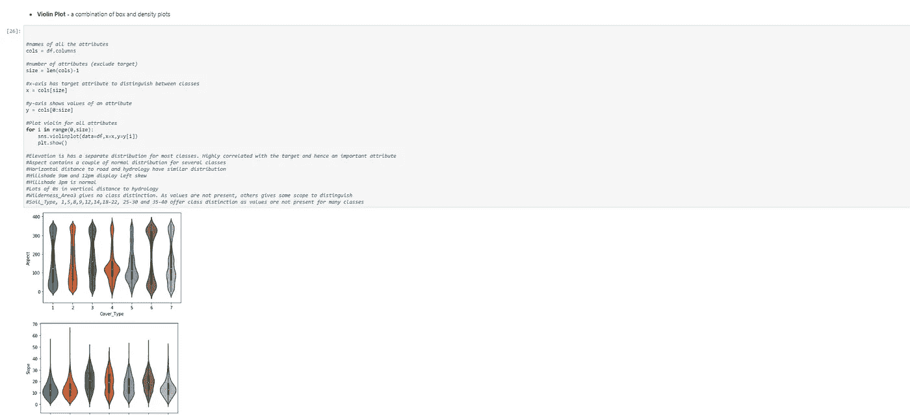

# 森林覆盖多分类深度神经网络非线性激活函数的比较

> 原文：<https://medium.com/analytics-vidhya/comparison-of-non-linear-activation-functions-for-deep-neural-networks-on-forest-cover-59379c084442?source=collection_archive---------16----------------------->

森林土壤类型预测。

**目标**

深度神经网络已经成功地用于各种新兴领域，以解决现实世界中的复杂问题，目前正在开发更多的深度学习(DL)架构。为了实现这些最先进的性能，DL 架构使用激活函数(AFs)来执行任何给定 DL 架构的隐藏层和输出层之间的各种计算。在这里，我们介绍常见类型的非线性激活函数，它们是众所周知的 sigmoid 函数的替代品，然后评估它们的特性。此外，将分析较深的神经网络，因为与较浅的网络相比，它们积极地影响最终性能。它们还严格依赖于权重初始化，因此将分析从高斯和均匀分布中提取权重的效果，特别注意到节点的输入和输出连接的数量如何影响整个网络。

**简介**

广泛使用的主要激活函数是 Sigmoid 函数，然而，当整流器线性单元(ReLU) (Nair & Hinton，2010)被引入时，由于其对不同机器学习任务的积极影响，它很快成为 Sigmoid 函数的更好的替代品。之后，引入了 ReLU 激活函数的不同变体，本实验探索了它们及其对森林覆盖类型数据集的影响。根据严格的制图变量(相对于遥感数据)得出的森林覆盖类型(主要的树木覆盖类型)。给定 30 x 30 米单元的实际森林覆盖类型由美国林务局(USFS)区域 2 资源信息系统数据确定。然后从美国地质调查局和 USFS 获得的数据中推导出独立变量。数据为原始形式(未缩放)，包含定性独立变量(如荒野面积和土壤类型)的二进制列数据。

这个研究区域包括位于科罗拉多州北部罗斯福国家森林的四个荒野地区。这些地区是人类干扰最小的森林，因此现有的森林覆盖类型更多是生态过程的结果，而不是森林管理做法的结果。

**数据集介绍**

研究区域包括位于科罗拉多州北部罗斯福国家森林的四个荒野地区。每次观测都是一个 30 米 x 30m 米的区域。要求您预测森林覆盖类型的整数分类。这七种类型是:

1 —云杉/冷杉 5 —白杨
2 —黑松 6 —花旗松
3 —黄松 7 —克鲁姆霍尔茨
4 —杨木/柳树

训练集(15120 个观察值)包含特征和 Cover_Type。测试集只包含特性。您必须预测测试集中每一行的 Cover _ Type(565892 个观察值)。

o **数据字段**

高程—以米为单位的高程

方位角-方位角的方位角

斜率-以度为单位的斜率

水平距离水文-距离最近的地表水要素的水平距离

vertical _ Distance _ To _ Hydrology-到最近的地表水要素的垂直距离

水平距离到道路-到最近道路的水平距离

山体阴影 _ 上午 9 点(0 至 255 指数)-夏至上午 9 点的山体阴影指数

山体阴影 _ 正午(0 至 255 指数)-夏至中午的山体阴影指数

山体阴影 _ 下午 3 点(0 至 255 指数)-夏至下午 3 点的山体阴影指数

山体阴影 _ 下午 3 点(0 至 255 指数)-夏至下午 3 点的山体阴影指数

山体阴影 _ 下午 3 点(0 至 255 指数)-夏至下午 3 点的山体阴影指数

horizontal _ Distance _ To _ Fire _ Points-到最近野火着火点的水平距离

荒野区域(4 个二进制列，0 =不存在或 1 =存在)—荒野区域名称

土壤类型(40 个二元列，0 =不存在或 1 =存在)-土壤类型名称

Cover_Type (7 种类型，整数 1 到 7) —森林覆盖类型名称

o **荒野地区有:**

拉瓦荒野地区

纽塔荒野地区

科曼奇峰荒野地区

Cache la Poudre 荒野区

o **土壤类型有:**

1)大教堂系列——岩石露头复杂，极其多石。Vanet——重拍家庭复杂，非常多石。
3)单坡口岩——岩石露头复合体，含碎石。
4) Ratake 家族——岩石露头复合体，含碎石。
5) Vanet 家族——岩石露头复合体，含碎石。
6) Vanet — Wetmore 家族—岩石露头复杂，多石。
7)哥特族。主管——灵活的家庭综合体。
9)特鲁特维尔家族，非常石头。
10) Bullwark — Catamount 家族—岩石露头复合体，含碎石。Bullwark — Catamount 家族—岩石土地复合体，含碎石。
12) Legault 家族——岩石地复合体，多石。
13)卡塔芒特家族——岩石地——布尔沃克家族复合体，碎石地。
14) Pachic 泥硼土—水成土复合体。
15)USFS 土壤和 ELU 调查中未指明。
16) Cryaquolis — Cryoborolis 复合体。
17) Gateview 系列— Cryaquolis 综合体。
18)罗杰特家族，很石头。典型的水晶-硼化学家复合体。
20)典型 cry aquepts——典型 cry aquenls 复合体。
21)典型的 cryakulls——Leigh can 家族，直到底层复合体。
22) Leighcan 家族，直到底层，极其巨砾。
23) Leighcan 家族，直到底层——典型的 Cryaquolls 复合体。Leighcan 家族，极其冷酷无情。
25)利可家族，温暖，极其无情。花岗岩——卡特蒙特家族的复合体，非常多石。利可家族，温暖——岩石露头复杂，多石。利坎家族——岩石露头复杂，多石。科莫—勒高特家族非常复杂，非常多石。科莫家族——岩石地——勒高家族复合体，极其多石。利·坎——卡特蒙特家族的综合体，极其多石。Catamount 族—岩石露头— Leigh can 族复合体，极其多石。Leigh can — Catamount 家族—岩石露头复杂，多石。低温——岩石陆地复合体，极其多石。
35)隐晶岩——岩石露头——隐晶岩复合体。布罗斯家族——岩石地带——cryumbleps 复合体，极其多石。岩石露头——cryumblets——cryorthens 复合体，极其多石。利·坎—莫兰家族——cryakolls 复合体，极其多石。
39)莫兰家族——Cryorthents——利可家族复杂，极其多石。莫兰家族——低温生物——岩石陆地复合体，极其多石。

**特征选择的探索性研究**

特征工程是将给定数据转换成更容易解释的形式的过程。在这里，我们感兴趣的是使 ML & DL 模型更加透明，但是可以生成一些特性，以便为没有数据相关背景的人准备的数据可视化更容易理解。然而，学习模型的透明性概念是一件复杂的事情，因为不同的模型通常需要不同的方法来处理不同种类的数据。

**加载数据集**

该数据集包括关于树木类型、阴影覆盖范围、到附近地标(道路等)的距离、土壤类型和当地地形的信息。在这里，加载我们的数据集并导入所有的 python 包，这些包在探索、可视化我们的数据和预测我们的模型时会很有用。

森林土壤类型预测-加载数据集-Ayush

**数据统计**

1.  **Head:** 这是另一个 python 函数 Head()，它给出了我们的数据集的概况，包括 5 个初始行以及所有可用的列。

森林土壤类型预测- **数据统计:head()** -Ayush

**2。** **Shape:** 这是一个 python 函数 Shape()，它决定了数据框的大小，我们可以看到 581012 个实例有 54 个属性。这也给出了一个明显的确认，即我们的数据集被成功加载，因为它与数据描述相匹配。

森林土壤类型预测- **数据统计:shape()- Ayush**

**3。** **数据类型:**通过函数 info()探索数据类型，该函数提供了许多关于数据集的其他见解。

森林土壤类型预测- **数据统计:info() -Ayush**

每列有 581012 个条目

我们可以看到所有列都被推断为 int64。

没有空值，所以使用任何缺失值技术(例如，估算)都是没有意义的。

我们数据集的总内存使用量是 243.8 Mb。

**4。** **统计描述:**这可以通过 describe()函数来实现，该函数计算与数据框列相关的统计摘要。此函数给出平均值、标准差和 IQR(四分位范围)值。这个函数排除了字符列(尽管我们的数据集没有任何字符列)并给出了关于数字列的摘要。

森林土壤类型预测- **数据统计:统计描述-ayu sh**

没有属性丢失，因为所有属性的计数都是 581012。因此，可以使用所有行。

Vertical_Distance_To_Hydrology 中存在负值。因此，一些测试如卡方检验不能使用。

荒野面积和土壤类型是一次性编码的。因此，它们可以被转换回来用于一些分析

所有属性都有一些不同的值，没有常量属性，因此删除任何列都没有意义。

所有的标度都不相同，因此，对于某些算法来说，重新标度和标准化可能是必要的。

**5。** **偏斜度:**在概率论和统计学中，偏斜度是一个实值随机变量的概率分布关于其均值的不对称性的度量。偏斜值可以是正的或负的，也可以是未定义的。偏斜度是统计分布中的不对称，其中曲线向左或向右出现扭曲或偏斜。偏斜度可以被量化以定义分布与正态分布的不同程度。

森林土壤类型预测- **数据统计:偏度-Ayush**

接近 0 的值显示出较小的偏斜

Soil_Type 中的几个属性显示出很大的倾斜。因此，如果偏斜得到纠正，一些算法可能会受益。

**6。** **类分布:**类分布是确定所有类是否有相同数量的实例的方法。不平衡的类分布，这是一种属于一个类的观察值的数量明显低于属于其他类的观察值的情况。

当面对不平衡数据集时，学习算法往往产生不令人满意的分类器。对于任何不平衡数据集，如果要预测的事件属于少数类，且事件发生率小于 5%，通常称为罕见事件。

森林土壤类型预测- **数据统计:类别分布(1)- ayush**

森林土壤类型预测- **数据统计:类别分布(2)- Ayush**

类别 4(在“Cover_type”中具有最低的类别外观):2747

观察总数:581，102

第 4 类的百分比:0.47

四班正在进行<1 percentage of presence.

· Classes 3, 4, 5, 6, 7 are having a very low presence in comparison to Classes 1 & 2 in ‘Cover_type’.

Here, we distributed each class with the same number of rows & columns to make imbalance class distribution ineffective.

**探索性数据分析**

**PCA(主成分分析)**

复杂数据分析中的一个常见问题来自于大量的变量，需要大量的内存和计算能力。这就是主成分分析(PCA)的用武之地。这是一种通过[特征提取](https://en.wikipedia.org/wiki/Feature_extraction)来降低特征空间维数的技术。

森林土壤类型预测-探索性**数据分析:PCA- Ayush**

**数据整合**

**1。** **关联:**

相关性表明两个属性之间的关系。

相关性需要连续的数据。因此，忽略 Wilderness_Area 和 Soil_Type，因为它们是二元的。

森林土壤类型预测- **数据整合:相关性- Ayush**

2.**散点图(结对图):**散点图非常直观，但功能强大。只需绘制样本中每个数据点的纵坐标和横坐标，即可得到其散点图。如果关系是非线性的，或者可能存在异常值，这些目标将在散点图中可见。在许多特征即尺寸的情况下，可以使用散点图矩阵。

森林土壤类型预测- **数据整合:散点图(1)- Ayush**

森林土壤类型预测- **数据整合:散点图(2)- Ayush**

这些图显示了点属于哪个类。图中的类别分布重叠。

山丘阴影图案相互之间形成了漂亮的椭圆形图案。

坡向和山形阴影形成了一个 s 形图案。

到水文的水平和垂直距离给出了一个几乎线性的模式。

**数据可视化**

**1。** **热图:**热图将变量作为行标题和列标题，变量与变量本身在对角线上，这是一种非常强大的方式来可视化高维空间中变量之间的关系。

森林土壤类型预测- **数据可视化:热图- Ayush**

**2。** **箱线图:**以简洁的可视化形式显示分布的基本统计数据。又名烛台阴谋。在金融界也很受欢迎。这也被称为盒须图。这在统计学家中很流行。用于可视化范围。可以横着画。

最大值、第三个四分位数、中值、第一个四分位数、最小值是可以通过箱线图轻松检测到的特征。

盒须图将异常值显示为一个点！

森林土壤类型预测- **数据可视化:**箱线图- **Ayush**

**3。** **配对图:**如果我们想要散点图的 4d 可视化，这就是 seaborn 包中的配对图发挥作用的时候。假设我们在一个数据中有 n 个特征，配对图将为我们创建一个(n x n)图，其中对角线图将是对应于该行的特征的直方图，其余的图是 y 轴中每行的特征和 x 轴中每列的特征的组合。

森林土壤类型预测- **数据可视化:Pair** Plot - **Ayush**

**4。** **LM 剧情:**Seaborn 的每一个剧情都有一套固定的参数。我们有三个强制参数，其余的是可选的，我们可以根据自己的要求使用。这 3 个参数是 X 轴的值、Y 轴的值和对数据集的引用。这三个参数在几乎所有的 Seaborn 地块上都是显而易见的，此外，还有一个可选参数，我希望你记住，因为它非常方便。这是一个**色调**参数，它接受分类列，帮助我们根据色调参数值对数据图进行分组。

土壤类型为 2 的水平距离水文和垂直距离水文。

水平 _ 距离 _ 到 _ 水文&垂直 _ 距离 _ 到 _ 水文与荒野 _ 区域 1。

森林土壤类型预测- **数据可视化:LM** Plot - **Ayush**

**5。** **VIOLIN 图:**VIOLIN 图可以推断为中间的盒图和数据两侧的分布/密度图(核密度估计)的组合。这可以给我们分布的细节，如分布是否是多模态的，偏斜度等。它也给了我们有用的信息，比如 95%的置信区间。

森林土壤类型预测- **数据可视化:Violin** 地块(1) - **Ayush**

森林土壤类型预测- **数据可视化:Violin** 地块(2) - **Ayush**

对于大多数类别，高程都有单独的分布。与目标高度相关，因此是一个重要的属性。

Aspect 包含几个类的几个正态分布

到道路和水文的水平距离具有相似的分布。

山体阴影上午 9 点和下午 12 点显示左侧倾斜。

山影下午 3 点是正常的。

水文的垂直距离中有很多 0。

荒野 3 没有阶级区分。由于不存在值，其他人给出了一些区分范围。

土壤类型 1、5、8、9、12、14、18–22、25–30 和 35–40 提供了等级区分，因为许多等级没有这些值。

**一个热编码属性的分组:**对于没有这种序数关系的分类变量，整数编码是不够的。在这种情况下，可以对整数表示应用独热编码。这是移除整数编码变量并为每个唯一整数值添加新的二进制变量的地方。

森林土壤类型预测- **数据可视化:一热编码(1)** - **Ayush**

森林土壤类型预测- **数据可视化:一热编码(2)** - **Ayush**

WildernessArea_4 对于 cover_type 4 来说很有存在感。很好的阶级区分。

《荒野大镖客 _3》没有太多的阶级区分。

土壤类型 1–6、10–14、17、22–23、29–33、35、38–40 提供了许多等级区别，因为一些的计数非常高。

**数据清理**

删除不必要的列:我们的数据集中可能有一些列对任何预测都没有帮助，因为它们没有任何特定的独特值来使它们变得更重要，只是在这里制造一些噪音。这可以通过计算每列的标准偏差来确定，我们已经通过**的**统计描述做到了这一点。

添加常量列，因为它们对预测过程没有帮助。

去除标准差等于零的那些。

没有任何列具有该标准，因此没有必要删除任何列。

森林土壤类型预测- **数据清理** - **Ayush**

**数据准备**

1.  **标准化(标准标量):**标准标量背后的想法是，它将转换您的数据，使其分布的平均值为 0，标准差为 1。给定数据的分布，数据集中的每个值将减去样本平均值，然后除以整个数据集的标准偏差。

森林土壤类型预测- **数据准备:标准化(1)** - **Ayush**

森林土壤类型预测- **数据准备:标准化(2)** - **Ayush**

**2。** **归一化:**归一化是数据科学中使用的方法之一，用于将数据集中的要素调整到相同的比例。当您规格化一个特征时，所有的特征值将在 0 到 1 的范围内。

选择需要规范化的数字列。

规范化培训数据。

将 numpy 数组转换为数据框。

通过使用训练集的平均值和标准差来标准化测试数据。

森林土壤类型预测- **数据准备:归一化(1)** - **Ayush**

森林土壤类型预测- **数据准备:归一化(2)** - **Ayush**

森林土壤类型预测- **数据准备:归一化(3)** - **Ayush**

**评估、预测和分析**

本研究旨在分析广义 MLP 体系结构的性能，该体系结构具有一种反向传播算法，该算法对隐含层和输出层的神经元使用不同的激活函数。用于实验比较 Sigmoid、Tanh、ReLU 和 Softmax。

用于将单元(神经元)的激活水平转换成输出信号的激活函数。人工神经网络(ANN)使用了几种常见的激活函数。多层感知器(MLP)的激活函数的最常见选择是在研究和工程中用作传递函数。这种流行的原因之一是它在单位区间内的有界性、函数及其导数的快速可计算性以及逼近论领域中的几个可修改的数学性质。然而，考虑到 MLP 应用的问题领域的巨大多样性，怀疑特定的问题需要单个或一组特定的激活函数是有趣的。

这里，我们不能使用 sigmoid 激活函数。我们的数据集输出层有 7 个不同的类要确定，这意味着这是一个多分类任务，但 sigmoid 是一个二进制分类算法，因为它只是将输出转换为 0 或 1。

由于消失梯度问题，sigmoid 和双曲线正切激活函数不能用于具有许多图层的网络。

除了 sigmoid 激活，我们可以使用 softmax 激活函数，它在构建多分类器方面非常有用，因为它是一种逻辑回归形式，可以将输入值归一化为值的向量，该向量遵循总和为 1 的概率分布。

应该注意的是，softmax 并不像 Sigmoid、Tanh & ReLU(校正线性单位)那样理想地用作层之间的激活函数，所述层可以是多个层或者仅仅是单个层，而是用作输出层。

**1。** **通过** **ReLU(校正线性单元)验证数据:**梯度下降的解决方法是使用校正线性激活函数，简称 ReL，主要思想是让梯度不为零，最终在训练时恢复。实现这种激活功能的节点或单元被称为整流线性激活单元或简称为 ReLU。通常，将整流器功能用于隐藏层的网络被称为整流网络。ReLU 在计算上比 tanh 和 sigmoid 便宜，因为它涉及更简单的数学运算。当我们设计深度神经网络时，这是一个很好的考虑点。整流线性激活函数是一个简单的计算，它直接返回作为输入提供的值，如果输入等于或小于 0.0，则返回值 0.0。

在 ReLU 作为中间层的神经网络中，Softmax activation 非常适合用作输出层(因为它将输入值归一化为值的向量，该向量遵循总和为 1 的概率分布)。

森林土壤类型预测- **数据预测:验证 ReLU** - **Ayush**

由于 Y 变量是多类分类变量，因此使用 softmax 作为激活函数，使用稀疏分类交叉熵作为损失函数。

使用 2 层，在两个隐藏层上有 64 个神经元，在输出层上有 8 个神经元。

我们使用所有训练示例的 26 个时期，一个向前传递和一个向后传递。

这里，我们将该模型的 batch_size 设为 60，这是一次向前/向后传递中的训练样本数。批量越大，需要的内存空间就越大。

*可视化培训历史*

森林土壤类型预测- **数据预测:可视化热鲁(1)** - **阿尤什**

森林土壤类型预测- **数据预测:可视化 ReLU(2)** - **Ayush**

**2。** **通过 Tanh 验证数据:**双曲正切激活函数。这部分是由于这样一个事实，即如果一个强负输入被提供给逻辑 sigmoid，它输出的值非常接近零。像逻辑 sigmoid 一样，tanh 函数也是 sigmoid(“s”形)，但输出该范围内的值。它的输出范围从 0 到 1，通常被解释为概率(比如逻辑回归)。双曲正切函数是对逻辑 sigmoid 的重新调整，其输出范围为-1 到 1。

优点是负输入将被映射为强负输入，而零输入将被映射到双曲正切图中的零附近。

森林土壤类型预测- **数据预测:验证 TanH(1)** - **Ayush**

森林土壤类型预测- **数据预测:验证 TanH(2)** - **Ayush**

这个函数是可微的。

函数是单调的，而它的导数不是单调的。

我们在输入层使用 54 个神经元，因为所有列的大小相同。

这里 100 个神经元被放置在 4 个隐藏层中& softmax 函数被用在输出层中。

我们使用值为 0.2 的 dropout 函数来处理深度学习模型中的正则化。

双曲正切函数主要用于两类之间的分类。

时期数、验证损失、验证准确度、模型实际损失和模型实际准确度。

*训练和验证准确性*

森林土壤类型预测- **数据预测:*训练和验证精度* TanH** - **Ayush**

*模型精度*

森林土壤类型预测- **数据预测:可视化/模型精度 TanH** - **Ayush**

**结论**

在这项研究中，我们使用了 3 个传统的可微的和单调的激活函数来研究 MLP 建筑的演变以及广义 Delta 规则学习。这些被提出的众所周知且有效的激活函数是 TanH、ReLU & Softmax。仿真结果表明，ReLU(校正线性单位)函数比其他函数具有更好的识别精度。换句话说，当激活函数的“ReLU-Softmax”组合用于隐含层和输出层的神经元(或节点)时，神经网络计算出良好的结果。使用 softmax 层作为隐藏层是不可能的，因为我们必须保持所有节点(隐藏变量)线性相关，这可能会导致许多问题和较差的泛化能力。

*   ReLu 的计算开销比 tanh 小，因为它涉及更简单的数学运算。
*   Softmax 用于输出层，而不是隐藏层。
*   “Tanh-Softmax”组合比“Tanh-Tanh”组合给出了更好的结果，准确率为 61%。
*   ReLU-Softmax 的组合提供了最好的结果，具有 100%的完美准确性。
*   规范化和标准化有助于算法达到这些良好的精度。