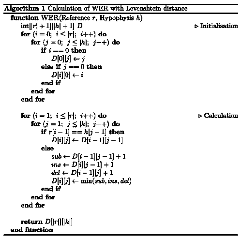
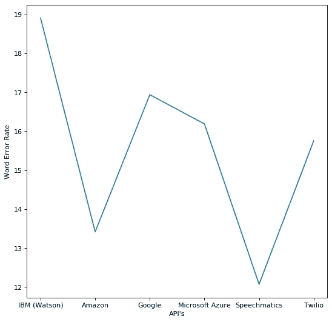

# 语音与文本 API 的比较

> 原文：<https://medium.com/analytics-vidhya/comparison-of-speech-to-text-apis-d8e0410ec924?source=collection_archive---------6----------------------->

[亚历山大·奈特](https://unsplash.com/@agkdesign?utm_source=medium&utm_medium=referral)在 [Unsplash](https://unsplash.com?utm_source=medium&utm_medium=referral) 上拍照

语音到文本系统是自然语言处理和干净的、人类可读的抄本的关键中间步骤。音频语音识别(ASR)是广阔的机器学习领域中要求最高的领域之一。随着模型每次迭代误差的减少，竞争达到了顶峰。手动抄写逐渐被机器所取代，机器有犯错的空间，但不是几乎为零，这是由人提供的。为了让机器理解我们，反之亦然，迫切需要语音处理。

你可以看到语音识别和人工智能的状态仍然有一段路要走，以匹配人类的能力。为了缩小这一差距，我们将寻求语音识别技术的进步，解决现有的准确性和安全性问题，并完全作为嵌入式解决方案运行。

要使用语音识别，您不必接受自然语言处理方面的培训，您只需要使用一个已经存在的用于音频语音识别的 API。加载带有音频/视频的 HTTP 请求，将其发送到 API 的服务器，您将收到脚本响应。

如果你对创建自己的语音处理机器感兴趣，这将需要大量的培训、时间和数据，并且不要忘记一个迎合你理想需求的模型。

四大已经为我们提供了近乎完美的语音处理 API*，那么为什么我们还需要看看其他的 API* ？

除了四大提供的 API 之外，还有许多 API 具有相当的效率。

下面是我比较过的 API 列表。

*   IBM 沃森
*   亚马逊转录
*   谷歌云
*   微软 Azure
*   演讲术
*   特维利奥

我做的比较是基于[单词错误率](https://en.wikipedia.org/wiki/Word_error_rate)

# **单词错误率**

单词错误率是比较音频语音识别的常用指标。它将一个参考与一个假设进行比较

## 单词错误率= (S + I + D) / N

在哪里

*   s 是取代的次数，
*   d 是删除的数量，
*   I 是插入的次数
*   n 是参考文献中的字数

> 参考:部分单词
> 假设:单词总和
> 
> 这种情况下正在发生“替代”。“Some”被“Sum”代替。

WER 计算基于字级的 [Levenshtein 距离](https://en.wikipedia.org/wiki/Levenshtein_distance)。

莱文斯坦距离

我制作了一个立体声音响，它有两个独立的音频通道，可以播放 6 个文件，其中只有一个扬声器没有干扰。这种评估不分析翻译错误，因此需要进一步的工作来确定错误的主要来源，并集中任何研究工作。

WER 海图

音频中的扬声器都用三种不同的口音说话；美国人亚洲人英国人。

我计算了每个 API 的平均值，并在此基础上绘制了一个图表。

这些云 API 继续利用客户数据改进其模型。计算出的数据可能与你读到这篇文章时不同。

.

.

.

这是我的第一篇文章，我想继续这样做，同时提高自己。任何关于写得更好或更好的建议都将不胜感激。