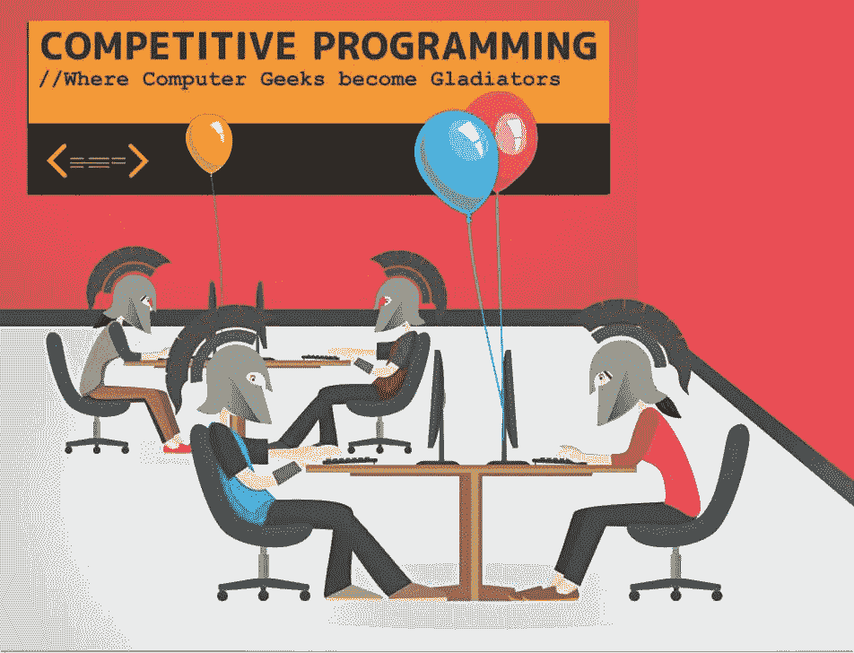
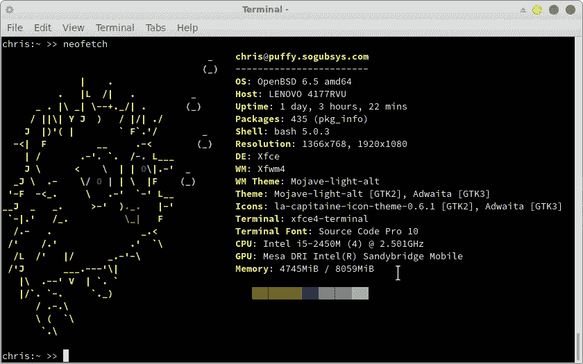
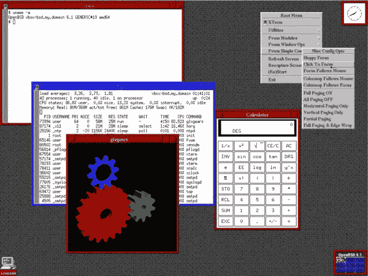
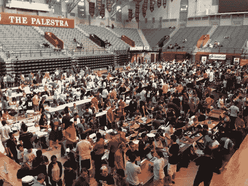
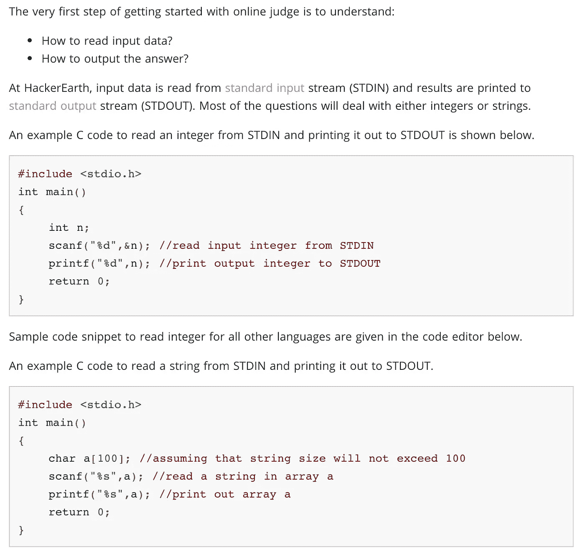
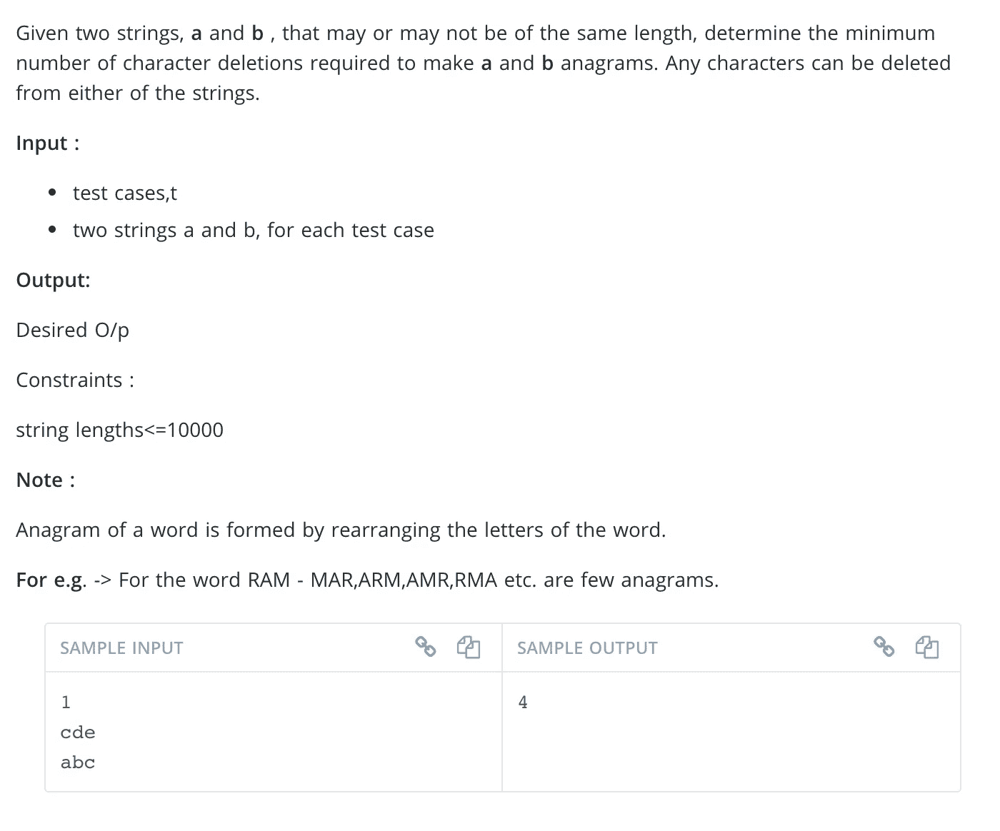
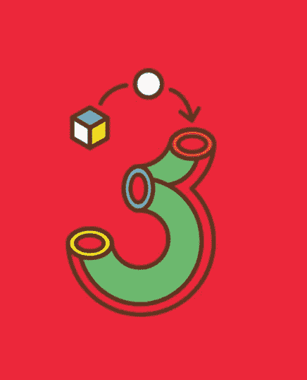
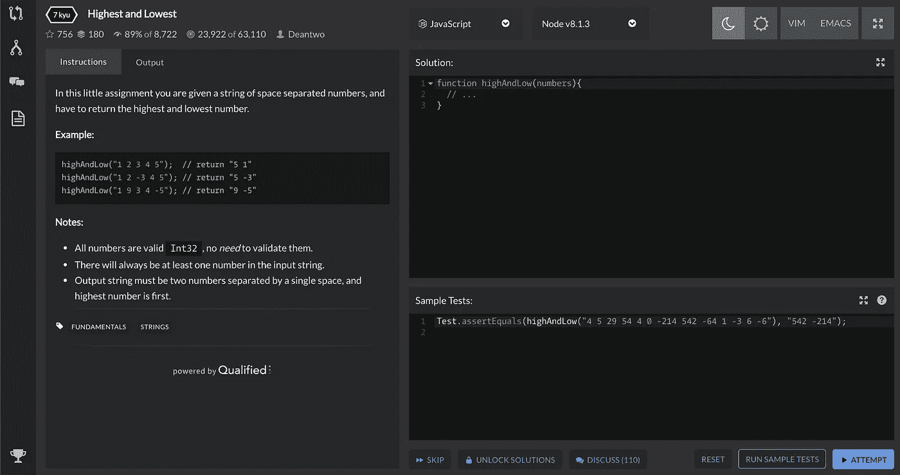

# 竞争性编程

> 原文：<https://medium.com/analytics-vidhya/competitive-programming-a54d13fd4360?source=collection_archive---------11----------------------->

是怎么开始的，又是怎么开始自己的！

在过去的二十多年里，竞争性编程和编码越来越受欢迎，它给了学生一种方式，不仅可以炫耀他们的能力，还可以与世界分享令人惊叹的项目。在这一点上，甚至有[大联盟黑客](https://mlh.io/)组，学生可以加入并成为这些大型活动和会议的一部分！虽然竞争激烈，但该社区实际上是相当开放和支持的。任何人都可以免费参加，一个人甚至不必是程序员也可以享受制作出来的项目；参赛者的背景在技能水平和年龄上各不相同，这使得整个大会看起来更受欢迎。

# 这一切是如何开始的？

大多数人认为竞争性编程始于 OpenBSD，OpenBSD 是一群程序员，他们开发了同名的免费开源操作系统。随着该公司开始举办自己的小型活动，聚会从尼尔斯·普罗沃斯那里获得了“黑客马拉松”的名称。这个小组将提出复杂的问题，用特定的编程语言来解决，或者提出困难的数字问题，用算法来回答。由于时间框架、计算机处理速度以及缺乏易于构建网站的框架(比如 2004 年首次推出的 Ruby Rails)，一切都受到了限制。因此，项目最终进展缓慢，挑战有时会持续整整 24 小时，团队需要轮班(…或者不轮班)。

终端中的 OpenBSD

OpenBSD 是美丽的❤

# 那么现在它发生了什么呢？

随着面向消费者的 Ruby on Rails 和 Amazon Web Services 的出现，黑客马拉松开始变得更加流行，因为人们可以更快地构建项目，处理更复杂的问题，而不必太担心基本的搭建。

这些黑客马拉松不仅在编程社区变得流行，而且在脸书和谷歌等基于软件的大公司中也很流行，以发放奖励或展示他们的工程师能力。虽然主要针对学生，但这些项目大部分人都能参赛。如前所述，大联盟黑客组织将学生纳入这些比赛，仅今年*半*就有 180 场比赛发生！

虽然社区中的很大一部分人不喜欢黑客马拉松这种时代精神中的持续赞助，但他们有一个共同的目标:创造和被看到。由于免费的东西和他们可以获得的曝光率，许多团体的数量都有所增长，但许多竞争者是因为它开始的原因而存在的，并发现创造力和运动员般的竞争是黑客马拉松的核心和灵魂。广泛的不同团体的成员不断向新来者发布他们的创作和建议，使其成为一个蓬勃发展的程序员社区。成千上万的会员每天都会发布几十个帖子；一些团体甚至超过 30k 个人！

因为这主要是为了给学生一个鼓励的环境，所以很多比赛都很轻松，尽管预计比赛时间会很长。有时，在整整 24 小时的时间里，这些参赛者在休息时一直保持清醒，以完成他们最大能力的挑战。演讲者和赞助商也会出现，让参赛者交谈并从中获得职业信息！虽然不是所有的比赛都这么简单和受欢迎…

# 针对高难度黑客马拉松的训练

一些黑客马拉松不仅仅是为了增长自己的知识和会见潜在的雇主。有比赛和竞争者认真对待这项运动，也有一些给想要参加的人的指南，以及一些在线练习部分，在开始之前可以跳过。

似乎这些竞争被分解成一些层，大多数人都试图大块实现。由于一些黑客马拉松比其他的更难，这是标准的课程进度，在进入每一个层次之前，或者为自己创建特定的分层目标，以知道你将进入哪个层次。

记住；大多数社区非常欢迎各种水平的熟练程度，但一些真正的竞争对手正在寻找有才华的程序员来帮助他们(快！)创造一些他们当年能产生的最好的项目。虽然一些比赛有主题或严格的参数，但许多黑客马拉松仅限于你可以用什么语言编码，有什么工具可用，或者你的团队规模。在这种情况下，拥有广泛的知识和灵活性是关键！

开始你自己的竞争之旅本身就是一个过程，但是这里有一些有用的工具可以让你做好准备，不管你已经编码多年还是决定自己尝试一下。下面我们看到了一个很好的布局，为你可能遇到的练习题和人为的挑战，全部按照难度和主题分开。

这些练习挑战可以在[这里](https://www.hackerearth.com/practice/)找到！

# 第一

问题的一个好的开始部分(无论是在挑战开始时，还是在低水平挑战中)是能够简单地将你的想法转化为代码。这与你可以把你的想法翻译成编码语言的想法是一致的；学会说和写吧！大多数竞赛都是从 Java 或 c++开始的，但是尽你所能去了解它们将有助于你的竞争。在这里，你会发现寻找质数、按特定顺序排列项目、字谜和阶乘等问题。

# 然后

从大多数在线资源来看，下一级是大多数人发现自己在这些比赛中开始感到挑战的地方，涵盖的材料包括搜索算法、哈希、数论等。走到这一步的问题是，您的手不再被握住，您必须在没有被明确告知的情况下自己决定何时实现这些工具。Code Monk 是一个寻找这类问题和解决方案的好地方！

# 然后

这是竞争者开始磨练他们所学技能的地方。现在，您可以读写代码，并在适当的时候使用必要的工具，大多数人说要练习您的动态编程。这是解决你遇到的每个问题的子问题，使你的整个解决方案更干净、更快，一路上没有打嗝。说起来容易做起来难，因为当你着手解决问题时，你需要你的眼睛和耳朵。这一级别的大多数问题也可以用线性数组数据结构来解决，但这是解决方案变得更加复杂并需要了解其他数据结构的地方。

在这一点上，任何人都可以说你是一个值得称赞的开发人员和程序员，所以继续编码，在低级别的挑战中竞争。大多数比赛都是免费的，就像学习任何其他语言、乐器或新技能一样，重要的是尽可能多地在这些环境中继续练习！处理时间压力和更好地调试将会在未来的比赛中为你节省很多潜在的错误，并让你在比赛中保持领先。

# 最后

从你的错误中学习，并在你自己的时间里重复正确的解决方案。看看其他人在比赛后发表了什么，或者其他人是如何利用自己的时间解决相同类型的问题的。阅读其他程序员的代码总是会让你接触到你可能从未想过的新解决方案！开始用图形知识工作，并牢记 Big O 简化您的代码，并在与不同编码的团队合作时准备好灵活性，这样您就可以领导他们，而不是在试图快速完成挑战时被教导他们的方式。

有大量不同的在线资源可供那些希望为黑客马拉松或仅仅是为了挑战自己而改进代码的人使用！我最喜欢的一些如下:

上面列出的是 CodeWars，每天都有挑战和大量不同的语言供你筛选！它像一个游戏一样给你排序，用你选择的语言向你抛出不同的容易到复杂的问题，让你编码并实时看到结果。还有一个强大的在线社区，可以看到针对复杂问题的不同解决方案的论坛！

hackerrank 也是一个做同样事情的好网站，但也可以参加在线比赛，看看你的表现如何。该网站允许你也做免费的课程，就像上面这个给你一个很好的编码面试大纲！

这些在线资源对大型社区是免费的，甚至像 Codecademy 这样的付费服务也有免费课程，让你在付费前先体验一下。编程的伟大之处在于大量的免费在线课程和游戏可以提高你的知识，以及加入巨大的在线社区进行协作(或者只是爬行并找到很酷的新解决方案:)我们都这样做。

如果你刚刚开始接触黑客马拉松，这一切可能有点令人不知所措，但这似乎是一个不断增长和不断变化的社区，所以试试吧！也有主题黑客马拉松，如 GameJam，它允许你与团队合作，快速编码视频游戏。以上是来自 2019 年的一些最佳亮点！鼓舞人心和酷的东西！

练习的最好方法是用其他人在在线社区中写的练习题来为自己准备常见的问题，或者只是帮助自己更好地使用代码。