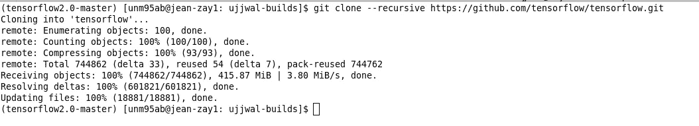
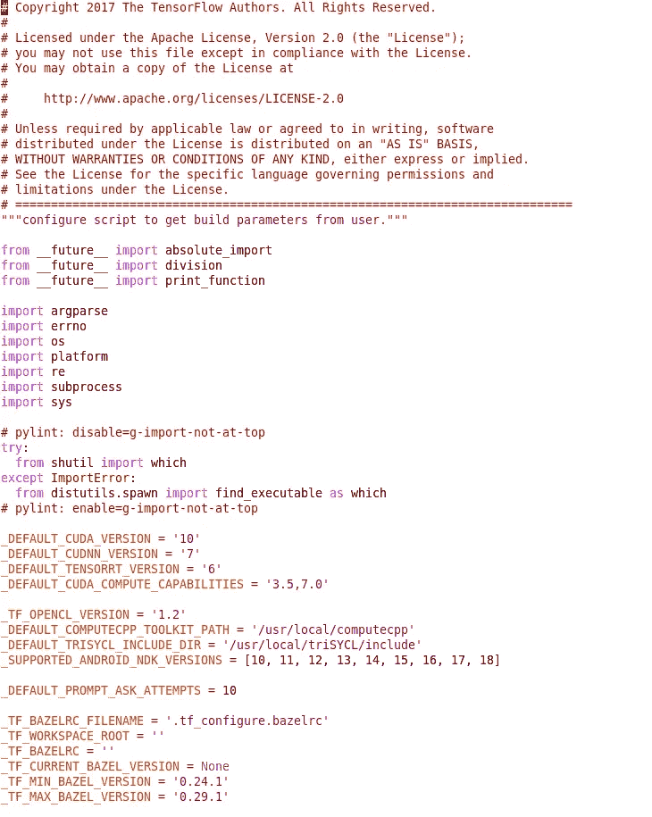
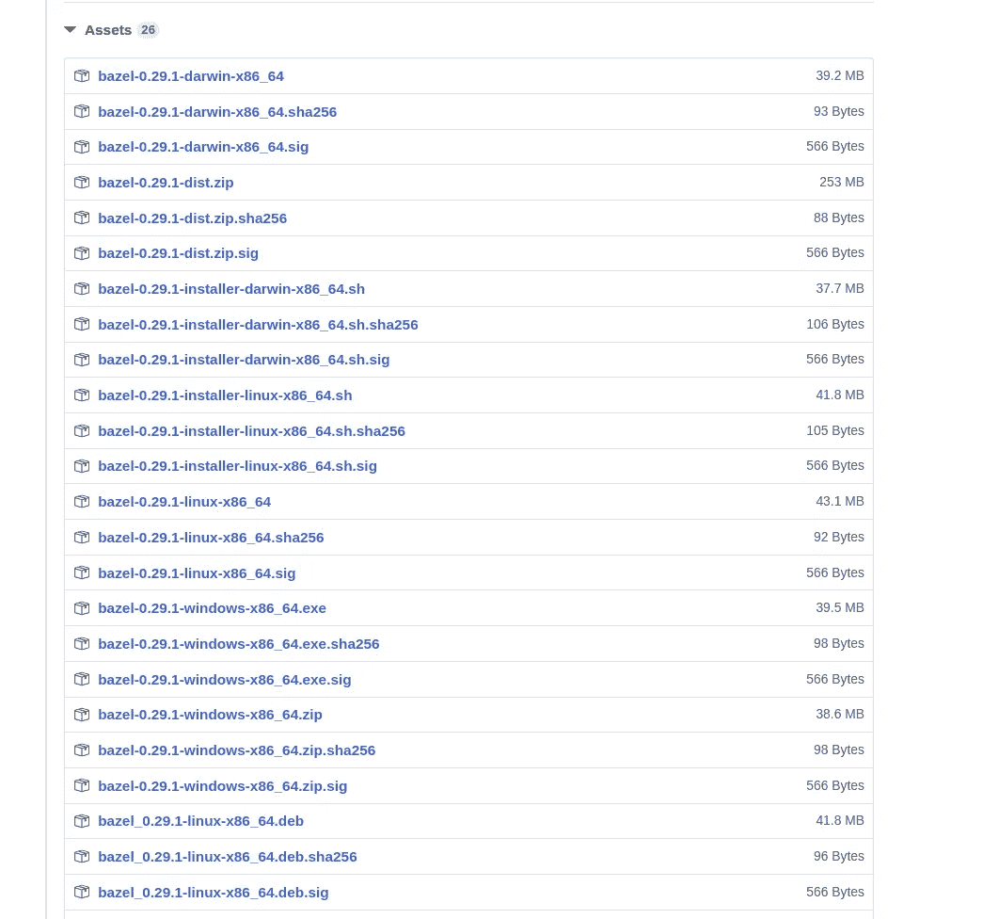
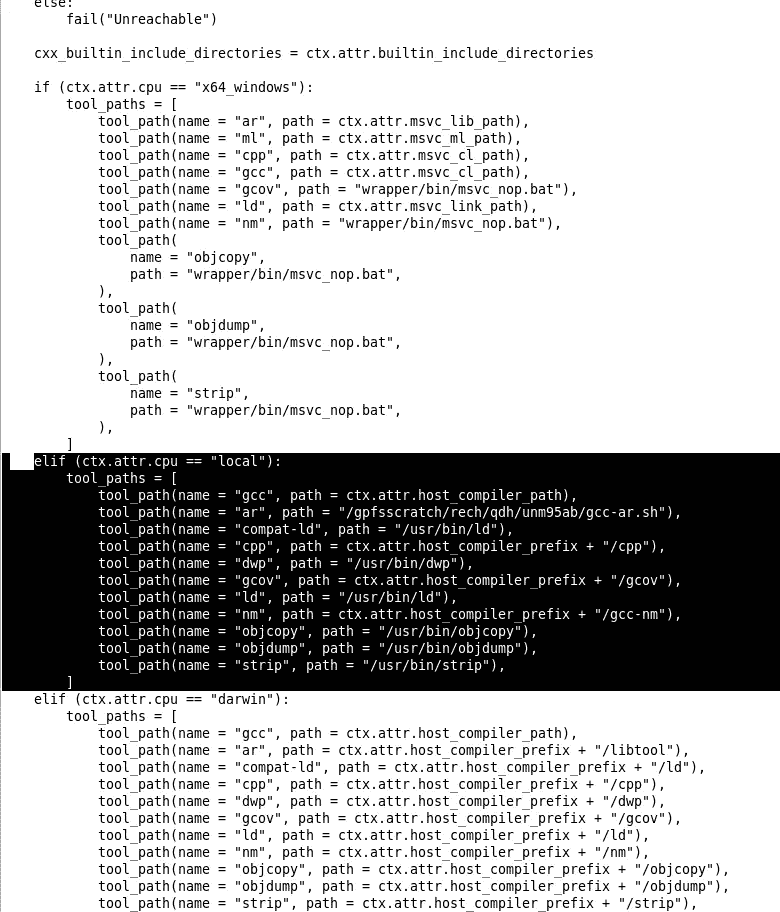

# 当编译器位于非标准位置时，从源代码编译 TensorFlow。

> 原文：<https://medium.com/analytics-vidhya/compiling-tensorflow-from-the-source-when-your-compiler-is-in-a-non-standard-location-194fecc92153?source=collection_archive---------5----------------------->

从源代码编译 TensorFlow 是设置针对您的系统优化的 TensorFlow 的一种很好的方式。如果您小心翼翼地为其提供正确的编译器选项，编译将确保您的 TensorFlow 构建尽可能充分利用您的系统配置(例如:- CPU 特性、NUMA 等)。).然而，对于大多数人来说，从源代码编译 TensorFlow 并不总是那么简单。在这篇文章中，我用例子描述了完整的步骤序列，描述了如何从 TensorFlow 的源代码编译 tensor flow。

在我继续之前，我想让你看一下我是如何写这篇文章的。我在一个没有 root 权限的计算集群上工作。系统上默认的系统编译器是 GCC 4.8.5，不适合编译 TensorFlow 2.0，因为 TF2.0 build 使用了 GCC 4.8.5 不支持的`std=c++14`标志进行编译。系统上还有其他可用的编译器，但是它们安装在其他非标准的位置。通过大量的反复试验和社区的帮助，我终于能够理解 TensorFlow 的编译机制。这篇文章将所有的信息浓缩在一篇文章中，这样其他人就不会遇到我所面临的同样的问题。

在继续这篇文章的其余部分之前，我们做如下假设:

> 您使用的是 Linux 发行版。

# 步骤 1:设置独立的 Python 环境

有两种基本方法可以设置独立的 python 环境。

*   Virtualenv，
*   蟒蛇环境。

选择哪一个基本上是你的事，也就是用户的事。如果你想了解更多关于这个话题的信息，我建议你通过[这篇文章](https://towardsdatascience.com/which-python-package-manager-should-you-use-d0fd0789a250)。我个人使用 anaconda 环境。

建立一个专用的环境是有益的，因为不同环境中的包和文件不会互相干扰。这意味着您可以在不同的环境中维护同一个库的多个版本，甚至不同的库。我经常遇到这种情况，因为有些代码是专门为 TensorFlow 或 PyTorch 的特定版本编写的。

在本文的剩余部分，我假设您已经建立了一个名为“ **tensorflow-2.0-master** ”的独立 python 环境。

确保`numpy,scipy,keras_preprocessing`已经在环境中设置。如果没有，请使用`pip install`进行设置。

是的，我们将从它的主分支构建 TensorFlow。然而，这并没有真正的区别，因为您可以按照相同的一组指令来构建 TensorFlow 的任何其他分支。

# 步骤 2:克隆 TensorFlow 源代码

您可以使用以下命令获得 TensorFlow 源代码

`git clone --recursive [https://github.com/tensorflow/tensorflow.git](https://github.com/tensorflow/tensorflow.git)`

这将克隆 GitHub 上的 TensorFlow 存储库



**注意:如果你想编译 TensorFlow 的一个特定分支，你应该检查你想要的分支。这可以使用**来完成

`git checkout <BRANCH_NAME>`

# 步骤 3:找到编译 TensorFlow 所需的 Bazel 版本

TensorFlow 依靠 Bazel 进行构建。Bazel 是一个构建系统。其他构建系统的例子有 CMake、Apache Maven(针对 Java)、Mason 和 Make。随着 TensorFlow 开发的发展，它为其建筑支持一组特定的 bazel 版本。因此，您需要为您试图构建的分支找到支持的 bazel 版本。

在克隆的 tensorflow 文件夹中，打开文件`configure.py`。下面我展示了写这篇文章时这个文件的截图。



您可以看到，有两个变量表示构建张量流所需的 bazel 的最小和最大版本。请注意，根据您尝试构建的分支以及您尝试构建分支的时间(因为 TensorFlow 开发在不断发展！！)，这些版本可能会有变化。因此，在构建 TensorFlow 之前访问这个文件并找出所需的 bazel 版本是一个很好的做法。

`_TF_MIN_BAZEL_VERSION`表示支持的最低 bazel 版本，而`_TF_MAX_BAZEL_VERSION`表示支持的最高 bazel 版本。您可以在这些版本之间选择任何 bazel 版本。在这篇文章的剩余部分，我决定用`_TF_MAX_BAZEL_VERSION`，在我的例子中是`0.29.1`。

# 第四步:安装 Bazel

如果您已经有了想要的 bazel 安装版本，您可以跳过这一步，否则请继续阅读这一步。

你可以通过[这个链接](https://github.com/bazelbuild/bazel/releases)获得 bazel 所有版本的列表。通过点击它的版本号来选择想要的版本，你将会看到一个选项列表，如下所示。



在写这篇文章的时候，我想我也应该向您展示如何编译 bazel。为了编译 bazel，你应该下载它的`dist`包。它将在列表中被命名为`bazel-<VERSION>-dist.zip`。下载`zip`文件并解压(解压时，请务必指定解压到的文件夹，否则 zip 中的所有文件都会解压到与`zip`文件相同的位置，会很混乱。所以，使用一个命令，比如`unzip bazel-0.29.1-dist.zip -d bazel-0.29.1`。

解压缩后，进入文件夹内部(在我的例子中是`bazel-0.29.1`，并键入`./compile.sh`。这将编译 bazel 并在`output`子文件夹中给你一个二进制文件。将这个`output`子文件夹添加到路径中(使用`export PATH=<PATH_TO_output_FOLDER>:$PATH`)。

现在，您已经成功设置了 bazel，并准备编译 TensorFlow。

# 第五步:在编译 TensorFlow 之前做一些准备

## 导出一些路径

在尝试编译 TensorFlow 之前，您必须设置两条路径— `GCC_HOST_COMPILER_PATH`和`GCC_HOST_COMPILER_PREFIX`。要确定这些路径，请在终端上键入`which gcc`。假设您得到的输出是`/a/b/c/d/bin/gcc`。然后，

。`GCC_HOST_COMPILER_PATH`应该是`/a/b/c/d/bin/gcc`。

。`GCC_HOST_COMPILER_PREFIX`应该是`/a/b/c/d/bin`。

有一点你要记住，上面两条路径应该是真正的绝对路径，而不是符号链接。如果它们是符号链接，那就有问题了。事实是，`bazel`能够在包含头文件时将符号路径解析为真正的绝对路径。然而，由于`GCC_HOST_COMPILER_PATH`和`GCC_HOST_COMPILER_PREFIX`是由用户指定的，`bazel`不会尝试解析这些路径。`bazel`要求你的 GCC 编译器和头文件在同一个父目录下([**详见本期 github**](https://github.com/bazelbuild/bazel/issues/10085))。由于`bazel`没有试图解析上述两个路径，所以在编译过程中，它会给你一个错误，告诉你无法找到头文件的依赖声明。**因此，在指定** `**GCC_HOST_COMPILER_PREFIX**` **和** `**GCC_HOST_COMPILER_PATH**` **之前，请自行解析任何符号链接。**

## 指定工具链

术语“工具链”是指编译器、链接器和其他工具，例如在编译的不同阶段需要的代码覆盖工具。在开始编译之前，Bazel 需要知道这些工具的位置。为此，打开文件`third_party/gpus/crosstool/cc_toolchain_config.bzl.tpl`。

这是一个很长的文件，但是你只需要 [**修改这个文件**](https://github.com/tensorflow/tensorflow/blob/master/third_party/gpus/crosstool/cc_toolchain_config.bzl.tpl#L1406-L1419) 的一小部分。为了清楚起见，我向您展示了这个文件的修改版本(由我为我的编译而修改的)



代码中突出显示的部分是被修改的部分。让我们讨论一下我是如何进行这一修改的:

第一件事是`gcc`。因为我已经提供了一个`GCC_HOST_COMPILER_PATH`作为环境变量(它将在`ctx.attr.host_compiler_path`中反映出来)，所以我不需要修改上面突出显示的代码中的`gcc`部分。

对于其他工具，您可以做的一件简单的事情如下:

假设你想为`objcopy`设置正确的路径。在终端上输入`which objcopy`。如果您得到的输出是`$GCC_HOST_COMPILER_PREFIX/objcopy`，那么您不需要修改那一行，因为它已经被设置为(我向您展示修改后的文件，所以您看不到它，但是如果您看到文件的在线版本，您会看到)`ctx.attr.host_compiler_prefix + "/objcopy"`。请记住，既然您已经指定了`GCC_HOST_COMPILER_PREFIX`，那么它将通过`bazel`反映在`ctx.attr.host_compiler_prefix`中。然而，如果您没有得到作为`$GCC_HOST_COMPILER_PREFIX/objcopy`的`which objcopy`的输出，那么就简单地跳过文件中`which objcopy`的输出，就像我在上面突出显示的文件中所做的那样。

一个例外是`ar`。新版本的`gcc`带有`gcc-ar`，它只是普通老式`ar`的包装。你可以在这篇 stackoverflow 文章中读到更多关于这个 [**的内容。**](https://stackoverflow.com/questions/48777554/what-is-the-difference-between-ar-nm-and-gcc-ar-gcc-nm) 因此，如果您在`$GCC_HOST_COMPILER_PREFIX`中看到`gcc-ar`和/或`gcc-nm`，那么请指定不是系统安装的`ar`通常出现在`/usr/bin/ar`中，但`gcc-ar`仍会调用它。

关于`gcc-ar`的另一件事是，当提供一个参数文件作为参数时，它会给出问题( [**详情请见此 GitHub 问题**](https://github.com/bazelbuild/bazel/issues/3760#issuecomment-444120226) )。所以，如果你简单地指定`gcc-ar`，你会在编译过程中收到报错`/usr/bin/ar: invalid option — ‘@'`。在刚刚讨论的 GitHub 问题中已经讨论了该变通方法。解决方法是围绕`gcc-ar`创建另一个简单的包装器脚本。包装器脚本应该将参数文件中的参数直接提供给`gcc-ar`。下面的例子将使它更清楚:

Bazel 在编译期间将尝试运行如下命令:

```
/gpfs7kro/gpfslocalsup/spack_soft/gcc/8.3.0/gcc-4.8.5-opnwtdjumg2hxo4ljvnx77ugb6afmvj3/bin/gcc-ar [@bazel](http://twitter.com/bazel)-out/host/bin/external/libjpeg_turbo/libjpeg.a-2.params
```

这里，以`@`开始的第二个参数实际上是一个参数文件，应该由`gcc-ar`读取，以便将指令传递给`ar`。但不幸的是，由于某种原因，它没有正确读取它，并给出了一个关于符号`@`的错误。因此，在我们的包装器脚本中，我们只需自己读取参数，并将其直接传递给调用`ar`的`gcc-ar`。以下是我写的包装脚本( [**向 GitHub issue**](https://github.com/bazelbuild/bazel/issues/3760) 致谢):

```
#!/usr/bin/env bashGCC_AR_PATH=/gpfs7kro/gpfslocalsup/spack_soft/gcc/8.3.0/gcc-4.8.5-opnwtdjumg2hxo4ljvnx77ugb6afmvj3/binARGS=$1
FILENAME=”${ARGS:1}”$GCC_AR_PATH/gcc-ar $(<$FILENAME)
```

必须使用`chmod +x`使该脚本可执行。这个脚本的完整路径是您应该在上面文件中的`ar`处指定的路径。

# 第六步:进行编译

现在，您只需在 tensorflow 文件夹中执行`./configure`并选择呈现给您的选项(如 CUDA 路径等)。完成后，只需使用以下命令:

```
bazel --output_user_root=../ujjwal_bazel_gcc8 build -s --config=opt --config=mkl --config=numa --cxxopt=”-D_GLIBCXX_USE_CXX11_ABI=0" --config=mkl //tensorflow/tools/pip_package:build_pip_package --verbose_failures
```

关于上述命令的一些注意事项:

a)我用过`config=mkl`和`config=numa`。您可以选择其他选项集。在这一点上，这是你的决定。

b)默认情况下，bazel 将使用您的个人文件夹进行缓存。TensorFlow 构建期间的缓存会占用大量空间。因此，如果您的主文件夹中没有太多空间，请指定`--output_user_root`作为缓存的文件夹。

c)我用过`--cxxopt="-D_GLIBCXX_USE_CXX11_ABI=0`。我已经在 TensorFlow 网站上使用了下面的说明，上面说如果你使用 GCC 5 或更高版本进行构建，你应该使用这个选项。

d)`-s`选项确保 bazel 在执行命令前打印完整的命令。当您遇到某个问题并希望向他人提供信息来帮助您调试时，这真的很有帮助。 [**感谢 bazel 开发者建议我在本期 GitHub 中使用这个**](https://github.com/bazelbuild/bazel/issues/10085) 。

编译完成后，使用`bazel-bin`命令创建`whl`文件，如下所示:

```
./bazel-bin/tensorflow/tools/pip_package/build_pip_package ./tensorflow_pkg
```

这里的`./tensorflow_pkg`是将创建`whl`文件的文件夹的路径。

一旦创建了`whl`文件，通过键入`pip install --ignore-installed <FULLPATH TO THE WHL FILE`来设置它。

希望这篇帖子对试图从 TensorFlow 的源代码编译 tensor flow 的人有所帮助。如果您有任何建议和问题，我将不胜感激。