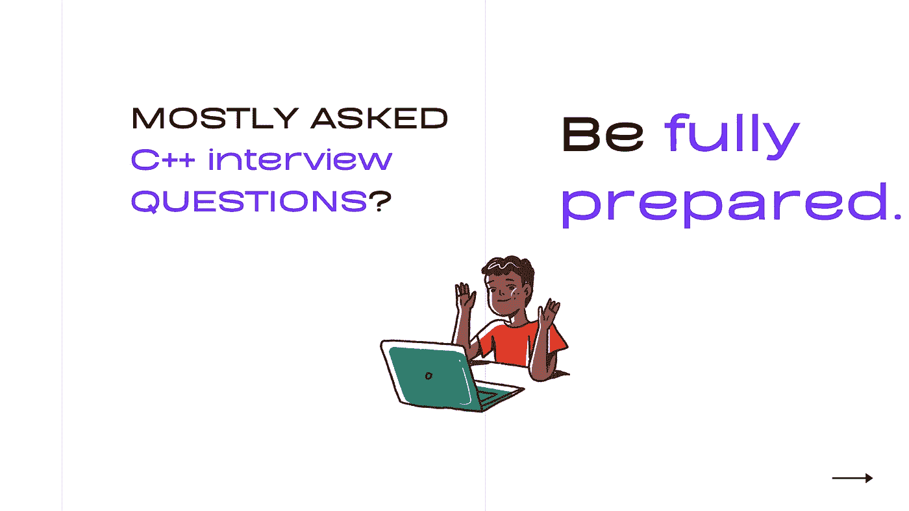

# 完成 C++面试问题和答案

> 原文：<https://medium.com/analytics-vidhya/complete-c-interview-questions-answers-8dc1fbe5b06b?source=collection_archive---------7----------------------->

本文涵盖了 c++中最常见的面试问题以及对每个问题的简要解释。

**1。什么是哎呀？**

面向对象编程是一种基于类的“对象”概念的编程范式，对象可能包含字段形式的数据和方法形式的相关代码。这些对象可以访问它们自己的过程…