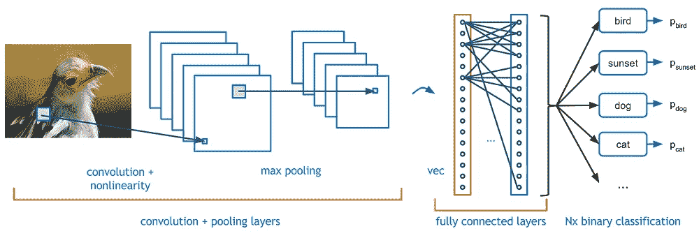

# 完整的深度学习路线图

> 原文：<https://medium.com/analytics-vidhya/complete-deep-learning-roadmap-8748c0475dc1?source=collection_archive---------1----------------------->

在这篇小文章中，我将指导你如何按顺序学习深度学习。深度学习的范围很广，但是通过适当的技术或计划，你可以很容易地学会，所以让我们深入研究一下。

首先你必须了解什么是深度学习，我们在深度学习的帮助下解决了什么问题，**深度学习有哪些不同的类型或技术**，这样你心里就有一个清晰的画面，为什么深度学习会用在**数据科学**或**人工智能领域。**

**深度学习**:深度学习是一种人工智能功能，它模仿人脑处理数据的工作方式，用于检测物体、识别语音、翻译语言和做出决策。**深度学习**人工智能能够在没有人类监督的情况下学习，从非结构化和无标签的数据中提取数据。

所以你对什么是**深度学习**以及为什么在人工智能和数据科学中使用它有一个清晰的想法。让我们来看看我们的议程，了解一下**深度学习中正确的学习模式。**

**神经网络:**

在深度学习中，你首先要学习的是神经网络，神经网络是如何工作的。什么是**输入层**，什么是**隐藏层**，**输出层**，什么是**损失函数**，f **正向传播**和**反向传播**如何工作。

然后来我们第一个深度学习技术叫做**人工神经网络**

**人工神经网络:**在**安**你要学的第一件事就是**安**如何工作。前向传播如何在**安**反向传播如何工作。什么是损失函数，然后您将学习不同类型的优化器，如**梯度下降**、**随机梯度下降**、**阿达格拉德**、 **RMSprop** 、**亚当**优化器如何工作或帮助减少损失函数。有哪些不同的权重初始化技巧。这些是你在深度学习中建立一个概念所必须学习的基本术语。

在了解了所有这些之后，构建一些基于 **ANN** 的项目，并部署在任何云服务上，如 **Heroku** 、 **AWS** 、 **GCP** 、 **AZURE** 。

你还应该学会如何借助 **GPU 在 **Google Colab** 中运行你的**深度** **学习**代码。**

**卷积神经网络:**

卷积神经网络

然后来到 **CNN** 部分 **ANN** 中的一切都是一样的就像损失函数正向传播、反向传播一样，唯一的区别就是在 CNN 中增加了一层叫做**卷积的层，**你需要了解一个**卷积层**是如何工作的。记住 **CNN** 用于图像分类和视频帧等。你将在 **CNN** 学到更多的东西是**滤镜**，如何缩小图像尺寸，我们如何做**数据增强**，什么是**填充**，**跨步**所有这些东西。

下一部分是**迁移学习**

**转移学习:**

迁移学习

在迁移学习中，你会学到一些重要的技巧，如**异常**、 **VGG16、VGG19、**、 **RESNET50、**、 **INCEPTION V3** 以及更多的技巧。我们如何在深度学习项目中使用这些技术所有这些技术都在 **Keras 文档**中有介绍，你可以从中学习。

在涵盖了这些话题之后，现在来谈谈**物体检测部分**

**物体检测:**在物体检测中你会学到一些各种各样的检测物体的技巧有些技巧是 **RCNN** ，**掩蔽 RCNN** ， **SSD** 和 **YOLO** ，你可以从任何地方学到这些东西。

目标检测

完成**后，CNN** 现在来到 **RNN** 部分

**递归神经网络:**

递归神经网络

**递归神经网络** (RNN)是一类**神经网络**，有助于对序列数据建模。在 RNN 你会学到不同的技术，如 **LSTM** 、 **GRU** 、**双向 LSTM** ，然后我们有一些 NLP 技术，如**单词嵌入**、 **word2vec** ，一些高级技术，如**编码器解码器**、**注意力模型**、**变压器**，一些最先进的算法，如 **Bert** 使用**拥抱脸**所有这些你都必须以一种有效的方式来涵盖。

然后在完成所有这些事情之后，借助 **flask** 和**在任意**云平台**中部署**做一些端到端的项目。

我希望这篇文章能帮助你以正确的方式学习深度学习。

祝你好运。