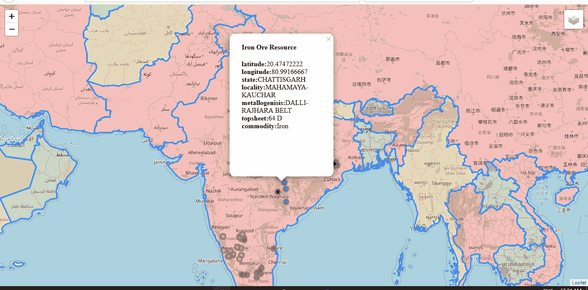
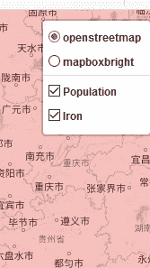
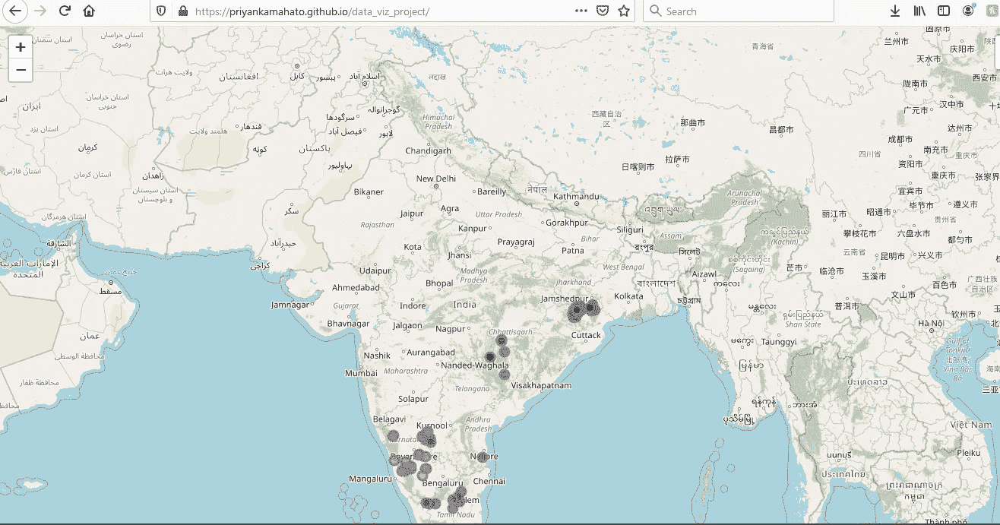
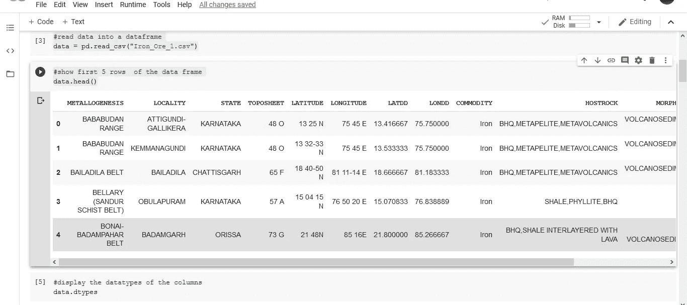
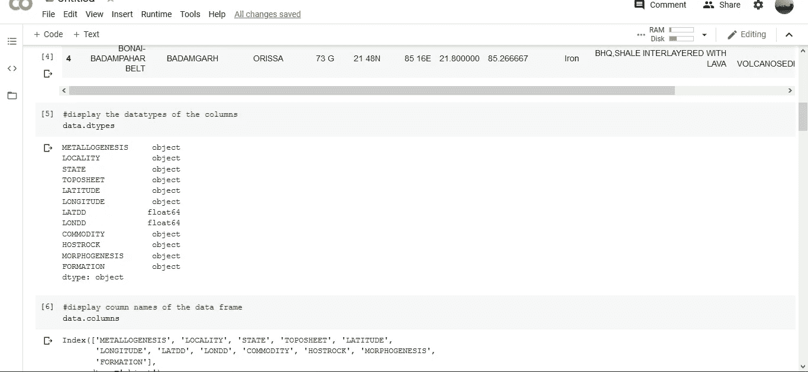
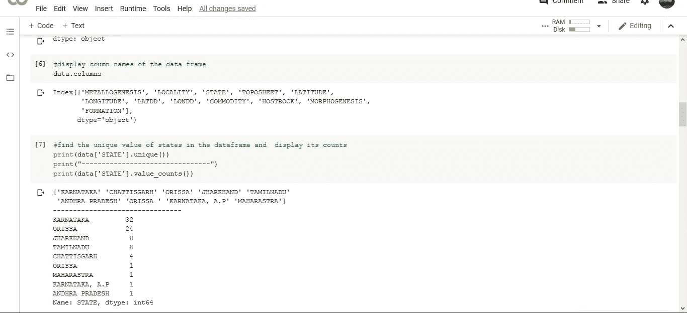

# 面向 Python 初学者的完整的端到端地理数据可视化项目

> 原文：<https://medium.com/analytics-vidhya/complete-end-to-end-geographical-data-visualization-project-for-python-beginners-f977b51afac8?source=collection_archive---------12----------------------->

使用 github 页面托管的 python 中的 follow 包的数据可视化组合项目。

项目的铁矿石视图"*图片由作者*提供

 [## project_working.wmv

我在 drive.google.co github 页面上主持的 python 数据可视化项目的完整工作](https://drive.google.com/file/d/1Kuj-9CJl00Wfwk8DLvDIKnEyfhNHFW_b/view?usp=sharing) 

***Github 回购项目链接:***[***【https://github.com/priyankamahato/data_viz_project】***](https://github.com/priyankamahato/data_viz_project)

***要看一下正在工作的项目点击*** [***本***](https://priyankamahato.github.io/data_viz_project/) ***github 页面网址:***[***https://priyankamahato.github.io/data_viz_project/***](https://priyankamahato.github.io/data_viz_project/)

这个项目是针对已经开始使用 python 的大学生和年轻专业人士的。这是我在学习 python 的第一周做的第一个端到端项目，它让我迷上了这门语言。让我印象深刻的是，通过利用现有的 python 包，我们可以使用如此少的代码行来制作如此视觉上令人印象深刻的项目。

这个项目最好的部分是我们不需要安装 python 或 jupyter/anaconda 来运行它。我已经使用*[***谷歌***](https://colab.research.google.com/) [***合作完成。在这个项目中，我遵循了从公共网站下载数据的完整流程，阅读包，根据我的用例设计地图，创建用于显示数据的弹出窗口，在***](https://www.google.com/search?client=firefox-b-d&sxsrf=ALeKk02-G6QzWvu5UWj_RghK44JdU0c1NQ:1593975451131&q=colaboratory&spell=1&sa=X&ved=2ahUKEwjo_K2k5bbqAhWGxDgGHUdsAfQQkeECKAB6BAgLECc)***[我的 github 配置文件](https://github.com/priyankamahato/data_viz_project)中创建 repo 代码，使用 [github 页面](https://pages.github.com/)以 html 文档的形式发布项目。****

# *项目的主题和目的:*

*1)通过这个项目，我想展示印度主要的铁矿石资源点及其在不同邦的属性。*

*2)该项目还有一个名为“人口”的选项，以红色显示人口超过 5000 万的国家，以橙色显示人口在 2000 万到 5000 万之间的国家，以绿色显示人口不到 2000 万的国家。*

*3)该项目的另一个重要目的是学习使用 github，并使用 github 页面发布我的项目和代码(要了解这方面的详细信息，我建议阅读其他博客并观看 youtube 视频，其链接在本博客的参考资料部分给出)。*

**

*项目中的下拉选项"*作者图片**

**

**图片作者**

# *项目的三个主要步骤:*

1.  *从各自的数据源下载数据*
2.  *在 google colab 笔记本中编写地图功能的代码，并保存在 github 和 github gists 中*
3.  *使用 Github 页面托管项目*

# *步骤的详细说明*

## *第一步:*

*该项目需要两个数据文件*

*第一个是从 data.gov.in[下载的，是一个 csv 文件，里面有印度铁矿资源的详细信息。](https://data.gov.in/catalog/location-iron-ore-deposits-india-and-its-salient-features?filters%5Bfield_catalog_reference%5D=88887&format=json&offset=0&limit=6&sort%5Bcreated%5D=desc)*

*第二个文件是一个 [json 文件](https://catalog.data.gov/dataset/world-map/resource/0213a52c-f4dd-4b1f-8c2e-41862d2a190b),其中包含国家名称和人口等指标*

*这里是项目所有必要资源的 [google drive 链接](https://drive.google.com/drive/folders/1TU5P_chs7Mj7lmmbp2mxsCeTmYeLk-Ws?usp=sharing)。*

## *步骤 2 -代码演练:*

*在这里，我将解释我编写项目代码的步骤*

1.  ***安装包** -项目中使用的包是叶子和熊猫，google collab 中安装包的一般格式是！pip 安装库名称。所以要装叶子和熊猫型的*

## *什么是叶子*

*Folium 是一个 python 包，可以用来制作漂亮的交互式地图。follow 使得在交互式传单地图上可视化用 Python 处理的数据变得很容易。*

*Folium 有许多来自 OpenStreetMap、MapQuest Open、MapQuest Open Aerial、Mapbox 和 Stamen 的内置 tileset，并支持带有 Mapbox 或 Cloudmade API 键的自定义 tileset。*

*2.接下来，我们需要导入包，将文件从本地系统读取到 google collab，将数据读取到 pandas df 中，并显示数据帧的前 5 行。*

*浏览以打开 Iron_Ore_1.csv 文件*

**

*代码输出截屏"*作者图片**

*3.执行基本的探索性数据分析，以获取数据框中的数据类型、列名和状态的唯一值*

**

*作者的 EDA " *图像的代码输出**

**

*唯一值计数的代码输出“*作者的图像**

*4.以 python 列表的形式存储列。*

*5.创建地图的基础图层。*

*6.为不同的状态设置不同颜色的标记。*

*7.创建铁矿层，在特定的纬度和经度位置添加标记和弹出窗口。*

*8.上传世界。json 文件*

*9.创建人口要素组，将铁矿石图层和人口图层添加到地图中，并以 html 文档的形式保存地图。*

## *步骤 3 -Github 存储库和 Github 页面:*

1.  *按照[*这个链接*](https://docs.github.com/en/github/creating-cloning-and-archiving-repositories/creating-a-new-repository) *中列出的步骤创建一个 Github 库。**
2.  *要为链接到您的回购的项目创建 github 页面，请点击[此链接](https://pages.github.com/)。使用选项从头开始创建项目。*

*项目现在已经准备好了。该项目的 url 可以在任何社交媒体网站上共享以展示它。*

# *类似的项目思路:*

*类似的逻辑和步骤可用于在 [kaggle](https://www.kaggle.com/) 和[https://data.gov.in/](https://data.gov.in/)中找到的不同地理数据集。可视化可以在*

1.  *新冠肺炎病例数*
2.  *每个州的交通事故*
3.  *各州的识字率等。*

*我还在下面附上了该项目的完整的谷歌 colab 笔记本。*

*链接到项目的完整代码*

# *参考资料:*

1.  *[https://www . tutorialspoint . com/Google _ colab/Google _ colab _ quick _ guide . htm](https://www.tutorialspoint.com/google_colab/google_colab_quick_guide.htm)*
2.  *[https://python-visualization.github.io/folium/](https://python-visualization.github.io/folium/)*
3.  *[https://medium . com/@ Harry Potter 0/an-introduction-to-data-analysis-with-pandas-27 ecbce 2853](/@harrypotter0/an-introduction-to-data-analysis-with-pandas-27ecbce2853)*
4.  *[https://towardsdatascience.com/tagged/folium](https://towardsdatascience.com/tagged/folium)*
5.  *[https://medium . com/code-heroku/introduction-to-explorative-data-analysis-EDA-c 0257 f 888676](/code-heroku/introduction-to-exploratory-data-analysis-eda-c0257f888676)*
6.  *[https://medium . com/swlh/a-初学者指南-github-e4747a93765c](/swlh/a-beginners-guide-to-github-e4747a93765c)*
7.  *[https://medium . com/@ aryamurali/embed-code-in-medium-e95b 839 cf DDA](/@aryamurali/embed-code-in-medium-e95b839cfdda)*
8.  *[https://medium . com/@ vovakuzmenkov/get-a-website-with-github-pages-9151 ed 636446](/@vovakuzmenkov/get-a-website-with-github-pages-9151ed636446)*