# CNN 全指南(上)

> 原文：<https://medium.com/analytics-vidhya/complete-guide-about-cnns-part-1-65bdfee3cae3?source=collection_archive---------12----------------------->

嗨，学习者！美国有线电视新闻网(CNN ),在从各种来源对当前燃烧和强大的技术进行深入研究后，展示了一个详细的博客。

[来源](https://www.pexels.com/search/concept/)

# ***路线图***

1.简介
2。CNN 怎么看一个图像
3。通用 CNN 架构
4。CNN 层概念详解
5。CNN
6 摘要。训练 CNN 模型
7。CNN
8 中的超参数。推荐 CNN 架构规则
9。容易引起好奇心的“为什么”问题

第一部分:介绍 CNN 概要
第二部分:[介绍从训练 CNN 模型到最后的为什么问题](/@shachikaul35/complete-guide-about-cnns-part-2-12c71b5d06bd)

# 介绍

卷积神经网络(ConvNets 或 CNN)是一种无监督的传统前馈深度学习技术，主要用于图像。
CNN 基本上对一个图像进行分类让我们假设一只狗或者猫。它不知道它是猫还是狗，但它刚刚接收到某些像素矩阵作为输入，并开始学习它的低级特征，如曲线、亮度或线条。随着越来越深入，它逐渐开始学习中级和高级特征，如耳朵和眼睛。最后，计算每个类别的概率(猫，狗..)的范围从 0 到 1，使用最佳描述图像的特定激活函数(0.8 用于猫，0.2 用于狗等)。

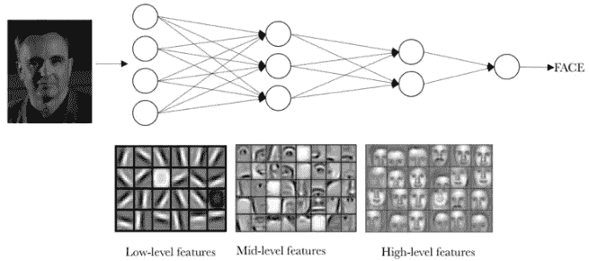

[来源](https://torres.ai/deeplearning/)

CNN 的应用扩展到图像、视频、文本和音频分析。物体识别，计算机视觉和相关的应用程序，包括人脸识别应用程序。此外，它还被广泛用于非常先进的深度学习算法，称为[甘](/analytics-vidhya/gan-an-imaginative-tool-into-reality-d8fa46aa6bff)。

> ConvNet 的作用是将图像简化为一种更容易处理的形式，而不会丢失对获得良好预测至关重要的特征。

# CNN 如何看待一幅图像

图像由排列成 n 维阵列的像素组成。这就是电脑看图像的方式。对它来说，图像是一个值的数组，每个值代表一个像素。每个像素表示该点的颜色强度，对于彩色和灰度图像，其范围分别为 0–255 和 0–1。在 CNN 中，n-D 数组形式的图像具有(长、宽、信道)的形状。这里，通道指的是图像的深度，指的是它是否是彩色图像。
彩色图像有 3 个通道(R、G、B ),这是一个堆叠的三维矩阵，每个矩阵的值范围在 0-255 之间。另一个非彩色图像是具有 1 个通道的 1-D 阵列。

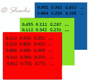

几个图像相关的术语:
1。**分辨率:**是指一幅图像中的 ppi(每英寸像素)/ dpi(每英寸点数)，以高度和宽度的形式表示。低分辨率意味着每英寸像素更少，因此当大像素变得可见时，拉伸图像会使质量更差。

2.**像素**:图像元素，其值是指图像中该点的颜色强度。参考[这篇博客](https://www.whydomath.org/node/wavlets/imagebasics.html)了解更多信息。
3。**尺寸**:改变尺寸是指图像中像素数量的变化，即需要删除或添加一些像素。

***关键事实:*** *在图像处理中，图像缩放不会改变图像的大小，相反，如果分辨率不适合新的大小，像素会被拉伸或压缩。*

# 通用 CNN 架构

CNN 是另一种具有类似结构的神经网络，就像典型的神经网络一样。

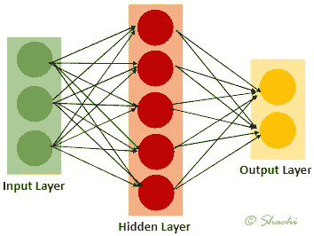

CNN 只是通过添加一些层，如卷积、relu(又名激活)和池层来修改 NN 架构。基本上整个网络分为学习特征和分类。

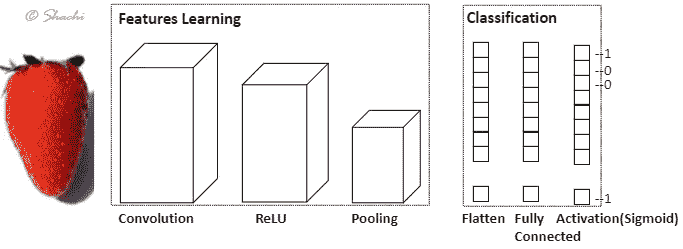

**使用以下 CNN 层学习特征:**

**卷积:**输入图像首先进入该层，卷积核围绕整个图像进行卷积，以降低图像维数并生成一堆特征图。
**ReLU** (又名激活) **:** ReLU 激活函数将负值转换为 0，**激活某些高权重特征**，这些特征被转发到下一层。因此被称为活化层。该层为模型带来了非线性，使其能够解决复杂的特征。

**汇集**(也称为下采样) **:** 一个下采样层，它减少了训练参数，从而减少了计算成本和时间。简而言之，**更快的计算**。

**使用以下 CNN 层进行分类:**

简化的矩阵现在被传递到分类层，在那里它被转换成一个长矢量(展平)。

**完全连接:**矩阵被转换成密集层，该密集层被展平(特征向量)成一维数组。随后，这必须通过完全连接的层，并最终通过激活分类器(sigmoid/softmax)来相应地对图像进行分类。分类是通过获得输入图像的每个类别的概率来完成的。

# CNN 分层概念详解

# 1.卷积层

一般来说,“卷积”指的是将两个数字合成第三个数字的运算。这里，执行逐元素乘法，最后相加产生标量值。基本上，卷积是以特定的**步长**在图像上卷积(滑动)**核**的操作。输入图像中的当前操作区域(*比如说第一次滑过形状 3*3 的最左边矩阵)*与内核被称为**感受野**。

*我来说更简单的*。我是在研究其他博客时得到这个解释的。有一个闪光灯以一个步幅值在输入图像上闪烁。在这里，手电筒是一个核心，它照亮的区域是感受野。现在，当内核大小增加时，通过更多的层，感受野也增加，因此我们能够一次识别复杂层次的特征(对象)。

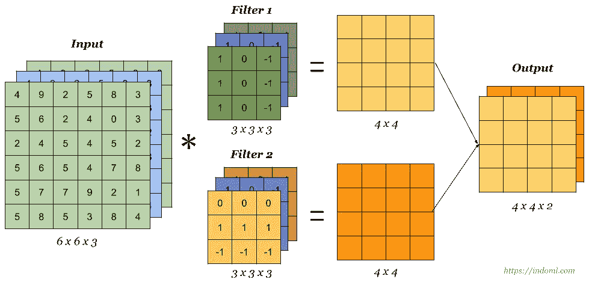

如上所述，这一层有许多滤波器，它们分别与输入图像卷积，产生输出矩阵，称为**特征图**。查看[这篇博客](/technologymadeeasy/the-best-explanation-of-convolutional-neural-networks-on-the-internet-fbb8b1ad5df8)了解更多细节。

> 层目标通过反向传播学习核的参数(值)。

**让我们进一步了解卷积中涉及的元素:**

***滤镜:*** (又名内核)

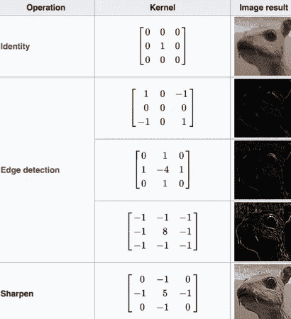

[来源](https://www.guru99.com/convnet-tensorflow-image-classification.html)

*   过滤器是一个**特征检测器**(数组值)，它代表图像特征，如边缘、曲线、模糊或亮度检测器。
*   内核的值被称为**权重**(/参数/强度值)，其中高权重表示该像素对于特定特征的重要性。值(1，-1，0)表示亮度(白色)、暗度(黑色)和 0(灰色)的过滤。
*   在跨越输入图像时，卷积期间执行以下两个操作:
    -逐元素乘法
    -求和
*   最初，滤波器被随机初始化，但随后被*反向传播更新。*
*   内核大小总是奇数。
*   深度应始终与输入图像的深度
    ( *例如，输入尺寸(32*32*3)，其中“3”是深度。同样，内核的尺寸(7*7*3)具有相同的深度。)*
*   **多滤波器卷积的影响:**
    1。保留空间尺寸
    2。特征图
    3 的深度(通道)越大。关于输入图像的更多信息
*   内核最初检测低级特征，如曲线或边缘。深入网络，他们增加感受域，从图像更大部分获取信息。这允许检测一些复杂级别的特征或特定对象，如耳朵或眼睛。
*   如果内核不能很好地适应输入图像，该怎么办？
    1。**放下**未安装过滤器的部分
    2。**用 0 填充**边界，使其适合内核

***特征图:*** *(又名激活图，卷积特征)*

*   一组值(*或矩阵*)是卷积层在与特定滤波器执行卷积运算后的**输出。**
*   它被称为激活图，因为它显示了与内核相关的特定特性的激活区域。

***跨步:***

步幅是指内核的*滑动，每次滑动一个特定的像素。*例如*，步幅为 1 将一次滑动一个像素的滤镜。*

[来源](https://towardsdatascience.com/a-comprehensive-guide-to-convolutional-neural-networks-the-eli5-way-3bd2b1164a53)

大步行走时，某些细节会被忽略。因此，我们需要一个填充的概念。

**填充:填充:**

*   填充是**沿着图像的边框**添加值 **的概念。**
*   填充的类型:
    1。**有效**:(无焊盘)导致输出尺寸<输入尺寸
    2。**相同:**(零填充)导致输出尺寸=输入尺寸

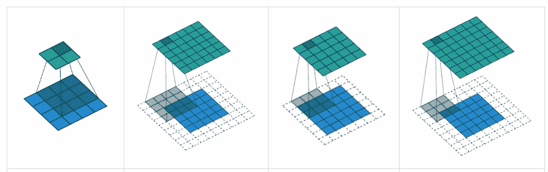

[来源](https://towardsdatascience.com/the-most-intuitive-and-easiest-guide-for-convolutional-neural-network-3607be47480)

在第一幅图像中，具有 3*3 内核的 4*4 输入(沿边界没有附加值)导致缩小的 2*2 特征图。这是'**有效的**填充。这对网络不好，因为我们会很快丢失很多细节。因此，第三个图像通过实现“**相同的**”填充来说明解决方案。
具有 2 层填充(添加 0)的 3*3 内核的 5*5 输入导致相同的维度，即相同的卷积，即作为输出的 5*5 特征图。

*   **为什么需要填充？**
    1。执行卷积可能会影响数据的快速丢失。因此，额外的像素会减弱这种影响。
    2。大步行走时，边缘的重量比中间的重量“接触”得少。因此，我们可能会丢失特定位置的某些细节。
*   **计算输出数据大小的公式**其中滤波器大小(f)、步幅(s)、填充(p)和输入大小(n)为:

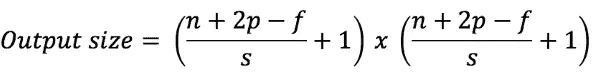

[来源](/machine-learning-bites/deeplearning-series-convolutional-neural-networks-a9c2f2ee1524)

# 2.ReLU:(又名激活层)

*   CNN 的激活层，在模型中引入非线性，能够解决复杂问题。
*   没有 ReLU 模型，图像分类是一个线性问题，而实际上是一个非线性问题。
*   没有消失梯度问题
*   输入中的负数转换为 0。
*   ReLU 函数在传递负数时输出为 0，而为正数返回相同的值。因此， **f(x)=max(0，x)**

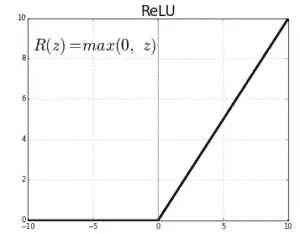

[https://ailephant.com/glossary/relu-function/](https://ailephant.com/glossary/relu-function/)

# 3.合并:(又称为缩减采样)

*   应用线性和非线性变换后，对输出进行下采样，以获得足以描述整个图像的显著部分，而不是获取巨大的参数。
*   每个要素地图(conv 图层的输出)都可以在保留重要信息的同时进行缩减。
*   这是**的一个特征，通过使用下面给出的两种方法中的任何一种来总结图像补丁中的重要特征**。
*   **是怎么做到的？**

1.  **平均:**在每个特征图上由滤波器覆盖的感受野区域的平均计算。类似于该补丁中存在的平均特征。

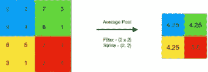

来源

2. **Max:** 每张特征图上滤镜覆盖的感受野区域的每一片的最大值。类似于图像的该部分中存在的最重要的特征。

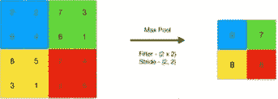

[来源](https://www.geeksforgeeks.org/cnn-introduction-to-pooling-layer/)

*   **优点？**

1.减少要训练的重量数量，从而直接影响**计算时间和成本**。短时间内更快的计算。
2。在旋转、缩放或裁剪等**变换**场景中，使我们的训练更加**健壮**。*如何？*特征图的像素表示特定特征的精确位置。因此，模型对于检测特定特征变得如此精确。因此，当图像有一点点偏移时，建模可能不明智，因为这会导致不同特征图。

# 4.展平:

汇集的图像矩阵被展平成单个向量，以便以某种方式在连续层中执行分类。

# 5.完全连接:(又名密集)

顾名思义，这一层就像标准神经网络中的一层，其中展平的层连接到前一层中的所有激活。它就像隐藏层，唯一的区别是它是完全连接的。

# 6.Sigmoid/Softmax:

CNN 的最后一层，在 sigmoid 或 softmax 激活函数的帮助下，基于二元或多类预测进行预测。这基本上是 FC 层之后的一个**输出层，在这里我们根据概率**得到预测的类别。

比较输出和实际输出，并计算损耗，然后将其反向传播，用于下一个时期的进一步训练。

# 摘要

1.  传递到网络的输入图像
2.  选择步幅、过滤器尺寸和填充参数。执行卷积。
3.  执行 ReLU 激活
4.  根据你的需要，重复上面的步骤。
5.  将矩阵展平为单一矢量，作为全连接层
6.  最后一层将根据不同的预测类别对图像进行分类

*值得浏览的有趣博客。*

 [## 深度学习系列:卷积神经网络

### 在这篇博客中，我将解释卷积神经网络(CNN 或 ConvNets)的细节，它已被证明是…

medium.com](/machine-learning-bites/deeplearning-series-convolutional-neural-networks-a9c2f2ee1524) 

快乐阅读！

***可以通过***[***LinkedIn***](https://www.linkedin.com/in/kaul-shachi)***与我联系。***

欢迎在评论区分享你的观点或任何误导性的信息。:)