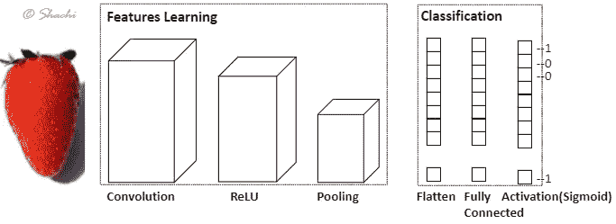

# CNN 全指南(下)

> 原文：<https://medium.com/analytics-vidhya/complete-guide-about-cnns-part-2-12c71b5d06bd?source=collection_archive---------26----------------------->

*各位学习者好！*
在通过各种渠道对一项非常有用的计算机视觉技术 CNN 进行深入研究后，发表了一篇详细的博客。

[https://www . the wow style . com/35-cool-collection-of-desktop-wallpaper/](https://www.thewowstyle.com/35-cool-collection-of-desktop-wallpaper/)

# 路标

1.简介
2。CNN 怎么看一个图像
3。通用 CNN 架构
4。CNN 层概念详解
5。CNN
6 摘要。训练 CNN 型号
7。CNN
8 中的超参数。推荐 CNN 架构规则
9。容易引起好奇心的“为什么”问题

第一部分:[介绍 CNN 摘要](/@shachikaul35/complete-guide-about-cnns-part-1-65bdfee3cae3)
第二部分:从训练 CNN 模型到最后的为什么问题

# 介绍

本博客纯属 CNN 执行相关。因此，如果你对这些概念的理解不是很好，请随意阅读这篇名为[CNN 完全指南(第一部分)](/@shachikaul35/complete-guide-about-cnns-part-1-65bdfee3cae3)的博客。

# 训练 CNN 模型

总的来说，NN 训练就像向前传递、计算损失、向后传递、权重更新和在每个时期重复一样。在 CNN 中，网络开始于从图像中的低级特征到高级对象的学习。但是它是如何识别这些特征的呢？
内核如何知道要寻找哪种低级特征，如边缘或曲线？后面层中的内核如何知道要查看哪些高级特性？内核如何知道哪些值有利于声音分类？

1.  **设置一些参数**，如输入图像大小、内核大小、时期、批处理大小、优化器、步幅、填充、学习率等。
2.  在**中，一个训练迭代**为一批，
    在第一层，做**正向传递**，其中传递一个形状为(32*32*3)带标签的图像数组到网络中。最初，权重(内核)是随机初始化的，这意味着过滤器不知道该看哪个特征。输出可以像[.1 .1 .1 .1]一样，其中任何给定的特性都没有权重。因此，**没有检测到低级特征**。
    2.1 **内核用步长在填充图像周围卷积**产生激活图。传递到 **ReLU 层**上，然后传递到**池层**上，在那里进行缩减采样。
    2.2 前一个 conv 层(激活图)的输出传递到下一个 conv 层，在该层中，卷积运算增加了内核大小，随后是 ReLU 和池化。这是为了**检测中级或高级特征**。
3.  最后，到达**损失函数**(可能是 MSE)。
4.  **反向传递**损失函数和具有学习率的优化器将**根据哪个权重对损失贡献最大来更新权重**。

对于特定批次的固定训练迭代，重复上述步骤。在最后一个训练批次的权重更新时，网络学习良好并最小化损失以进行精确预测，并移动到下一个时期。

**你还在混淆 epoch、iteration 或 step、batch 或 batch_size 吗？**

好吧，至少我花时间消化了。所以让我再经历一次…

假设 **1000 个图像**，给定 **500 个批量**和 **3 个时期**。
1 历元是**整个数据集的训练**包括一个向前和向后的行程。因此，为了训练 1000 个图像，其中批次大小为 500，因此，2 个
批次。完成一个历元需要 2 次迭代(批)。总迭代次数将是 6(3*2 个时期)。在整个 CNN 培训期间，模型将经历 3 次，即 6 个批次。

# CNN 中的超参数

参数根据数据决定，但一般要求如下:

1.  **通道**:颜色通道越多，内核越多，学到的特性越多，但可能会导致过度拟合。因此，在 CNN 中，辍学被用来避免过度适应。
2.  **仁大小:**应为**奇数**。核越大，感受野越大，一个图像块中捕获的信息越多。
    如果图像具有一些不同的局部特征，建议使用较小的内核(3*3，5*5)。如果要识别更大的物体，使用大的内核(9*9)。
3.  **跨步**:垂直/水平跨步时跳过像素。
    步幅值越大，输入图像下降越快。
4.  **填充**:指沿边框添加 0 的列和行，以节省空间维度。更多关于原因的信息，请访问这个博客。
5.  **池化**:根据最大或平均池化缩小图像尺寸。此外，使模型在任何类型的图像变换中都能稳健地进行分类。

# 推荐的 CNN 架构规则

有一些经验法则，如果遵循的话，将会建立一个好的健壮的网络。
1。**从最小尺寸的**开始内核，以便最初最好地识别局部(粒度)细节，并且**逐渐增加**的尺寸，以便完美地识别高级别。
2。为了更深入地了解图像尺寸通过卷积减少的地方，最好通过使用**填充**来保持图像尺寸不变。
3。**更多的层，更多的学习**因此继续添加更多的层，直到模型完全学习，记住不要过度拟合。
4。如果观察到某种过度拟合，可以使用**脱落层**或 l1/l2 正则化。
5。一般**内核大小** in:
5.1 **卷积层:** (3*3，5*5)用于较小的图像，而(7*7，9*9)用于较大的图像。
5.2 **合并:** (2*2，3*3)，步幅为 2

# 容易引起好奇心的“为什么”问题

> 为什么是卷积网络而不是神经网络？

1.  **计算时间和成本更少:**在 NN 中，形状为(1000，1000，3)的彩色百万像素图像是 3 层的堆叠，其中每层具有范围为(0–255)值的值数组。具有(1000*1000*3)个特征的图像将难以传递到神经元并更新这三百万个特征的权重。因此，卷积出现在图像中。**多对一映射**如在池**中。**
2.  **仅共享权重:**根据 CNN 架构，仅某些权重跨层前馈，因此网络必须仅关注内核权重以捕捉重要特征。在 NN 中，每个输入有更多的权重(/参数)。因此，CNN 需要学习的参数**比输入图像参数**少得多**。**

> 为什么我们需要 stride？为什么我们不能不受跳过像素的限制直接进行卷积呢？

在图像具有相似的相近像素的情况下，较小的图像足以给出信息。因此，步距为 2 减小了图像尺寸，这对计算时间和空间有最好的贡献。

> 为什么 ReLU 在 CNN 被证明更好？

1.  减少**消失梯度问题**在较低层，梯度呈指数下降，使得斜率值变小，几乎消失梯度(可能不训练)，NN 根本不收敛。ReLU 使之成为可能，因为它**在一个方向**饱和。
2.  增加模型的非线性而不影响感受野，其中早期的 conv 层执行 conv 运算和矩阵计算的线性计算。

> 为什么会出现消失梯度问题？

当您的超参数(批次、learn_rate、时期等)和参数(权重、偏差)设置不正确时，通常会在基于神经网络梯度的方法(如反向传播等)中发生。

模型要么花很长时间训练，要么根本不训练。这取决于坡度或坡度。因此，你的神经网络不会收敛，导致性能不佳。

> 为什么在网络的末端使用全连接层，而不是在网络的起点？

简而言之，参数少，时间少，避免过拟合。全连接的层将有更多的权重来训练，因此卷积是参数较少的救星。

> CNN 为什么强制实行联营？

池层的目标是从根本上减少图像的空间维度。我们不要混淆深度。

> 为什么建议通过汇集来减少空间维度？

1.  更少的参数导致更快的**计算**
2.  信息越少越好**过度拟合**

点击此链接了解更多信息:

 [## 卷积神经网络(CNN) -深度学习向导

### 学习深度学习和深度强化轻松快速地学习数学和代码。被成千上万的学生和…

www.deeplearningwizard.com](https://www.deeplearningwizard.com/deep_learning/practical_pytorch/pytorch_convolutional_neuralnetwork/)  [## 直观理解用于深度学习的卷积

### 探索让它们工作的强大的视觉层次

towardsdatascience.com](https://towardsdatascience.com/intuitively-understanding-convolutions-for-deep-learning-1f6f42faee1) 

快乐阅读！

***可以通过***[***LinkedIn***](https://www.linkedin.com/in/kaul-shachi)***与我联系。***

欢迎在评论区分享你的观点或任何误导性的信息。:)