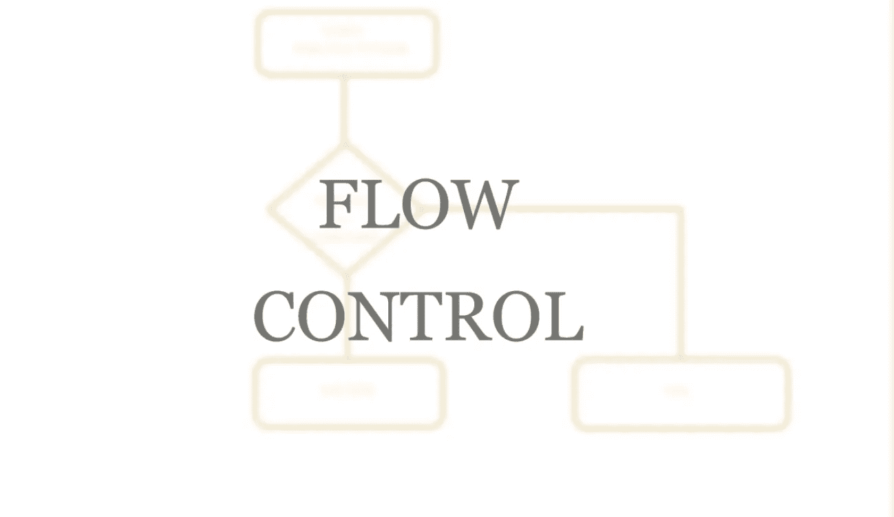
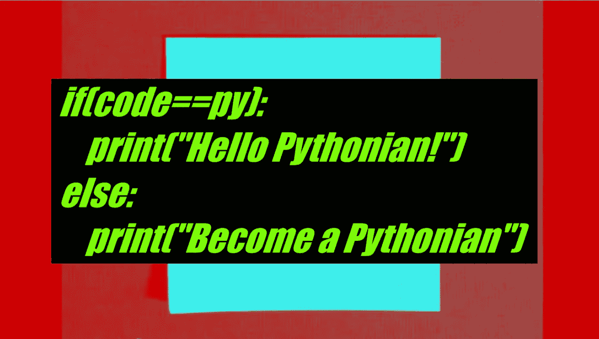
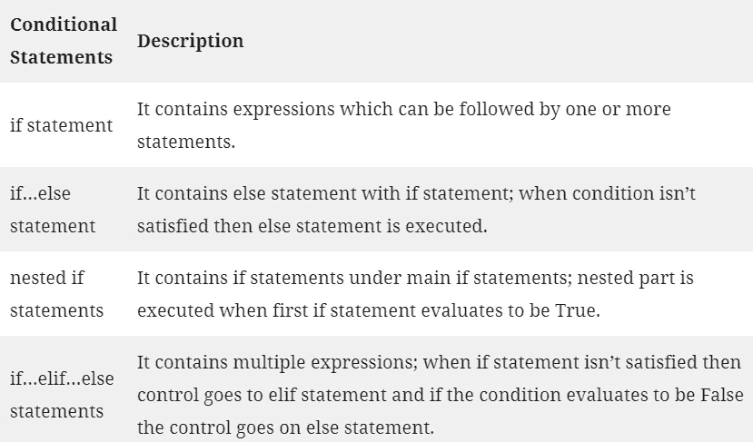
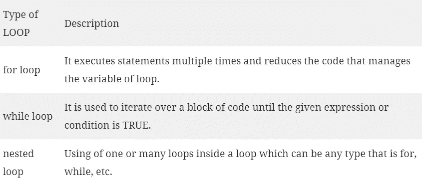
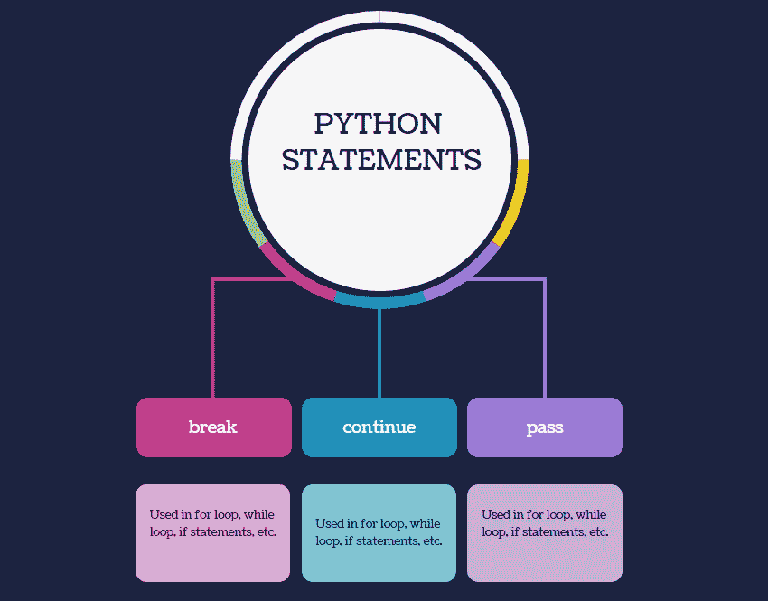
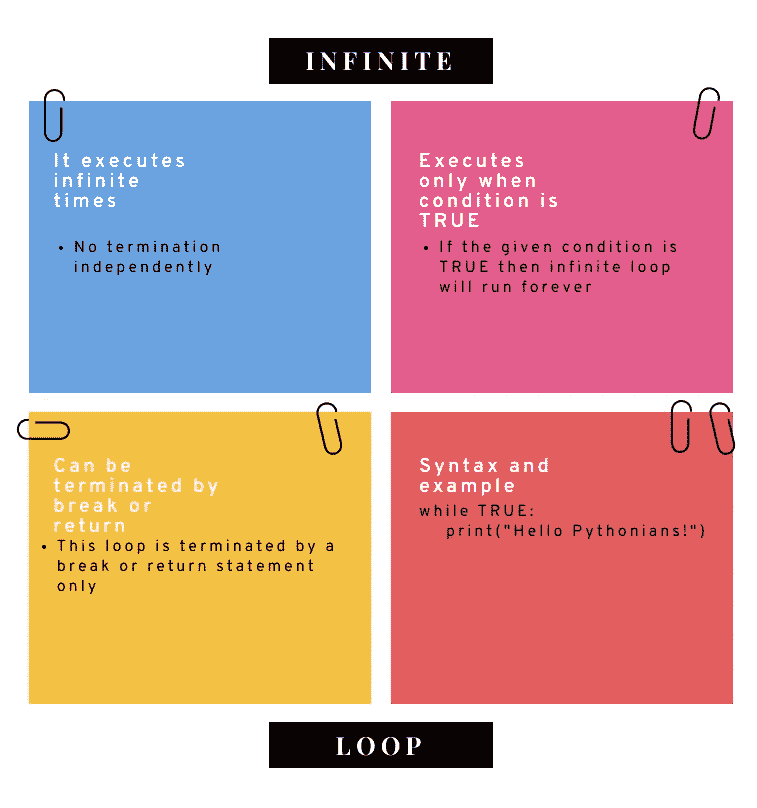

# Python 中流控制完整指南

> 原文：<https://medium.com/analytics-vidhya/complete-guide-on-flow-control-in-p-760680245754?source=collection_archive---------17----------------------->

你好皮顿人！我带着 Python 的另一个重要部分回来了，它是关于流控制的完整指南。

到目前为止，我们已经看到程序按顺序运行或编译。这意味着，程序逐行运行或编译，那么如果我们想打破这种方式来获得我们自己的优势呢？这就是为什么我们在 Python 中使用流控制。

> **流控制基本上是改变流或代码的顺序。这可以通过使用*循环*或*条件/决策语句来完成。***

**1。条件语句:**条件语句也叫决策语句。这意味着如果条件或表达式得到满足，那么用户可以执行那组语句。

Python 中总共有四种类型的条件语句。它们是:

A) if 语句

B) if…else 语句

C) if…elif…else 语句

d)嵌套的 if 语句

**2。循环:当任何复杂的程序都倾向于变得简单时，循环就被用在程序中。循环通常用于分解复杂性，使你的代码更小更有效。**

Python 中总共有三种类型的循环。它们是:

A) for 循环

B) while 循环

c)嵌套循环

> **现在，让我们来关注“Python 中的决策是如何通过编码做出的！?"**

**决策** —它是程序执行过程中出现的条件的展望，由根据这些条件采取的特定行动提供。

用于决策的结构称为 ***决策结构*** 。决策结构对多个条件或表达式进行评估，从而给出正确或错误的输出。

在 Python 中，非零值和非空值被视为真，零值和空值被视为假。

Python 有 4 种类型的决策语句。它们如下:

**1。If 语句:**

If 语句包含被评估或比较的条件或逻辑表达式，并根据评估做出决策。如果表达式计算结果为真，则执行 If 语句下的代码，否则执行块尾。

***语法* :** if 表达式:

{语句/代码}

**2。If…else 语句:**

在 if…else 语句中；当 if 中的表达式的计算结果不为真时，指针将访问解析为假的 else 语句，并执行其中的语句。

***语法* :** if 表达式:

{语句/代码}

否则:

{语句/代码}

**3。If…elif…else 语句:**

elif 语句用于检查多个表达式是否为真，如果其中任何一个表达式的计算结果为真，则执行代码/语句；否则将执行 else 语句，将结果解析为假。

elif 语句是可选的。一个程序中的一个 if 语句可以有多个 elif 语句，但每个程序中的一个 if 语句只能有一个 else 语句。

***语法* :** if 表达式:

{语句/代码}

elif 表达式 1:

{语句/代码}

elif 表达式 2:

{语句/代码}

…….

elif 表达式(n):

{语句/代码}

否则:

{语句/代码}

**4。嵌套 If 语句:**

有时，当用户想要在解析为真的条件下检查某个条件时，会出现这种情况。在这种情况下，使用嵌套的 if 语句。

在嵌套的 if 语句中，用户可以在 if 语句下有 if 语句..if…else 语句下的 else 语句，或者 if…elif…else 语句下的 if…elif…else 语句。

如果第一个 if 语句中的表达式计算结果为真，则执行嵌套部分，否则将根据用户给定的代码直接跳转到 elif 语句或 else 语句。

***语法* :** if 表达式:

{语句/代码}

if 表达式:

{语句/代码}

elif 表达式:

{语句/代码}

否则:

{语句/代码}

elif 表达式:

{语句/代码}

否则:

{语句/代码}

让我们检查一下 Python 中关于决策语句的程序，以便更清楚地了解不同使用的各种语句。

点击 [statements.py](https://drive.google.com/file/d/1cCHtyH8eZgpjN-xGmX1i0vrx--z1HB68/view?usp=sharing)

> **Python 中条件的执行方式**

Python 提供了三种以循环形式执行复杂条件的方法。它们是:

**1。for 循环:**

python 中的 For 循环一般用来迭代一个序列。序列包括字符串、元组、字典等。

有时 for 循环包括三个部分:

a)初始化

b)条件

c)增量/减量

每当用户想知道他/她必须执行某组语句的次数时，就会使用 For 循环。

***语法:*** 为顺序变量:

{语句/代码}

**2。while 循环:**

使用 while 循环，只要给定的条件评估为真，用户就可以执行某组语句。

While 循环通常执行条件更新来终止循环。

用户可以选择显式追踪内部条件以终止循环。

***语法:*** while 表达式:

{语句/代码}

**3。嵌套循环:**

嵌套循环通常意味着在另一个循环中使用一个循环。Python 语言允许用户在一个循环下使用另一个循环。

***语法:***

***一)【嵌套循环】***

对于表达式中的变量:

对于表达式中的变量:

{语句/代码}

{语句/代码}

***b)【嵌套 while 循环】***

while 表达式:

{

while 表达式:

{语句/代码}

{语句/代码}

}

让我们快速浏览一下 loops 的程序: [loops.py](https://drive.google.com/file/d/12neAbsCjA7AH6jqAevpIz69cbqqNOdv7/view?usp=sharing)

> **Python 中使用的语句**

有时，你们都可能会面临这样的情况:需要跳过循环的某个部分，开始下一次执行，或者在执行完一次后，想要完全退出循环。所以，对于这些；python 提供了 *break* 、 *pass* 和 *continue* 语句来处理任何时候发生的那种情况。所以，我们来详细讨论一下，了解一下基本面。

**中断语句:**

当满足某个条件/表达式时，break 语句终止循环，并转到将在循环外执行的下一次迭代。它将程序控制带出循环。break 语句与 for 循环、while 循环、if 语句等一起使用。

***语法:***

***a)在 for 循环中:***

对于列表中的值:

if 表达式:

*突破*

***b)在 while 循环中:***

while 表达式:

if 表达式:

*突破*

**继续陈述:**

continue 语句在某个循环中使用，用于跳过当前迭代的循环体中的其余语句，并将控制返回到循环的开始处。continue 语句不会终止循环，而是跳转到要执行的下一个迭代。

***语法:***

***a)在 for 循环中:***

对于列表中的值:

if 表达式:

*继续*

***b)在 while 循环中:***

while 表达式:

if 表达式:

*继续*

**通过声明:**

pass 语句是一个空操作。这意味着，当它执行时，什么也没有发生。当您不想让任何代码在循环中进一步执行时，可以使用它。

***语法:***

***a)在 for 循环中:***

对于列表中的值:

if 表达式:

*通过*

***b)在 while 循环中:***

while 表达式:

if 表达式:

*通过*

让我们跳到使用这些语句的 python 程序: [statements.py](https://drive.google.com/file/d/16PCZIBSrGpL4FDKYT3um3KaeHo2r5FbR/view?usp=sharing)

> **无限循环——无限循环**！

你想没完没了吗？看看这个没完没了的节目: [infinite.py](https://drive.google.com/file/d/15SVszjJ9-Gw-iz41cNbwzMNAqTYK6VDH/view?usp=sharing)

经常练习 python 的感觉真的很好。我希望你们都跟我一样。持续的练习和专注一定会让你成为真正的 Pythonain。

更多免费的 Python 材料，请访问:[https://wethepythonians.wordpress.com/](https://wethepythonians.wordpress.com/)