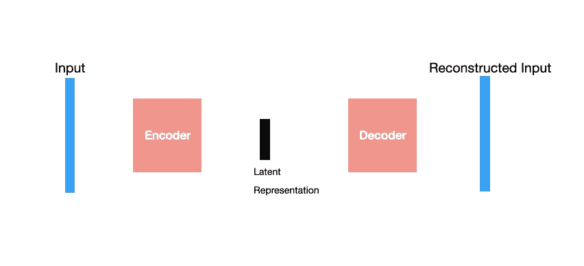
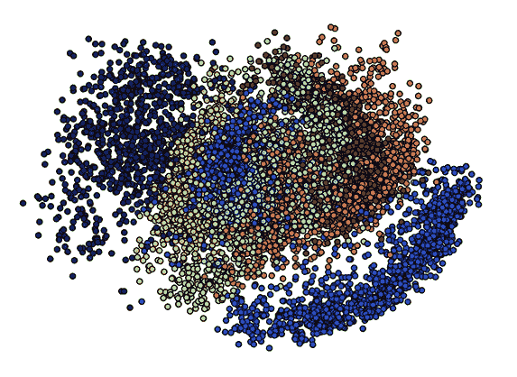
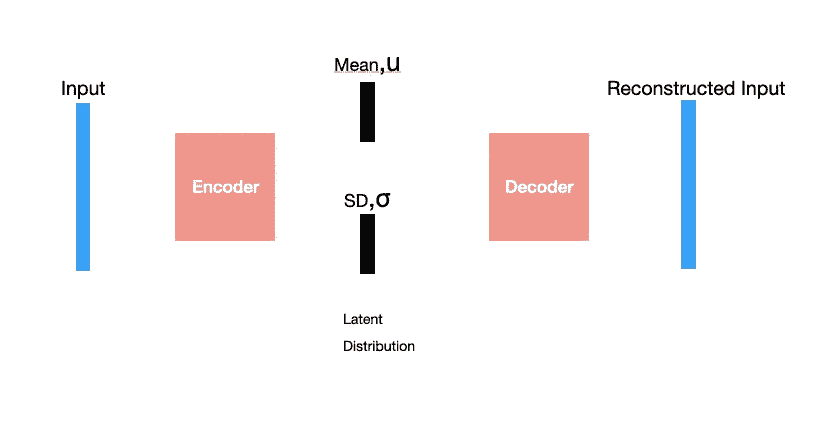
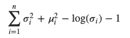

# 在 Pytorch 和 Keras 中构建自动编码器的完整指南

> 原文：<https://medium.com/analytics-vidhya/complete-guide-to-build-an-autoencoder-in-pytorch-and-keras-94555dce395d?source=collection_archive---------8----------------------->

这篇文章是我之前的[文章](/analytics-vidhya/complete-guide-to-build-cnn-in-pytorch-and-keras-abc9ed8b8160)的延续，这篇文章是使用 pytorch 和 keras 构建 CNN 的完整指南。

从标准数据集或自定义数据集获取输入已经在[使用 pytorch 和 keras 的 CNN 完全指南](/analytics-vidhya/complete-guide-to-build-cnn-in-pytorch-and-keras-abc9ed8b8160)中提到。所以我们可以从对自动编码器的必要介绍开始，然后实现一个。

## 自动编码器

自动编码器是一种神经网络，它学习以最小的信息损失对数据进行编码。



自动编码器

上述网络有许多变体。其中一些是:

## 稀疏自动编码器

这种自动编码器通过正则化激活函数隐藏节点来减少过拟合。

## 降噪自动编码器

这个自动编码器是通过在输入中加入噪声来训练的。这将消除评估时输入的噪声。

## 变体自动编码器

这是一种深度生成神经网络。自动编码器的主要挑战是它们总是试图最小化重建误差，并且从不关心潜在的表示。

一个好的潜在表示应该总是有意义的，以便它可以用于像 GAN 这样的生成神经网络。有意义是指安排。来自同一类的数据点分组更近，来自不同类的数据点分组稍远。



【https://blog.keras.io/building-autoencoders-in-keras.html 

这种潜在表示可以通过如下改变神经网络的结构来实现:



VAE

与其他自动编码器不同，我们正在生成一个具有均值和标准差的潜在分布，而不是单一的潜在向量。然后，我们将从潜在分布中取样以重建输入。

关于变体自动编码器的两件重要事情是:

在采样时，我们需要使用重新参数化技巧来处理节点的随机性，因为节点的随机性可能会停止反向传播。

> μ,𝛔≈μ+𝛔*n(0,1)

这种重新参数化的技巧不会改变分布。但是它将调整参数以允许反向传播。

变化自动编码器使用下面的等式正则化成本函数。

> 正则化成本函数= Loss+KL(N(μ,𝛔),N(0,1))

这将强制潜在分布遵循标准正态分布，从而扩展其在深度生成模型中的使用。

你可以在这篇[文章](https://towardsdatascience.com/understanding-variational-autoencoders-vaes-f70510919f73)中读到更多关于 VAE 的信息，在这里你可以读到更多关于各种类型的自动编码器的信息。我们将在本文中实现 VAE。

# 履行

任何自动编码器都包括两个网络编码器和解码器。如前所述，VAE 也使用规则化成本函数。

## 编码器

编码器接受输入并返回潜在分布的平均值和标准偏差。

```
#**Pytorch****class** **VAE**(nn.Module):
    **def** __init__(self, x, h1, h2, z):
        super(VAE, self).__init__()

        self.fc1 = nn.Linear(x, h)
        self.fc2 = nn.Linear(h1, h2)
        self.fc_mean = nn.Linear(h2, z)
        self.fc_sd = nn.Linear(h2, z)

    **def** encoder(self, x):
        h1 = F.relu(self.fc1(x))
        h2 = F.relu(self.fc2(h1))
        **return** self.fc_mean(h2), self.fc_sd(h2) *# mu, log_var*#**Keras**x = Input(batch_shape=(batch_size, original_dim))
h = Dense(intermediate_dim, activation='relu')(x)
z_mean = Dense(latent_dim)(h)
z_log_sigma = Dense(latent_dim)(h) 
```

## 抽样

根据从编码器获得的平均值和标准偏差，我们将通过采样生成解码器的输入。上面提到的重新参数化技巧出现在这里。

```
**#Pytorch**def sampling(self, mu, log_var):
        std = torch.exp(0.5*log_var)
        eps = torch.randn_like(std)
        **return** eps.mul(std).add_(mu) #**Keras**def sampling(args):
    z_mean, z_log_sigma = args
    epsilon = K.random_normal(shape=(batch_size, latent_dim),
                              mean=0., std=epsilon_std)
    return z_mean + K.exp(z_log_sigma) * epsilon
```

## 解码器

解码器获取采样函数的输出，并尝试重建原始输入。

```
**#Pytorch****class** **VAE**(nn.Module):
    **def** __init__(self, x, h1, h2, z):
        super(VAE, self).__init__()
        self.fc1 = nn.Linear(x, h1)
        self.fc2 = nn.Linear(h1, h2)
        self.fc_mean = nn.Linear(h2, z)
        self.fc_sd = nn.Linear(h2, z)
        *# decoder* 
        self.fc4 = nn.Linear(z, h2)
        self.fc5 = nn.Linear(h2, h1)
        self.fc6 = nn.Linear(h1, x)

    **def** decoder(self, z):
        h1 = F.relu(self.fc4(z))
        h2 = F.relu(self.fc5(h1))
        **return** F.sigmoid(self.fc6(h2))#**Keras**decoder_h = Dense(intermediate_dim, activation='relu')
decoder_mean = Dense(original_dim, activation='sigmoid')
h_decoded = decoder_h(z)
x_decoded_mean = decoder_mean(h_decoded)
```

## 损失函数

如前所述，VAE 使用正则化损失函数，

具有均值μi 和标准偏差𝛔i 的分布的 KL 散度具有标准正态分布(KL(N(μi,𝜎I),N(0,1))是



```
**#Pytorch****def** loss_function(reconstructed_x, x, mu, log_var):
    loss = F.binary_cross_entropy(reconstructed_x, x.view(-1, 784),      
                       reduction='sum')
    regularized_term = -0.5 * torch.sum(1 + log_var - mu.pow(2) -   
                      log_var.exp())

    **return** loss + regularized_term**#Keras**def vae_loss(x, x_decoded_mean):
    xent_loss = objectives.binary_crossentropy(x, x_decoded_mean)
    kl_loss = - 0.5 * K.mean(1 + z_log_sigma - K.square(z_mean) - 
                 K.exp(z_log_sigma), axis=-1)
    return xent_loss + kl_loss
```

## 数据流动

数据从编码器、采样开始，然后是解码器。

```
**#Pytorch**def forward(self, x):
        mu, log_var = self.encoder(x.view(-1, 784))
        z = self.sampling(mu, log_var)
        **return** self.decoder(z), mu, log_var
```

在 keras 中，不需要转发函数。数据将按照你建立网络模型的顺序流动。

用损失函数编制网络。

```
#**Pytorch**vae = VAE(x_dim=784, h_dim1= 512, h_dim2=256, z_dim=2)
latent, mu, log_var = vae(data)
loss = loss_function(latent, data, mu, log_var)

loss.backward()

optimizer.step()**#Keras**vae = Model(x, x_decoded_mean)vae.compile(optimizer='rmsprop', loss=vae_loss)
```

我们还将在下一篇文章中打包 pytorch 和 keras 中 GAN 的实现。

感谢阅读:)

## 参考

[](https://blog.keras.io/building-autoencoders-in-keras.html) [## 在 Keras 中构建自动编码器

### 在本教程中，我们将回答一些关于自动编码器的常见问题，我们将涵盖代码的例子…

blog.keras.io](https://blog.keras.io/building-autoencoders-in-keras.html)