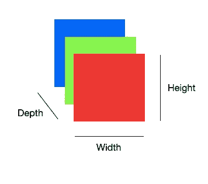
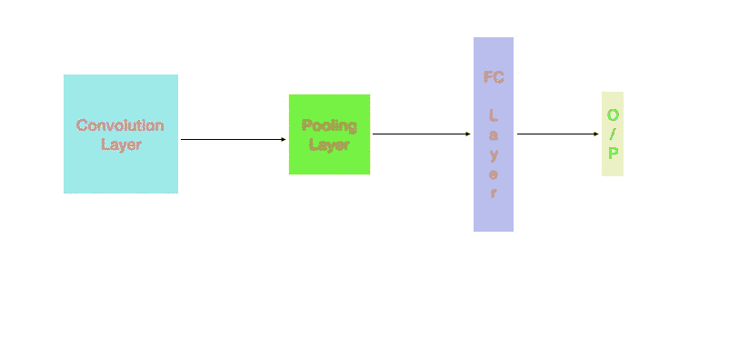

# 在 Pytorch 和 Keras 建立 CNN 的完整指南

> 原文：<https://medium.com/analytics-vidhya/complete-guide-to-build-cnn-in-pytorch-and-keras-abc9ed8b8160?source=collection_archive---------0----------------------->

卷积神经网络近年来受到了广泛的关注。在处理图像时，它可以提供更好的结果。

Pytorch 和 Keras 是计算机视觉应用中使用的两个重要的开源机器学习库。

Pytorch 因其被《自然》杂志定义而闻名，并成为研究人员的最爱。另一方面，Keras 在原型制作方面非常受欢迎。

我们将逐步建立一个卷积网络。

# 卷积神经网络

CNN 是图像分类和识别的热门选择。

CNN 中的三个重要层是卷积层、汇集层和全连接层。非常常用的激活函数是 ReLU。

在每一层中，我们应该知道一些重要的术语:

## 卷积层

这是接受输入以提取要素后的第一层。

图像矩阵是三维的(宽、高、深)。



核或滤波器矩阵用于特征提取。

如果(w，h，d)是输入维数，而(a，b，d)是 n 个核的核维数，则卷积层的输出是(w-a+1，h-b+1，n)。

跨距是我们在输入矩阵上移动的像素数。

填充是我们对图像所做的改变，以适应过滤器。它要么用零填充，要么丢弃图像的一部分。

## 汇集层

池层是为了减少参数的数量。常用的三种池类型是:

最大池化:从要素地图中获取最大值。

平均池:取特征图中值的平均值。

Sum Pooling:对特征映射中的值求和。

## 全连接层

来自池化图层或卷积图层(不需要池化图层时)的输出被展平，以将其提供给完全连接的图层。



美国有线新闻网；卷积神经网络

# CNN 的实现

## 导入库

克拉斯

```
import keras
from keras.models import Sequential
from keras.layers import Dense, Dropout, Flatten
from keras.layers import Conv2D, MaxPooling2D
```

pytorch

```
import torchvision.datasets as datasetsimport torch.nn as nn
import torch.nn.functional as F
import torch.optim as optim
```

## 加载输入

输入既可以从 torchvision 和 keras 中可用的标准数据集加载，也可以从用户指定的目录加载。

Keras 和 pytorch 中标准数据集的输入:

```
#kerasfrom keras.datasets import mnist(X_train, y_train), (X_test, y_test) = mnist.load_data()#pytorchimport torchvision.datasets as datasetsmnist_trainset = datasets.MNIST(root='./data', train=True, download=True, transform=transform)mnist_testset = datasets.MNIST(root='./data', train=False, download=True, transform=transform)
```

Keras 和 pytorch 中用户指定目录的输入

```
#keras**from** **keras.preprocessing.image** **import** ImageDataGeneratortrain_datagen = ImageDataGenerator(rescale = 1./255,
                                   shear_range = 0.2,
                                   zoom_range = 0.2,
                                   horizontal_flip = **True**)

test_datagen = ImageDataGenerator(rescale = 1./255)

training_set = train_datagen.flow_from_directory("./classify/dataset/training_set",
                                                 target_size = (64, 64),
                                                 batch_size = 5
                                                 )
test_set = test_datagen.flow_from_directory("./classify/dataset/test_set",
                                            target_size = (64, 64),
                                            batch_size = 5
                                            )#pytorch**from** torchvision **import** datasets, transforms 
**from** torch.utils **import** data dataset = datasets.ImageFolder(root='./classify/dataset/training_set/, 
transform = transforms.ToTensor()) loader = data.DataLoader(dataset, batch_size = 8, shuffle = **True**)
```

## 添加卷积层

在添加卷积层之前，我们将看到 keras 和 pytorch 中最常见的网络布局。

在 keras 中，我们将从“model = Sequential()”开始，并将所有层添加到模型中。

在 pytorch 中，我们将从定义类开始，用所有层初始化它，然后添加 forward 函数来定义数据流。

神经网络类(nn。模块):
def __init__(self):

向前定义(自身，x):

在 keras 中添加卷积层:

```
model = Sequential()model.add(Conv2D(32, (5, 5), input_shape=(28, 28, 1), activation=’relu’))
```

32 是过滤器的数量，并且内核大小是 5*5。ReLU 是激活层。

在 pytorch:

```
class NeuralNet(nn.Module):
    def __init__(self):
        super(NeuralNet, self).__init__()
        self.conv1 = nn.Conv2d(3,32,3,1)
        self.conv2 = nn.Conv2d(32,64,3,1)
```

在 conv1 中，3 是输入通道数，32 是滤波器数或输出通道数。3 是内核大小，1 是步幅。

## 添加池层:

我们将添加内核大小为 2*2 的最大池层。

在喀拉斯

```
model.add(MaxPooling2D(pool_size=(2,2))
```

在 pytorch:

```
x=torch.nn.functional.max_pool2d(x,2)
```

## 添加完全连接的层

正如我们已经知道全连接层，

我们将在喀拉斯和 pytorch 增加一个。

```
#kerasmodel.add(Flatten())
model.add(Dense(128, activation='relu'))
model.add(Dense(10, activation='softmax'))#pytorchclass NeuralNet(nn.Module):
    def __init__(self):
        super(NeuralNet, self).__init__()
        self.conv1 = nn.Conv2d(3,32,3,1)
        self.conv2 = nn.Conv2d(32,64,3,1)
        self.fc1 = nn.Linear(9216, 128)
        self.fc2 = nn.Linear(128, 10)
```

现在，我们已经完美地添加了所有层。但是我们需要定义从输入层到输出层的数据流(例如，什么层应该在什么层之后)

## 网络中的数据流

这部分纯粹是为 pytorch 准备的，因为我们需要添加到 NeuralNet 类中。

在 Keras 中，我们添加每一层的顺序将描述我们传递给每一层定义它的流和参数。

```
 model = Sequential()
 model.add(Conv2D(32, (5, 5), input_shape=(28, 28, 1),    
  activation='relu'))
 model.add(MaxPooling2D())
 model.add(Dropout(0.2))
 model.add(Flatten())
 model.add(Dense(128, activation='relu'))
 model.add(Dense(num_classes, activation='softmax')) 
```

在 pytorch 中，我们将添加 forward 函数来描述 __init__ 中添加的层的顺序:

```
class NeuralNet(nn.Module):
    def __init__(self):
        super(NeuralNet, self).__init__()
        self.conv1 = nn.Conv2d(3,32,3,1)
        self.conv2 = nn.Conv2d(32,64,3,1)
        self.fc1 = nn.Linear(9216, 128)
        self.fc2 = nn.Linear(128, 10)
    def forward(self,x):
        x=self.conv1(x)
        x=F.relu(x)
        x=self.conv2(x)
        x=F.relu(x)
        x=F.max_pool2d(x,2)
        x = torch.flatten(x, 1)
        x = self.fc1(x)
        x = F.relu(x)
        x = self.fc2(x)
        output = F.log_softmax(x, dim=1)
        return output
```

## 使模型适合输入数据

在 keras 中，我们将使用选定的损失函数编译模型，并使模型符合数据。时期、优化器和批量大小作为参数传递。

历元是我们在整个数据中迭代模型的次数。

批次大小是由于重量变化而输入的数据量或图像数量。批量大小用于减少记忆的复杂性。

有不同类型的优化算法可用。你可以在这里阅读它们。一般来说，很多人更喜欢亚当。

```
model.compile(loss='categorical_crossentropy', optimizer='adam', metrics=['accuracy'])model.fit(X_train, y_train, validation_data=(X_test, y_test), epochs=10, batch_size=200) 
```

在 pytorch，

```
model = NeuralNet()
optimizer = optim.Adam(model.parameters())for (i,l) in trainloader:
    optimizer.zero_grad()
    output = model(i)
    loss = F.nll_loss(output, l)
    loss.backward()
    optimizer.step()
```

nll_loss 是负对数似然损失。F.nll_loss()和 F.log_softmax()的组合与分类交叉熵函数相同。

optimizer.zero_grad()清除以前数据的梯度。

loss.backward()使用 optimizer.step()计算梯度并更新权重。

## 评估模型

keras 中的评估模型

```
score = model.evaluate(X_test, target_test, verbose=0)print(f'Test loss: {score[0]} / Test accuracy: {score[1]}')
```

对于 keras 中的自定义数据，您可以使用以下函数:

```
model.fit_generator(training_set,
                         epochs = 2,
                         validation_data = test_set,
                         verbose = 1)score = model.evaluate_generator(test_set)
```

在 pytorch:

```
model.eval()
test_loss = 0
correct = 0
with torch.no_grad():
    for data, target in testloader:
        output = model(data)
        test_loss += F.nll_loss(output, target, 
                         reduction='sum').item() 
        pred = output.argmax(dim=1, keepdim=True)  
        correct += pred.eq(target.view_as(pred)).sum().item()test_loss /= len(testloader.dataset)print('\nTest set: Average loss: {:.4f}, Accuracy: {}/{} ({:.0f}%)\n'.format(
    test_loss, correct, len(testloader.dataset),
    100\. * correct / len(testloader.dataset)))
```

model.eval()告诉 model 我们正在评估过程中。这是因为某些层的行为在训练和测试中会发生变化。

torch.no_grad()将关闭梯度计算，以便节省内存。

# 最后的想法

我觉得我使用 pytorch 对数据流有了更多的控制。出于同样的原因，它很快成为研究人员的最爱。

然而我们会看到。GAN 和自动编码器的实现将在后面的文章中介绍。

## 参考

[](/@RaghavPrabhu/understanding-of-convolutional-neural-network-cnn-deep-learning-99760835f148) [## 理解卷积神经网络(CNN) —深度学习

### 在神经网络中，卷积神经网络(ConvNets 或 CNN)是进行图像处理的主要类别之一

medium.com](/@RaghavPrabhu/understanding-of-convolutional-neural-network-cnn-deep-learning-99760835f148) [](https://pytorch.org/tutorials/) [## 欢迎来到 PyTorch 教程- PyTorch 教程 1.5.0 文档

### 60 分钟的闪电战是最常见的起点，并提供了如何使用 PyTorch 的广阔视野。它涵盖了…

pytorch.org](https://pytorch.org/tutorials/) 

https://keras.io/examples/vision/mnist_convnet/