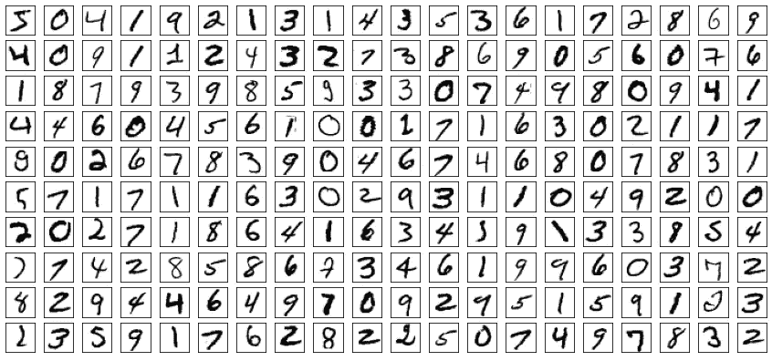

# 使用 Tensorflow 2.x 进行 MNIST 数字分类的 CNN 完全指南

> 原文：<https://medium.com/analytics-vidhya/complete-guide-to-cnn-for-mnist-digits-classification-with-tensorflow-2-x-a29680ced311?source=collection_archive---------2----------------------->

## **我们将学习，什么是 CNN？并建立了一个用于数字分类的 CNN 模型。**

MNIST 数字(作者图片)

**卷积神经网络**简称 CNN，是深度学习模型，学习图像中的模式。它广泛用于图像分类任务。