# 机器学习评估指标完全指南

> 原文：<https://medium.com/analytics-vidhya/complete-guide-to-machine-learning-evaluation-metrics-615c2864d916?source=collection_archive---------2----------------------->

蒂姆·斯万在 [Unsplash](https://unsplash.com?utm_source=medium&utm_medium=referral) 上的照片

*大家好，*

*建立机器学习模型是基于持续反馈的原则。建立机器学习模型，评估模型性能，进一步不断改进模型，直到您达到理想的准确度。模型评估指标用于解释指标的性能。模型性能度量旨在区分模型结果。*

*制作机器学习模型并进行预测是一项简单的任务。您的最终目标是创建一个对样本外数据给出高精度的模型。因此，在进行预测之前检查性能指标是很重要的。*

*在人工智能行业，我们有不同种类的指标来评估机器学习模型。除了所有这些评估指标之外，交叉验证在评估机器学习模型中非常流行，并且起着重要的作用。*

> **基本机器学习热身**

当我们讨论分类问题时，我们总是处理两种类型的算法

*   像 SVM & KNN 这样的算法产生一个类或标签输出。然而，在二进制分类问题中，生成的输出不是 0 就是 1。但是由于机器学习的进步，我们有一些算法可以将类输出转换成概率。
*   逻辑回归、随机森林和梯度推进等是一些生成概率输出的算法。将概率输出转换为类输出只是创建一个阈值概率的问题。

此外，当我们处理回归问题时，输出值是连续的，因此不需要任何进一步的操作。

> 让我们来谈谈评估指标

> **机器学习评估指标**
> 
> ***评价指标进行分类，回归&聚类***

## ***1 —为分类***

1.  ***混淆矩阵***

从外行人对混淆矩阵的定义开始

混淆矩阵是一个表格，它概括了不同的预测和测试结果，并将它们与现实世界的值进行对比。混淆矩阵用于统计、**、* [*机器学习*](https://searchenterpriseai.techtarget.com/definition/machine-learning-ML) *模型以及其他人工智能(*[*【AI】*](https://searchenterpriseai.techtarget.com/definition/AI-Artificial-Intelligence)*)应用。混淆矩阵也可以称为误差矩阵。**

*[*混乱矩阵*](https://scikit-learn.org/stable/modules/generated/sklearn.metrics.confusion_matrix.html#sklearn.metrics.confusion_matrix) 主要用于对统计数据进行深入高效的分析，并利用数据可视化进行更快速的分析。*

*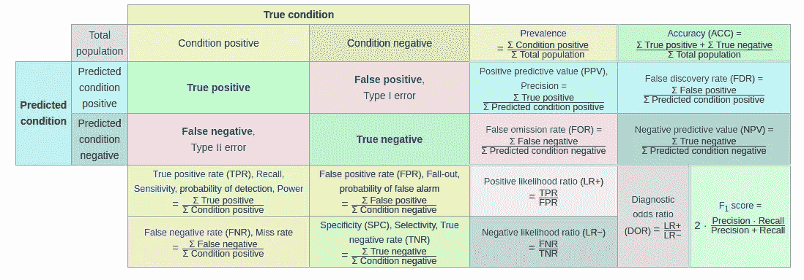*

*来源:[https://en.wikipedia.org/wiki/Confusion_matrix](https://en.wikipedia.org/wiki/Confusion_matrix)*

*上面的混淆矩阵看起来有点混乱，你需要记住混淆矩阵的一些术语:*

*   ***准确率:**正确的预测占总预测数的比例。*
*   ***阳性预测值或精确度:**被正确识别的阳性病例的比例。*
*   ***阴性预测值:**被正确识别的阴性病例的比例。*
*   ***灵敏度或召回率:**被正确识别的实际阳性病例的比例。*
*   ***特异性:**被正确识别的实际阴性病例的比例。*

*让我们借助一个例子来理解一些概念。我们将以肾脏疾病为例。*

*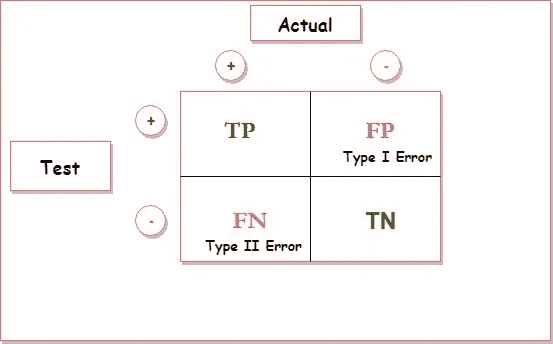*

*   ***真阳性**:此人有肾脏疾病，他们确实有此病。*
*   ***真阴性**:没有肾脏疾病的人，**实际上**没有疾病。*
*   ***假阳性(FP):** 人有肾病&他们实际上没有患病。(也称为“第一类错误”)*
*   ***假阴性(FN):** 人没有肾病&他们实际上有肾病。(也称为“第二类错误”).*

*我研究的第一类和第二类错误的一个很好的例子是*

*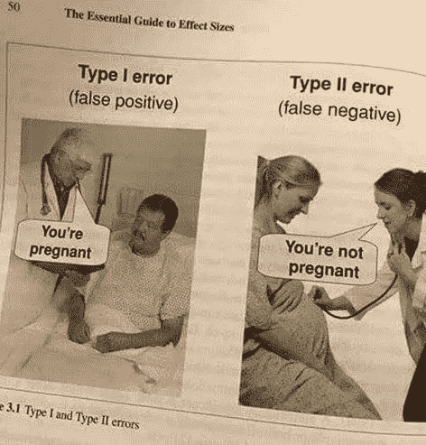*

*与混淆矩阵相关的其他几点是-*

*   *高召回率和低精确度表示大多数阳性预测被正确识别，这意味着我们的假阴性非常少，但是假阳性显著增加。*
*   *低召回率和高精确度表示我们错过了许多正面的例子，这些例子具有很高的假阴性，但是我们预测为正面的例子肯定是正面的预测。*
*   *混淆矩阵的每一列代表预测的类实例。*
*   *矩阵的每一行都代表实际的类实例。*
*   *高精度分数使模型对 1 的分类能力更有信心。将这一点与回忆结合起来，就可以知道它能够覆盖多少个 1。*
*   *混淆矩阵不仅提供了我们的分类模型所犯的错误，还提供了我们所犯错误的类型。*

****2。回忆，灵敏度&特异性****

**从灵敏度*开始，计算正确检测到的阳性类别的比率。该度量给出了模型识别一个肯定类的好坏程度。*

*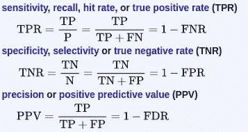*

*然而，精度显示了正类的准确性，它计算正类预测正确的可能性。*

*另一方面，特异性被表征为实际阴性的比率，该比率被模型预测为阴性类别或真阴性。因此，我们可以得出结论，将有另一部分的实际阴性，得到预测为阳性，可以被称为假阳性。*

*通常，当我们处理上面定义的指标时。在卫生保健组织的情况下，他们将更关心最小的错误阳性诊断。他们会更注重高特异性。另一方面，另一种预测模型将更关注灵敏度。*

****3。F1 得分****

*在某些情况下，数据科学家和机器学习工程师试图同时获得最佳精度和召回率。 [*F1 得分*](https://scikit-learn.org/stable/modules/generated/sklearn.metrics.f1_score.html#sklearn.metrics.f1_score) 是精度和召回值的调和平均值。F1 分数的公式是这样的*

*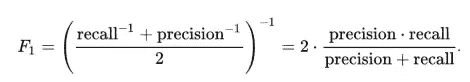*

*那么，为什么需要取调和平均值作为查全率和查准率值，而不是几何平均值或算术平均值呢？答案是简单而直谐的意思是惩罚最极端的价值观。然而，在某些情况下，数据科学家会更重视精确度或召回率。*

*F1 值越高，分类模型的预测能力越强。接近 1 的分数意味着模型是完美的，然而，接近 0 的分数表明模型的预测能力下降。*

****4。AUC-ROC(ROC 曲线下面积)****

*A [***ROC 曲线*** *(* ***接收机工作特性曲线*** *)*](https://scikit-learn.org/stable/modules/generated/sklearn.metrics.roc_auc_score.html#sklearn.metrics.roc_auc_score) 是表示分类模型在所有分类阈值的性能的图表。该曲线绘制了两个参数:*

*   *真阳性率- *真阳性数除以真阳性数和假阴性数之和。* *它描述了当实际结果为正时，模型在预测正类方面有多好。**
*   *假阳性率- *假阳性数除以假阳性数和真阴性数之和。**

*ROC 曲线绘制了真阳性率和假阳性率之间的图。这些图是在不同的分类阈值下生成的。因此，如果我们有一个低的分类阈值，那么我们可以将更多的项目分类为阳性，从而增加假阳性和真阳性。下图显示了典型的 ROC 曲线。*

*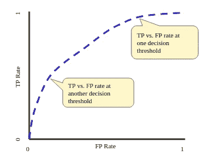*

*来源:[https://developers . Google . com/machine-learning/crash-course/](https://developers.google.com/machine-learning/crash-course/)*

*ROC 曲线中的点可以通过评估像逻辑回归这样的监督机器学习模型来计算，但这将是低效的。这个问题的解决方案是基于排序的算法，称为 AUC。*

*[*AUC*](https://scikit-learn.org/stable/modules/generated/sklearn.metrics.roc_auc_score.html#sklearn.metrics.roc_auc_score) 是曲线下面积的缩写。它计算 ROC 曲线下的整个 2D 面积。*

*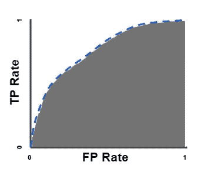*

*来源:[https://developers . Google . com/machine-learning/crash-course/](https://developers.google.com/machine-learning/crash-course/)*

*更直观地说，它是 x 轴上的 FPR(假阳性率)和 y 轴上的 TPR(真阳性率)对于范围从 0.0 到 1 的不同阈值的图。*

*AUC ROC 图是用于确定机器学习模型预测能力的最流行的指标之一。以下是使用 AUC ROC 图的一些原因-*

*   *不同的机器学习模型曲线可以用不同的阈值来检查。*
*   *模型预测能力用曲线下面积(AUC)来概括。*
*   *AUC 被认为是标度变量，它测量预测的等级而不是其绝对值*
*   *AUC 总是关注模型预测技能的质量，而不管选择了什么阈值。*

***5。对数损耗***

*AUC ROC 曲线通过采用不同阈值的预测概率来确定模型的性能。对 AUC ROC 曲线有一些担心，因为它说明了概率的顺序，而不是模型以更高的概率预测阳性数据点的能力。*

*在这种情况下， [*对数损失*](https://scikit-learn.org/stable/modules/generated/sklearn.metrics.log_loss.html#sklearn.metrics.log_loss) 出现了，对数损失或对数损失通过惩罚错误分类起作用。然而，从数学上讲，它只不过是每个实例的校正预测概率对数的负平均值。日志丢失主要适用于多类分类问题。对数损失取样本中所有类别的概率。如果我们最小化特定分类器的日志损失，我们将获得更好的性能指标。*

*数学公式如下所示*

*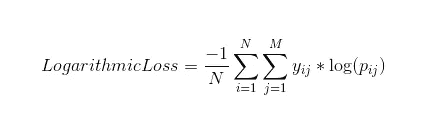*

*这里，*

*   *y_ij，表示样本 I 是否属于类 j*
*   *p_ij 表示样本 I 属于类 j 的概率*

*对数损失有一个范围[0，∞)。而且，它没有上限。我们可以将对数损失解释为越接近 0，精确度越高，反之，如果对数损失远离 0，精确度越低。*

## ****2 —为回归****

1.  ****均方根误差****

*[*均方根误差*](https://en.wikipedia.org/wiki/Root-mean-square_deviation) 是回归问题中最常用的度量标准。RMSE 由预测误差的标准偏差定义。这些预测误差有时被称为残差。残差基本上是数据点到回归线的距离的度量。*

*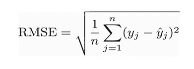*

***其中**:*

*   *σ=[求和](https://www.statisticshowto.datasciencecentral.com/summation/)(“相加”)*
*   *(yi— yj)Sup>2 =差值的平方*
*   *样本量*

*简单地说，RMSE 告诉我们回归线周围数据点的集中程度。RMSE 假设残差是无偏的，并且遵循正态分布。下面是一些与均方根误差相关的有趣的点。*

*   *当我们处理大量数据点时，RMSE 的工作效率很高。因此，误差重构变得更加可靠。*
*   *根据 RMSE 的数学公式,“平方根”显示出很大的数字偏差。*
*   *使用 RMSE 之前，请确保数据集中没有异常值，因为 RMSE 受异常值的影响很大。*
*   *均方根误差具有更高的权重，并且与其他评估度量相比，它也惩罚误差。*

****2。平均绝对误差****

*原始值和预测值之间的平均值称为 [*平均绝对误差*](https://scikit-learn.org/stable/modules/generated/sklearn.metrics.mean_absolute_error.html#sklearn.metrics.mean_absolute_error) 。它还测量误差的平均大小，即预测值与实际输出值的差距。此外，MAE 不为我们提供任何错误方向，即我们是过度拟合数据还是欠拟合数据。*

*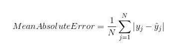*

****3。均方差****

*MSE 和 MAE[略有不同。MSE 中的偏差取原始值和预测值之差的**平方**的平均值。在 MSE 中，梯度的计算变得比 MAE 容易，MAE 需要计算工具来计算梯度。](https://scikit-learn.org/stable/modules/generated/sklearn.metrics.mean_squared_error.html#sklearn.metrics.mean_squared_error)*

*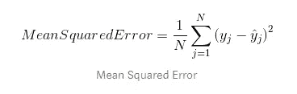*

*当目标列正态分布在平均值周围时，可以使用均方误差。当异常值出现在我们的数据集中时，均方误差就会出现，因此有必要对它们进行惩罚。*

****4。R 平方/调整后的 R 平方****

*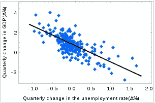*

*来源:[https://blog . minitab . com/blog/adventures-in-statistics-2/multiple-regession-analysis-use-adjusted-r-squared-and-predicted-r-squared-include-the-correct-number-of-variables](https://blog.minitab.com/blog/adventures-in-statistics-2/multiple-regession-analysis-use-adjusted-r-squared-and-predicted-r-squared-to-include-the-correct-number-of-variables)*

*[*R 的平方*](https://scikit-learn.org/stable/modules/generated/sklearn.metrics.r2_score.html#sklearn.metrics.r2_score) 是数据点与回归线拟合程度的统计度量。它也被称为决定系数。r 平方定义为解释的变化除以线性模型解释的总变化。*

*r 平方值始终位于 0 %到 100 %之间，因此 0%表示响应数据在其平均值附近没有可变性，100 %表示模型解释了响应数据在其平均值附近的所有可变性。这显然意味着 R 平方值越高，模型越完美。*

> *r 平方=解释偏差/总偏差*

*另一方面，R 的平方*不能*确定系数估计和预测是否有偏差。因此，调整后的 R 平方出现了，它对有不同数量预测因子的回归模型有解释力，简单地说，调整后的 R 平方基本上解释了有多个独立变量或预测因子的回归模型。*

*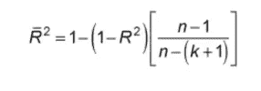*

*调整后的 R-squared 是 R-squared 的修改版本，已针对模型中的预测因子数量进行了调整。只有当新项对模型的改进超过偶然的预期时，它才会增加。调整后的 R-squared 不是比较非线性模型的典型模型，而是多元线性回归。*

****5。均方根对数误差****

*顾名思义 [*均方根对数误差*](https://scikit-learn.org/stable/modules/generated/sklearn.metrics.mean_squared_log_error.html#sklearn.metrics.mean_squared_log_error) 取实际值和预测值的对数。当我们不想惩罚预测值和实际值之间的巨大差异，并且这些预测值和实际值被认为是巨大的数字时，通常使用这种类型的评估指标。*

*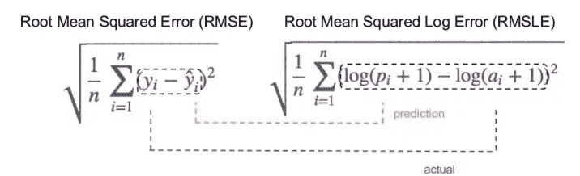*

*来源:[https://www . analyticsvidhya . com/blog/2019/08/11-重要-模型-评估-错误-度量/](https://www.analyticsvidhya.com/blog/2019/08/11-important-model-evaluation-error-metrics/)*

## ***3 —用于聚类***

*与分类相比，很难确定聚类结果的质量。评估度量不能依赖于标签，而只能依赖于分割的良好性。此外，当我们使用聚类时，我们通常没有观察值的真实标签。*

1.  ****调整后的 Rand 评分****

*[*调整后的 Rand 评分*](https://scikit-learn.org/stable/modules/generated/sklearn.metrics.adjusted_rand_score.html) 不取决于标签值而是取决于聚类分裂。换句话说，调整后的 rand 分数计算了这些分裂 i.r.initial 和聚类结果一致的观察值的份额。*

*这里要注意的一点是，这个度量是对称的，并且不依赖于标签排列。调整后的 Rand 分数的公式如下*

*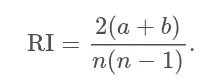*

*其中 N 是样本中观察值的数量，a 是具有相同标签并位于相同聚类中的观察值对的数量，b 是具有不同标签并位于不同聚类中的观察值的数量。*

***2*2。调整后的互信息****

*更类似于调整后的 Rand 分数，因为它也不依赖于标签的排列，并且基本上是对称的度量。 [*调整后的互信息*](https://scikit-learn.org/stable/modules/generated/sklearn.metrics.adjusted_mutual_info_score.html) 由熵函数定义，并由样本分裂解释，样本分裂是指分配一个聚类的可能性。对于两个集群来说，互信息基本上更高，两个集群具有更大的数量，而不管实际上是否有更多的信息被共享。*

*基本上，MI 测量两个聚类共有的信息份额是否分裂，即关于其中一个聚类的信息如何降低另一个聚类的不确定性。*

*AMI 介于 0 和 1 之间，值接近 0 表示拆分是独立的，值接近 1 表示它们是相似的。*

*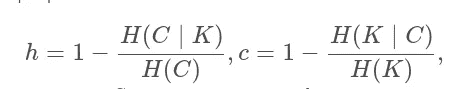*

*这里 K 是聚类结果，C 是初始分裂。 *h* 评估每个聚类是否由相同的类对象组成，而 *c* 测量相同的类与聚类的匹配程度。*

****3。剪影****

*[*剪影*](https://scikit-learn.org/stable/modules/generated/sklearn.metrics.silhouette_score.html) 得分的系数由每个样本的平均类内距离和平均最近类距离计算得出。*

*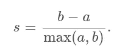*

*轮廓距离显示了同一类别的对象之间的距离与来自不同聚类的对象之间的平均距离的不同程度。轮廓得分的值介于-1 到+1 之间。如果该值接近于 1，则它对应于具有密集和明确定义的聚类的良好聚类结果，然而如果该值接近于-1，则它表示差的聚类。因此，轮廓值越高，聚类的结果越好。*

*同样，对于轮廓分数，我们还可以通过取使轮廓系数最大化的聚类数来定义最优的聚类数。*

> *嘘！我们来到了这个机器学习评估指标的奇妙旅程。还有许多其他性能指标，您可以查看参考资料部分了解更多信息。*

**如果你在为你的机器学习算法选择哪些指标的问题上进退两难，请查看这个令人敬畏的* [*博客。*](https://neptune.ai/blog/f1-score-accuracy-roc-auc-pr-auc)*

> ***参考文献***

*   *[https://www . ka ggle . com/kashnitsky/topic-7-unsupervised-learning-PCA-and-clustering](https://www.kaggle.com/kashnitsky/topic-7-unsupervised-learning-pca-and-clustering)*
*   *[https://www . analyticsvidhya . com/blog/2019/08/11-重要-模型-评估-错误-度量/](https://www.analyticsvidhya.com/blog/2019/08/11-important-model-evaluation-error-metrics/)*
*   *[https://towards data science . com/metrics-to-evaluate-your-machine-learning-algorithm-f10ba 6e 38234](https://towardsdatascience.com/metrics-to-evaluate-your-machine-learning-algorithm-f10ba6e38234)*
*   *[https://www . coursera . org/lecture/big-data-machine-learning/metrics-to-evaluate-model-performance-pft GM](https://www.coursera.org/lecture/big-data-machine-learning/metrics-to-evaluate-model-performance-pFTGm)*
*   *[https://link . springer . com/chapter/10.1007/978-3-642-39712-7 _ 1](https://link.springer.com/chapter/10.1007/978-3-642-39712-7_15)*
*   *[https://sci kit-learn . org/stable/modules/classes . html # module-sk learn . metrics](https://scikit-learn.org/stable/modules/classes.html#module-sklearn.metrics)*

**如果你喜欢这个帖子，请关注我。如果你注意到思维方式、公式、动画或代码有任何错误，请告诉我。**

**干杯！**