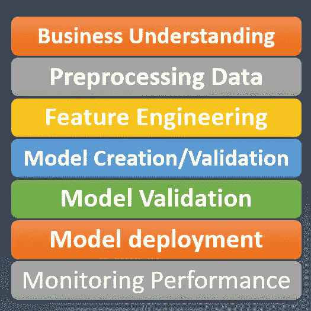

# 真实业务问题陈述中数据科学项目的完整生命周期/管道

> 原文：<https://medium.com/analytics-vidhya/complete-life-cycle-pipelines-of-data-science-project-in-real-business-problem-statement-5d4a0121ed29?source=collection_archive---------29----------------------->

每当我们在办公/生产中遇到业务问题时，我们通常会将业务问题陈述转换为数据科学问题。

1.  **业务和数据理解:**通过粒度级分析收集业务理解和数据理解。
2.  **整合收集数据** …