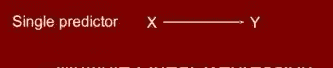
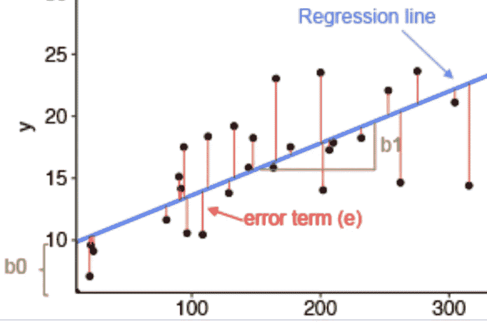
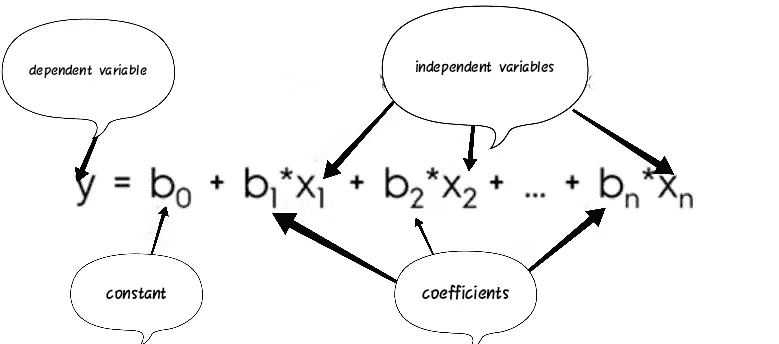
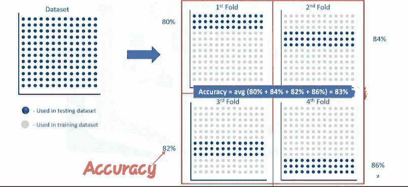

# 机器学习的完全线性回归；

> 原文：<https://medium.com/analytics-vidhya/complete-linear-regression-for-machine-learning-e2d0583ca12e?source=collection_archive---------16----------------------->

> 线性回归简介:

*   线性回归是基于监督学习的机器学习算法。
*   在回归中有两种类型的变量，即因变量和自变量。
*   因变量也被称为我们试图预测的目标变量，自变量也被称为解释变量。
*   自变量通常用 x 表示；因变量用 y 表示。
*   回归模型将 y 或因变量与 x 的函数(即自变量)联系起来。该模型发现自变量和因变量之间的线性关系。
*   回归的关键点是我们的依赖值应该是连续的，而不能是离散值。
*   然而，自变量或变量可以在分类或连续测量尺度上测量
*   所以，我们想做的是利用历史数据，利用它们的一个或多个特征，从这些数据中，建立一个模型。
*   我们使用回归来建立这样的回归或估计模型。

> 线性回归的类型:

有两种类型的线性回归模型:

*   简单线性回归
*   多元线性回归。

> 应用:

*   回归分析的应用之一可能是在销售预测领域。您可以尝试根据独立变量(如年龄、教育程度和经验年限)来预测销售人员的年总销售额。
*   它还可以用于心理学领域，例如，根据人口统计和心理因素来确定个人满意度。
*   我们可以使用回归分析来预测一个地区的房价，基于它的大小、卧室的数量等等。
*   我们甚至可以用它来预测独立变量的就业收入，如工作时间、教育程度、职业、性别、年龄、经验年限等等。
*   事实上，您可以在这些和许多其他领域或领域中找到回归分析有用性的许多例子，如金融、医疗保健、零售等。
*   我们有很多回归算法。它们中的每一种都有自己的重要性和最适合其应用的特定条件。

> 简单线性回归:

1.  简单回归是用一个自变量来估计一个因变量。
2.  例如，使用任何给定汽车的发动机尺寸和气缸数量来预测二氧化碳排放量。

在简单线性回归中，我们使用如下数学函数对数据建模:

y = B0 + B1 * x

在哪里，

y→因变量

x→独立变量

B0→截距，在机器学习中也叫偏差

B1→斜率，Y 值相对于 x 值的变化如何变化

B0 和 B1 也叫线性方程系数。

4.在简单线性回归中，我们画一条最适合数据的直线，用这条直线我们预测因变量。

## 现在的问题是:“你如何通过这些点画一条线？”以及，“你如何确定哪条线‘最适合’？”

线性回归估计直线的系数。这意味着我们必须计算 B0 和 B1，以找到“拟合”数据的最佳直线。

要回答第二个问题，我们需要找到误差(也叫残差)。误差是从数据点到拟合回归线的距离。

所有残差的平均值显示了线与整个数据集的拟合程度。

我们的目标是找到一条使所有这些误差的平均值最小的直线。

线性回归的目标是最小化这个 MSE(均方误差)方程，为了最小化它，我们应该找到最佳参数 B0 和 B1。

## 现在的问题是，如何找到 B0 和 B1，使得这个误差最小？

→我们有两种选择:

1 -我们可以使用数学方法。或者，

2 -我们可以使用优化方法。

> 顺便说一下，你真的不需要记住计算这些参数的公式，因为 Python、R 和 Scala 中用于机器学习的大多数库都可以很容易地为你找到这些参数。但是了解它是如何工作的总是好的。

多元线性回归:

1.  多元回归是指用一个或多个自变量来估计因变量。这里自变量可以是连续的，也可以是分类的。
2.  例如，使用任何给定汽车的发动机尺寸和气缸数量来预测二氧化碳排放量。

3.在多元线性回归中，我们使用如下数学函数对数据进行建模:

4.多元线性回归中的直线称为平面或超平面

## 什么时候应该用多元线性回归？

当我们想要确定自变量对因变量的影响强度时，可以使用它。

其次，它可以用来预测变化的影响。也就是理解当我们改变自变量时，因变量是如何变化的。

## 现在的问题是，如何以最小化误差的方式找到系数？

*   有许多方法可以估计这些系数的值。
*   最常见的方法是普通最小二乘法和最优化方法。
*   普通最小二乘法试图通过最小化“均方误差”来估计系数的值但是，对于大型数据集，这需要很长时间。
*   为了克服普通最小二乘法的缺点，可以采用优化算法。如果数据集很大，梯度下降是一种优化算法和最佳方法。

## 在预测中我们应该使用多少个独立变量？

使用太多独立变量进行预测可能会导致模型过度拟合。过拟合模型在训练数据集中给出了高精度，但是在测试期间精度非常低。为了避免过度拟合，有各种技术可用。例如，交叉验证、集合、正则化等。

> 模型评估

以下是我们可以用来评估模型的方法:

1.  训练和测试相同的数据集。
2.  训练/测试分割
3.  k 倍交叉验证

## 训练和测试相同的数据集:

*   在这种方法中，我们训练整个数据集，并且在训练之后，我们提取数据集的一部分用于测试。
*   这种评估方法很可能具有高的“训练精度”和低的“样本外精度”，因为模型知道来自训练的所有测试数据点。
*   “训练准确性”是模型在使用测试数据集时做出的正确预测的百分比。这可能导致过度拟合。
*   “样本外准确性”是模型使用不属于训练数据集的数据进行正确预测的百分比。

## 训练/测试分割:

*   具有高的样本外准确度非常重要。为了实现这一点，我们可以使用另一种称为训练/测试分割的方法。
*   在这种方法中，我们将数据集分成两个具有一定比例的数据集，例如 80:20 表示数据集的 80%将用于训练，20%将用于测试。
*   训练/测试分割的问题是，它高度依赖于训练和测试数据的数据集。这种变化导致训练/测试分割比在同一数据集上训练和测试具有更好的样本外预测，但由于这种依赖性，它仍然存在一些问题。

## k 倍交叉验证

*   这种方法解决了上述两种方法中发现的问题。
*   让我们理解这种方法的工作原理，如果我们设置 k=4，那么我们在相同的数据集上进行 4 次迭代的训练和测试操作。
*   在第一次迭代中，我们使用数据集的前 25%进行测试，其余全部用于训练。在第二次迭代中，我们使用接下来 25%的数据进行测试，以此类推。并且在所有迭代之后，我们计算所有迭代的准确度的平均值。

> 评估指标或准确性指标

*   它用于检查我们模型的性能。
*   通常，我们通过比较实际值和预测值来计算回归模型的准确性。
*   以下是我们可以使用的评估指标:

1.  平均绝对误差(MAE):

平均绝对误差是误差绝对值的平均值。

2.均方差(MSE):

均方误差(MSE)是平方误差的平均值。

3.均方根误差(RMSE):

均方根误差(RMSE)是均方误差的平方根。这是最受欢迎的评估指标之一。

4.相对绝对误差(RAE):

它也称为残差平方和，取总绝对误差并通过除以样本预测值的总绝对误差进行归一化。

5.相对平方误差(RSE):

它与“相对绝对误差”非常相似，但被数据科学界广泛采用，因为它用于计算 R 平方。

r 平方不是一个误差，而是一个衡量模型准确性的常用指标。它表示数据值与直线的拟合程度。

R 平方值越高，模型就越符合您的数据。