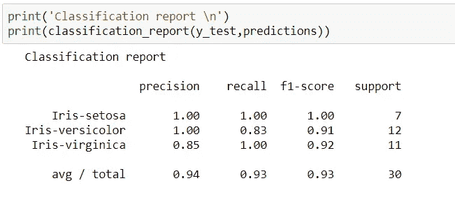

# 初学者的完整机器学习项目

> 原文：<https://medium.com/analytics-vidhya/complete-machine-learning-project-for-beginner-d6add8a0102d?source=collection_archive---------4----------------------->

杰弗里·艾森在 [Unsplash](https://unsplash.com?utm_source=medium&utm_medium=referral) 上的照片

# 虹膜分类:一种多类分类

嗨！在这篇博客中，我将向您展示如何为初学者构建一个完整的机器学习(ML)项目。

我们今天要解决的问题是鸢尾花分类:一个多类分类问题，也称为机器学习的“Hello World”。

今天的议程是:

*   **机器学习**
*   **预测分析项目模板**

## 机器学习

机器学习是一种使计算机能够解决特定任务而无需显式编程的方法。

现实中:机器里没有所谓的学习。机器学习(ML)中使用了一些统计模型来做出决策。(参考:百页机器学习书)。

 [## 机器学习

### 机器学习(ML)是对算法和统计模型的科学研究，计算机系统使用这些算法和统计模型来…

en.wikipedia.org](https://en.wikipedia.org/wiki/Machine_learning) 

我在这里假设，你对机器学习的基础知识有所了解。

让我们看看解决真实世界机器学习(ML)项目的模板。

# ML(预测分析)项目模板

(灵感来自——杰森·布朗利)

 [## 机器学习掌握

### 让开发者在机器学习方面变得令人敬畏。

machinelearningmastery.com](https://machinelearningmastery.com/) 

1.  **准备问题**

*   加载库
*   加载数据集

2.**汇总数据**

*   描述统计学
*   数据可视化

3.**准备数据**

*   数据清理
*   特征选择
*   数据转换

4.**评估算法**

*   分离验证数据集
*   测试选项和评估指标
*   抽查算法
*   比较算法

5.**提高精度**

*   算法调整
*   合奏

6.**最终确定型号**

*   验证数据集的预测
*   在整个训练数据集上创建独立模型
*   保存模型以备后用

推荐使用 Jupyter 笔记本，虽然你可以使用任何 IDE。但是，我将在这个博客中使用 Jupyter 笔记本代码。

# 准备问题

— *加载库*

在进一步进行模型开发之前，首先加载重要的库。

图一。加载重要的库(由 Jason Brownlee 启发)

— *加载数据集*

数据集应位于 python 文件所在的同一文件夹中。

要详细了解数据集，只需点击[此处](https://en.wikipedia.org/wiki/Iris_flower_data_set)。然后在这个博客里更进一步。

图二。加载数据集

# **汇总数据**

— *数据集的维度*

图三。数据集的维度

在上面的*图 3 中。*显示给定数据集中有 *150 行*和 *6 列*。

— *偷看数据*

图 4。偷看数据

— *数据底部*

图五。数据的底部

— *描述*

图六。数据描述(统计分析)

— *班级分布*

类分布显示了给定数据集中有多少个类以及每个类有多少个实例。

图 7。物种群

# 数据可视化

— *配对图*

图 8。使用 Seaborn 进行配对绘图的代码

图九。配对图

通过查看上面的可视化图(配对图),很明显两个特征*花瓣 _ 长度*和*花瓣 _ 宽度*是重要特征。

# 评估一些算法

现在，让我们创建一些给定数据的模型，并估计它们对未知数据的准确性。

评估算法的步骤

1.  分离出一个验证数据集。
2.  将测试工具设置为使用 10 重交叉验证。
3.  建立 5 个不同的模型，根据花朵尺寸预测物种。
4.  选择最佳型号。

 [## k-fold 交叉验证的简单介绍

### 交叉验证是一种统计方法，用于评估机器学习模型的技能。它通常用于…

machinelearningmastery.com](https://machinelearningmastery.com/k-fold-cross-validation/) 

在使用`dataset.drop(columns='Id')`继续之前，请删除列“Id”

图 10。验证数据集的代码。

问:为什么我使用数组而不是熊猫数据帧？

答:因为简单数组的计算速度比熊猫数据帧快。

**抽查算法**

图 11。抽查算法

在上面的图片中，可以看出 SVM 是所有算法中最好的选择

# 做预测

SVM 是我们测试过的最精确的模型。因此，我将使用支持向量机(SVM)进行预测。

— *让我们创建一个模型*

图 12。创建模型

— *让我们来拟合模型*

图 13。使用 fit()方法拟合模型

让我们来做预测吧

图 14。根据看不见的数据预测结果

图 15。预测结果

*—我们来看看这个模型的精度如何*

图 16。模型的准确性

— *让我们看看预测结果的混淆矩阵*

图 17。混淆矩阵

— *让我们看看分类报告*

图 18。分类报告。

# 保存模型以备后用

— *将模型保存到磁盘*

——*一段时间后*

请查看下面的链接。

 [## 使用 scikit-learn 在 Python 中保存和加载机器学习模型

### 找到一个准确的机器学习模型并不是项目的终点。在这篇文章中，你会发现如何拯救…

machinelearningmastery.com](https://machinelearningmastery.com/save-load-machine-learning-models-python-scikit-learn/) 

您可以使用上面的模板来解决任何现实世界的分类问题。

欢迎您提出任何疑问和问题。