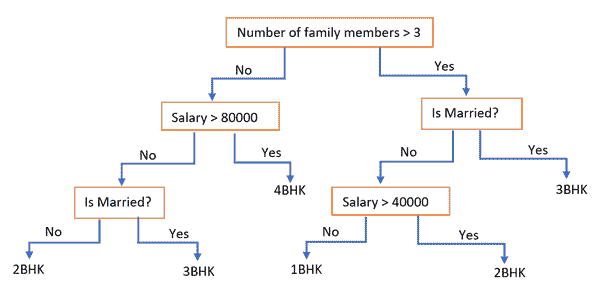
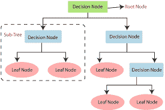
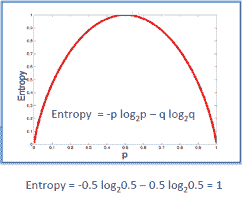
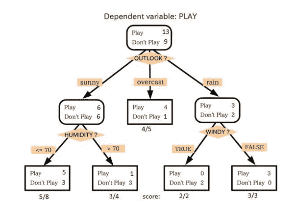
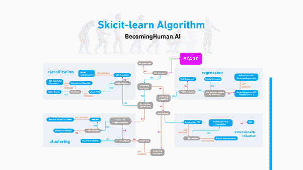

# 决策树的完整概述

> 原文：<https://medium.com/analytics-vidhya/complete-overview-of-decision-tree-51b03cf87193?source=collection_archive---------26----------------------->

决策树算法是针对**分类问题**的一种监督学习。分类是通过添加标签(例如垃圾邮件/非垃圾邮件)将数据集划分为不同类别或组的过程

# ***决策树***

决策树是基于特定条件的决策的所有可能解决方案的图形表示。它对分类变量和连续因变量都有效。在这个算法中，我们将全部样本数据分成两个或更多的同类集合。

**Ex** -

***重要术语***

1.  **决策节点**——也称为根节点。这是整个数据集算法的起点
2.  **叶节点** -(算法结束，从此节点无法分离)
3.  **拆分** -基于条件
4.  **Branch/Sub**-tree-拆分树或数据后
5.  **修剪**——去除不需要的分支(减少复杂性)

# ***大车算法***

到目前为止一切顺利，但你可能会怀疑我们应该如何选择，如何选择最佳属性，从哪里开始？？

这个算法帮助你进入它。不要担心在任何时候被卡住。一直走到最后:)

**购物车** -分类和回归树算法

## **如何决定在哪里拆分？？**

为此我们需要知道

1.  **基尼指数** -用于构建决策树的杂质(随机性程度)的度量
2.  **信息增益** -根据属性分割数据集后熵的减少。决策树的构建是关于寻找返回最高信息增益的属性
3.  **方差减少**——这是一种用于连续目标变量(回归问题)的算法。选择方差较低的分裂作为分裂总体(样本)的标准
4.  **卡方—** 这是一种找出子节点和父节点之间差异的统计显著性的算法

## **熵-**

这是一个衡量杂质(随机程度)的指标。这是算法的第一步

> ***熵(s)= -P(是)log(是)-P(否)log(否)***

## **信息增益**

它测量熵的减少，并决定哪个属性应该被选为决策节点。

信息增益公式

> **I(S)=熵(S) — [(加权平均)*(熵(每个特征))]**

将此公式应用于所有属性，并选择具有最大增益的属性。

**Ex-**

在上图中，你可以看到人口根据多种属性被分为四个不同的组，以识别“他们是否会玩”。为了将人口分成不同的异质群体，它使用了各种技术，如基尼系数、信息增益、卡方、熵

# ***购物车的一些有用功能和优点***

*   CART 是非参数的，因此不依赖于属于特定分布类型的数据。
*   输入变量中的异常值不会显著影响 CART。
*   您可以放宽停止规则，使决策树“过度增长”,然后将树修剪回最佳大小。这种方法最大限度地降低了数据集中的重要结构因过早停止而被忽略的可能性。
*   CART 结合了测试数据集测试和交叉验证，以更准确地评估拟合优度。
*   CART 可以在树的不同部分多次使用相同的变量。这种能力可以揭示变量集之间复杂的相互依赖关系。
*   CART 可以与其他预测方法结合使用，以选择输入变量集。

# **决策树的优点**

*   容易理解
*   易于生成规则
*   几乎没有要调整的超参数
*   复杂的决策树模型可以通过可视化得到显著简化

# **决策树的缺点**

*   可能会过度拟合
*   不容易处理非数字数据
*   当有许多分类标签时，计算可能会很复杂

# **一些关键建议-**

*   我们可以使用任何分类算法来代替依赖于数据集的决策树算法。您可以应用不同的算法，并选择更准确的算法
*   如果因变量和自变量之间的关系由线性模型很好地近似，则线性模型优于基于树的模型
*   如果因变量和自变量之间存在高度非线性和复杂关系，则树模型执行分类回归模型

*这个 skicit 算法备忘单在用 python 实现时可能会有帮助*

## ***延伸阅读材料***

[*https://alex.smola.org/drafts/thebook.pdf*](https://alex.smola.org/drafts/thebook.pdf)

[http://cs229.stanford.edu/notes/cs229-notes-dt.pdfT21](http://cs229.stanford.edu/notes/cs229-notes-dt.pdf)

[*决策树分析示例*](https://www.dotnetlovers.com/article/214/decision-tree-analysis-with-example)

[*https://www.youtube.com/watch?v=wr9gUr-eWdA&list = ploromvodv 4 rmigqp 3 wxshtmggzqpvfbu&index = 10*](https://www.youtube.com/watch?v=wr9gUr-eWdA&list=PLoROMvodv4rMiGQp3WXShtMGgzqpfVfbU&index=10)

[*统计分析与数据挖掘应用手册*](https://www.elsevier.com/books/handbook-of-statistical-analysis-and-data-mining-applications/nisbet/978-0-12-374765-5)