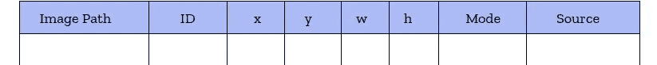
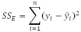
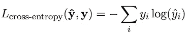
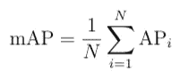
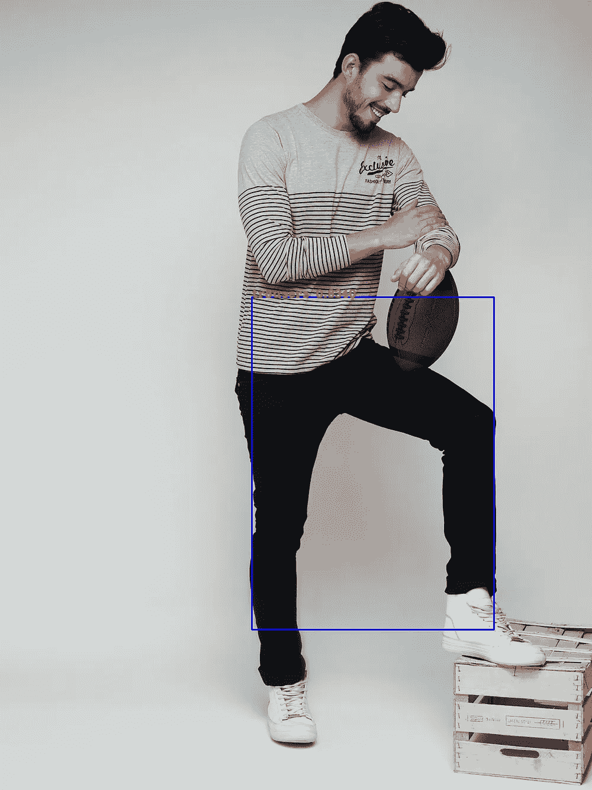
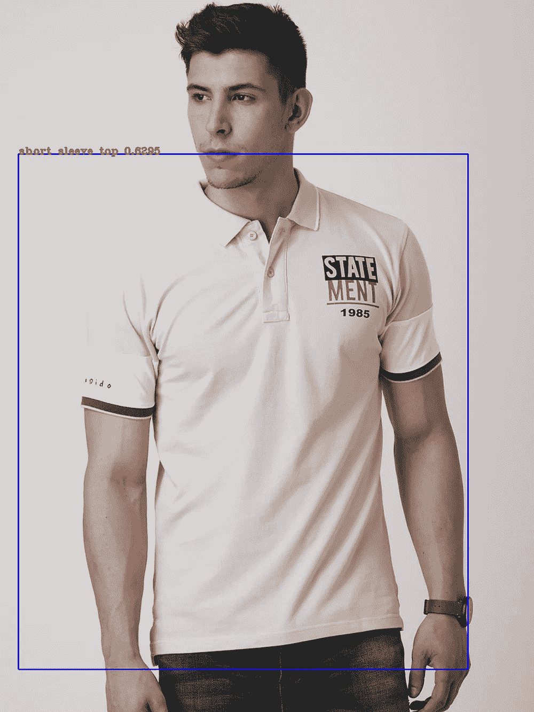

# 时装材料边界框检测的完整管道(YOLOv3)

> 原文：<https://medium.com/analytics-vidhya/complete-pipeline-for-bounding-box-detection-for-fashion-material-yolov3-cae64c48fb78?source=collection_archive---------14----------------------->

大家好，我最近在研究时尚材料的包围盒检测。从这份工作中，我学到了很多东西，而且我知道大部分东西都可以在网上找到。这个博客是为了把所有有用的东西都集中到一个地方。我将分享我的学习，并带你通过这个管道。

> *数据集中的偏差或方差越低，模型精度越高*

## **数据收集**

1.  **[DeepFashion1](https://drive.google.com/drive/folders/0B7EVK8r0v71pQ2FuZ0k0QnhBQnc) 是一个大规模布料数据集。它包含大约 80 万张 46 种流行服装的图片。**
2.  **[DeepFashion2](https://drive.google.com/drive/folders/125F48fsMBz2EF0Cpqk6aaHet5VH399Ok) 是一个全面的时尚数据集。它包含 13 个流行服装类别的 491，000 个不同的图像。**

## **数据集预处理**

**这些数据集都是以不同的方式组织的。DeepFashion1 就像一个有一个边界框的图像，所有的注释都存储在一个文本文件中，而 DeepFashion2 就像一个有一个或多个边界框的图像，每个图像都有自己的 JSON 格式的注释文件。**

> **进口熊猫作为 pd**

**每个人都熟悉这个命令。我组合了这两个数据集，并制作了如下所示格式的数据帧。给每个类和模式列分配 Id 是为了知道这个图像是否属于训练、测试或验证数据。Source 是想知道这个图片是来自 deepfashion1 还是 deepfashion2。**

****

**我不分享我的代码，因为这个博客背后的想法是通过管道启发你。不过，如果你在编码时遇到任何问题，请告诉我，我一定会帮你解决。**

**处理如此庞大的数据集既忙碌又耗时。构建数据框架的过程会花费很多时间。 [**DASK**](https://towardsdatascience.com/why-every-data-scientist-should-use-dask-81b2b850e15b) 是用 Python 编写的并行计算开源库。下面是 Dask 的一瞥。**

**TF record:TF record 格式是一种以二进制序列存储数据的简单格式。您应该对如何创建 tfrecord 有一个基本的了解。在我们的数据帧中，有属于一个图像的注释。我们的任务是使用 python“集合”库将它们组合在一起，然后创建 tf 示例。这里有一个想法的代码，将有助于您在分组。**

**由于我们的数据集很大，我们的 tfrecord 创建脚本需要时间。我们可以使用 DASK 进行并行计算，也可以共享 tfrecord，即分割 tfrecord 文件。tfrecord 的分片最好在这个 [**博客**](https://github.com/tensorflow/models/blob/master/research/object_detection/g3doc/using_your_own_dataset.md#sharding-datasets) 用代码解释。**

## **模型训练**

**YOLO9000 ，使用改进的 YOLOv2 模型可以检测多达 9000 个对象类别。在每秒 67 帧的速度下，该探测器在视觉对象类别挑战赛 VOOC 2007 上获得了 76.8 mAP(平均精度)，击败了更快的 RCNN 等方法。**

****损失函数**:平方和误差**

****

****分类** **损失**:交叉熵**

****

**您将在这个 [git](https://github.com/zzh8829/yolov3-tf2) 仓库中找到完整的架构。根据您的 tfrecord 文件进行更改，还需要对 hyperparameter 进行微调。**

**要么我们可以从头开始训练我们的网络，要么我们可以使用在线提供的预训练权重。训练时使用“eager_fit”模式，因为 eager 模式非常适合调试。**

## **估价**

**评估指标用于衡量模型的准确性。有许多不同类型的评估指标可用于测试模型。使用多个评估指标来测试一个模型是很重要的。这是因为模型可能在一个评估指标上表现良好，但在其他评估指标上表现不佳。**

**我使用平均精度(mAP)评估指标。这篇[博客](https://towardsdatascience.com/breaking-down-mean-average-precision-map-ae462f623a52#d439)很好地解释了平均精度。看一看**

****

**平均精度公式**

**其中 AP(平均精度)和 N 是数据集中的类的数量。**

**编写一个 python 脚本，使用训练模型预测测试数据集的边界框，并将其保存到一个文件夹中。将地面真相保存到另一个文件夹中。克隆这个 [git](https://github.com/rafaelpadilla/Object-Detection-Metrics) 仓库。将您的预测数据和基本事实输入到这个 git 存储库中的 python 脚本中。这将给你的终端带来地图价值。**

## **初步结果**

********

**myntra 图像上的测试模型**

**雅尔加尔吼！！**

***发现错误，不吝赐教***