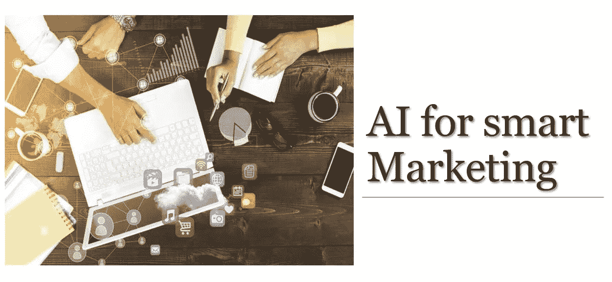
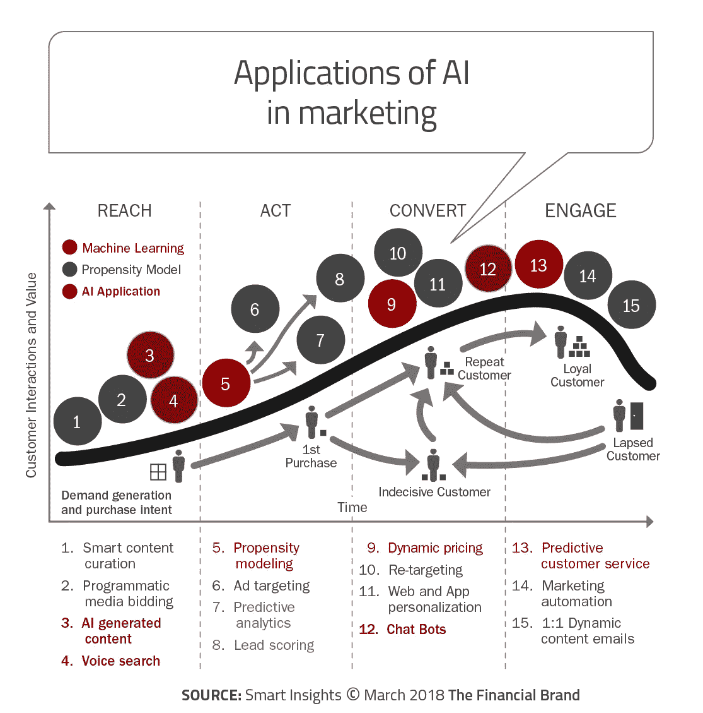

# 人工智能在营销中的完整路线图|用途|重要性|工具

> 原文：<https://medium.com/analytics-vidhya/complete-roadmap-to-ai-in-marketing-uses-importance-tools-dc61b34327a5?source=collection_archive---------23----------------------->

> *“没有数据的营销就像闭着眼睛开车——丹·扎雷拉”*

# 我们所说的营销分析是什么意思？

简而言之，营销是为了推广某种东西，分析是为了识别趋势、绩效衡量和数据模式，以做出基于数据的决策。因为营销无处不在。解决方案是具有一套指标的“人工智能”,这些指标提供了关于营销贡献的有意义的数据，因此，即使对于那些可能不同意营销方法的人来说，也不会对结果有任何争议。营销中的人工智能使营销人员能够测量、自动化和分析营销绩效，以最大限度地提高其有效性和优化投资回报(ROI)。

# 重要性以及为什么需要它们？

想象你正在投资股票市场。你知道在哪里投资，你对买哪只股票有一个大致的概念，但是你没有仪表板来监控。你完全不知道你买了多少股票，也不知道银行里有多少钱。如果你继续没有任何检查，那么你可能会破产。

这个股票比喻适用于组织和分析——他们的仪表板——帮助他们保持营销引擎有效运行。分析过程的正确实施有助于在营销中避免后果。因此，分析过程不仅仅是让企业远离麻烦，而是帮助企业优化营销绩效。营销分析成功的关键在于应用，如果产出和见解没有得到应用，那么分析计划就没有价值。当首席执行官直截了当地说，“给我钱”，当营销拥有正确的分析数据并明智地使用这些数据时，它就能够做到这一点。通常，尤其是营销人员越来越多地被期望使用分析来告知和证明他们的决策。

> “市场营销一直是一项紧张激烈的运动，就像跑马拉松一样。随着购买过程、媒体和技术以及管理预期的变化，就像跑一场马拉松，脚下的土地会发生变化。已经很困难的事情变得越来越困难。如果你打算不经测量就去做，那就像在地震中蒙着眼睛跑马拉松一样。”——大卫·拉布

# 用 AI 做营销的好处！

*   *人工智能可以超个性化客户体验*
*   *人工智能可以加速某些类型和格式的内容的生产*
*   *预测客户行为和识别最有价值的潜在客户的能力*
*   *人工智能可以决定创建什么内容以及何时分发它*
*   处理大数据并做出准确预测的能力

# 如何利用 AI 进行营销？

## -了解你的客户终身价值(CLV)

除非了解客户的价值，否则公司无法就如何花钱获得客户做出好的决策。毕竟，如果一家公司持续花费比客户创造的更多的钱来获得客户，这家公司经常会倒闭。因此，计算客户的终身价值并利用这些计算来增加公司的盈利能力是很重要的。根据客户产生的留存率、折扣率和每期利润，您可以计算 CLV。通过聚类算法，可以根据客户特征进行聚类。

## -预测和预报

营销人员可以使用**预测**来衡量他们活动的效果，决定进入和退出哪个市场，并决定他们产品的生命周期。通过过去的销售数据和预测，营销人员可以知道一年中什么时候卖出的产品/服务最多。因此，营销人员可以在特定的时间框架内进行营销，并对营销进行计算投资。

他们有许多预测方法来预测销售，如**时间序列预测** (ARIMA，萨里玛，GARCH，Prophet，指数平滑)，**深度学习算法**(LSTM-深度神经网络)。

## 聊天机器人

无论是习惯、购买、反馈，信息应用都让客户更容易接触到公司，告诉他们他们的想法。它免费且易于使用。但是缺点是很难回复每一个发送信息的客户(有时许多人会问同样的信息)。因此，为了即时回复，人工智能可以通过聊天机器人来解决这个问题，通过为潜在买家提供找到正确产品或服务的方法来自动回复。他们还通过同时处理无限的查询和全天候可用来提高效率。聊天机器人还保留数据，因此能够通过神经网络进行学习，并根据过去的查询改善未来对话的结果。

## -内容生成

手动生成内容是一个繁琐的过程。但随着人工智能的进步，它现在可以自己生成内容。人工智能作家可能不像人类那样完美，但它可以帮助我们节省大约 33%的文本生成时间。

查看这篇关于内容生成的有趣文章([https://www . research gate . net/publication/313247478 _ Procedural _ Content _ Generation _ via _ Machine _ Learning _ PCGML](https://www.researchgate.net/publication/313247478_Procedural_Content_Generation_via_Machine_Learning_PCGML))

## -动态定价

我们都可能经历过价格的上涨/下跌，例如，当需求上升时，出租车费也会上涨。通过根据这些变量的实时值自动提高或降低价格，并根据消费者的行为和偏好不断调整，机器学习算法可以优化最大利润和库存。价格和需求是算法的一个核心估计。企业从更少的浪费中受益，消费者也保证了更准确的购买价值。

# 一些工具和技术

*   [**Google Cloud AI**](https://cloud.google.com/products/machine-learning/)**(它可以建立聊天机器人，做视频、图像、文字的分析。[gcpcloudneel](https://medium.com/u/ea99511c3f0c?source=post_page-----dc61b34327a5--------------------------------)**
*   **[**【Acrolinx】**](https://www.acrolinx.com/)**(增强内容)****
*   ****[**Atomic Reach**](https://www.atomicreach.com/)**(**深入理解是什么让你的内容发挥作用，以及如何完善它@Atomic_Reach)****
*   ****[**Automat**](https://www.automat.ai/)**(它帮助品牌为每个客户提供个性化的信息体验，并动态优化转化以获得最佳效果)******
*   ******[**精灵**](http://gjny.com/meet-genie/) (提供消费者购买行为准确预测的推荐引擎)******

# ****最后的话****

****我们在营销中使用人工智能有很大的优势，它不会剥夺创作者的工作，而是会帮助他们更有创造力和生产力。它有助于大幅提高业务投资回报率。人工智能营销趋势现在允许我们分析从活动、社交互动和参与中收集的大量数据和信息。****

****请告诉我们你是如何在营销中应用 AI 的？****

*****随便打个招呼过*[*LinkedIn*](https://www.linkedin.com/in/ronak-jain-6002b1155/)*，我总是很乐意与该领域的其他专业人士联系。*****

*****一如既往:非常感谢评论、问题和分享！❤️*****